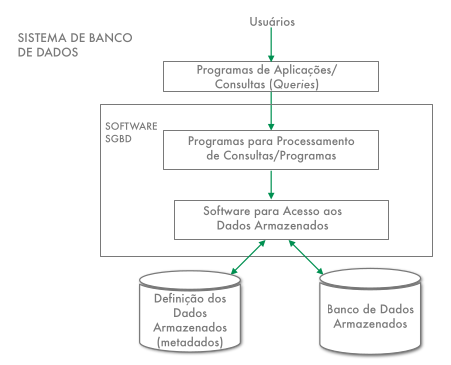
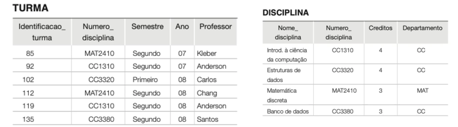
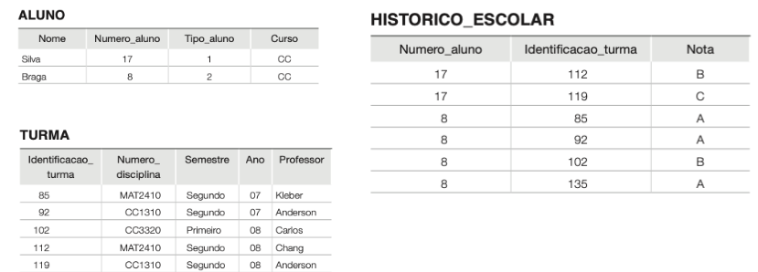
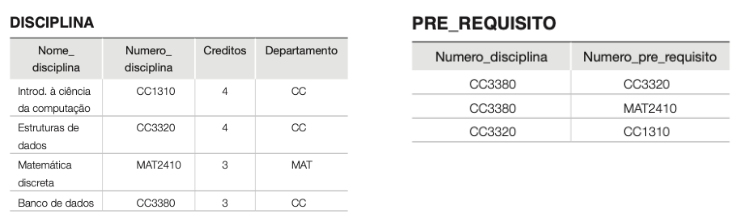
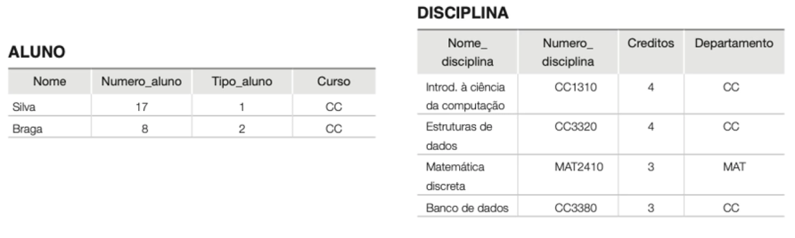
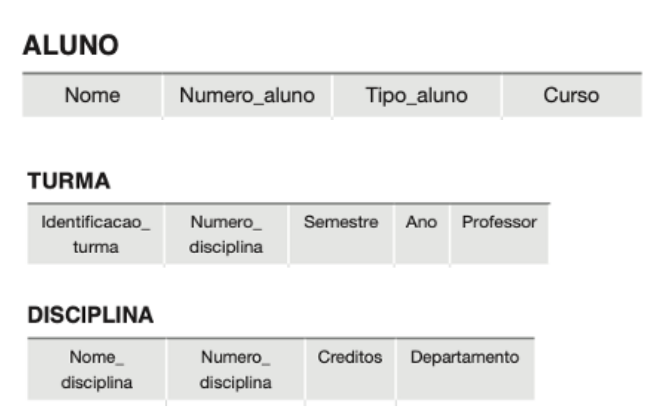
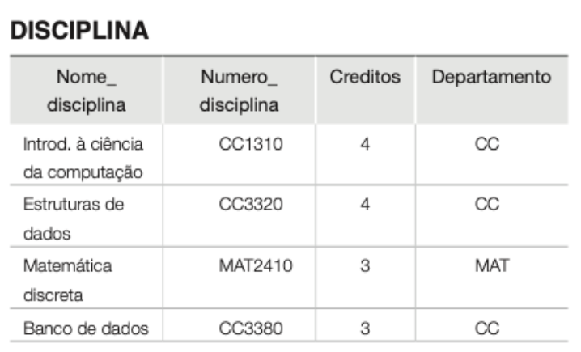
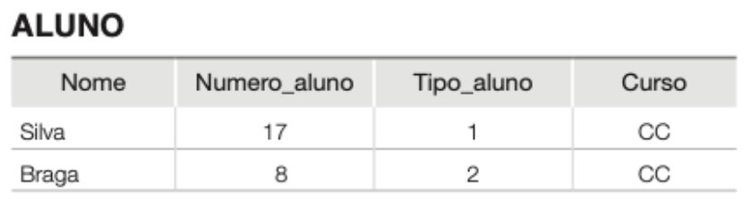

# Sistemas de Banco de Dados

- Conjunto de dados utilizados para realizar uma operação.

- **SGBD**: Software onde é possível <u>criar</u>, <u>manipular</u> vários banco de dados. 
- **Metadados**: Informação, descrição e explicação dos dados.
    - Catálogo dos dados;
    - <u>Dicionário</u> dos dados;
    - Estrutura do nosso banco de dados;
- **Banco de Dados**: Conjunto de dados armazenados.

## Sistemas Gerenciadores de Bancos de Dados (SGBD)

- Características:

  - Controle de **redundância**;

  - Compartilhamento de Dados;
  - Restrição de acesso;
  - Fornecimento de múltiplas interfaces;
  - Forçar **restrições de integridade**;
    - <u>Regras</u> que o SGBD deve seguir
  - Backup e recuperação contra falhas;
  - Controle de transação;
  - Tempo de desenvolvimento reduzido;

### SGBD x Sistemas de Arquivos

| **SGBD**                                                     | **Sistema de Arquivos**                       |
| ------------------------------------------------------------ | --------------------------------------------- |
| Armazena dados e metadados                                   | Definição é parte integrante da aplicação     |
| A redundância de dados é controlada                          | Existe excesso de redundância de dados        |
| Independência entre dados e programas                        | Dependência entre dados e programas           |
| Eficiência, concorrência, compartilhamento, segurança, integridade e tolerância a falhas | Depende da aplicação                          |
| Interface amigável                                           | Interface depende da linguagem de programação |

- Quando não usar ?
  - Sistemas <u>embarcados</u>;
  - Sistemas pequenos onde não é necessário a persistência dos dados;
  - Sistemas <u>sensíveis a tempo</u>;
  - SGBD pode causar **overhead**.

## Banco de Dados

- Tipos de banco de dados:
  - **Geográfico** (mapas, projeções cartográficas);
  - Vetorias;
  - Memória (In-Memory);
  - **Relacionais** (SQL);
  - **Não relacionais** (NoSQL);
  - Orientado a Objetos;
  - ...

- **Propriedades:**
  - **Minimundo**, representa um <u>problema</u> do mundo real.
  - Uma **coleção de dados** <u>logicamente</u> coerente.
  - Projetado para a necessidade de um grupo de usuários;

- Usuários:
  - Usuários finais;
  - <u>Administrador</u> de Banco de Dados (**DBA**);
  - Analista de Sistemas e Programador de Aplicações;
  - **Projetistas** de Banco de Dados;

### Dado, Esquema, Instância e Informação

- **Esquema:** Estrutura (tabelas, colunas), <u>metadados</u>.

- **Instância:** Os dados propriamente ditos.

- **Estado:** "Fotografia" do banco de dados naquele momento.
  - Conjunto completo do banco de dados em um determinado momento.

- **Dados:** "Bruto", conjunto de caracteres/números sendo armazenado.
- **Informação:** A interpretação do dado via tabela.

## Modelo de Dados
- É o conjunto de conceitos para **descrever** um banco de dados.

### Modelo Conceitual
- Fornece conceitos que são próximos da **percepção dos usuários** a respeito dos dados.
- Modelo Entidade Relacionamento - **MER**.

### Modelo Lógico/ de Implementação
- Frequentemente utilizados em SGBDs comercias.
- Modelo Relacional - **MR**.

### Modelo de dados Físico
- Descreve como os dados são armazenados.
- SQL.
