# Modelo Entidade Relacionamento

- É um modelo de dados **conceitual** de <u>alto nível</u>.
- Está centrado na **percepção dos usuários** sobre os dados, não
  importando a maneira na qual os dados serão **armazenados**.

## Entidade

- É um **elemento** do mundo real com uma existência própria.
- **Exemplo:** Pessoas, Carros, Casa, ...
- Cada entidade possui propriedades que a descrevem, chamadas de **atributos**.
- Exemplo: Funcionários da Empresa
```txt
Nome = João
Endereço = Rua A, Casa 123
Idade = 26
Fone = 222-2222
```

### Atributos
- **Simples:** Trata-se de um atributo que **não** é divisível.
  - Data de nascimento;
  - CPF;
  - Matrícula;
- **Composto:** Consiste em vários atributos básicos.
  - Endereço;
  - Logradouro;

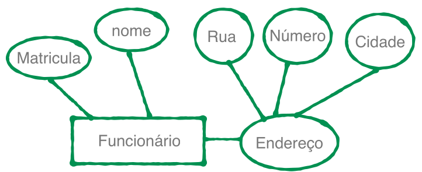

- **Atributo Monovalorado:** Possui um <u>único</u> valor para uma entidade particular.
  - Ex: <u>Nome</u> na entidade funcionário

- **Atributo Multivalorado:** Pode ter um <u>conjunto de valores</u> para uma mesma entidade
  - Ex: Email na entidade funcionário, Área de pesquisa

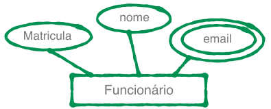

- **Atributo Derivado ou Virtual:** É aquele que <u>pode ser obtido</u> a partir de outros atributos.
  - Ex: <u>Idade</u> calculada a partir da **data de nascimento**, <u>número total de funcionários</u> - derivado da **soma** dos empregados.
  - **Não** é armazenado no SGBD.

- **Valores NULL:** Valor vazio para um atributo.
  - Ex: Telefone Residencial

- **Atributo Chave:** Identifica cada entidade <u>unicamente</u>.
  - Matrícula, CPF, código, id, ...
  - É marcado com "um traço embaixo", sublinhado.

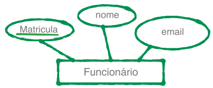

- **Domínio de um Atributo:**
  - Especifica os <u>possíveis valores</u> que podem estar associados a um atributo em cada entidade individual.
  - Ex: Domínio do atributo *Nome* seria um conjunto de <u>caracteres alfabéticos</u>.

## Relacionamento

- É um conjunto de **associações** entre entidades.
- Relacionamento **liga** as instâncias dos dados.
- **Grau** de um Tipo de Relacionamento:
  - **Binário:** Relaciona <u>duas</u> entidades. 
  - **Terciário:** Relaciona <u>três</u> entidades.
  - **Não existe** um limite para quantas entidades podem participar de um relacionamento.

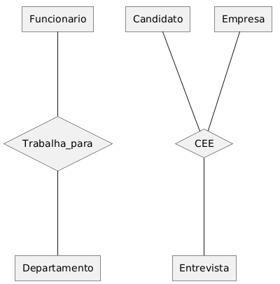

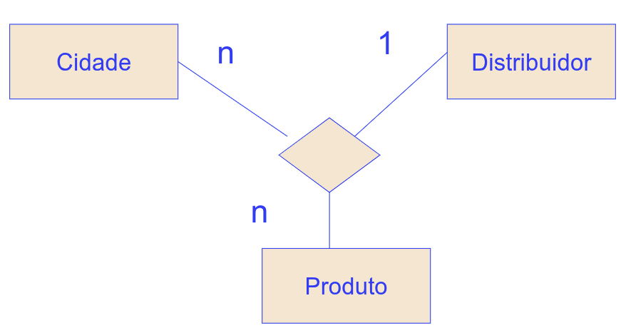

- Relacionamento **Recursivo**: A entidade se relaciona com ela <u>mesma</u>.
  - Pré-requisito e uma disciplina;
  - Funcionário e supervisor;
  - É importante explicitar os papeis das entidades naquele relacionamento.

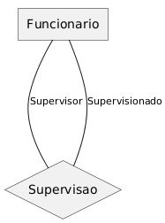

### Cardinalidade

- Quantidade que as **instâncias** da entidade podem se relacionar.
  - `1:1`; um para um.
  - `1:N`; um para muitos.
  - `N:1`; muitos para um.
  - `N:N`; muitos para muitos.

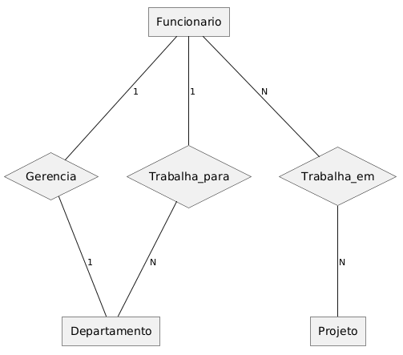

### Participação

- **Obrigatoriedade** que a entidade pode ter ao participar daquele relacionamento.
- **Total:** Obrigatório.
  - É representada por dois traços `==`.
  - **Todas** as instâncias da entidade precisam estar <u>relacionadas</u> com as instâncias da outra entidade.
- **Parcial:** Optativo.
  - É representado por apenas um traço `---`.
  - **Nem todas** as instâncias da entidade precisam estar relacionadas com as instâncias da outra entidade.

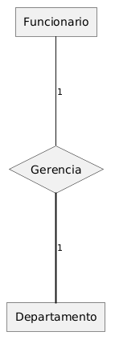

#### Cardinalidade (Mínima, Máxima)

- **Cardinalidade Mínima:** Substitui a participação, obrigatoriedade. 
  - 0: Parcial; 
  - 1: Total.
- **Cardinalidade Máxima:** Continua como antes.
  - 1 ou N.

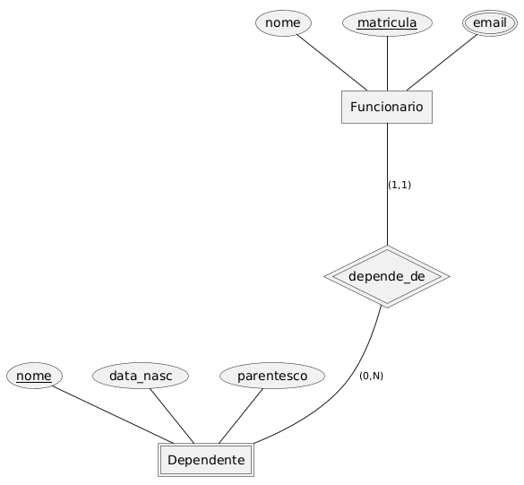
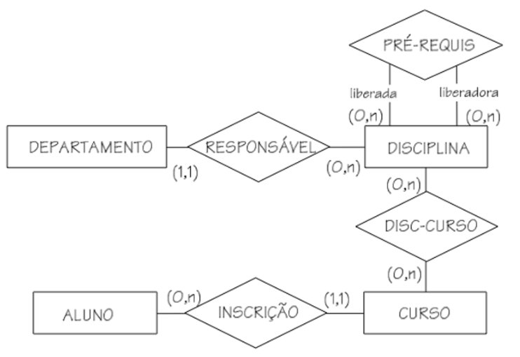

## Entidade Fraca

- **Não** tem um atributo que pode ser considerado **chave**, único.
  - Precisa de uma chave externa para se identificar unicamente. 
- **Chave Composta:** Sua chave candidata + a chave da entidade forte.
  - (matriculaEmp , nomeDep)

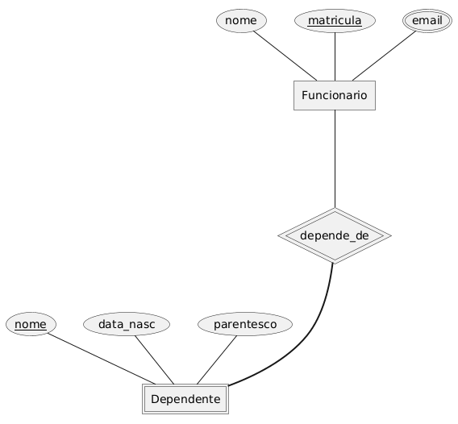

- **Relacionamento de Identificação:** Indica que o dependente precisa da chave do funcionário para se identificar unicamente.

> [!IMPORTANT]
>
> - Toda entidade fraca tem **participação total** no **Relacionamento de Identificação** com a entidade forte.

## Exemplo 01 - RH
Uma Empresa é organizada em **departamentos**. Cada departamento tem um <u>nome</u>, um <u>número</u> e um <u>empregado que gerencia o departamento</u>. Deve-se saber a <u>data</u> em que um empregado iniciou como gerente de um **departamento**. Um **departamento** pode ter <u>diversas localizações</u>.

Um **departamento** controla um número de **projetos**, cada qual com um <u>nome</u>, um <u>número</u> e uma <u>única localização</u>.

São armazenados o <u>nome</u> do **empregado**, <u>matrícula</u>, <u>endereço</u>, <u>salário</u>, <u>sexo</u> e <u>data de nascimento</u>. Um **empregado** está associado a um **departamento**, mas pode trabalhar em **diversos projetos**, não necessariamente controlados pelo mesmo departamento. Deve-se saber o número de <u>horas semanais</u> que um empregado trabalha em cada projeto, bem como o **supervisor direto de cada empregado**.

Cada **empregado** pode possuir vários **dependentes**, devendo-se saber, para cada dependente, o <u>nome</u>, o <u>sexo</u>, a <u>data de nascimento</u> e a sua <u>ligação com o empregado</u>.

- Na Entidade fica aquilo que exclusivo dela, ou seja, não depende de outras entidades.
- Como descobrir a **Cardinalidade e a Paricipação**?
  - 1 empregado pode trabalhar em quantos departamentos ? **1**, a resposta vai para o outro lado.
  - 1 departamento pode ter quantos empregados ? **vários**, a resposta vai para o outro lado.
  - Todos os empregados trabalham em algum departamento ? **Não** necessariamente, neste caso.
  - Todo departamento tem um empregado ? **Não** necessariamente, neste caso.
  - 1 empregado gerencia quantos departamentos ? **1**, a resposta vai para o outro lado.
  - 1 Departamento é gerenciado por quantos empregados ? **1**, a resposta vai para o outro lado.
  - Todo empregado gerencia um departamento ? **Não**, parcial.
  - Todo Departamento é gerenciado por um empregado ? **Sim**, total.
  - 1 empregado supervisionado pode ser supervisionado por quantos supervisores ? **1**, resposta vai para o outro lado.
  - 1 supervidor pode ter quantos empregados supervisionados ? **Vários**, resposta vai para o outro lado.
  - Todo empregado é supervisionado por alguém ? **Não**. Parcial
  - Todo empregado é supervisor ? **Não**. Parcial
  - 1 empregado pode ter quantos dependentes ? **Vários**, reposta vai para o outro lado.
  - 1 Dependente depende de quantos empregados ? **1**, resposta vai para o outro lado. 
  - Todo dependente é dependente de algum empregado ? **Sim**. Total
  - Todo empregado tem dependente ? **Não**. Parcial
  - ...

```plaintext
@startchen

'/ Entidades e Atributos /'
entity Departamento {
    nome_departamento
    cod_departamento <<key>>
    local <<multi>>
}

entity Empregado {
    nome_empregado
    matricula <<key>>
    endereco
    salario
    sexo
    data_de_nasc
}

entity Projeto {
    nome_projeto
    cod_projeto <<key>>
    local
}

entity Dependente <<weak>> {
    nome_dependente <<key>>
    sexo
    data_nasc
    parentesco
}

'/ Relacionamentos /'
relationship Gerencia {
    data_inicio
}

relationship Supervisao {
    
}

relationship Trabalha_em {
    horas
}

relationship Trabalha_para {
    
}

relationship Controla {
    
}

relationship Depende_de <<identifying>> {
    
}

Empregado -N- Trabalha_para
Trabalha_para -1- Departamento

Empregado -1- Gerencia
Gerencia =1= Departamento

Empregado -NSupervisionado- Supervisao 
Supervisao -1Supervisor- Empregado

Empregado -N- Trabalha_em
Trabalha_em -N- Projeto

Empregado -1- Depende_de
Depende_de =N= Dependente

Departamento -1- Controla
Controla =N= Projeto

@endchen
```


## Exemplo 02 - Detran
- A especificação encontra-se me `/exercicios/lista-detran.pdf`


## Especificação e Generalização

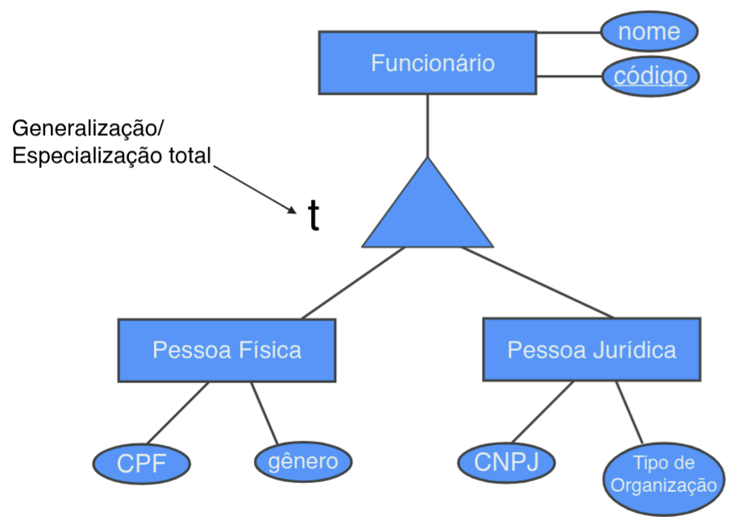

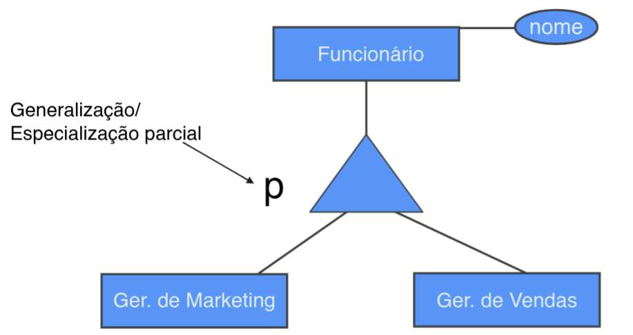


## Tipos de Entidade


## Notação
- Peter Chen

- UML
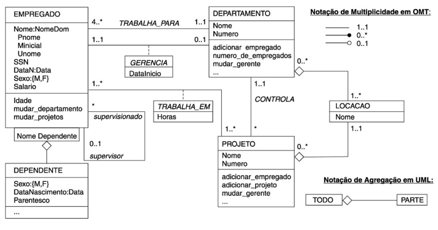

- *Crow’s Foot Notation* - Notação Pé de Galinha
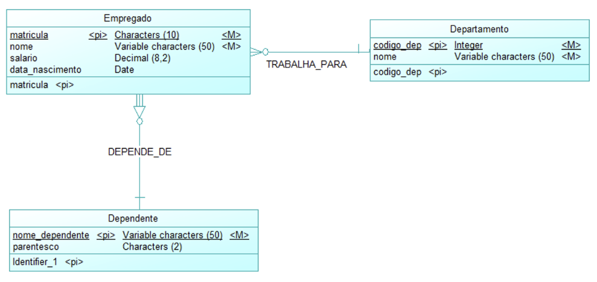

