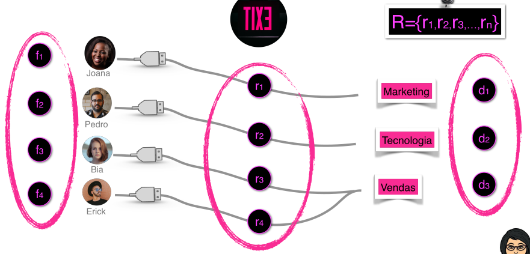
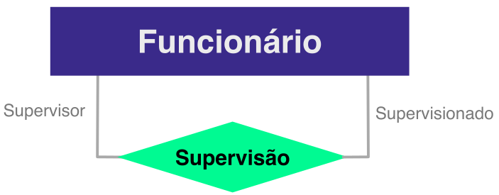
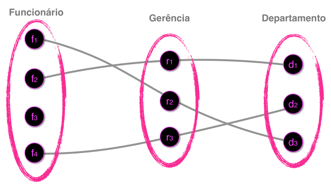
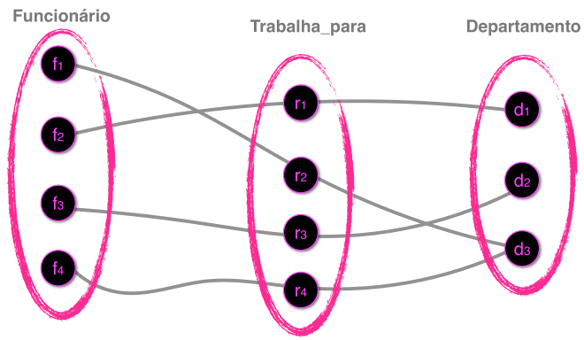
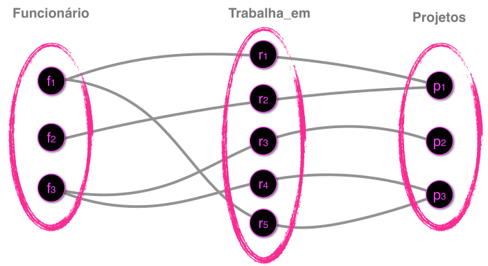

# Modelo Entidade Relacionamento

- É um modelo de dados **conceitual** de <u>alto nível</u>.
- Está centrado na **percepção dos usuários** sobre os dados, não
  importando a maneira na qual os dados serão **armazenados**.

## Entidade

- É um **elemento** do mundo real com uma existência própria.
- **Exemplo:** Pessoas, Carros, Casa, ...
- Cada entidade possui propriedades que a descrevem, chamadas de **atributos**.
- Exemplo: Funcionários da Empresa
```txt
Nome = João
Endereço = Rua A, Casa 123
Idade = 26
Fone = 222-2222
```

### Atributos
- **Simples:** Trata-se de um atributo que **não** é divisível.
  - Data de nascimento;
  - CPF;
  - Matrícula;
- **Composto:** Consiste em vários atributos básicos.
  - Endereço;
  - Logradouro;


- **Atributo Monovalorado:** Possui um <u>único</u> valor para uma entidade particular.
  - Ex: <u>Nome</u> na entidade funcionário

- **Atributo Multivalorado:** Pode ter um <u>conjunto de valores</u> para uma mesma entidade
  - Ex: Email na entidade funcionário, Área de pesquisa


- **Atributo Derivado ou Virtual:** É aquele que <u>pode ser obtido</u> a partir de outros atributos.
  - Ex: <u>Idade</u> calculada a partir da **data de nascimento**, <u>número total de funcionários</u> - derivado da **soma** dos empregados.
  - **Não** é armazenado no SGBD.

- **Valores NULL:** Valor vazio para um atributo.
  - Ex: Telefone Residencial

- **Atributo Chave:** Identifica cada entidade <u>unicamente</u>.
  - Matrícula, CPF, código, id, ...
  - É marcado com "um traço embaixo", sublinhado.


- **Domínio de um Atributo:**
  - Especifica os <u>possíveis valores</u> que podem estar associados a um atributo em cada entidade individual.
  - Ex: Domínio do atributo *Nome* seria um conjunto de <u>caracteres alfabéticos</u>.

## Relacionamento

- É um conjunto de **associações** entre entidades.
- Relacionamento **liga** as instâncias dos dados



- **Grau** de um Tipo de Relacionamento:
  - **Binário:** Relaciona <u>dois</u> entidades. 
  - **Terciário:** Relaciona <u>três</u> entidades.
  - **Não existe** um limite para quantas entidades podem participar de um relacionamento.


- Relacionamento **Recursivo**: A entidade se relaciona com ela <u>mesma</u>.
  - Pré-requisito e uma disciplina;
  - Funcionário e supervisor;


- É importante explicitar os papeis do relacionamento.
- Exemplo de como fica na modelagem:



### Cardinalidade

- Quantidade que as **instâncias** da entidade podem se relacionar.
- `1:1` um para um



- `1:N`um para muitos
- `N:1` muitos para um



- `N:N` muitos para muitos



#### Cardinalidade (Mínima, Máxima)


- **Cardinalidade Mínima:** Substitui a participação. 
  - 0: Parcial; 
  - 1: Total.
- **Cardinalidade Máxima:** Continua como antes.
  - 1 ou N.

### Participação

- **Obrigatoriedade** que a entidade pode ter ao participar daquele relacionamento.
- **Total:** Obrigatório.
  - É representada por dois traços `===`.
  - **Todas** as instâncias da entidade precisam estar <u>relacionadas</u> com as instâncias da outra entidade.
- **Parcial:** Optativo.
  - É representado por apenas um traço `---`.
  - **Nem todas** as instâncias da entidade precisam estar relacionadas com as instâncias da outra entidade.


### Relacionamento Ternário


## Entidade Fraca

Ver vídeo no apreender3!!!

Não tem um atributo que pode ser considerado chave, único

Chave composta, sua chave + a chave da entidade forte

- (matriculaEmp , nomeDep)

toda entidade fraca tem participação total no relacionamento de identificação com a entidade forte.

Ver outros vídeos no apreender3!!!

## Exemplo
- Uma Empresa é organizada em departamentos. Cada departamento tem um nome, um número e um empregado que gerencia o departamento. Deve-se saber a data em que um empregado iniciou como gerente de um departamento. Um departamento pode ter diversas localizações.

- Um departamento controla um número de projetos, cada qual com um nome, um número e uma única localização.

- São armazenados o nome do empregado, matrícula, endereço, salário, sexo e data de nascimento. Um empregado está associado a um departamento, mas pode trabalhar em diversos projetos, não necessariamente controlados pelo mesmo departamento. Deve-se saber o número de horas semanais que um empregado trabalha em cada projeto, bem como o supervisor direto de cada empregado.

- Cada empregado pode possuir vários dependentes, devendo-se saber, para cada dependente, o nome, o sexo, a data de nascimento e a sua ligação com o empregado.


- Ver vídeo no apreender3!!!
- relacionamento ganha um atributo
- Como descobrir a cardinalidade
  - 1 empregado pode trabalhar em quantos departamento ? 1 , a resposta vai para o outro lado
  - 1 departamento pode ter quantos funcionários trabalhando nele ? vários ? vai para o outro lado
  - Sempre escolher uma instância para fazer a analise
- Todos os empregados são supervisores ?

## Especificação e Generalização


## Tipos de Entidade


## Notação
- Peter Chen
- UML


- *Crow’s Foot Notation* - Notação Pé de Galinha


