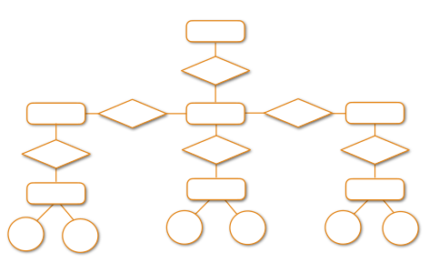
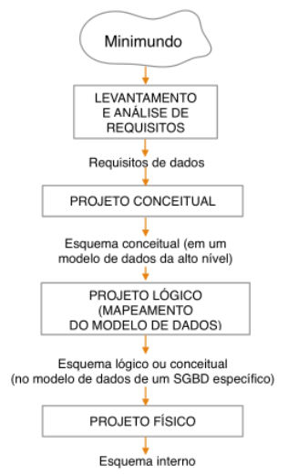
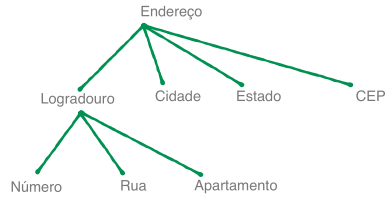
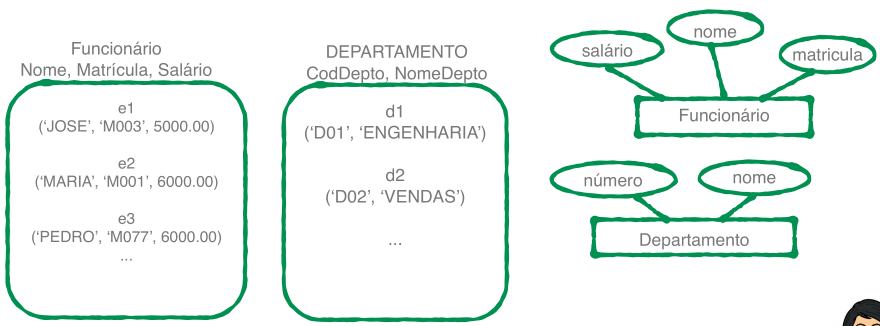

# Modelo Entidade Relacionameto

- É um modelo de dados **conceitual** de <u>alto nível</u>.
- Está centrado na **percepção dos usuários** sobre os dados, não
  importando a maneira na qual os dados serão **armazenados**.





## Entidade
- É um **elemento** do mundo real com uma existência própria.

- Cada entidade possui propriedades que a descrevem, chamadas de **atributos**.

Exemplo: Funcionários de uma empresa

```
Nome = João
Endereço = Rua A, Casa 123
Idade = 26
Telefone = 11 91111-1111
```

### Atributos

- **Simples:** Trata-se de um atributo que **não** é divisível.
  - Data de nascimento;
  - CPF;
  - Matrícula;
- **Composto:** Consiste em vários atributos básicos.
  - Endereço;
  - Logradouro;




- **Atributo Monovalorado:** Possui um <u>único</u> valor para uma entidade particular.
  - Ex: <u>Nome</u> na entidade funcionário

- **Atributo Multivalorado:** Pode ter um <u>conjunto de valores</u> para uma mesma entidade
  - Ex: Email na entidade funcionário, Área de pesquisa


- **Atributo Derivado ou Virtual:** É aquele que <u>pode ser obtido</u> a partir de outros atributos.
  - Ex: <u>Idade</u> calculada a partir da **data de nascimento**, <u>número total de funcionários</u> - derivado da **soma** dos empregados.
  - **Não** é armazenado no SGBD.

- **Valores NULL:** Valor vazio para um atributo.
  - Ex: Telefone
- Entidade na forma de instâncias, elementos de um conjunto:



- **Atributo Chave:** Identifica cada entidade unicamente.
  - Matrícula, CPF, código, id, ...
  - É marcado com "um traço embaixo", sublinhado


- **Domínio de um Atributo:**
  - Especifica os <u>possíveis valores</u> que podem estar associados a um atributo em cada entidade individual.
  - Ex: Domínio do atributo *Nome* seria um conjunto de <u>caracteres alfabéticos</u>.
