# Modelo Relacional

- Criado por *Edgar Frank Codd* na década de 70.

### Tabela - Relação

FUNCIONARIO
| matricula | nome | data_nasc | salario |
| :-------: | :--: | :--------:| :-----: |
| 111 | Joana | 25/06/1991 | 12.000 |
| 222 | Pedro | 14/08/1995 | 8.000 |
| 333 | Bia | 03/11/1994 | 9.000 |
| 444 | Erick | 17/10/1997 | 6.000 |

DEPARTAMENTO
| CodDep | NomeDep |
| :--: | :-----: |
|  VE  | Vendas |
|  MK  | Marketing |
|  TI  | Tecnologia |

- Nela estão contidos os dados dos nossos funcionários.
- **Coluna:** Atributo ou a propriedade da tabela.
    - **Nome do Campo:** "Nome" do atributo.
        - Ex: matricula, nome, salario.
    - **Valor do Abritubo:** Valor de um determinado campo. 
        - Ex: 111, Joana, 12.000.

- **Linha** ou **Tuplas:** São os <u>registros</u> da tabela.
- **Grau:** Número de atributos/colunas que uma tabela possue.
    - Ex: Possui grau 4.

- **Chave Primária (*Primary Key - PK*):** Identifica <u>unicamente</u> uma tupla detre o conjunto de todas as tuplas.
    - Ex: matricula, CodDep.

- **Chave Candidata:** Um possível atributo que <u>pode ser</u> a **chave primária**, ou seja, identificar unicamente a entidade.
    - Ex: matricula, cpf.

- **Chave Estrangeira:** É utilizado para fazer <u>relacionamento/ligamento</u> entre tabelas.
    - Incluí-se uma coluna nova na tabela e o valor dessa coluna está ligado com a outra tabela que está sendo relacionada.
    - Ex: `CodDep` é a chave **estrangeira (*Foreign Key - FK*)**.

| matricula | nome | data_nasc | salario | CodDep |
| :-------: | :--: | :--------:| :-----: | :---: |
| 111 | Joana | 25/06/1991 | 12.000 | MK |
| 222 | Pedro | 14/08/1995 | 8.000 | TI |
| 333 | Bia | 03/11/1994 | 9.000 | VE |
| 444 | Erick | 17/10/1997 | 6.000 | VE |

### Restrições de Integridade - *Constraints*

- São as **regras** que o SGBD <u>vai ou não permitir</u> dentro do bando de dados.

#### Restrição de Integridade de Domínio
- **Domínio:** <u>Conjunto de valores</u> que um determinado atributo pode ter. 
- O SGBD vai garantir essa restrição de valores, ou seja, não haverá dados fora do domínio especificado.
    - Ex: Nome = 23435.

#### Restrição de Integridade de Valores NULL
- Pode definir se aquela coluna é **obrigatória**, `NOT NULL`, não pode ter valores nulos.
- Ex: A coluna nome pode ser colocada como `NOT NULL`, assim, quando o for tentar inserir no banco de dados alguma instância sem nome o SGBD irá retornar um erro. 

#### Restrição de Integridade de Entidade
- Está relacionada com a chave primária.
- Uma chave primária **não** pode ser **repetida** e ser **nula**.

#### Restrição de Integridade Referencial
- Está associada ao conceito de chave estrangeira.
- O valor de uma **chave estrangeira** tem que ser **igual** ao valor de uma **chave primária**.
    - Isso tem que ocorrer para fazer a ligação com a outra tabela. 

- O SGBD não permite colocar um valor de chave estrangeira que **não exista** como chave primária da tabela que faz referência a essa chave estrangeira.

> [!WARNING]
>
> Uma **chave estrangeira** também pode ser **nula**, ela pode ser um campo que não estaja preenchido se a chave estrangeira for `NOT NULL`.
> - Isso ocorre quando o relacionamento é **Parcial**.

## Mapeamento MER $\rightarrow$ MR

- O objetivo é transformar o projeto conceitual feito pelo MER para o modelo lógico usando MR.

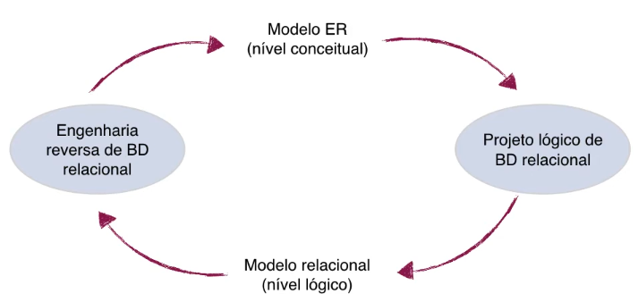

### Entidade

- Cada **entidade** vira uma **tabela** no banco de dados.
- Cada dessa entidade **atributo** gera uma **coluna** da mesma.

#### Atributo Composto

- Somente as **partes** desse atributo composto é mapeada.
- Funcionario (<u>matricula</u>, nome, rua, cidade)

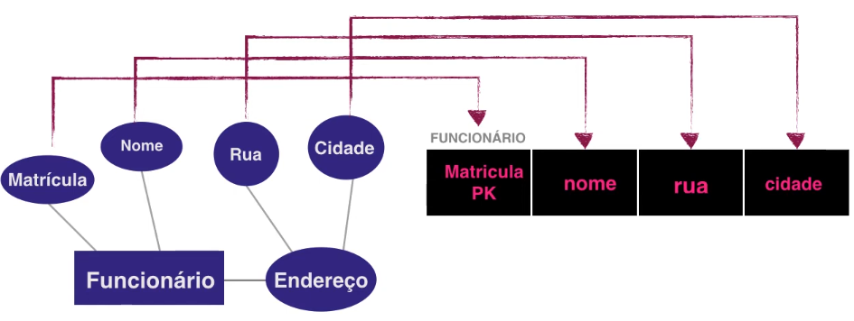

FUNCIOANRIO
| matricula (PK) | nome | rua | cidade |
| :-----------: | :--: | :-: | :----: |

#### Atributo Multivalorado

- É preciso **criar** uma **nova tabela** para esse atributo.
    - Isso ocorre para **evitar a repetição** da **chave primária** que seria um erro (Integridade de Entidade).
- Ex: Funcionario e Telefone
    - A chave da tabela TELEFONE é composta pela **chave do funcionário** + o próprio **atributo telefone**.
    - É uma **Chave Composta**.
- Funcionario (<u>matricula</u>, nome, rua, cidade)
- Telefone ((<u>matFunc(</u> (PK), (<u>fone</u>), onde `MatFunc` referencia Funcionario (matricula)

FUNCIOANRIO
| matricula (PK) | nome | rua | cidade |
| :-----------: | :--: | :-: | :----:  |

TELEFONE
| matFunc (FK e PK) | fone (PK) |
| :--------------: | :--------: |

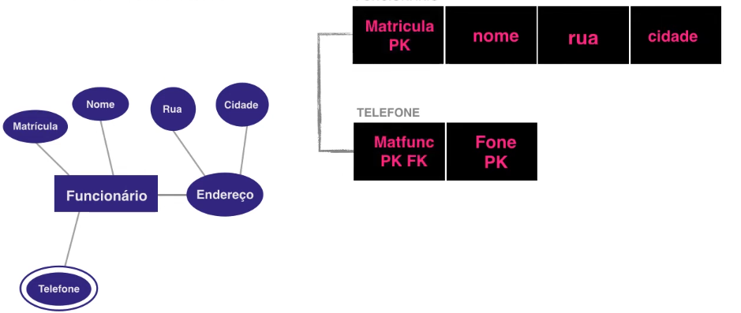

#### Entidade Fraca

- É uma entidade que precisa da **chave** de uma **outra entidade** para se identificar unicamente.
- Ex: Funcionario e Dependete
    - A chave da tabela DEPENDENTE é composta pela **chave do funcionário** + o **nome** do dependente.
    - É uma **Chave Composta**.
- Funcionario (<u>matricula</u>, nome, rua, cidade)
- Dependente (<u>matFunc</u>, <u>nome</u>, data_nasc, parentesco), onde `MatFunc` referencia Funcionario (matricula)

FUNCIOANRIO
| matricula (PK) | nome | rua | cidade |
| :-----------: | :--: | :-: | :----:  |

DEPENDENTE
| matFunc (PK e FK) | nome (PK) | data_nasc | parentesco |
| :--------------: | :--------: | :-------: | :--------: | 

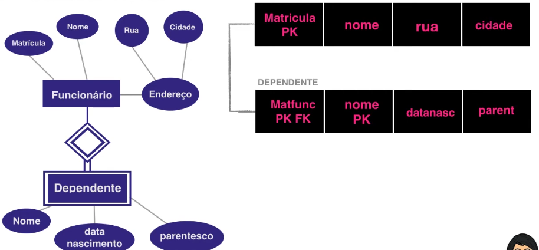

### Relacionamento

- Pode gerar uma **tabela** ou ser uma **coluna/conjunto de colunas**, como na coluna `FK`, no banco de dados. 
- O relacionamento no modelo relacional é implementado por meio de **chaves estrangeiras**.
    - Ou seja, são responsáveis pelo relacionamento entre as tabelas.

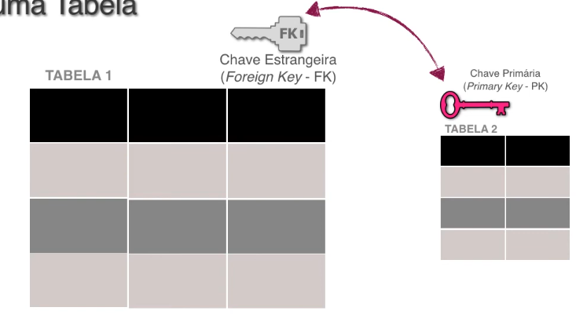

#### Relacionamento 1:1
- **Parcipação total** dos dois lados: Gera uma **única** tabela no banco de dados. 

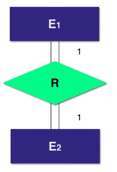  
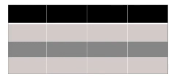

- **Parcipação parcial** dos dois lados: Cria-se uma coluna de **chave estrangeira** em uma das tabelas para fazer a ligação.
    - Não faz diferença em qual tabela ($E_1$, $E_2$) colocar a chave estrangeira.
    - Normalmente, coloca-se na tabela que tem **menos registros**.

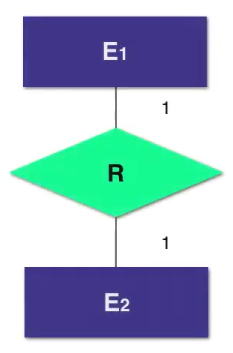  
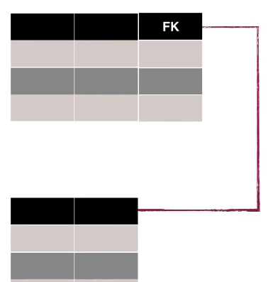
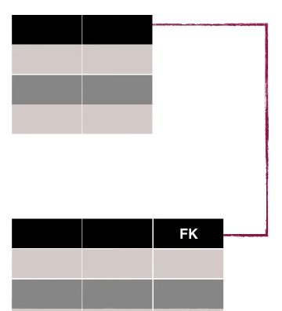

- **Parcipação total** de um lado e **Participação parcial** de outro: Cria-se uma coluna de **chave estrangeira** na tabela com **partcipação total**.
    - Garante que não vai ter espaços em brancos.

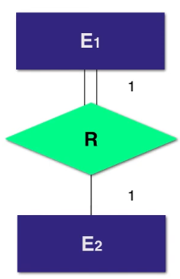  
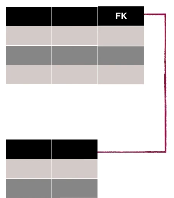

#### Relacionamento 1:N / N:1
- Cria-se uma coluna de **chave estrangeira** na tabela que se relaciona uma **única** vez com a outra tabela, ou seja, do `lado N` na **modelagem MER**.
- Caso fosse ao contrário ocorreria a duplicata da **chave primária (*pk*)**.

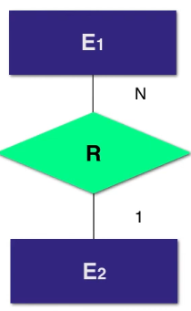  
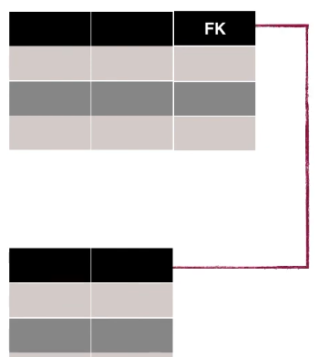

#### Relacionamento N:N
- Cria-se uma **nova tabela** que é composta por **chaves estrangeiras** das outras tabelas. 

> [!NOTE]
>
> Nessa nova tabela criada com as **chaves estrangeiras (*FK*)**, elas também são **chaves primárias (*PK*)** dessa nova tabela.

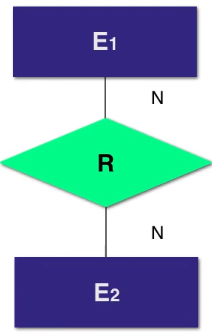  
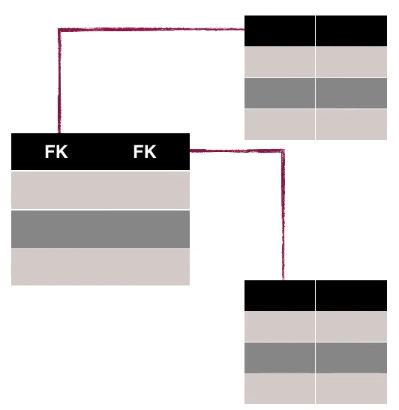

### Relacionamento Ternário ou Maior que 2

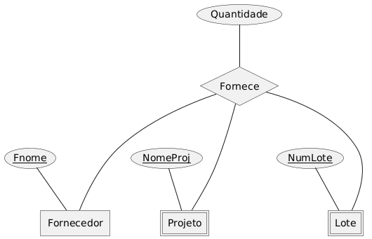

- Cria-se uma **tabela** para o relacionamento que recebe como **chave estrangeira** e **primária**, as chaves primárias das outras entidades.

| NumLote \<pk>, \<fk> | FNome \<pk>, \<fk> | NumProj \<pk>, \<fk> | Quantidade |
| :------------------: | :----------------: | :------------------: |:---------: |

### Generalização/Especialização
- Existem três possíveis alternativas a se considerar.

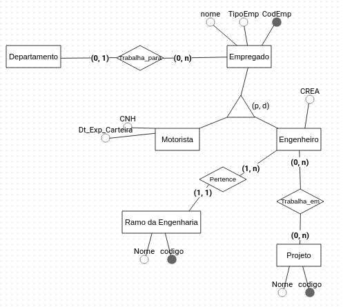

#### Uso de uma **única tabela** para toda hierarquia;
```
Empregado (codEmp, nome, tipoEmp, cartHab, dtcartHab, CREA, codREng, codDep)
    codREng referencia RamoEng(codREng)
    codDep referencia Departamento(codDep)

ProjEmp (codEmp, codProj)
    codEmp referencia Empregado(codEmp)
    codProj referencia Projeto(codProj)

Projeto (codProj, nome)
RamoEng (codREng, nome)
Departamento (codDep, nome)
```

#### Uso de **subdivisão** da entidade genérica;

```
Empregado (codEmp, nome, tipoEmp, codDep)
    codDep referencia Departamento(codDep)

ProjEmp (codEmp, codProj)
    codEmp referencia empregado(codEmp)
    codProj referencia Projeto(codProj)

Motorista (codEmp, CartHab, dtCartHab)
    codEmp referencia Empregado(codEmp)

Engenheiro (codEmp, CREA, codREng)
    codEmp referencia Empregado(codEmp)
    codREng referencia RamoEng (codREng)

Projeto (codProj, nome)
RamoEng (codREng, nome)
Departamento (codDep, nome)
```

#### Uso de uma tabela **para cada** entidade.

```
EmpOutros (codEmp, nome, tipoEmp, codDep)
    codDep referencia Departamento(codDep)

ProjEmp (codEmp, codProj)
    codEmp referencia Engenheiro(codEmp)
    codProj referencia Projeto(codProj)

Motorista (codEmp, nome, CartHab, dtCartHab, codDep)
    codDep referencia Departamento(codDep)

Engenheiro (codEmp, nome, CREA, codREng, codDep)
    codDep referencia Departamento(codDep) 
    codREng referencia RamoEng (codREng)

Projeto (codProj, nome)
RamoEng (codREng, nome)
Departamento (codDep, nome)
```

## Exemplo - RH

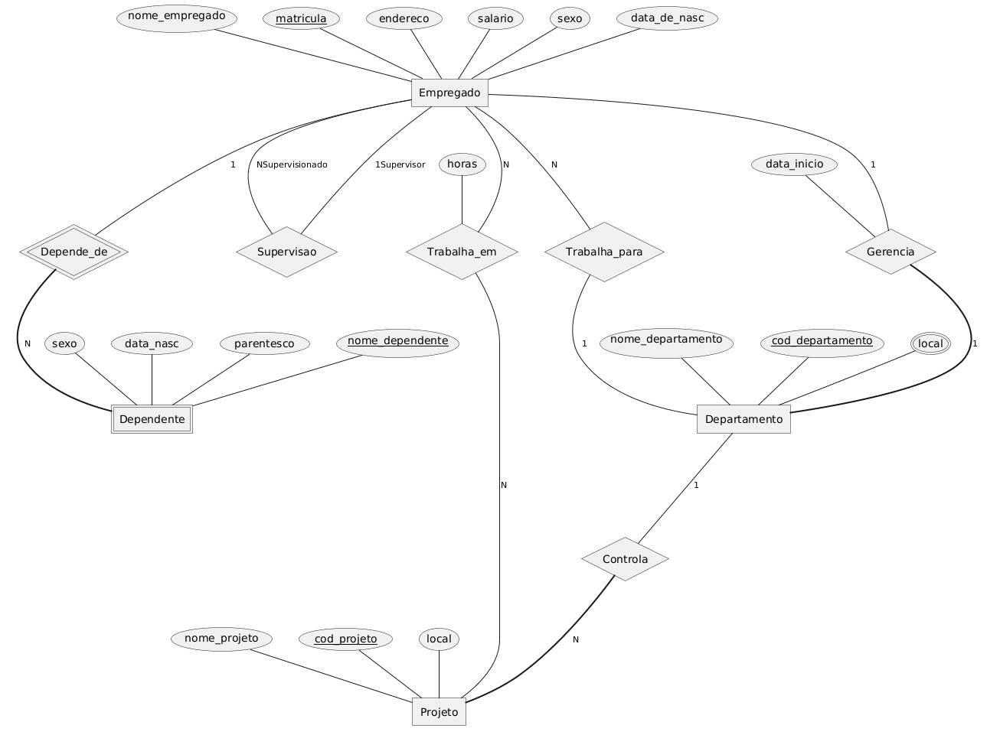

PROJETO
| cod_proj \<pk> | nome_proj | local | dep_con \<fk> | 
| :------------: | :-------: | :---: | :-----------: |

EMPREGADO
| matricula \<pk> | nome_emp | endereco | salario | sexo | data_nasc | depart \<fk> | supervisor \<fk> | 
| :-------------: | :------: | :------: | :-----: | :--: | :-------: | :----------: | :--------------: |

> **Auto-Relacionamento:** Liga-se à própria chave primária.

DEPARTAMENTO
| nome_dep |  cod_dep \<pk> | gerente \<fk> | dt_inicio_gerente |
| :------: | :------------: | :-----------: | :---------------: |

LOCAL_DEP
| cod_dep \<pk>, \<fk> | local \<pk> | 
| :------------------: | :---------: |

> Tabale local (cod_dep, local) cod_dep referencia Departamento (cod_dep).

DEPENDENTE
| nome \<pk> | sexo | parentesco | data_nasc | matricula \<pk>, \<fk> |   
| :--------: | :--: | :--------: | :-------: | :--------------------: | 

> **Chave Composta:** (matricula, nomeDep)

EMP_PROJ
| cod_proj \<pk>, \<fk> | cod_emp \<pk> ,\<fk> | horas |  
| :-------------------: | :------------------: | :---: | 
