# SQL - *Structured Query Language*

- Foi criado por ***Donald D. Chamberlim*** e por ***Raymond F. Boyce*** no laboratório da IBM.
- Virou padrão pela primeira vez em 1986 pela `ANSI` e `ISO`.
- Hoje em dia existe diversas outras versões: `SQLServer`, `MySQL`, `PostgreSQL`.  
- Basicamente, o mesmo SQL que é usado no `MySQL` pode ser usado no `PostgreSQL`, por exemplo.
    - Existe algumas **pequenas diferenças** entre eles, embora o contexto geral do `SQL` é sempre mantido.

## Linguagem SQL
- Na lingaugem `SQL` existem diversas **sublinguagens**: 
    - **DDL (*Data Definition Language*):** Linguagem de <u>definição</u> de dados, **estrutura** do banco de dados.
    - **DML (*Data Manipulation Language*):** Linguagem para <u>manipulção</u> dos dados.

## DDL - *Data Definition Language*
- `CREATE`: Cria objetos no meu banco de dados.
    - Banco de Dados;
    - Tabelas.

```sql
CREATE database nome_banco;
(
    coluna tipo [constraint coluna],
    ...
    ...
    ...
    [constraint tabela]
);
-- [ ]: Siginifica que essa parte é opcional
```

> [!NOTE]
>
> - Podemos colocar a constraint direto na coluna ou criar todas as colunas e depois criar as regras no final da tabela.

- Cada SGBD possui um **conjunto de dados específicos**, o exemplo a seguir e usando o `MySQL`.

| Tipo | Descrição |
| :--: | :-------: |
| `VARCHAR (size)` | Valores de caractere variável |
| `CHAR (size)` | Valores de caracteres fixos |
| `INTEGER` | Valores Numéricos |
| `DECIMAL (p,s)` | Valores Numérios, `p`: Número de dígitos totais, `s`: Quantidade de dígitos após a vírgula |
| `DATE` | Valores data |
| `BLOB` | Valores de caracteres de comprimento variável para dados binários até 2GB, usado para colocar foto, pdf |
| `LOGBLOB` | valores de caracteres de comprimento variável para dados binários |

> [!WARNING]
>
> - Prestar atenção em como a estrutura da data está no Banco de Dados.

### Constraints
- `NOT NULL`: A coluna é obrigatória, ela não pode estar nula no Banco de Dados.  
- `UNIQUE`: A coluna é única, nessa coluna não pode ter outra instância de valor igual. 
    - CPF, matrícula, ...
- `PRIMARY KEY`: Chave Primária.
- `FOREIGN KEY`: Chave Estrangeira.
- `CHECK`: Verificação para domínios, lista de valores possíveis que um atributo pode ter (**lista de domínios**). 
    - Ex: O Estado Civil de uma pessoa é solteiro, casado ou viúvo.

#### Sintaxe

```sql
-- Nível de Coluna
coluna [CONSTRAINT nome_constraint] tipo_constraint,

-- Nível de Tabela
coluna, ...
[CONSTRAINT nome_constraint tipo_constraint (coluna, ...)], 
```

- `ALTER TABLE`: Altera **estrutura** e ***constraints*** de uma tabela.  
    - Adiciona e altera colunas;
    - Inclui ou remove constraints;
    - Habilita e desabilita constraints, ocorre quando estamos fazendo **migração** ou **manutenção** do Banco de dados.

```sql
ALTER TABLE nome_tabela
ADD [CONSTRAINT nome_constraint] tipo_constraint (nome_coluna)
-- 
ALTER TABLE <nome_tabela>
DROP PRIMARY KEY | UNIQUE tipo_constraint (nome_coluna) | 
CONSTRAINT nome_constraint [CASCADE];
-- Cascade: Apaga em cascata as constraint relacionadas àquela coluna.
ALTER TABLE nome_tabela
DROP PRIMARY KEY | UNIQUE tipo_constraint (nome_coluna) | 
CONSTRAINT <nome_constraint> [CASCADE]; 
```

- `DROP`: Elimina uma tabela ou um objeto do banco de dados.
    - **Todos** os <u>dados</u> e estrutura da tabela são excluídos;
    - **Todas** as **transações** pendentes serão efetivadas (***commit***);
    - **Todos** os **índices** serão eliminados.

```sql
DROP TABLE <nome_tabela>
    [CASCADE CONSTRAINTS];
```

## Exemplos - DDL

### Exemplo Simples
```sql
create table pessoa (
    codigo integer primary key,
    nome varchar(50) not null,
    data_nasc date
)

create table projeto (
    codigo integer primary key,
    nome varchar(100) not null
)

create table pessoa_projeto (
    cod_pes integer references pessoa (codigo),
    cod_proj integer references projeto (codigo),
    primary key (cod_pes, cod_proj)
)
```

### Exemplo - Dentran
- Criando o Banco de Dados.

```bash
mysql> CREATE DATABASE detran;
Query OK, 1 row affected (0.00 sec)

mysql> SHOW DATABASES;
+--------------------+
| Database           |
+--------------------+
| information_schema |
| detran             |
| mysql              |
| performance_schema |
| sys                |
+--------------------+
```

- Criando as tabelas e relacionamentos.
```sql
-- Tabela Proprietário
CREATE TABLE proprietario (
	idProprietario INTEGER AUTO_INCREMENT PRIMARY KEY,
	cpf CHAR(11) UNIQUE NOT NULL,
	nome VARCHAR(60) NOT NULL,
	data_nasc DATE,
	cidade VARCHAR(30),
	estado VARCHAR(20),
	bairro VARCHAR(40)
);

-- Tabela Telefone
CREATE TABLE telefone (
	numero VARCHAR(15),
	idProprietario INTEGER REFERENCES proprietario (idProprietario),
	PRIMARY KEY (numero, idProprietario)
);

-- Tabela Categoria
CREATE TABLE categoria (
	idCategoria INTEGER AUTO_INCREMENT PRIMARY KEY,
	nome_categoria VARCHAR(15)
);

-- Tabela Modelo
CREATE TABLE modelo(
	idModelo INTEGER AUTO_INCREMENT PRIMARY KEY,
	nome_modelo VARCHAR(15)
);

-- Tabela Veículo
CREATE TABLE veiculo (
	idVeiculo INTEGER AUTO_INCREMENT PRIMARY KEY,
	cor VARCHAR(15),
	placa VARCHAR(10) UNIQUE NOT NULL,
	chassi VARCHAR(50) UNIQUE NOT NULL,
	ano_fabricacao DATE,
	idProprietario INTEGER REFERENCES proprietario (idProprietario),
	idModelo INTEGER REFERENCES modelo (idModelo),
	idCategoria INTEGER REFERENCES categoria (idCategoria),
);

-- Tabela Tipo de Infração
CREATE TABLE tipo_infracao (
	idTipo_Infracao INTEGER AUTO_INCREMENT PRIMARY KEY,
	valor DECIMAL (6,2) NOT NULL
);

-- Tabela Local
CREATE TABLE local (
	idLocal INTEGER AUTO_INCREMENT PRIMARY KEY,
	vel_permitda INTEGER,
	longitude DECIMAL (11,8) NOT NULL, -- pos_geografica POINT NOT NULL
	latitude DECIMAL (10,8) NOT NULL,
);

-- Tabela Agente de Trânsito
CREATE TABLE agente_transito (
	matricula INTEGER PRIMARY KEY,
	nome VARCHAR(60) NOT NULL,
	data_contratacao DATE,
);

-- Tabela Infracao
CREATE TABLE infracao (
	data_hora DATETIME,
	vel_aferida INTEGER,
	idLocal INTEGER REFERENCES local (idLocal),
	idAgente_Transito INTEGER REFERENCES agente_transito (matricula),
	idTipo_Infracao INTEGER REFERENCES tipo_infracao (idTipo_Infracao),
	idVeiculo INTEGER REFERENCES veiculo (idVeiculo),  
	PRIMARY KEY (data_hora, idLocal, idAgente_Transito, idTipo_Infracao, idVeiculo)
);
```

## DML - *Data Manipulation Language*
- `INSERT`: Insere **dados**, novas linhas, dentro das tabelas no Banco de Dados.
	- `[colunas]`: Pode-se **especificar** quais as colunas estão inserindo os dados no banco de dados 

```sql
INSERT INTO tabela [colunas] VALUES (valores);
--  Apenhas uma linha é inserida por vez com esta sintaxe.

-- Exemplo
INSERT INTO pessoa VALUES (1, 'Cebolinha', '05/30/1990')
INSERT INTO pessoa (codigo, nome) VALUES (2, 'Monica')
INSERT INTO projeto VALUES (1, 'Meninas.Comp') 
INSERT INTO projeto VALUES (2, 'Maratona Cerrado')
INSERT INTO pessoa_projeto (1,1)
INSERT INTO pessoa_projeto VALUES (1,2)
```

- `UPDATE`: Atualiza **dados** do banco de dados.
	- `[, coluna = valor]`: Pode-se atualizar vários colunas de uma só. 
	- `[WHERE condicao]`: **Atualiza somente** os valores da tabela que satisfazem a condição.  
	- Quando **não** é colocada uma condição **todos** os registros daquela tabela são atualizados.  

```sql
UPDATE tabela
SET coluna = valor [, coluna = valor]
[WHERE condicao];

-- Exemplo
UPDATE aluno
SET nome = 'Maria'
WHERE mat = 1

UPDATE professor
SET salario = salario * 0.75

UPDATE professor
SET quadra = 'SQN 210',
	bloco = 'B',
	apartamento = 210
WHERE MAT = 2
```

> [!NOTE]
> 
> Caso erre ao usar o `UPDATE` pode-se usar um **rollback** para voltar ao estado anterior.

- `DELETE`: **Apaga dados**, remove linhas, que estão na tabela.
	- Assim como no `UPDATE` pode-se adicionar uma condição para **apagar somente** os valores da tabela que satisfazem a condição.  
	- Quando **não** é colocada uma condição **todos** os dados daquela tabela são deletados. 

```sql
DELETE [FROM] tabela
[WHERE condicao];
```

> [!WARNING]
>
> Se você tentar excluir uma linha que contém uma chave primária usada como chave estrangeira em outra tabela, ocorrerá um erro de **constraint de integridade referencial**.
> - Nesse caso teria que apagar todas as chaves estrangeiras e depois apaga a chave primária.

- `SELECT`: Executa uma **consulta** no Banco de Dados.
	- `[DISTINCT] (*, coluna [alias])`: Colocamos as colunas que queremos retornar.
		- `*`: Retornar **todas as colunas** da tabela.
		- `DISTINCT`: Retornar somente valores diferentes.
	- `[WHERE condicao]`: **Retorna somente** os valores da tabela que satisfazem a condição.
	- `[ORDER BY {coluna exp} [ASC|desc]]`: Pode-se **ordenar** o resultado de forma **descendente** ou **ascendente**.

```sql
SELECT [DISTINCT] (*, coluna [alias])
FROM tabela
[WHERE condicao]
[ORDER BY {coluna exp} [ASC|desc]];

-- Exemplo
SELECT * 
FROM aluno

SELECT curso, nome 
FROM aluno

SELECT nome 
FROM aluno
WHERE curso = 'CIC'
ORDER BY nome
```

### WHERE
- Na cláusula `WHERE` podemos utilizar diferentes operadores e comparadores lógicos.

| Categoria | Operador | Descrição | Exemplo |
|---|---|---|---|
| Comparação | `=` | Igualdade | `idade = 18` |
| Comparação | `>` | Maior que | `salario > 2000` |
| Comparação | `<` | Menor que | `idade < 30` |
| Comparação | `>=` | Maior ou igual | `nota >= 7` |
| Comparação | `<=` | Menor ou igual | `preco <= 100` |
| Comparação SQL | `IN (lista)` | Retorna valores presentes em uma lista | `estado_civil IN ('Solteiro', 'Casado')` |
| Comparação SQL | `LIKE` | Busca padrões em textos | `nome LIKE 'A%'` |
| Comparação SQL | `IS NULL` | Retorna valores nulos | `telefone IS NULL` |
| Lógico | `AND` | Todas as condições devem ser verdadeiras | `idade > 18 AND cidade = 'Brasília'` |
| Lógico | `OR` | Pelo menos uma condição deve ser verdadeira | `cidade = 'Goiânia' OR cidade = 'Brasília'` |
| Lógico | `NOT` | Inverte uma condição | `NOT idade < 18` |

#### Exemplos
```sql
SELECT nome
FROM aluno
WHERE curso IN ('CIC', 'LIC') -- Retorna o nome dos alunos que são dos cursos CIC ou LIC

SELECT nome
FROM aluno
WHERE curso = 'CIC' OR curso = 'LIC'

SELECT nome
FROM aluno
WHERE nome LIKE 'M%' -- Retorna tudo que começa com M

SELECT nome
FROM aluno
WHERE nome LIKE '%A%' -- Retorna se tem A em algum lugar no nome  

SELECT nome
FROM aluno
WHERE nome LIKE 'A%' -- Retorna tudo que termina com A

-- 'a' != 'A'

SELECT *
FROM aluno
WHERE email IS NULL -- Retorna os alunos que não tem emails cadastrados/preenchidos
```

#### Expressões de Negação

| Categoria | Operador | Descrição | Exemplo |
|---|---|---|---|
| Comparação | `!=` | Diferente de | `idade != 18` |
| Comparação | `<>` | Diferente de (padrão SQL) | `salario <> 2000` |
| Comparação | `^=` | Diferente de (alguns SGBDs) | `nota ^= 10` |
| Comparação SQL | `NOT IN (lista)` | O valor não está presente na lista | `estado_civil NOT IN ('Solteiro', 'Casado')` |
| Comparação SQL | `NOT LIKE` | Não possui determinado padrão | `nome NOT LIKE 'A%'` |
| Comparação SQL | `IS NOT NULL` | O valor não é nulo | `telefone IS NOT NULL` |

#### Exemplos
```sql
SELECT *
FROM cliente
WHERE estado_civil NOT IN ('Solteiro', 'Casado');

SELECT *
FROM cliente
WHERE nome NOT LIKE 'A%';

SELECT *
FROM cliente
WHERE telefone IS NOT NULL;
```

## SELECT
- Executa uma consulta no Banco de Dados.

```sql
SELECT [DISTINCT] (*, coluna [alias])
FROM tabela
[WHERE condicao]
[ORDER BY {coluna exp} [ASC|desc]];
```

- **Produto Cartesiano:** Mistura os dados de tabelas diferentes.

```sql
SELECT *
FROM tabela1, tabela2
```

FUNCIONARIO
| matricula | nome | data_nasc | salario | codDep |
| :-------: | :--: | :-------: | :-----: | :----: | 
| 111 | Joana | 25/06/1991 | 12.000 | MK |
| 222 | Pedro | 14/08/1995 | 8.000 | TI | 

DEPARTAMENTO
| codDep | Descrição |
| :----: | :-------: | 
|   MK   | Marketing |
|   TI   | Tecnologia |

```sql
SELECT *
FROM funcionario, departamento
```

FUNCIONARIO_DEPARTAMENTO
| matricula | nome | data_nasc | salario | codDep | codDep | Descrição |
| :-------: | :--: | :-------: | :-----: | :----: | :----: | :-------: | 
|    111    | Joana | 25/06/1991 | 12.000 | MK |  MK   | Marketing  |
|    111    | Joana | 25/06/1991 | 12.000 | MK |  **TI**   | **Tecnologia**  |
|    222    | Pedro | 14/08/1995 | 8.000 | TI |   TI   | Tecnologia |
|    222    | Pedro | 14/08/1995 | 8.000 | TI |   **MK**   | **Marketing** |

- `JOIN`: Junta os dados de tabelas diferentes de forma consisitente.

```sql
SELECT *
FROM tabela1, tabela2
-- O valor da coluna de uma tabela é igual ao valor da coluna de outra tabela.
WHERE tabela1.coluna1 = tabela2.coluna2 

-- Corrigindo o exemplo
SELECT *
FROM funcionario, departamento
WHERE funcionario.codDep = departamento.codDep
```

FUNCIONARIO_DEPARTAMENTO
| matricula | nome | data_nasc | salario | codDep | codDep | Descrição |
| :-------: | :--: | :-------: | :-----: | :----: | :----: | :-------: | 
|    111    | Joana | 25/06/1991 | 12.000 | MK |  MK   | Marketing  |
|    222    | Pedro | 14/08/1995 | 8.000 | TI |   TI   | Tecnologia |

- Existem outros tipos de `JOIN`: `INNER JOIN`, `LEFT JOIN` e `RIGHT JOIN`.

```sql
-- INNER JOIN: Retorna somente os registro com valores iguais.
-- Mesmo resultado do plano cartesiano com WHERE, porém o JOIN é implementado de forma otimizada pelo SGBD. 
SELECT *
FROM tabela1 INNER JOIN tabela2 
	ON tabela1.id = tabela2.id

-- LEFT/RIGHT/FULL JOIN: Retorna todos os valores de um lado se tiver relação, valores iguais, traz junto.
SELECT *
FROM tabela1 [LEFT/RIGHT/FULL] OUTER JOIN tabela2 
	ON tabela1.id = tabela2.id
```

- `GROUP BY`: Mostra dados referente a um grupo de registros.
	- Agrupa um conjunto de dados e aplica as condições nesses grupos.
	- Mostra estatística para diferentes grupos;
	- **Inclui** e **exclui** registros de grupos usando a clausura `HAVING`.

```sql
SELECT coluna
FROM tabela
[WHERE condição]
[GROUP BY expressão]
[HAVING condição do grupo]
[ORDER BY colunas]
```

- Funções de Grupo:
	- `AVG`: Média.
	- `COUNT` Contador.
	- `MAX`: Máximo.
	- `MIN`: Mínimo.

- **Subqueries:** Escrever *queries* aninhadas para o banco de dados.
	- Uma ***Subquery*** é um `SELECT` que contém outros SELECT's.
	- Deve estar sempre entre **parênteses**.
	- Deve aparecer do **lado direito** do operador.
	- Pode ser usado na clausura `FROM`.
	- É comum a ***Subquery*** está dentro do `WHERE`.

```sql
-- Query Principal
SELECT lista_select
FROM tabela
WHERE expressão operador
-- Subquery
	(SELECT lista_select
	FROM tabela)
```

> [!IMPORTANT]
>
> - A ***subquery*** é executada antes da query principal.

### Exemplo: NBA

```sql
-- Nomes dos Jogadores e o Nome dos Times
SELECT tb_pessoa.nome_pessoa, tb_time.nome_time -- SELECT nome_pessoa, nome_time pois nome_pessoa e nome_time não existem em outras ocorrências no banco de dados 
FROM tb_pessoa, tb_time, tb_time_jogador
WHERE tb_pessoa.id_pessoa = tb_time_jogador.id_jogador 
AND tb_time.cod_time = tb_time_jogador.cod_time;

-- Usando ALIAS
SELECT nome_pessoa, nome_time
FROM tb_pessoa p, tb_time t, tb_time_jogador tj
WHERE p.id_pessoa = tj.id_jogador  
AND t.cod_time = tj.cod_time;

-- Contar quantos vezes aparecem o nome do time, ou seja, quantos jogadores cada time tem
SELECT COUNT(nome_time), nome_time
FROM tb_pessoa p, tb_time t, tb_time_jogador tj
WHERE p.id_pessoa = tj.id_jogador
AND t.cod_time = tj.cod_time
GROUP BY nome_time;

-- Quero os grupos onde o resultado é a 4
-- Having é a condição do grupo
SELECT COUNT(nome_time), nome_time
FROM tb_pessoa p, tb_time t, tb_time_jogador tj
WHERE p.id_pessoa = tj.id_jogador
AND t.cod_time = tj.cod_time
GROUP BY nome_time
HAVING COUNT(nome_time) > 4;
```

## Outros Tópicos

### Auto-Numeração
- É utilizada para criar um **identificador automático** para uma determinada coluna.

```sql
CREATE TABLE especialidade (
	id IN(11) AUTO_INCREMENT/SERIAL/SEQUENCE, -- Cada SGBD utiliza um nome
	nome VARCHAR(20) NOT NULL,
	PRIMARY KEY (id)
);
```

### VIEWS (Visões)
- São tabelas virtuais ou lógicas criadas a partir de uma tabela física, normalmente oriundas do `SELECT`.

```sql
CREATE VIEW nomeDaVisao 
	AS SELECT ...;
```

### Stored PROCEDURES.
- São programas que **podem ser armazenados** no SGBD, porém depende da linguagem que o SGBD vai usar.
	- Os SGBD comercias tem suas linguagens próprias do `SQL`.

```sql
CREATE PROCEDURE proc_name
([parameters,...])
[BEGIN]
	corpo_da_rotina;
[END]
```

### TRIGGERS (Gatilhos)
- São **objetos** do banco de dados associados a uma tabela, definidos para serem disparados automaticamente e **responderem a um evento particular**.
	- São usados com comandos `DML`.
	- Ex: Quando ocorrer um `UPDATE` em uma tabela o SGBD vai fazer uma função.
- São utilizados para a **auditoria** do banco de dados.
	- Quem mexeu na tabela ?
	- Qual foi a mudança feita na tabela ?
	- Quem fez uma consulta em uma tabela ?

```sql
CREATE TRIGGER 
trigger_name trigger_time trigger_event 
ON table_name FOR EACH ROW trigger_s 

-- Exemplo
CREATE TRIGGER exemplo_trigger AFTER
UPDATE ON funcionario FOR EACH ROW
BEGIN
	IF (NEW.nome IS NOT NULL) THEN 
		INSERT INTO Funcionario_auditoria
			VALUES(NEW.nome, OLD.nome)
	END IF;
END;
```

- Depois que atualiza o funcionário para cada linha, se o novo nome não é nulo insere na tabela de auditoria o novo valor inserido para nome e o antigo valor do nome.

### CURSORES
- São objetos que armazenam um **conjunto de registros**.
- Retornam um resultado do banco de dados, usando variáveis da linguagem de programação e depois e possível manipular aquele cursor.
- Passos:
	1. Declarar (`Declare`)
	2. Abrir (`Open`)
	3. Pegar os dados (`Fetch`).
	4. Fechar (`Close`).

```sql
DECLARE cur1 CURSOR FOR 
SELECT nome
FROM funcionario;

OPEN cur1;

REPEAT 
	FETCH cur1 INTO a;
		SELECT a;
	UNTIL film 
END REPEAT;

CLOSE cur1;
```

## Exemplo - DML

Usando o comando `INSERT INTO`:

```sql
INSERT INTO categoria (cod_categoria, nome_categoria)
VALUES (3, 'Bicicleta Elétrica');

-- Outra forma de usar o INSERT quando não se sabe os valores da tabela
INSERT INTO categoria
VALUES (4, 'Bicicleta');
```

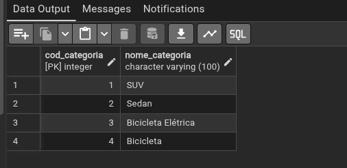

Usando o comando `DELETE`:

```sql
-- Se não colocar o where é deletado todos os registros da tabela
DELETE FROM categoria
WHERE cod_categoria = 4;

-- Erro de Integridade Referencial
DELETE FROM local
WHERE cod_local = 1;
/*
ERROR:  update or delete on table "local" violates foreign key constraint "infracao_idlocal_fkey" on table "infracao"
Key (cod_local)=(1) is still referenced from table "infracao". 

SQL state: 23503
Detail: Key (cod_local)=(1) is still referenced from table "infracao".
*/
```

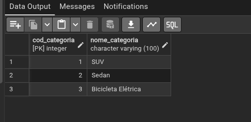

> [!NOTE]
>
> No caso de erro de **Integridade Referencial** seria preciso **primeiro apagar** o registro que faz uso do `cod_local = 1` e posteriormente apagar em sua própria tabela.

Usando o comando `UPDATE`:

```sql
UPDATE categoria 
SET nome_categoria = 'Bicicleta'
WHERE cod_categoria = 3;
```

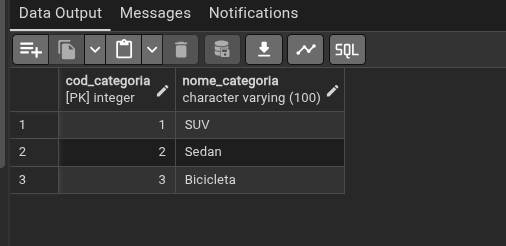

## Exemplo - SELECT

Vendo todas as ocorrências da tabela **veiculo** e da tabela **proprietário:**

```sql
SELECT * FROM veiculo;
SELECT * FROM proprietario;
```

Retornando apenas os nomes dos **proprietários:**

```sql
SELECT nome 
FROM proprietario;
```

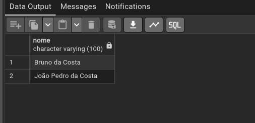

```sql
SELECT nome 
FROM proprietario
ORDER BY nome;
```

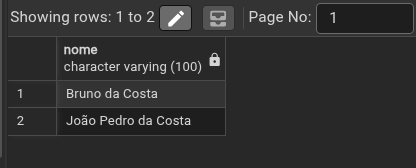

Retornando apenas os nomes e os cpf dos **proprietários:**

```sql
SELECT cpf, nome 
FROM proprietario;
```

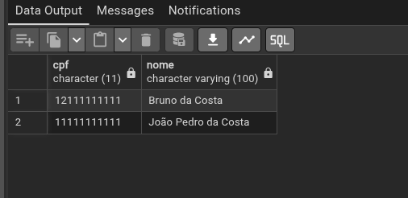

O nome do proprietátio e quais carros eles tem ?

```sql
-- Produto Cartesiano
SELECT * 
FROM proprietario, veiculo; 

-- Produto Cartesiando com WHERE
SELECT * 
FROM proprietario AS p, veiculo AS v
WHERE p.cod_proprietario = v.idproprietario;

-- INNER JOIN
SELECT * 
FROM proprietario AS p 
INNER JOIN veiculo AS v
	ON p.cod_proprietario = v.idproprietario;
```

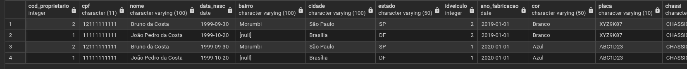

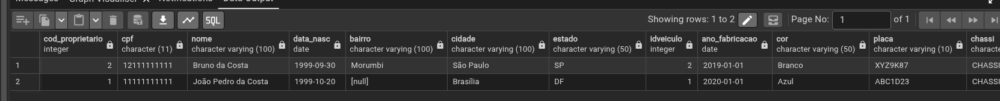

O nome do proprietátio e a placa do carro dele ?
```sql
SELECT nome, placa 
FROM proprietario AS p, veiculo AS v
WHERE p.cod_proprietario = v.idproprietario;
```

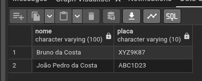

Quantos veiculos tem no banco de dados ?

```sql
SELECT COUNT(*)
FROM veiculo; 
```

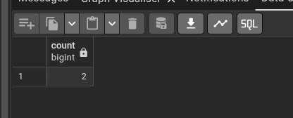

Quantos veiculos por cada cor ?

```sql
SELECT cor, COUNT(*)
FROM veiculo
GROUP BY cor;
```

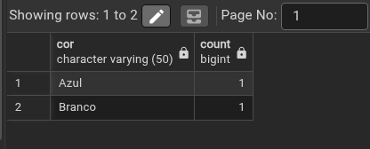

```sql
SELECT cor, COUNT(*)
FROM veiculo
GROUP BY cor
HAVING COUNT(*) > 1;
```

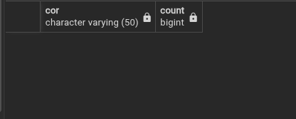
