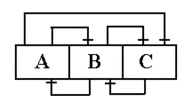

# Normalização
- É importante para identificar um bom projeto relacional.
- Um bom MER e sua consequente conversão para um MR, praticamente deixa o esquema relacional **normalizado**.
- Utiliza-se a normalização somente para validar um projeto relacional.
- As formas normais surgiram para diminuir a redundância do banco de dados.

### Redundância de Dados

| Identidade | Nome          | Endereço       | Habilidade |
| :--------: | :-----------: | :------------: | :--------: |
| 8795835    | Édson Arantes | Ponta da Praia | Futebol    |
| 8795835    | Édson Arantes | Ponta da Praia | Voleibol   |
| 8795835    | Édson Arantes | Ponta da Praia | Basquete   |
| 8795835    | Édson Arantes | Ponta da Praia | Atletismo  |
| 8795835    | Édson Arantes | Ponta da Praia | Tênis      |

- Se Pelé mudar de endereço ? *Problemas com atualização*
- Um novo esporte para Pelé ? *Problemas com inclusão*

### Idealmente
| Identidade | Nome          | Endereço       | Habilidade |
| :--------: | :-----------: | :------------: | :--------: |
| 8795835    | Édson Arantes | Ponta da Praia | { Futebol,Voleibol, Basquete, Atletismo, Tênis } |

Mas isso não é uma tabela pois o atributo **habilidade** não é atômico!

## Formas Normais

### 1º Forma Normal (1FN)
Toda tabela deve ser ***"minimamente"*** normalizada (1FN).

**Tabela em 1FN:** O **valor** de uma coluna de uma tabela é **indivisível**.
- Dados dever ser atômicos.

> ![NOTE]
>
> Toda tabela do modelo relacional já está na **primeira forma normal**.

TB_EMP
| Matrícula | Nome | Cod Cargo | NomeCargo | CodProj | DataFim | Horas |
| :-------: | :--: | :-------: | :-------: | :-----: | :-----: | :---: |
|    120    | João | 1 | Programador | 01 | 17/07/95 | 37 |
|    120    | Jo   | 1 | Programador | 08 | 12/01/96 | 12 |
|    121    | Hélio | 1 | Programador | 01 | 17/07/95 | 45 |
|    121    | Hélio | 1 | Programador | 08 | 12/01/96 | 21 |
|    121    | Hélio | 1 | Programador | 12 | 21/03/96 | 107 |
|    270    | Gabriel | 2 | Analista    | 08 | 12/01/96 | 10 |
|    270    | Gabriel | 2 | Analista    | 12 | 21/03/96 | 38 |
|    273    | Silva | 3 | Projetista  | 01 | 17/07/95 | 22 |
|    274    | Abraão | 2 | Analista    | 12 | 21/03/96 | 31 |
|    279    | Carla | 1 | Programador | 01 | 17/07/96 | 27 |
|    279    | Carla | 1 | Programador | 08 | 12/01/96 | 20 |
|    279    | Carla | 1 | Programador | 12 | 21/03/96 | 51 |
|    301    | Ana | 1 | Programador | 12 | 21/03/96 | 16 |
|    306    | Manoel | 3 | Projetista  | 17 | 21/03/96 | 67 |

Essa tabela está na 1FN, porém apresenta:
- Redundância de dados.
- Problemas de inserção, remoção e atualização.

Uma tabela em 1FN continua com problemas de redundância de dados, inclusão, atualização e remoção.

É necessário a aplicação de outras formais normais:
- 2FN
- 3FN

### Dependência Funcional
- $A \rightarrow B$, lê-se:
    - $A$ funcionalmente determina $B$
    - $B$ é funcionalmente dependente de $A$
    - $B$ é um função de $A$

- Para cada valor de $A$ só existe um valor de $B$.
- $A \neg \rightarrow B$, negação de $A \rightarrow B$.
- $A$ ou $B$ pode ser um conjunto de atributos.

#### Exemplo:
| Identidade | Nome          | Endereço       | Habilidade |
| :--------: | :-----------: | :------------: | :--------: |
| 8795835    | Édson Arantes | Ponta da Praia | Futebol    |
| 8795835    | Édson Arantes | Ponta da Praia | Voleibol   |
| 8795835    | Édson Arantes | Ponta da Praia | Basquete   |
| 8795835    | Édson Arantes | Ponta da Praia | Atletismo  |
| 8795835    | Édson Arantes | Ponta da Praia | Tênis      |

- Identidade $\rightarrow$ Nome.
- Identidade $\rightarrow$ Endereço.
- Identidade $\neg \rightarrow$ Habilidade.
    - Posso ter várias habilidades para uma mesma identidade.
- Nome $\neg \rightarrow$ Identidade.
    - Pode ter homônimos.
- Habilidade $\neg \rightarrow$ Identidade.
    - Posso ter mais de uma pessoa que joga futebol, por exemplo.
- Identidade $\rightarrow$ Nome, Endereço.

### 2º Forma Normal (2FN)
Uma tabela está na Segunda Forma Normal (2FN) se ela está na 1FN e todo atributo do complemento de uma chave candidata é **totalmente funcionalmente dependente** daquela chave.

$A, B, C \rightarrow D$
- $D$ é totalmente funcionalmente dependente de $\{ A,B,C \}$ se para todo valor de $\{ A,B,C \}$ só existe uma valor de $D$, e se $D$ não funcionalmente dependente de $A$, ou $B$, ou $C$.

Para fazer a análise se a tabela está na 2FN fazemos as seguintes perguntas:
1. Quais são as chaves candidatas ?
2. Se os atributos complementos da chave são **totalmente** dependente da chave ?

#### Exemplo
TB_GERAL
| E # | Enome | Sexo | Idade  | D # | Dnome | Opinião |
| :-: | :---: | :--: | :----: | :-: | :---: | :-----: |
| E 1 | João  | M    | 25     | D 1 | Mat   | Boa     |
| E 1 | João  | M    | 25     | D 2 | Quim  | Má      |
| E 1 | João  | M    | 25     | D 3 | Fis   | Boa     |
| E 2 | Maria | F    | 22     | D 2 | Quim  | Satisf. |
| E 2 | Maria | F    | 22     | D 3 | Fis   | Satisf. |
| E 2 | Maria | F    | 22     | D 4 | Est   | Má      |
| E 3 | João  | M    | 27     | D 2 | Quim  | Boa     |
| E 3 | João  | M    | 27     | D 3 | Fis   | Boa     |

- Chave Candidata: { E#, D# }
- Complementos da Chave: Enome, Sexo, Idade, Dnome, Opinião

Analisando as dependências:
- $\{E\#, D\#\} \not\to Enome$, $E\# \to \{Enome\}$. $\rightarrow$ Tabela 1. 
- $\{E\#, D\#\} \not\to Sexo$, $E\# \to \{Sexo\}$. $\rightarrow$ Tabela 1.
- $\{E\#, D\#\} \not\to Idade$, $E\# \to \{Idade\}$. $\rightarrow$ Tabela 1.
- $\{E\#, D\#\} \not\to Dnome$, $D\# \to \{Dnome\}$. $\rightarrow$ Tabela 2.
- $\{E\#, D\#\} \to Opiniao$. $\rightarrow$ Tabela 3.

Logo, essa tabela **não** está na 2FN. E para ficar na 2FN teríamos que criar as seguintes tabelas:

TB_EMP
| E#  | Enome | Sexo | Idade  |
| :-: | :---: | :--: | :----: |
| E1  | João  | M    | 25     |
| E2  | Maria | F    | 22     |
| E3  | João  | M    | 27     |

TB_DISC
| D#  | Dnome |
| :-: | :---: |
| D1  | Mat   |
| D2  | Quim  |
| D3  | Fis   |
| D4  | Est   |

TB_OPNIAO
| E # | D#  | Opinião |
| :-: | :-: |  :----: |
| E1  | D1  | Boa     |
| E1  | D2  | Má      |
| E1  | D3  | Boa     |
| E2  | D2  | Satisf. |
| E2  | D3  | Satisf. |
| E2  | D4  | Má      |
| E3  | D2  | Boa     |
| E3  | D3  | Boa     |

### 3º Forma Normal (3FN)
Uma relção está na 3FN se, e somente se, estiver em 2FN e todos os atributos não-chave forem **dependentes não-transitivos** da chave primária.

Esquecemos as chaves e olhamos os atributos não chave. 

### Dependência Transitiva
Suponha que tenhamos uma tabela com colunas A, B e C.

Se a coluna C é funcionalmente dependente de B e B é funcionalmente dependente de A, então C é funcionalmente dependente de A.

#### Exemplo
TB_GERAL
| Matr | Nome    | codCargo | nomeCargo   | codPro | DataFim  | horas |
| :--: | :-----: | :------: | :---------: | :----: | :------: | :---: |
| 120  | João    | 1        | Programador | 01     | 17/07/95 | 37    |
| 120  | João    | 1        | Programador | 08     | 12/01/96 | 12    |
| 121  | Hélio   | 1        | Programador | 01     | 17/07/95 | 45    |
| 121  | Hélio   | 1        | Programador | 08     | 12/01/96 | 21    |
| 121  | Hélio   | 1        | Programador | 12     | 21/03/96 | 107   |
| 270  | Gabriel | 2        | Analista    | 08     | 12/01/96 | 10    |
| 270  | Gabriel | 2        | Analista    | 12     | 21/03/96 | 38    |
| 273  | Silva   | 3        | Projetista  | 01     | 17/07/95 | 22    |
| 274  | Abraão  | 2        | Analista    | 12     | 21/03/96 | 31    |
| 279  | Carla   | 1        | Programador | 01     | 17/07/95 | 27    |
| 279  | Carla   | 1        | Programador | 08     | 12/01/96 | 20    |
| 279  | Carla   | 1        | Programador | 12     | 21/03/96 | 51    |
| 301  | Ana     | 1        | Programador | 12     | 21/03/96 | 16    |

- Chave Candidata: { Matr, codPro }
    - { Matr } não pode pois repete-se `<pk>` da Matr
    - { codCargo } não pode pois repete-se `<pk>` da codCargo
    - { codPro } não pode pois repete-se `<pk>` da codPro
    - { Matr, codCargo } não pode pois repete-se `<pk>` do codCargo
    - { Matr, codCargo, codPro } não pode pois repete-se `<pk>` do codCargo
- Complementos da Chave: 

Analisando as dependência total:
- $\{Matr, codPro\} \not\to Nome$, $Matr \to \{Nome\}$. $\rightarrow$ Tabela 1. 
- $\{Matr, codPro\} \not\to codCargo$, $Matr \to \{codCargo\}$. $\rightarrow$ Tabela 1.
- $\{Matr, codPro\} \not\to nomeCargo$, $Matr \to \{nomeCargo\}$. $\rightarrow$ Tabela 1.
- $\{Matr, codPro\} \not\to Dnome$, $codPro \to \{Datafim\}$. $\rightarrow$ Tabela 2.
- $\{Matr, codPro\} \to horas$. $\rightarrow$ Tabela 3.

TB_FUNC
| Matr | Nome    | codCargo | nomeCargo   |
| :--: | :-----: | :------: | :---------: |
| 120  | João    | 1        | Programador |
| 121  | Hélio   | 1        | Programador |
| 270  | Gabriel | 2        | Analista    |
| 273  | Silva   | 3        | Projetista  |
| 274  | Abraão  | 2        | Analista    |
| 279  | Carla   | 1        | Programador |
| 301  | Ana     | 1        | Programador |
| 306  | Manuel  | 3        | Projetista  |

TB_PROJ
| codProj | dataFim  |
| :-----: | :------: |
| 01      | 17/07/95 |
| 08      | 12/01/96 |
| 12      | 21/03/96 |

TB_HORAS
| Matr | codPro | horas |
| :--: | :----: | :---: |
| 120  | 01     | 37    |
| 120  | 08     | 12    |
| 121  | 01     | 45    |
| 121  | 08     | 21    |
| 121  | 12     | 107   |
| 270  | 08     | 10    |
| 270  | 12     | 78    |
| 273  | 01     | 22    |
| 274  | 12     | 31    |
| 279  | 01     | 27    |
| 279  | 08     | 20    |
| 279  | 12     | 51    |
| 301  | 01     | 16    |
| 301  | 12     | 85    |
| 306  | 12     | 67    |

Analisando as dependência transitiva:
- NomeCargo é dependente transitivo de Matrícula
- $codCargo \to \{nomeCargo\}$

TB_FUNC
| Matr | Nome    |
| :--: | :-----: |
| 120  | João    |
| 121  | Hélio   |
| 270  | Gabriel |
| 273  | Silva   |
| 274  | Abraão  |
| 279  | Carla   |
| 301  | Ana     |
| 306  | Manuel  |

TB_CARGO
| codCargo | nomeCargo   |
| :------: | :---------: |
| 1        | Programador |
| 2        | Analista    |
| 3        | Projetista  |

Essas tabelas juntos com a TB_PROJ e TB_HORAS estão na 3FN.
