# Atividade DML - Dentra

## Inserindo registros nas tabelas

### Sintaxe do INSERT 

```sql
INSERT INTO nome_tabela (coluna1, coluna2, ...)
VALUES (valor1, valor2, ...);
```

Inserindo na tabela `Proprietário`:
```sql
INSERT INTO Proprietario (cod_proprietario, cpf, nome, data_nasc, bairro, cidade, estado)
	VALUES 
		(1, '11111111111', 'João da Costa', '1999/10/20', NULL, 'Brasília', 'DF'),
		(2, '12111111111', 'Bruno da Costa', '1999/09/30', 'Morumbi', 'São Paulo', 'SP');
```

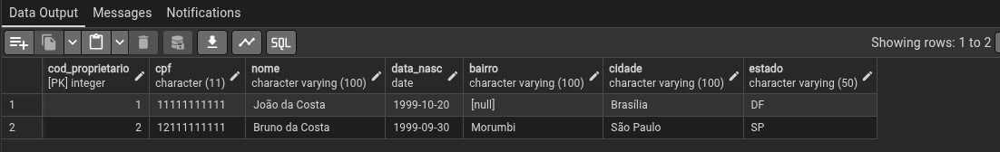

Inserindo na tabela `telefone`:
```sql
INSERT INTO telefone (telefone, cod_proprietario)
VALUES 
    ('(61) 99999-9999', 1), 
    ('(11) 11111-1111', 2);
``` 

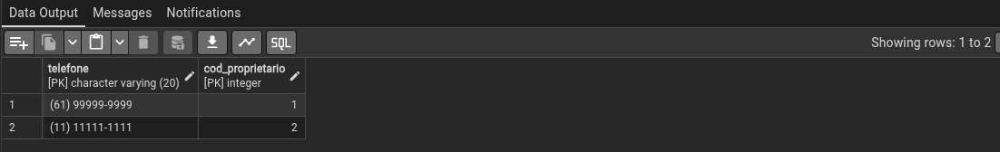

Inserindo na tabela `Categoria`:
```sql
INSERT INTO Categoria (cod_categoria, nome_categoria) 
VALUES 
    (1, 'SUV'),
    (2, 'Sefan');
```

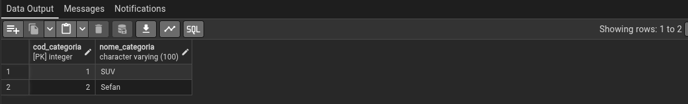

Inserindo na tabela `Modelo`:
```sql
INSERT INTO Modelo (cod_modelo, nome_modelo) 
VALUES 
    (1, 'Pulse'),
    (2, 'Logan');
```


Inserindo na tabela `Veiculo`:
```sql
INSERT INTO Veiculo 
(idVeiculo, ano_fabricacao, cor, placa, chassi, idProprietario, idModelo, idCategoria)
VALUES
    (1, '2020-01-01', 'Prata', 'ABC1D23', 'CHASSI001', 1, 1, 1),
    (2, '2019-01-01', 'Branco', 'XYZ9K87', 'CHASSI002', 2, 2, 2),
    (3, '2022-01-01', 'Preto', 'JKL5M44', 'CHASSI003', 1, 2, 1);
```

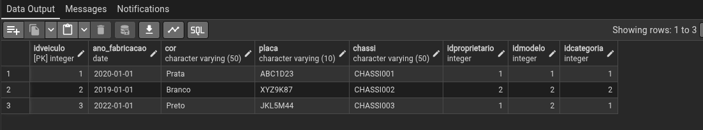

Inserindo na tabela `Local`:
```sql
INSERT INTO Local
(cod_local, vel_permitida, longitude, latitude)
VALUES
    (1, 60, -47.8825, -15.7942),
    (2, 80, -47.9000, -15.7801),
    (3, 40, -47.9105, -15.8123);
```


Inserindo na tabela `Agente_de_Transito`:
```sql

INSERT INTO Agente_de_Transito
(matricula, nome, data_contratacao, tempo_servico)
VALUES
    (1001, 'Carlos Henrique', '2018-03-10', 7),
    (1002, 'Mariana Souza', '2020-08-15', 5),
    (1003, 'Felipe Almeida', '2022-01-20', 3);
```

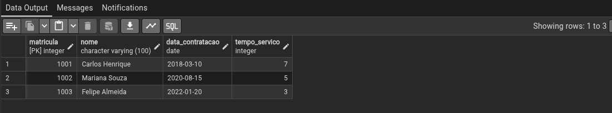

Inserindo na tabela `Tipo_Infrao`:
```sql

INSERT INTO Tipo_Infrao
(cod_tipo_infracao, valor)
VALUES
    (1, 130.16),
    (2, 195.23),
    (3, 880.41);
```

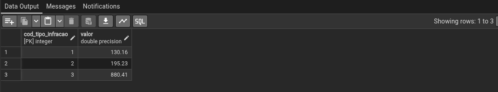

Inserindo na tabela `Infracao`:
```sql
INSERT INTO Infracao
(idVeiculo, idLocal, idAgente_de_Transito, idTipo_Infracao, vel_aferida, data_hora)
VALUES
    (1, 1, 1001, 1, 75, '2025-05-20 14:30:00'),
    (2, 2, 1002, 2, 105, '2025-05-21 09:15:00'),
    (3, 3, 1003, 3, 70, '2025-05-22 18:45:00');
```

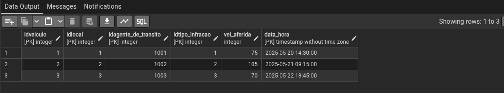

## Atualizando registros na tabelas

### Sintaxe do UPDATE

```sql
UPDATE nome_da_tabela
SET coluna1 = valor1, 
    coluna2 = valor2
WHERE condição;
```

Atualizando na tabela `Categoria`:
```sql
UPDATE Categoria 
SET nome_categoria = 'Sedan'
WHERE cod_categoria = 2;
```

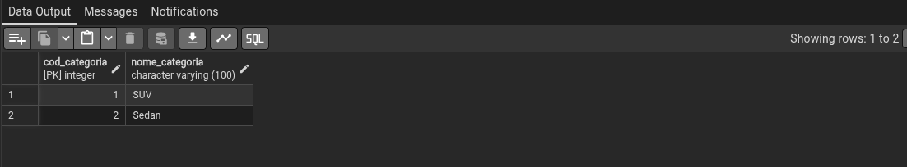

Atualizando na tabela `Veiculo`:
```sql
UPDATE Veiculo
SET cor = 'Azul'
WHERE idVeiculo = 1;
```

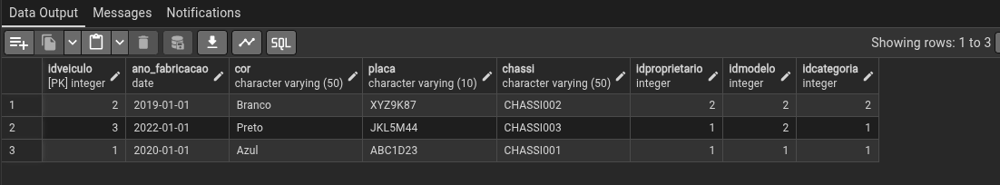

Atualizando na tabela `Proprietario`:
```sql
UPDATE Proprietario
SET nome = 'João Pedro da Costa'
WHERE cod_proprietario = 1;
```

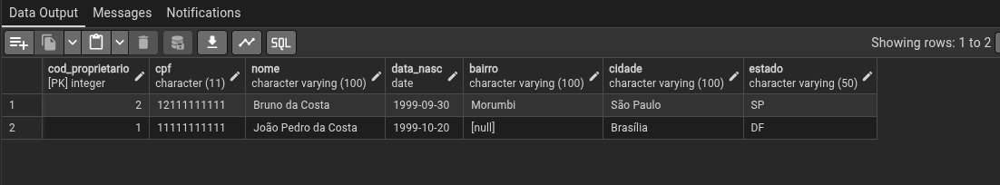

Atualizando na tabela `Tipo_Infrao`:
```sql
UPDATE Tipo_Infrao
SET valor = 250.00
WHERE cod_tipo_infracao = 2;
```


Atualizando na tabela `Local`:
```sql
UPDATE Local
SET vel_permitida = 50
WHERE cod_local = 3;
```

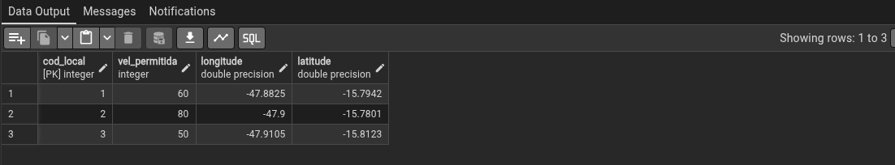

## Deletando registros nas tabelas

### Sintaxe do DELETE 

```sql
DELETE FROM nome_da_tabela 
WHERE condicao;
```

Deletando na tabela `Infracao`:
```sql
DELETE FROM Infracao
WHERE idVeiculo = 3;

DELETE FROM Infracao
WHERE idAgente_de_Transito = 1003;
```
 


Deletando na tabela `Veiculo`:
```sql
DELETE FROM Veiculo 
WHERE idVeiculo = 3;
```

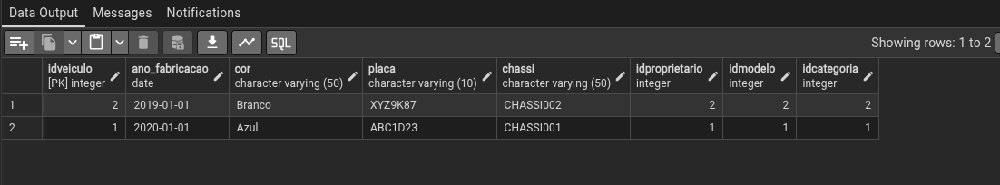

Deletando na tabela `Agente_de_Transito`: 
```sql
DELETE FROM Agente_de_Transito
WHERE matricula = 1003;
```

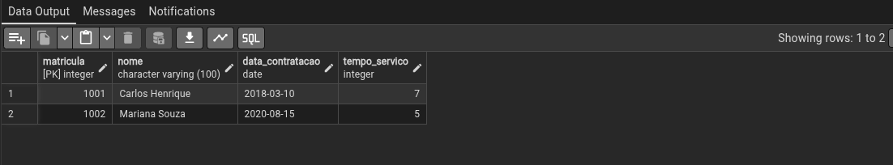

Deletando na tabela `telefone`:
```sql
DELETE FROM telefone
WHERE cod_proprietario = 2;
```

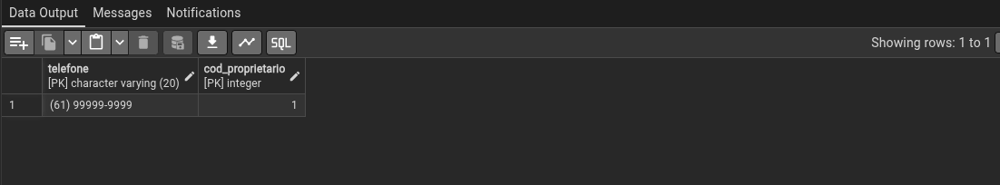

> [!NOTE] 
> 
> Foi preciso deletar o `idVeiculo` e `idAgente_de_Transito` na tabela `Infracao`, em que aparecem como ***fk*** antes de deletar os respectivos registros em sua própria tabela.
