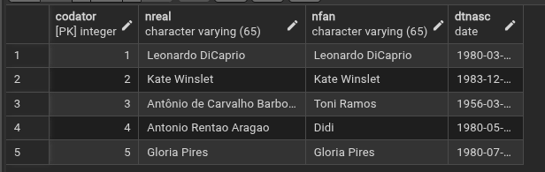
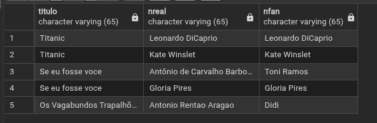

# Laboratório - SELECT

### 1)  Liste todos os dados da tabela Ator.

```sql
SELECT * 
FROM ator;
```



### 2) Liste o nome dos filmes e suas respectivas categorias.

```sql
SELECT f.titulo, c.descricao
FROM filme AS f
INNER JOIN categoria AS c 
	ON c.codcat = f.codcat;
```


### 3) Liste o nome dos filmes e o nome dos atores de cada filme

```sql
SELECT f.titulo, a.nreal, a.nfan
FROM filme AS f
INNER JOIN filme_ator AS fa
	ON fa.codfilme = f.codfilme
INNER JOIN ator AS a
	ON a.codator = fa.codator
```



### 4) Na questão 3 todos os filmes cadastrados foram apresentados? Caso contrário, gere uma consulta que liste o nome de todos os filmes cadastrados, caso tenha ator, liste o autor também

```sql
SELECT f.titulo, a.nreal, a.nfan
FROM filme AS f
LEFT OUTER JOIN filme_ator AS fa
	ON fa.codfilme = f.codfilme
LEFT OUTER JOIN ator AS a
	ON a.codator = fa.codator;
```


### 5) Liste o nome dos atores que trabalharam no mesmo filme de Gloria Pires de forma ordenada.

```sql
SELECT t2.nreal
FROM (
    SELECT f.titulo, a.nreal
    FROM filme AS f
    INNER JOIN filme_ator AS fa
        ON fa.codfilme = f.codfilme
    INNER JOIN ator AS a
        ON a.codator = fa.codator
) AS t1,

(
    SELECT f.titulo, a.nreal
    FROM filme AS f
    INNER JOIN filme_ator AS fa
        ON fa.codfilme = f.codfilme
    INNER JOIN ator AS a
        ON a.codator = fa.codator
) AS t2

WHERE t1.nreal = 'Gloria Pires'
    AND t2.titulo = t1.titulo
    AND t2.nreal <> 'Gloria Pires'

ORDER BY t2.nreal;
```


### 6) Liste o nome de todos os atores que começam com a letra A. Utilize o comando LIKE.

```sql
SELECT ator.nreal 
FROM ator
WHERE ator.nreal LIKE 'A%';
```


### 7) Quantos clientes tem cadastrados no banco de dados?

```sql
SELECT COUNT(*) AS qtdeClientes
FROM cliente;
```


###  8) Liste o nome dos clientes que já alugaram filmes (os nomes não devem ser repetidos)?

```sql
SELECT DISTINCT c.nome
FROM cliente AS c 
INNER JOIN locacao l
	ON l.codcli = c.codcli;
```


### 9) Liste o nome dos clientes e o número de locação realizada por cada um respectivamente.

```sql
SELECT c.nome, COUNT(*) AS qtdeLoc
FROM cliente AS c 
INNER JOIN locacao l
	ON l.codcli = c.codcli
GROUP BY c.nome;
```


### 10) Liste o nome dos clientes e o número de locação apenas dos clientes que tiveram mais de uma locação.

```sql
SELECT c.nome, COUNT(*) AS qtdeLoc
FROM cliente AS c 
INNER JOIN locacao l
	ON l.codcli = c.codcli
GROUP BY c.nome
HAVING COUNT(*) > 1;
```


