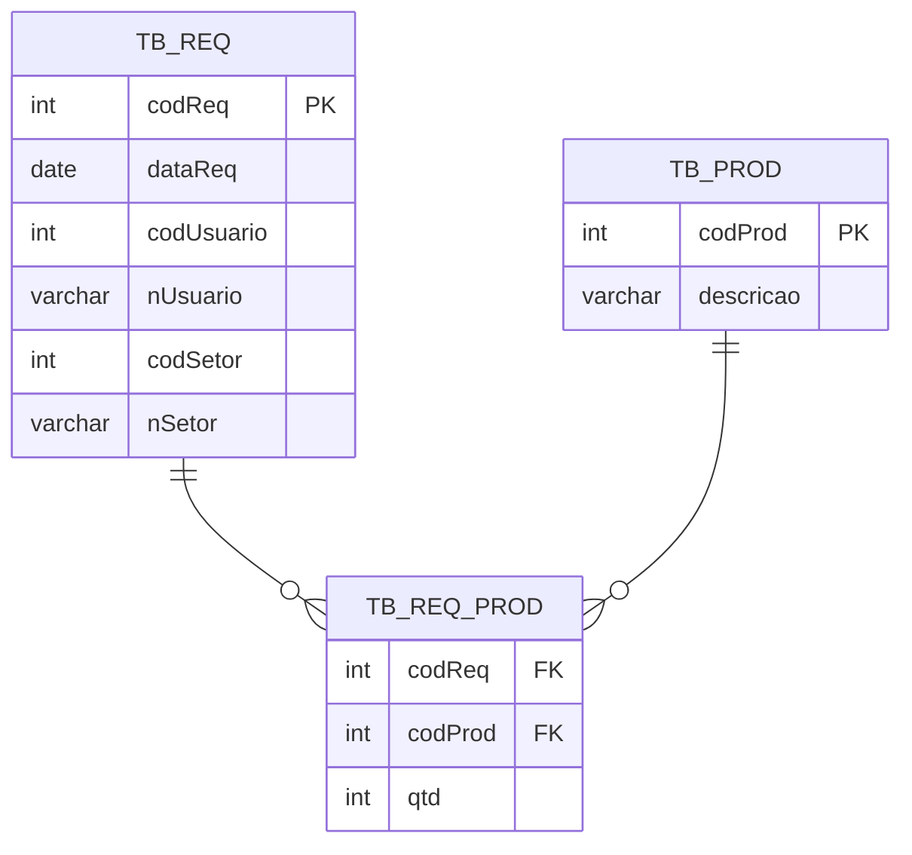
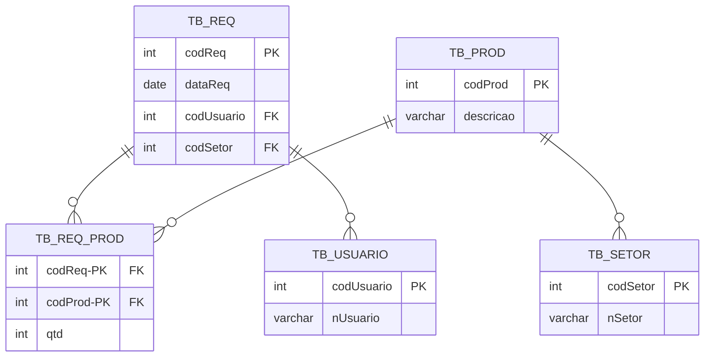
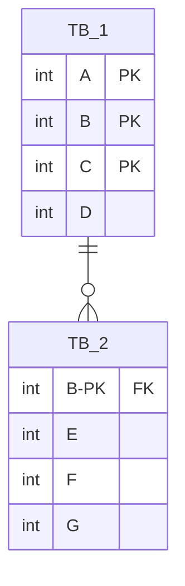

# Listas de Exercícios

## Álgebra Relacional

### Questão 01 - Abaixo será apresentado o Modelo Relacional de um banco de dados.

$$
\begin{align*}
CLIENTE &(
\underline{CodCli},
Nome,
Ender,
Sexo,
DataNasc,
Fone,
RG,
CPF
)\\[0.3cm]

PROD &(
\underline{CodProd},
Descr,
PrecoUnit,
QtdeEst
)\\[0.3cm]

FORN &(
\underline{MatrForn},
RSocial,
NFant,
Ender,
Fone
)\\[0.3cm]

VENDA &(
\underline{CodCli},
\underline{CodProd},
DataHora,
QtdeVend,
FormPag
)\\
&\text{FK } CodCli \text{  REFERENCIA } CLIENTE(CodCli)\\
&\text{FK } CodProd \text{  REFERENCIA } PROD(CodProd)\\[0.3cm]

PROD\_SIM &(
\underline{CodProd},
\underline{CodProdSim}
)\\
&\text{FK } CodProd \text{  REFERENCIA } PROD(CodProd)\\
&\text{FK } CodProdSim \text{  REFERENCIA } PROD(CodProd)\\[0.3cm]

PROD\_FORN &(
\underline{CodProd},
\underline{MatrForn}
)\\
&\text{FK } CodProd \text{  REFERENCIA } PROD(CodProd)\\
&\text{FK } MatrForn \text{  REFERENCIA } FORN(MatrForn)
\end{align*}
$$

Construa em Álgebra Relacional
1. Quais os nomes dos clientes de compraram macarrão ?

$$
T_1 \leftarrow \rho_{c}(\text{CLIENTE}) \times \rho_{p}(\text{PROD}) \times \rho_{v}(\text{VENDA}) \\
T_2 \leftarrow \sigma_{\text{c.CodClie } = \text{ v.CodClie} \text{ AND } \text{ p.CodProd } = \text{ v.CodProd} \text{ AND } \text{p.desc = 'Macarrao'}}(T_1) \\
\pi_{\text{c.nome}}(T_2)
$$

2. Para toda ocorrência de similaridade de produtos apresente, em cada linha, nome do produto, como também o nome do produto similiar.

$$
T_1 \leftarrow \rho_{p_1}(\text{PROD}) \times \rho_{ps}(\text{PROD-SIM}) \times \rho_{p_2}(\text{PROD}) \\
T_2 \leftarrow \sigma_{p_1.\text{CodProd } = \text{ ps.CodProd } \text{ AND } \text{ ps.CodProdSim } = p_2.\text{CodProd}}(T_1) \\ 
\pi_{p_1.\text{desc}, p_2.\text{desc}}(T_2)
$$

3. Liste todos os nomes dos produtos e o nome dos seus fornecedores. 

$$
T_1 \leftarrow \rho_{f}(\text{FORN}) \times \rho_{p}(\text{PROD}) \times \rho_{pf}(\text{PROD-FORN}) \\
T_2 \leftarrow \sigma_{p.\text{CodProd } = pf.\text{ CodProd} \text{ AND } f.\text{MatrForn } = pf.\text{MatrForn}}(T_1) \\
\pi_{p.\text{desc}, f.\text{Nfant}}(T_2)
$$

## Normalização

### Questão 1

O formulário de Requisição de Material ilustrado abaixo é utilizado pelos funcionários de uma empresa para solicitar material junto ao setor de almoxarifado.

O sistema de informação de controle de estoque utilizado pela empresa necessita de um projeto de banco de dados eficiente. Para armazenar suas requisições de materiais, utilize um esquema de tabela e normalize os dados, com base no formulário de Requisição de Material apresentado, deixando-o na terceira forma normal.

Na resposta deverão constar, também, a primeira e segunda forma normal.

#### Formulário de Requisição de Material

| Campo | Valor | Campo | Valor |
|---------|---------|---------|---------|
| Código Requisição | 1200 | Data Requisição | 22/03/1890 |
| Código Usuário | 14780 | Nome Usuário | Pascal |
| Código Setor | 03 | Nome Setor | Recursos Humanos |

#### Itens da Requisição

| Código do Produto | Descrição do Produto | Quantidade |
|-------------------|----------------------|------------|
| 15 | Lápis grafite | 2 |
| 3  | Caneta azul   | 3 |
| 9  | Caneta preta  | 2 |
| 45 | Caneta vermelha | 1 |
| 33 | Resma de papel | 1 |

#### 1FN
Colocar os todos os campos em uma única tabela:
| codReq | dataReq | codUsu | nUsua | codSetor | nSetor | codProd | desc | quant |
| :----: | :-----: | :----: | :---: | :------: | :----: | :-----: | :--: | :---: |

#### 2FN
Quais são as chaves candidatas ?
| codReq | dataReq | codUsu | nUsua | codSetor | nSetor | codProd | desc | quant |
| :----: | :-----: | :----: | :---: | :------: | :----: | :-----: | :--: | :---: |
|  1200  | 22/03/1890 | 14780 | Pascal | 03 | RH | 15 | Lápis | 2 |
|  1200  | 22/03/1890 | 14780 | Pascal | 03 | RH | 3 | Caneta Azul | 3 |
|  1200  | 22/03/1890 | 14780 | Pascal | 03 | RH | 9 | Caneta Preta | 3 |

Devido a não repetição: (codReq, codProd)

Analisando as dependências:
- $\{ codReq \} \rightarrow \{ dataReq, codUsuario, nUsuario, codStero, nSetor \}$.
- $\{ codProd \} \rightarrow \{ desc \}$.
- $\{ codReq,codProd \} \rightarrow \{ quant \}$.

#### 3FN
Procuramos atributos não chave que definem outros: codUsuario e codSetor.

### Questão 2
Supondo a tabela TABELA(<u>A, B, C</u>, D, E, F, G), com as dependências funcionais apresentadas a seguir:

TABELA(<u>A, B, C</u>, D, E, F, G)
1. $A,B,C \rightarrow D$  
2. $F \rightarrow G$
3. $B \rightarrow E$
4. $B \rightarrow F$
5. $B \rightarrow G$

Apresente a(s) tabela(s) após aplicar a **2FN** na tabela.

