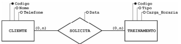
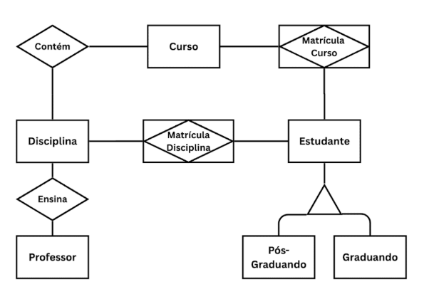
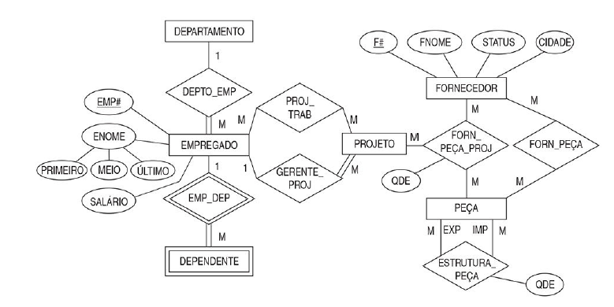
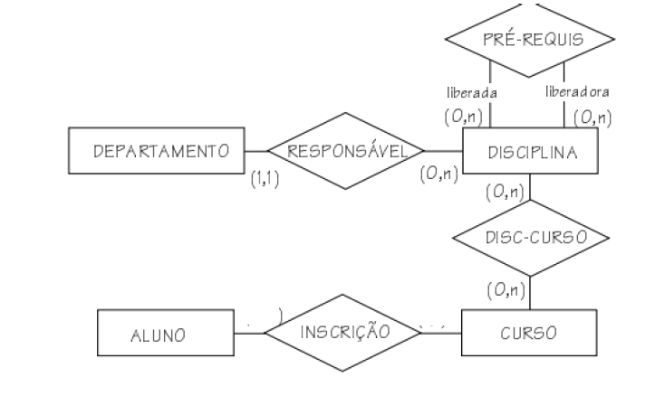
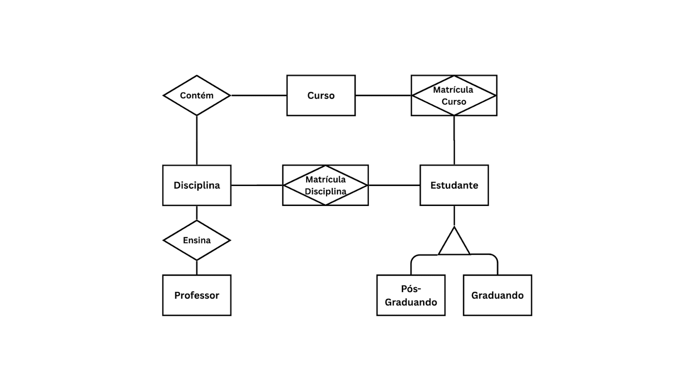

# Teste 01 - Conceitos Básicos e Modelo Conceitual

### Questão 01 - Em uma rede hospitalar, o número de funcionários de um departamento deve ser registrado, mas esse número não é informado diretamente. Ele é calculado com base no total de funcionários registrados para cada departamento.

Como deve ser representado esse atributo no MER?

**a. Atributo derivado**  
b. Relacionamento recursivo  
c. Atributo composto  
d. Atributo multivalorado  
e. Atributo chave

### Questão 02 - O Modelo Relacional de Banco de Dados, proposto por Edgar F. Codd, baseia-se em princípios matemáticos da teoria dos conjuntos e da lógica de predicados.

Com base nesse modelo, analise as afirmações a seguir:

I. No modelo relacional, os dados são organizados em tabelas (relações) compostas por tuplas (colunas) e atributos (linhas).  
II. Cada tupla deve ser única dentro de uma relação, sendo a chave estrangeira o mecanismo que garante essa unicidade.  
III. Uma chave estrangeira estabelece uma restrição de integridade referencial, garantindo que um valor em uma tabela exista como chave primária em outra.  
IV. No modelo relacional, a ordem das linhas e colunas em uma tabela não é relevante, pois uma relação é um conjunto não ordenado de tuplas.

Assinale a alternativa correta:  
a. Apenas I e IV estão corretas.  
**b. Apenas III e IV estão corretas.**  
c. Apenas II e III estão corretas.  
d. Apenas I e II estão corretas.  
e. Apenas II e IV estão corretas.

### Questão 03 - Sobre Sistemas de Banco de Dados (SBD) e suas características, analise as afirmativas abaixo:

I. Um banco de dados representa um minimundo, ou seja, uma abstração de um problema do mundo real.  
II. Em um sistema de arquivos tradicional, há maior controle de redundância e independência entre dados e programas do que em um SGBD.  
III. O SGBD permite o compartilhamento de dados entre múltiplos usuários e aplicações.  
IV. O conceito de dado refere-se a fatos brutos, enquanto informação é o resultado do
processamento desses dados.

Assinale a alternativa correta:

a. Apenas as afirmativas I e IV estão corretas.  
**b. Apenas as afirmativas I, III e IV estão corretas.**  
c. Apenas as afirmativas I e II estão corretas.  
d. Apenas as afirmativas II e III estão corretas.  
e. Todas as afirmativas estão corretas.

### Questão 04 - Com relação ao modelo entidade-relacionamento (MER) ilustrado na figura precedente, assinale a opção correta.

a. O relacionamento SOLICITA é classificado como ternário.  
b. Um treinamento pode ser solicitado por no máximo um cliente.  
c. Na entidade CLIENTE, o atributo Nome é do tipo identificador.  
**d. Um cliente pode solicitar vários treinamentos.**  
e. O modelo está representado de forma incorreta, pois não se admite, em um MER, o uso de atributos em relacionamentos.

### Questão 05 - Em relação ao DER, escolha as respostas corretas.

a. Todo aluno deve estar matriculado em uma disciplina.  
**b. É possível ter uma disciplina sem nenhum aluno.**  
c. Nota é um atributo chave do modelo.  
d. Neste modelo o semestre é um atributo chave do relacionamento.  
e. Esse modelo está errado pois o relacionamento não pode ter atributos.

### Questão 06 - (INFRAERO)  Analise o diagrama (DER):

As cardinalidades apresentadas significam que

a. B se relaciona com nenhuma ou apenas uma ocorrência de A.  
**b. B se relaciona com uma e apenas uma ocorrência de A.**  
c. B se relaciona com nenhuma ou muitas ocorrências de A.  
d. A se relaciona com uma ou muitas ocorrências de B.  
e. A se relaciona com uma e apenas uma ocorrência de B.

### Questão 07 - om base no esboço de um Modelo Entidade-Relacionamento:

“Um cliente pode fazer vários pedidos, mas um pedido pertence a um único cliente. Um pedido pode ter vários produtos, e um produto pode estar em vários pedidos. A quantidade de cada produto em um pedido é registrada.”

Assinale a alternativa que apresenta corretamente as entidades e atributos de acordo com esse modelo.

a. Entidades: Cliente, Pedido, Produto;  
Atributos:
- Cliente: id_cliente (PK), nome
- Pedido: id_pedido (PK), data
- Produto: id_produto (PK), nome, preco, quantidade

b. Entidades: Produto, ItemPedido.  
Atributos:
- Produto: id_produto (PK), nome, preco
- ItemPedido: id_item (PK), id_produto (FK), quantidade

c. Entidades: Cliente, Pedido.  
Atributos:
- Cliente: id_cliente (PK), nome
- Pedido: id_pedido (PK), data, id_cliente (FK), produto, quantidade

**d.** Entidades: Cliente, Pedido, Produto, ItemPedido.  
Atributos:
- Cliente: id_cliente (PK), nome, email
- Pedido: id_pedido (PK), data, id_cliente (FK)
- Produto: id_produto (PK), nome, preco
- ItemPedido: id_pedido (FK), id_produto (FK), quantidade

e. Entidades: Cliente, Pedido, Produto.  
Atributos:
- Cliente: id_cliente (PK), nome
- Pedido: id_pedido (PK), data, id_cliente (FK)
- Produto: id_produto (PK), nome, preco, id_pedido (FK), quantidade

### Questão 08 - Com base no diagrama Entidade-Relacionamento apresentado, que representa um sistema acadêmico com entidades como Curso, Disciplina, Estudante e Professor, analise as afirmativas abaixo.

a. O relacionamento entre Estudante e Disciplina é do tipo 1:N, pois um estudante só pode cursar uma disciplina por vez.  
b. A entidade Curso é uma entidade fraca dependente de Disciplina.  
c. O relacionamento Contém representa uma relação N:N entre Curso e Disciplina, que deveria obrigatoriamente ser transformada em entidade fraca.  
d. O relacionamento Ensina indica que um professor pode estar associado a apenas uma disciplina.  
**e. A entidade Estudante possui uma especialização em Pós-Graduando e Graduando, caracterizando uma generalização/especialização.**

### Questão 09 - onsiderando o modelo entidade‐relacionamento abaixo e as informações nele contidas, assinale a alternativa correta.

a. A razão de cardinalidade para DEPARTAMENTO: EMPREGADO em DEPTO_EMP é 1:M e a participação de EMPREGADO em DEPTO_EMP é parcial.  
b. Os atributos da entidade EMPREGADO são multivalorados.  
c. STATUS é um atributo derivado de FORNECEDOR.  
**d. A participação de PROJETO em GERENTE_PROJ é total.**  
e. EMP# é atributo chave e PRIMEIRO é um atributo derivado de ENOME.

### Questão 10 - Considere os conceitos de modelo de dados, esquema e instância em bancos de dados.

Analise as afirmativas a seguir:

I. O modelo de dados físico descreve como os dados são armazenados no sistema.  
II. O modelo lógico é independente de SGBDs e não é utilizado em sistemas comerciais.  
III. O esquema de um banco de dados define sua estrutura, como tabelas, atributos e relacionamentos.  
IV. A instância de um banco de dados pode mudar frequentemente, mesmo que o esquema permaneça o mesmo.

Assinale a alternativa correta:

a. Apenas as afirmativas I e IV estão corretas.  
b. Todas as afirmativas estão corretas.  
**c. Apenas as afirmativas I, III e IV estão corretas.**  
d. Apenas as afirmativas II e III estão corretas.  
e. Apenas as afirmativas I e II estão corretas.

### Questão 11 - Em um banco de dados acadêmico, considere a seguinte situação:
Uma tabela chamada ALUNO possui os atributos (Nome, Numero_aluno, Curso), e em determinado momento contém registros como “Silva, 17, CC” e “Braga, 8, CC”.

Nesse contexto, esses registros representam:

a. O modelo conceitual.  
b. O esquema do banco de dados.  
c. O modelo físico.  
**d. A instância do banco de dados.**  
e. O dicionário de dados.

### Questão 12 - Com base nos conceitos apresentados sobre Banco de Dados e Modelos de Dados, analise as afirmativas a seguir:

I. O modelo de dados conceitual fornece uma visão próxima da percepção dos usuários sobre os dados.  
II. O esquema de um banco de dados representa o estado atual dos dados armazenados em um determinado momento.  
III. Um SGBD é responsável por controlar redundância, garantir integridade e fornecer mecanismos de segurança.  
IV. Uma instância de banco de dados corresponde ao conjunto de valores armazenados no banco em um determinado instante.

a. Apenas as afirmativas II e III estão corretas.  
b. Todas as afirmativas estão corretas.  
c. Apenas as afirmativas I e II estão corretas.  
**d. Apenas as afirmativas I, III e IV estão corretas.**  
e. Apenas as afirmativas I, II e IV estão corretas.  

### Questão 13 - Modifique as cardinalidades mínimas de forma a especificar o seguinte:

Um curso não pode estar vazio, isto é, deve possuir ao menos uma disciplina em seu currículo. E um aluno mesmo que não inscrito em nenhum curso, deve permanece no banco de dados.

a. (0,1) - (0,1)  
b. (1,N) - (1,1)  
c. (1,N) - (0,1)  
d. (0,N) - (1,1)  
e. (0,N) - (0,1)

### Questão 14 - Acerca do seguinte modelo relacional:

O relacionamento **Contém** entre **Curso** e **Disciplina** é tipicamente **Um-para-Muitos (1:N):** Um **Curso** $\rightarrow$ **Contém** Muitas **Disciplinas**. 

No mapeamento desse relacionamento para o Modelo Relacional, a regra de colocação de Chave Estrangeira (FK) deve ser estritamente seguida para garantir a Integridade Referencial.

Selecione as alternativas corretas:

a. A coluna de FK referente a TB_Disciplina deve ser adicionada na TB_Curso. Com isso é possível garantir a integridade referencial no banco de dados.  
b. A coluna de FK referente ao TB_Curso deve ser adicionada na TB_Disciplina. Com isso é possível garantir a integridade identidade, isto é, não terá duplicidade de chave primária na TB_Disciplina.  
**c. A coluna de FK referente ao TB_Curso deve ser adicionada na TB_Disciplina. Com isso é possível garantir a integridade referencial no banco de dados.**  
**d. A integridade referencial entre TB_Curso e TB_Disciplina garante que não seja possível cadastrar uma disciplina associada a um curso inexistente, pois a coluna de FK em TB_Disciplina deve obrigatoriamente corresponder a um registro válido em TB_Curso.**  
e. A coluna de FK referente a TB_Disciplina deve ser adicionada na TB_Curso. Com isso é possível garantir a integridade referencial no banco de dados.

### Questão 15 - Qual das opções representa corretamente o conceito de banco de dados?

a. Um programa que executa operações aritméticas e lógicas com dados numéricos.  
b. Uma coleção de scripts e algoritmos que resolvem problemas computacionais.  
**c. Uma coleção de dados relacionados, organizados de forma a facilitar o acesso e a manipulação.**   
d. Um conjunto de documentos Word organizados em pastas e subpastas.  
e. Um conjunto de informações armazenadas em arquivos de texto simples.
