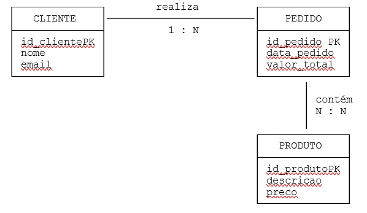
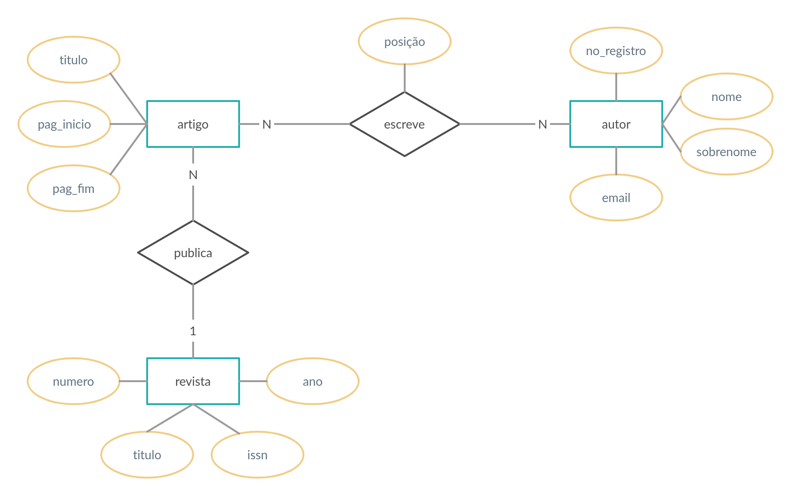

# Teste 02 - Modelo Relacional

### Questão 01 - Considere a seguinte representação do Modelo Relacional (MR): 

```
DEPARTAMENTO( 
id_departamento PK 
) 
 
FUNCIONARIO( 
id_funcionario PK, 
nome NOT NULL, 
salario CHECK (salario > 0), 
id_departament REFERENCES DEPARTAMENTO(id_departamento) 
) 
```

Analise as situações:   
I. Funcionário com salário negativo.   
II. Funcionário vinculado a departamento inexistente.   
III. Dois funcionários com o mesmo id_funcionario.   
IV. Funcionário sem nome. 

Assinale a alternativa correta: 
  
a. I e IV violam integridade de entidade.  
b. II e III violam integridade de domínio.  
c. I e II violam integridade referencial.  
d. Todas violam integridade referencial.  
**e. I e IV violam integridade de domínio; II viola integridade referencia**

### Questão 02 - Durante o mapeamento de um Modelo Entidade-Relacionamento (MER) para o Modelo Relacional, foi identificada a entidade DEPENDENTE, associada à entidade EMPREGADO. Cada dependente está vinculado a apenas um empregado, enquanto um empregado pode possuir vários dependentes.

Considerando esse cenário, assinale a alternativa correta:

a. O modelo relacional não permite representar relacionamentos entre funcionários e dependentes.  
**b. O atributo identificador do EMPREGADO deve aparecer na tabela DEPENDENTE como chave estrangeira.**  
c. A tabela DEPENDENTE deve possuir apenas os atributos do dependente, sem necessidade de referência ao empregado.  
d. O relacionamento entre EMPREGADO e DEPENDENTE deve ser implementado utilizando apenas uma chave primária composta na tabela EMPREGADO.
e. A entidade DEPENDENTE deve ser removida do modelo relacional por depender da entidade EMPREGADO.

### Questão 03 - Analise as sentenças a seguir e marque (V) para verdadeiro e (F) para falso:


 
( ) Um professor pode não estar alocado em uma turma.  
( ) Ao converter para o Modelo Relacional, a chave primária de TURMA passará para a tabela de PROFESSOR.  
( ) Uma turma necessariamente deve ter um professor.
 
A seguir, assinale a alternativa que apresenta a sequência correta:

a. F,V,V   
b. V,V,V   
c. F,F,F  
**d. V,F,V**   
e .V,V,F 


### Questão 4 - Considere o seguinte Diagrama Entidade-Relacionamento (DER):



Considerando as regras de transformação do DER para o Modelo Relacional, assinale a alternativa correta:

a. A tabela PEDIDO deve ser eliminada, pois o relacionamento já conecta CLIENTE e PRODUTO.  
**b. O relacionamento N:N entre PEDIDO e PRODUTO exige a criação de uma tabela associativa contendo as chaves das duas entidades.**  
c. A tabela CLIENTE deve conter uma chave estrangeira para cada pedido realizado.  
d. Relacionamentos N:N não podem ser representados em bancos relacionais.  
e. O relacionamento entre PEDIDO e PRODUTO pode ser representado apenas adicionando uma chave estrangeira em PRODUTO.


### Questão 05 -As soluções para o mapeamento de atributos multivalorados e atributos compostos no Modelo Relacional são idênticas. Ambos atributos precisam ser representados por relações separadas.
Escolha uma opção:

Verdadeiro  
**Falso** 

### Questão 06 - Dados autodescritivos são aqueles que ocorrem quando o nome e o valor do atributo são inseridos juntos em uma tupla.
Escolha uma opção:

**Verdadeiro**  
Falso 

### Questão 07 - Considere a tabela a seguir

```
VENDA( 
    id_venda, 
    produto, 
    fornecedor, 
    telefone_fornecedor 
) 
```

Sabendo que cada fornecedor possui apenas um telefone, assinale as alternativas corretas: 

a. Existe redundância de dados na relação.  
b. A decomposição em tabelas separadas pode reduzir anomalias de atualização.  
c. Alterar o telefone de um fornecedor pode exigir atualização em várias tuplas.   
**d. O atributo telefone_fornecedor depende funcionalmente do atributo fornecedor.** 

### Questão 08 - Na representação da informação, os atributos permitem que entidades e eventos possam ser reconhecidos, referidos e descritos. Um atributo relacional permite relacionar eventos e entidades.

Escolha uma opção:

**Verdadeiro**  
Falso 


### Questão 09 - Usando a figura a seguir escolha as alternativas corretas:



A chave primaria para a entidade artigo seria:

a. pag_inicio  
b. pag_fim  
**c. titulo**  
d. nenhum

### Questão 10 - 
Sem imagem questão analuda


### Questão 11 - (SEFAZ) No mapeamento de um modelo entidade-relacionamento para um modelo relacional de banco de dados, o tipo de relacionamento que implica a criação de uma terceira tabela para onde serão transpostos as chaves primárias e os eventuais atributos das duas tabelas originais é denominado

**a. relacionamento N:N**  
b. relacionamento 1:1  
c. relacionamento ternário  
d. autorrelacionamento 1:N  
e. relacionamento 1:N

### Questão 12 - Considerando o esquema do Modelo Relacional

```
DEPARTAMENTO( 
 id_departamento PK 
) 

FUNCIONARIO( 
 id_funcionario PK, 
 nome NOT NULL, 
 salario CHECK (salario > 0), 
 id_departamento REFERENCES DEPARTAMENTO(id_departamento) 
) 
```

Assinale as alternativas corretas: 
 
**a. A restrição CHECK (salario > 0) está relacionada à integridade de domínio.**  
b. Um funcionário pode ser cadastrado com um id_departamento inexistente sem violar restrições.  
c. A restrição NOT NULL em nome está relacionada à integridade referencial.  
d. A chave primária garante unicidade dos registros de FUNCIONARIO.  
e. A chave estrangeira impede a repetição de id_funcionario.

### Questão 13 - No contexto do modelo relacional de bancos de dados, assinale a alternativa correta:

a. O modelo relacional não utiliza restrições de integridade para validação dos dados.  
b. No modelo relacional, a ordem das colunas de uma tabela altera o significado lógico dos dados armazenados.  
c. Uma relação pode possuir tuplas duplicadas, desde que estejam em páginas diferentes do disco.  
**d. Cada linha de uma relação representa uma tupla, e cada coluna representa um atributo.**  
e. Chaves estrangeiras são utilizadas exclusivamente para aumentar o desempenho das consultas SQL.

### Questão 14 - "Chaves candidatas são chaves que identificam univocamente uma entidade. Têm a propriedade de serem superchaves mínimas. Chave primária é a chave candidata escolhida pelo projetista."

Escolha uma opção:

**Verdadeiro**  
Falso 

### Questão 15 - Durante o processo de transformação do Modelo Entidade-Relacionamento (MER) para o Modelo Relacional, uma entidade chamada Funcionário possui os atributos:

- Matrícula
- Nome
- Rua
- Cidade

Sabendo que Matrícula é o identificador único da entidade, assinale a alternativa correta sobre sua representação no modelo relacional:

**a. O atributo Matrícula é uma boa opção para ser definido como chave primária da tabela FUNCIONÁRIO.**  
b. Os atributos Nome, Rua e Cidade devem ser removidos da tabela por não serem identificadores.  
c. O modelo relacional não permite atributos textuais em tabelas.  
d. A tabela FUNCIONÁRIO não pode possuir chave primária no modelo relacional.  
e. Os atributos Rua e Cidade devem obrigatoriamente ser transformados em tabelas separadas.
