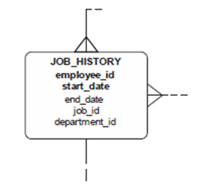
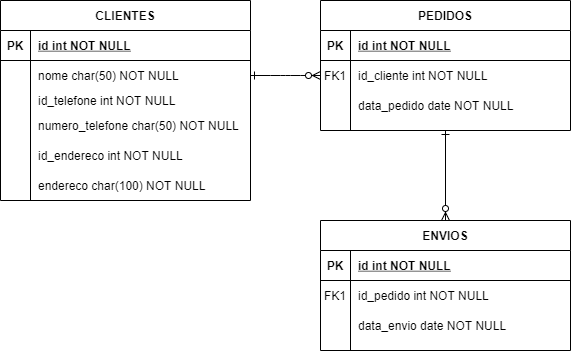

# Teste 3 - Álgebra Relacional

### Questão 01 - Considere a entidade a seguir, retirada de um diagrama de entidade-relacionamento, que possui como chave primária os atributos `employee_id` e `start_date`.



Pode-se afirmar que para esta entidade estar na Segunda Forma Normal (2FN), ela precisa estar na Primeira Forma Normal (1FN) e

a. todos os atributos precisam permitir apenas valores exclusivos, de forma que não haja redundância e, consequentemente, desperdício de espaço em disco.  
b. o atributo employee_id, que é parte da chave primária, precisa ser proveniente de uma das tabelas relacionadas a esta.  
c. os atributos employee_id, job_id e department_id precisam ser chave estrangeira nesta entidade.  
d. a chave primária precisa ser formada pelos atributos employee_id, job_id e department_id, que são provenientes de tabelas relacionadas a esta.  
**e. os atributos end_date, job_id e department_id precisam ser  dependentes da chave primária composta inteira, não apenas de parte dela.**

### Questão 02 - Considere a tabela representada abaixo, onde CPF é uma chave primária: 

```
EMPREGADO (CPF, PrimeiroNome, UltimoNome, Departamento, Salario)
```

Qual é a expressão, em álgebra relacional, que retorna os nomes (PrimeiroNome) dos empregados com salário (Salario) menor que 9000 e que trabalhem no departamento (Departamento) de número 11?

Escolha uma opção:

a. $\sigma_\text{ PrimeiroNome}(\pi_{\text{ Salario } < 9000 \text{ AND } \text{Departamento } = 11})$  
b. $\sigma_\text{ PrimeiroNome}(\pi_{\text{ Salario } < 9000 \text{ AND } \text{Departamento } = 11 (\text{EMPREGADO})})$  
**c.** $\pi_\text{ PrimeiroNome}(\sigma_{\text{ Salario } < 9000 \text{ AND } \text{Departamento } = 11 (\text{EMPREGADO})})$  
d. $\sigma_\text{ PrimeiroNome}(\sigma_{\text{ Departamento } = 11; \text{ Valor } <  9000} )$  
e. $\pi_\text{ PrimeiroNome}(\pi_{\text{ Departamento } = 11}; \pi_{\text{ Salario } <  9000} )$

### Questão 03 - Considerando o diagrama abaixo, é correto afirmar que a relação ENVIOS está na 3FN, ou seja, ela também está na 2FN e 1FN.



Escolha uma opção: 

**Verdadeiro**  
Falso 

### Questão 04 - Julgue as seguintes assertivas:

(i). Um esquema de relação X estará na 2FN se todo atributo não primário A em X tiver dependência funcional total da chave primária de X.  
(ii). A primeira forma normal (1FN) é considerada parte da definição formal, em que não é possível, como valor de atributo de uma única tupla, obter um conjunto de valores, uma tupla de valores ou uma combinação entre ambos.

a. Nenhuma assertiva está correta.  
b. Apenas a assertiva (ii) está correta.  
**c. Ambas assertivas estão corretas.**  
d. Apenas a assertiva (i) está correta.


### Questão 05 - Para normalizar, conforme primeira forma, uma tabela em um banco de dados, é preciso criar chaves estrangeiras que representem a ligação entre elas.

Escolha uma opção:

Verdadeiro  
**Falso** 

### Questão 06 - MPOG - Em relações normalizadas, na primeira forma normal, toda tupla em toda relação contém apenas um único valor, do tipo apropriado, em cada posição de atributo.

Escolha uma opção:

**Verdadeiro**  
Falso 

### Questão 07 - É correto afirmar que uma entidade está corretamente normalizada na segunda forma normal 2FN, quando seus atributos não chave não dependem outros atributos não chave.

Escolha uma opção:

Verdadeiro  
**Falso** 

### Questão 08 - TJ-PE SISTEMAS - É correto que uma relação está na:

a. 3FN se, e somente se, ela estiver na segunda e todos os atributos não chave contiverem mais de um valor discreto periódico.  
b. 2FN se, e somente se, estiver na primeira e todos os atributos não chave forem dependentes não transitivos da chave primária.  
**c. 2FN se, e somente se, estiver na primeira e todos os atributos não chave forem totalmente dependentes da totalidade da chave primária.**  
d. 3FN se, e somente se, todos os domínios básicos forem multivalorados.  
e. 2FN se, e somente se, todos os domínios básicos contiverem mais de um valor discreto periódico.

### Questão 09 - Normalização de dados é o processo que examina os atributos de uma entidade com o objetivo de evitar anomalias observadas na inclusão, exclusão e alteração de registros. Uma relação está na primeira forma normal (1FN) se não houver grupo de dados repetidos.

Escolha uma opção:

**Verdadeiro**  
Falso 

### Questão 10 - No âmbito da álgebra relacional, os símbolos π (Pi) e σ (Sigma) são utilizados, respectivamente, em operações de

a. seleção ou particionamento horizontal; e projeção ou particionamento vertical.  
b. projeção ou particionamento horizontal; e seleção ou particionamento vertical.  
**c. projeção ou particionamento vertical; e seleção ou particionamento horizontal.**  
d. reunião ou seleção; e intersecção ou projeção.  
e. seleção ou particionamento vertical; e projeção ou particionamento horizontal.

### Questão 11 - As operações da álgebra relacional Seleção, Projeção e Produto Cartesiano são implementadas na linguagem SQL, respectivamente, pelas cláusulas:

a. Select, Where e From.  
b. Where, From e Select.  
**c. Where, Select e From.**  
d. Select, Select e Join.  
e. Select, From e Where.

### Questão 12 - Para as questões referentes às consultas abaixo, considere as seguintes tabelas de uma base de dados que armazena informações sobre currículos de cursos em uma universidade:


Carla, aluna do curso de Engenharia (código 101), está planejando seu semestre letivo e quer saber quais disciplinas obrigatórias precisa cursar. A coordenação do curso deseja ajudar Carla fornecendo uma lista com os códigos das disciplinas obrigatórias no currículo.

**Qual consulta retorna os códigos das disciplinas obrigatórias do curso de código 101?**

a. $\pi_{\text{CodCr}}(\sigma_{\text{Caracter = 'O'}} (\text{DiscCur}))$  
b. $\pi_{\text{CodDisc}}(\sigma_{\text{CodCr = 101 } \land \text{ Carater = 'E'}}(\text{DiscCur}))$   
**c.** $\pi_{\text{CodDisc}}(\sigma_{\text{CodCr = 101 } \land \text{ Carater = 'O'}}(\text{DiscCur}))$  
d. $\pi_{\text{CodDisc}}(\sigma_{\text{CodCr = 101}}(\text{DiscCur}))$  
e. $\pi_{\text{CodDisc}}(\sigma_{\text{ Carater = 'O'}}(\text{DiscCur}))$  

### Questão 13 - A SBC (Sociedade Brasileira de Computação) está montando uma biblioteca digital para armazenar dados sobre a produção de pesquisadores em computação. Uma parte desta base de dados corresponde às tabelas abaixo:


A SBC quer saber quais artigos citaram um trabalho específico, identificado pelo código 123. Essa informação será usada para avaliar o impacto desse trabalho na área.

Qual consulta retorna os códigos dos artigos que referenciaram o artigo 123?

a. $\pi_{\text{CodArtReferenciador}}(\text{Referencia})$  
b. $\pi_{\text{CodArtReferenciado}}(\text{Referencia})$   
c. $\pi_{\text{CodArt}}(\sigma_{\text{CodArtReferenciado } = 123}(\text{Referencia}))$  
**d.** $\pi_{\text{CodArtReferenciador}}(\sigma_{\text{CodArtReferenciado } = 123}(\text{Referencia}))$  
e. $\pi_{\text{CodArtReferenciado}}(\sigma_{\text{CodArtReferenciador } = 123}(\text{Referencia}))$

### Questão 14 - Para as questões referentes às consultas abaixo, considere as seguintes tabelas de uma base de dados que armazena informações sobre currículos de cursos em uma universidade:


Durante a elaboração do relatório anual, a coordenação do curso de Ciência da Computação (código 404) precisa de uma visão clara sobre os níveis das disciplinas oferecidas no curso, separando-as em graduação e pós-graduação.

**Qual consulta retorna os níveis das disciplinas do curso 404, sem duplicatas?**

a. $\pi_{\text{NivelDisc}}(\sigma_{\text{CodCr = 404 } \land \text{ CodDisc = 1001}}(\text{DiscCur}))$  
b. $\pi_{\text{NivelDisc}}(\sigma_{\text{CodCr = 404}} ( \text{DiscCur} \bowtie_{\text{ CodDisc = CodDisc}} (\text{Disciplina}) ))$  
c. $\pi_{\text{NivelDisc}}(\sigma_{\text{CodCr } = 404}(\text{DiscCur}))$  
d. $\rho_{\text{NivelDisc, DISTINCT}}(\text{DiscCur} \bowtie_{\text{ CodDisc = CodDisc}} (\sigma_{\text{CodCr } = 404}(\text{Disciplina})))$  
**e.** $\pi_{\text{NivelDisc}}(\text{DiscCur} \bowtie_{\text{ CodDisc = CodDisc}} (\sigma_{\text{CodCr } = 404}(\text{Disciplina})))$

### Questão 15 - Álgebra Relacional é um conjunto básico de operações para o modelo relacional de banco de dados os quais permite que um usuário especifique as solicitações de recuperação básica através de expressões. Sobre as definições das operações da álgebra relacional, é INCORRETO afirmar que:

Escolha uma opção:

**a. A operação de União entre duas tabelas A e B resulta em uma nova tabela que inclui todas as tuplas que estão em A e em B, simultaneamente.**   
b. A operação de Subtração (ou Diferenciação) entre duas tabelas A e B, diz respeito a uma relação A - B, que inclui todas as tuplas que estão em A mas não em B.  
c. A operação de Projeção é utilizada para projetar apenas os atributos desejados.  
d. O resultado do Produto Cartesiano entre duas tabelas é uma terceira tabela a qual conterá todas as relações possíveis entre os elementos contidos nas tabelas originais.  
e. A operação de Seleção é utilizada para escolher um subconjunto das tuplas de uma relação que satisfaça uma condição de seleção.
