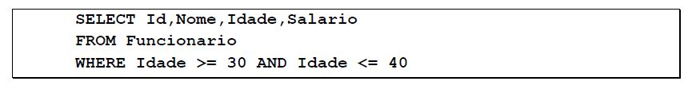
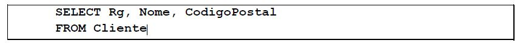
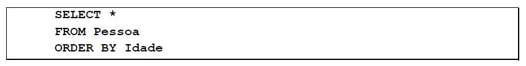
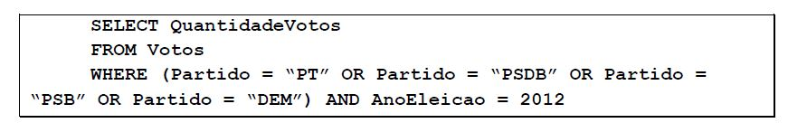
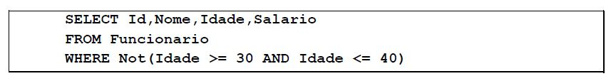
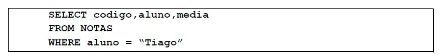

# Teste 4 - Select

### Questão 01 - Utilizando-se a linguagem SQL, assinale a alternativa que representa a consulta na tabela “pessoa" para se obter os valores do atributo “sobrenome" cujo atributo "nome" inicie com “J" e cujo atributo “ano_nascimento” seja maior do que 1980.

Escolha uma opção:

**a. select sobrenome from pessoa where nome like “J%” and ano_nascimento > 1980.**  
b. select from pessoa, sobrenome where pessoa.nome like “J_” and ano_nascimento > 1980.  
c. select sobrenome from pessoa where nome = “J*” and ano_nascimento > 1980.  
d. select sobrenome from pessoa where nome starts_with “J” and ano_nascimento > 1980.

### Questão 02 - A cláusula abaixo seleciona o ID, Nome, Idade e o Salário de todos os Funcionários com Idade entre 30 e 40 anos.



Escolha uma opção:

**a. Verdadeiro**  
b. Falso 

### Questão 03 - Do que se trata o comando abaixo?



a. O comando SQL que permite obter o RG, Nome e o Código Postal de todos os Pacientes registrados no banco de dados.  
b. O comando SQL que permite obter o RG, Nome e o Código Postal de todos os funcionários registrados no banco de dados.  
c. O comando SQL que permite obter o RG, Nome e o Código Postal de único cliente.  
**d. O comando SQL que permite obter o RG, Nome e o Código Postal de todos os clientes registrados no banco de dados.**  

### Questão 04 - A cláusula abaixo não irá selecionar a quantidade de votos dos Partidos: PT, PSDB, PSB e DEM nas eleições de 2012.


Escolha uma opção:

a. Verdadeiro  
**b. Falso** 

### Questão 05 - A clausula irá selecionar todos os dados da tabela Pessoa, ordenado pela Idade pois quando a ordenação for ASCendente não é necessário incluir a cláusula ASC em ORDER BY, já que a ordenação padrão é ascendente.



Escolha uma opção:

**a. Verdadeiro**  
b. Falso 

### Questão 06 - Essa cláusula irá selecionar a quantidade de votos dos Partidos: PT, PSDB, PSB e DEM nas eleições de 2012.



Escolha uma opção:

**a. Verdadeiro**  
b. Falso 

### Questão 07 - Considerando duas tabelas em um banco de dados, DEPARTAMENTO e EMPREGADO, relacionadas por uma chave estrangeira em EMPREGADO que referencia a tabela DEPARTAMENTO, que operação será realizada pelo comando SQL abaixo?

```sql
SELECT * FROM DEPARTAMENTO, EMPREGADO;
```

Escolha uma opção:

a. Projeção.  
b. União.  
**c. Produto Cartesiano.**  
d. Seleção.  
e. Junção Natural.

### Questão 08 - DPE - Seja a tabela Contas de um banco de dados relacional:

- Contas (Número, Saldo, Nome-Cliente, Código-Agência)

O comando SQL para obter o saldo e o código da agência dos registros da tabela Conta, com nome do cliente nulo, ordenados pelo saldo, com código da agência maior do que 5000 é:

**a.**
```sql
SELECT Saldo, Código-Agência
FROM Contas
WHERE Código-Agência > 5000 AND Nome-Cliente IS NULL
ORDER BY Saldo
```

b.
```sql
SELECT Saldo, Código-Agência
FROM Contas
WHERE Código-Agência > 5000 AND Nome-Cliente = ‘null’
CLASSIFY ON Saldo
```

c.
```sql
SELECT Saldo, Código-Agência
FROM Contas
WHERE Código-Agência > 5000, Nome-Cliente = NULL’
HAVING Saldo UP
```

d.
```sql
SELECT Saldo, Código-Agência
FROM Contas
FOR Código-Agência > 5000 , Nome-Cliente <> NULL’
CLASSIFY ON Saldo
```

e.
```sql
SELECT Saldo, Código-Agência
FROM Contas
WHERE Código-Agência > 5000 OR Nome-Cliente LIKE ‘NULL’
ORDER UP ON Saldo
```

### Questão 09 - Selecionar o ID, Nome, Idade e o Salário de todos os Funcionários cuja a idade não está entre 30 e 40 anos.



Escolha uma opção:

**a. Verdadeiro**  
b. Falso 

### Questão 10 - O código abaixo irá exibir informações da tabela notas do aluno Tiago.select


Escolha uma opção:

**a. Verdadeiro**  
b. Falso 

### Questão 11 - O símbolo * na clausula SELECT indica que não é obrigatório selecionar todos os campos de uma tabela.

Escolha uma opção:

a. Verdadeiro  
**b. Falso** 

### Questão 12 - O código abaixo realiza uma consulta que mostra o nome dos funcionários da área de INTELIGENCIA e que têm, como parte do endereço, a cidade de BRASILIA,DF.

```sql
SELECT nome
FROM funcionario
WHERE area = 'INTELIGENCIA'
AND endereco LIKE '%BRASILIA,DF%';
```

Escolha uma opção:

**a. Verdadeiro**  
b. Falso 

### Questão 13 - O comando abaixo irá exibir informações sobre codigo, aluno e media, da tabela estudante.



Escolha uma opção:

a. Verdadeiro  
**b. Falso** 

### Questão 14 - Do que se trata a cláusula abaixo:


a. Selecionar o ID, Nome, Idade e o Salário de todos os Funcionários cuja a idade seja 30 e 40 anos.  
b. Selecionar o ID, Nome, Idade e o Salário de todos os Funcionários cuja a idade está entre 30 e 40 anos.  
**c. Selecionar o ID, Nome, Idade e o Salário de todos os Funcionários cuja a idade não está entre 30 e 40 anos.**  
d. Selecionar o ID, Nome, Idade e o Salário de todos os Funcionários cuja a idade não seja 30 e 40 anos.

### Questão 15 - Na cláusula WHERE, a condição de seleção area = 'INTELIGENCIA' escolhe a tupla de interesse em particular na tabela funcionário, pois area é um atributo de funcionário.

```sql
SELECT nome
FROM funcionario
WHERE area = 'INTELIGENCIA'
AND endereco LIKE '%BRASILIA,DF%';
```

**a. Verdadeiro**  
b. Falso 
