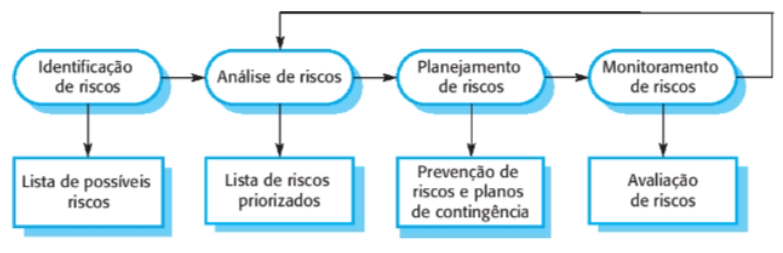

# Gerenciamento de Projetos

### A Importância do Gerenciamento

- O gerenciamento é fundamental porque a engenharia de software profissional está sempre sujeita a **restrições de cronograma e orçamento**
- O papel do gerente é garantir que o projeto cumpra essas restrições e entregue um produto de alta qualidade.
- **Critérios de sucesso de um projeto:**
  - Entregar o software no **prazo acordado**;
  - Manter os custos dentro do **orçamento**;
  - Satisfazer as **expectativas do cliente**;
  - Manter uma **equipe de desenvolvimento coesa** e funcional.

### Por que o Gerenciamento de Software é Único?

- Diferente de outras engenharias, a de software apresenta desafios específicos:
  - **Intangibilidade:** O software não pode <u>ser visto</u> ou <u>tocado</u>, o que dificulta avaliar o progresso apenas "olhando" para o produto; os gerentes dependem de evidências produzidas por terceiros.
  - **Unicidade dos projetos:** Grandes projetos são <u>exclusivos</u>. Mudanças tecnológicas rápidas podem tornar a experiência prévia obsoleta.
  - **Processos Variáveis:** Diferentes organizações utilizam processos distintos, tornando difícil prever problemas de forma confiável.

### Fatores que Influenciam o Estilo de Gestão

- **Tamanho da empresa e do software:** Empresas menores e projetos pequenos permitem uma <u>comunicação mais informal</u>, enquanto grandes sistemas exigem <u>coordenação entre múltiplas equipes</u> e burocracia formal.
- **Tipo de Cliente:** Clientes externos ou governamentais exigem canais de comunicação e procedimentos mais burocráticos do que clientes internos.
- **Cultura e Processo:** A <u>cultura da organização</u> (aversão ao risco vs. inovação) e o processo escolhido (<u>ágil</u>, que é mais "leve", ou formal, que exige monitoramento rigoroso) moldam o trabalho do gerente.
- **Criticidade:** Softwares <u>críticos para a segurança</u> exigem registros formais de todas as decisões, ao contrário de produtos de consumo simples.

### Atividades Fundamentais do Gerente

- **Planejamento:** Estimar prazos, custos e atribuir tarefas.
- **Gerenciamento de Riscos:** <u>Avaliar</u> e <u>monitorar</u> problemas que possam afetar o projeto.
- **Gerenciamento de Pessoas:** Escolher a equipe e garantir um desempenho eficiente.
- **Preparação de Relatórios:** <u>Comunicar</u> o progresso de forma clara para clientes e para a alta gerência
- **Elaboração de Propostas:** inclui os objetivos do projeto, como ele será executado, além de **estimativas de custo e prazo**.

## Gerenciamento de Riscos

#### Definição e Objetivo

- O gerenciamento de riscos consiste em **prever problemas** que possam afetar o <u>cronograma</u> do projeto ou a <u>qualidade</u> do software, tomando atitudes proativas para evitá-los.
-  O objetivo principal é <u>facilitar</u> a resolução de problemas e <u>garantir</u> que eles não causem estouros inaceitáveis no **orçamento ou no cronograma**.

#### Categorias de Riscos

- Os riscos podem ser classificados de acordo com o impacto que geram:
  - **Riscos de Projeto:** Afetam o <u>cronograma</u> ou os <u>recursos</u> (ex: perda de um profissional experiente).
  - **Riscos de Produto:** Afetam a <u>qualidade</u> ou o <u>desempenho</u> do software (ex: um componente que deixa o sistema lento).
  - **Riscos de Negócio:** Afetam a <u>organização</u> desenvolvedora ou <u>cliente</u> (ex: lançamento de um produto concorrente).

- É importante notar que essas categorias se **sobrepõem**: 
  - A perda de um membro da equipe pode <u>atrasar a entrega</u> (projeto), resultar em erros por <u>falta de experiência</u> do substituto (produto) e prejudicar a r<u>eputação da empresa</u> para futuros contratos (negócio).

| Risco                              | Afeta              | Descrição                                                                 |
|------------------------------------|--------------------|---------------------------------------------------------------------------|
| Rotatividade de pessoal            | Projeto            | Um membro experiente da equipe vai sair do projeto antes de ele terminar. |
| Mudança na gestão                  | Projeto            | Haverá uma mudança da gestão da empresa, com prioridades diferentes.      |
| Indisponibilidade de hardware      | Projeto            | O hardware essencial para o projeto não será entregue no prazo.           |
| Mudança nos requisitos             | Projeto e produto  | Haverá um número de mudanças nos requisitos maior do que o previsto.      |
| Atrasos na especificação           | Projeto e produto  | As especificações das interfaces essenciais não estão disponíveis no prazo.|
| Tamanho subestimado                | Projeto e produto  | O tamanho do sistema foi subestimado.                                     |
| Baixo desempenho das ferramentas   | Produto            | As ferramentas de software que apoiam o projeto não têm o desempenho previsto. |
| Mudança tecnológica                | Negócio            | A tecnologia subjacente é suplantada por uma nova tecnologia.             |
| Concorrência de produtos           | Negócio            | Um produto concorrente é lançado antes de o sistema ficar pronto.         |

#### O Processo de Gerenciamento de Riscos

- O gerenciamento é um **processo iterativo** que ocorre durante todo o projeto. 
- Ele é dividido em quatro estágios fundamentais:
  - **Identificação:** <u>Listar</u> possíveis riscos ao projeto, produto ou negócio.
  - **Análise:** Avaliar a **probabilidade** e as **consequências** de cada risco.
  - **Planejamento:** Criar planos para <u>evitar</u> o risco ou <u>minimizar</u> seus efeitos.
  - **Monitoramento:** Avaliar <u>regularmente</u> os riscos e revisar os planos à medida que novas informações surgem.

#### Por que ocorrem incertezas?

- O gerenciamento de riscos é essencial devido a fatores inerentes ao desenvolvimento de software, tais como:
  - **Requisitos mal definidos** ou que mudam constantemente.
  - Dificuldade em **estimar o tempo** e os recursos necessários.
  - **Diferenças nas habilidades** individuais da equipe.

#### Formalidade e Documentação

- A forma como os riscos são registrados varia conforme o projeto:
  - **Grandes Projetos:** Devem utilizar um **registro de riscos** formal e um **plano de gerenciamento de riscos** detalhado.
  - **Pequenos Projetos:** O registro formal pode ser dispensado, mas o gerente deve estar ciente dos riscos o tempo todo.
  - **Desenvolvimento Ágil:** O gerenciamento é **menos formal** e focado em discussões de equipe. Embora o modelo ágil reduza riscos de mudanças de requisitos, ele é muito vulnerável à **rotatividade de pessoal**, pois depende fortemente de comunicações informais e possui pouca documentação.

### Identificação de Riscos

- Esta é a **primeira etapa** e visa listar ameaças ao processo de engenharia de software, ao produto ou à organização.
- **Métodos:** Pode ser feita via ***brainstorming*** da equipe, baseada na **experiência** dos gerentes ou através de **checklists**.
- **Categorias de Risco:**
  - **Estimativa:** Subestimar tempo, tamanho do software ou taxa de correção de defeitos.
  - **Organizacional:** Reestruturações, problemas financeiros ou dificuldade em recrutar talentos.
  - **Pessoas:** Indisponibilidade de membros-chave (doenças) ou falta de treinamento.
  - **Requisitos:** Mudanças que exigem retrabalho ou falta de compreensão do cliente sobre o impacto dessas mudanças.
  - **Tecnologia:** Falhas de desempenho (ex: banco de dados) ou defeitos em componentes reusáveis.
  - **Ferramentas:** Ineficiência de código gerado ou falta de integração entre ferramentas.

| Tipo de risco  | Possíveis riscos                                                                 |
|----------------|----------------------------------------------------------------------------------|
| Estimativa     | 1. O tempo necessário para desenvolver o software foi subestimado.               |
| Estimativa     | 2. A taxa de correção de defeitos foi subestimada.                               |
| Estimativa     | 3. O tamanho do software foi subestimado.                                        |
| Organizacional | 4. A organização foi reestruturada, e uma gerência diferente ficou responsável pelo projeto. |
| Organizacional | 5. Problemas financeiros da organização obrigam a reduções no orçamento do projeto. |
| Organizacional | 6. É impossível recrutar pessoas com as habilidades necessárias.                |
| Pessoal        | 7. Um membro importante da equipe está doente e indisponível em momentos críticos. |
| Pessoal        | 8. O treinamento necessário para a equipe não está disponível.                  |
| Requisitos     | 9. Mudanças propostas nos requisitos exigem uma grande dose de retrabalho no projeto (design). |
| Requisitos     | 10. Os clientes não entendem o impacto das mudanças nos requisitos.             |
| Tecnologia     | 11. O banco de dados utilizado no sistema não consegue processar tantas transações por segundo quanto o previsto. |
| Tecnologia     | 12. Defeitos nos componentes de software reusáveis têm de ser consertados antes que eles sejam reusados. |
| Ferramentas    | 13. O código gerado pelas ferramentas de geração de código é ineficiente.        |
| Ferramentas    | 14. As ferramentas de software não conseguem trabalhar juntas de maneira integrada. |

- **Resultado:** Uma lista longa que deve ser reduzida a um **tamanho administrável** para monitoramento.

### Analíse de Requisitos

- Nesta fase, julga-se a **probabilidade** e a **gravidade** de cada risco identificado, baseando-se no bom senso e na experiência anterior.
- **Escalas de Avaliação:** 
  - **Probabilidade:** Variando de *insignificante* a *muito alta*.
  - **Efeitos (Gravidade):** Classificados como **catastróficos** (ameaçam a sobrevivência do projeto), **graves** (atrasos significativos), **toleráveis** ou **insignificantes**.
- **Dinamicidade:** A avaliação deve ser <u>atualizada</u> em <u>cada iteração</u>, pois a probabilidade e os efeitos podem mudar conforme novas informações surgem.
- **Priorização:** Deve-se focar nos <u>riscos mais significativos</u>, geralmente os catastróficos e os graves com probabilidade acima de moderada (frequentemente monitorando um "top 10")

| Risco                                                                 | Probabilidade | Efeitos         |
|-----------------------------------------------------------------------|---------------|-----------------|
| Problemas financeiros da organização obrigam a reduções no orçamento do projeto (5). | Baixa         | Catastróficos   |
| É impossível recrutar pessoas com as habilidades necessárias (6).     | Alta          | Catastróficos   |
| Um membro importante da equipe está doente e indisponível em momentos críticos (7). | Moderada      | Graves          |
| Defeitos nos componentes de software reusáveis precisam ser corrigidos antes do reuso (12). | Moderada      | Graves          |
| Mudanças nos requisitos exigem grande retrabalho no projeto (design) (9). | Moderada      | Graves          |
| A organização foi reestruturada e uma nova gerência assumiu o projeto (4). | Alta          | Graves          |
| O banco de dados não suporta a quantidade de transações prevista (11). | Moderada      | Graves          |
| O tempo necessário para desenvolver o software foi subestimado (1).   | Alta          | Graves          |
| As ferramentas de software não funcionam de forma integrada (14).     | Alta          | Toleráveis      |
| Os clientes não entendem o impacto das mudanças nos requisitos (10).  | Moderada      | Toleráveis      |
| O treinamento necessário para a equipe não está disponível (8).       | Moderada      | Toleráveis      |
| A taxa de correção de defeitos foi subestimada (2).                   | Moderada      | Toleráveis      |
| O tamanho do software foi subestimado (3).                            | Alta          | Toleráveis      |
| O código gerado pelas ferramentas é ineficiente (13).                 | Moderada      | Insignificantes |

#### Estratégias de Mitigação dos Riscos

- Para cada risco prioritário, devem-se definir estratégias para gerenciar o impacto:

| Risco                              | Estratégia                                                                 |
|------------------------------------|---------------------------------------------------------------------------|
| Problemas financeiros da organização | Preparar um documento para a alta gerência mostrando a importância do projeto para as metas da empresa e justificando por que cortes no orçamento não são custo-benefício. |
| Problemas de recrutamento          | Alertar o cliente sobre possíveis dificuldades e atrasos; investigar a compra de componentes. |
| Doenças do pessoal                 | Reorganizar a equipe para aumentar a sobreposição de funções e garantir que todos compreendam o trabalho uns dos outros. |
| Componentes defeituosos            | Substituir componentes potencialmente defeituosos por componentes confiáveis adquiridos externamente. |
| Mudanças nos requisitos            | Utilizar rastreabilidade para avaliar impactos; maximizar a ocultação da informação no design. |
| Reestruturação organizacional      | Preparar um documento para a alta gerência destacando a importância do projeto para os objetivos da empresa. |
| Desempenho do banco de dados       | Investigar a adoção de um banco de dados com melhor desempenho. |
| Tempo de desenvolvimento subestimado | Avaliar a compra de componentes e o uso de ferramentas de geração automática de código. |

### Planejamento de Riscos

-  O objetivo central desta etapa é desenvolver **estratégias para gerenciar riscos significativos** que ameacem o projeto.
- **Ações Proativas:** É necessário <u>antecipar</u> quais ações podem minimizar a perturbação do projeto caso um problema ocorra.
- **Identificação de Indicadores:** Deve-se definir quais informações precisam ser <u>coletadas</u> durante o monitoramento para detectar problemas antes que se tornem graves.
- **Análise de Cenários:** O planejamento utiliza perguntas do tipo **"e se"** para explorar <u>riscos individuais, combinações de riscos e fatores externos</u>. 
- Exemplos: 
  - Saída de especialistas, 
  - Cortes no orçamento, 
  - Falência de fornecedores ou atrasos na entrega de requisitos pelo cliente.

#### Categorias de Estratégias de Gerenciamento

- As respostas aos riscos identificados são classificadas em <u>três categorias</u> principais, seguindo uma lógica similar à de sistemas críticos (evitar, tolerar ou recuperar):
  - **Estratégias de Prevenção:** Buscam **reduzir a probabilidade** de o risco surgir (ex: lidar preventivamente com componentes defeituosos).
  - **Estratégias de Minimização:** Focam em **reduzir o impacto** caso o risco ocorra (ex: plano para lidar com a doença de um membro importante da equipe).
  - **Planos de Contingência:** São preparações para o **pior cenário**, garantindo que haja uma estratégia em vigor caso ele se concretize (ex: lidar com problemas financeiros da organização).
- **Hierarquia de Preferência:** É sempre melhor usar uma estratégia que **evite** o risco; se não for possível, deve-se tentar **reduzir as chances** de efeitos graves e, por fim, ter planos para **lidar com o risco** caso ele surja

### Monitoramento de Riscos

- O monitoramento é o processo contínuo de verificar se os pressupostos sobre os riscos para o produto, o processo e o negócio permanecem válidos.
- **Avaliação Regular:** Deve ocorrer em todos os estágios do projeto e ser discutida separadamente em cada análise gerencial.
- **Reavaliação de Probabilidade e Impacto:** O gerente deve decidir constantemente se a probabilidade de um risco ocorrer <u>aumentou</u> ou <u>diminuiu</u>, e se a severidade de suas consequências mudou.
- **Fatores de Risco:** Utilizam-se <u>indicadores específicos</u> para cada tipo de risco; por exemplo, o alto número de **solicitações de mudança de requisitos** pode ser um sinal de alerta sobre a probabilidade e os efeitos de certos riscos.

| Tipo de risco  | Possíveis indicadores                                                                 |
|----------------|----------------------------------------------------------------------------------------|
| Estimativa     | Não cumprimento do cronograma; não resolução dos defeitos relatados.                  |
| Organizacional | Fofocas na organização; falta de ação por parte da alta gerência.                     |
| Pessoal        | Baixo moral da equipe; más relações entre os membros; alta rotatividade de pessoal.   |
| Requisitos     | Muitas solicitações de mudança nos requisitos; queixas do cliente.                    |
| Tecnologia     | Atraso na entrega de hardware/software de suporte; muitos problemas técnicos relatados. |
| Ferramentas    | Resistência ao uso das ferramentas; queixas sobre as ferramentas; solicitações de hardware mais potente (computadores mais rápidos, mais memória, etc.). |

## Gerenciamento de Pessoas

#### O Fator Humano na Engenharia de Software

- As pessoas são os **maiores ativos** de uma organização de software
-  O papel do gerente é garantir a produtividade através do **respeito** e da atribuição de responsabilidades que reflitam as habilidades de cada um.
- **O desafio técnico vs. pessoal:** Bons engenheiros nem sempre são bons gestores; muitos possuem altas habilidades técnicas, mas carecem de **habilidades emocionais (*soft skills*)** para liderar e motivar um time.
- **Fatores críticos no relacionamento gerente-equipe:** 
  - **Consistência:** Todos devem ser tratados de forma comparável e sentir que sua contribuição é valorizada.
  - **Respeito:** Valorizar as diferentes habilidades e dar oportunidade para que todos contribuam.
  - **Inclusão:** Criar um ambiente onde todas as opiniões, inclusive dos menos experientes, sejam ouvidas.
  - **Honestidade:** Ser transparente sobre o que vai bem ou mal e reconhecer as próprias limitações técnicas.

#### Motivação de Pessoas
- Motivar significa organizar o trabalho e o ambiente para incentivar a eficácia máxima.
-  A falta de motivação gera lentidão, erros e desinteresse pelas metas da equipe.
- **A Hierarquia de Maslow aplicada ao Software:** Como necessidades básicas (fisiológicas e de segurança) costumam estar supridas para engenheiros de software, o gerente deve focar nos níveis superiores:
  - **Sociais (Pertencimento):** Proporcionar espaços de encontro (físicos ou virtuais). Reuniões presenciais no início do projeto são essenciais para criar laços e aceitação de metas.
  - **Estima (Respeito):** Reconhecimento público de realizações e remuneração compatível com a experiência.
  - **Autorrealização (Desenvolvimento):** Oferecer responsabilidades, tarefas desafiadoras (mas possíveis) e oportunidades de treinamento.

### Tipos de Personalidade e Motivação

- A motivação também depende do perfil psicológico do profissional:
  - **Orientadas a tarefas:** Motivadas pelo desafio intelectual e pelo trabalho em si.
  - **Auto-orientadas:** Motivadas pelo sucesso pessoal, reconhecimento e progressão de carreira.
  - **Orientadas à interação:** Motivadas pelo convívio com os colegas. Costumam ser comunicadores eficazes e preferem trabalhar em grupo.

> [!IMPORTANT]
>
> **Observação:** A motivação de um indivíduo pode mudar. Por exemplo, alguém técnico pode se tornar "auto-orientado" se sentir que não é adequadamente recompensado.

- Problemas de motivação individual (como perda de interesse) devem ser resolvidos rapidamente para não afetar o restante do grupo.

## Trabalho em Equipe

- A maioria do software profissional é desenvolvida por equipes. Para sistemas grandes, as equipes são divididas em grupos menores para facilitar o trabalho.
- **Tamanho Ideal:** O tamanho recomendado para um grupo de engenharia de software é de **quatro a seis membros**, nunca ultrapassando 12, para reduzir problemas de comunicação.
- **Coesão do Grupo:** Um grupo bem-sucedido é aquele em que os membros priorizam o sucesso da unidade sobre seus objetivos individuais e agem para proteger a entidade de interferências externas.
- **Benefícios da Coesão:** Estabelecimento de **padrões de qualidade próprios** por consenso.
  - **Aprendizagem mútua** e apoio entre os membros.
  - **Compartilhamento de conhecimento**, garantindo a continuidade caso alguém saia.
  - Incentivo à **refatoração e melhoria contínua** coletiva.

#### Seleção de Membros do Grupo

- A tarefa do gerente é <u>equilibrar habilidades técnicas e personalidades</u>, embora muitas vezes precise trabalhar com os funcionários já disponíveis na empresa.
- **Personalidades Complementares:** Para evitar competições desnecessárias, é ideal misturar diferentes motivações.
  - **Orientados à tarefa:** Fortes tecnicamente.
  - **Auto-orientados:** Eficazes em terminar o trabalho e progredir.
  - **Orientados à interação:** Essenciais para detectar tensões e facilitar o diálogo.
- **Envolvimento Precoce:** Incluir todos os membros no design desde o início ajuda a equipe a entender e se identificar com as decisões tomadas, evitando oposições posteriores

#### Organização do Grupo

- A forma como o grupo se organiza impacta a troca de informações e a tomada de decisões.
- **Papéis:** Em grandes projetos, recomenda-se separar o papel do **gerente de projetos** (gerencial) do **arquiteto de sistemas** (liderança técnica).
- **Modelos de Organização:**
  - **Informal:** As decisões são tomadas por <u>consenso</u> e as tarefas alocadas conforme a <u>habilidade</u>. É o modelo padrão em **times ágeis**, mas pode falhar se a equipe for <u>pouco experiente</u>.
  - **Hierárquica:** O líder toma as decisões e as comunica de cima para baixo. Funciona para problemas bem compreendidos, mas raramente é eficaz em <u>softwares complexos</u> devido à necessidade de comunicação em todos os níveis.
- **Risco do "Superprogramador":** Focar excessivamente em indivíduos altamente produtivos pode desmotivar o restante da equipe e criar um risco enorme para o projeto caso esse profissional saia da empresa.

#### Comunicação do Grupo

- A comunicação eficaz é <u>bidirecional</u> e essencial para resolver problemas e alinhar decisões.
- **Fatores que Influenciam a Comunicação:**
  - **Tamanho do grupo:** Quanto maior o grupo, mais complexas as vias de comunicação ($n \cdot (n - 1)$).
  - **Estrutura:** Grupos informais <u>comunicam-se melhor</u> que os hierárquicos.
  - **Composição:** Grupos com sexos <u>mistos</u> tendem a ter melhor interação.
  - **Ambiente Físico:** Deve equilibrar áreas privadas para <u>concentração</u> e áreas comuns para <u>colaboração</u>.
- **Canais e Ferramentas:** Além de reuniões (que podem ser dominadas por personalidades fortes), o uso de **wikis, blogs e mensagens instantâneas** ajuda a <u>gerenciar informações</u> e incluir membros remotos, evitando a sobrecarga de e-mails.
