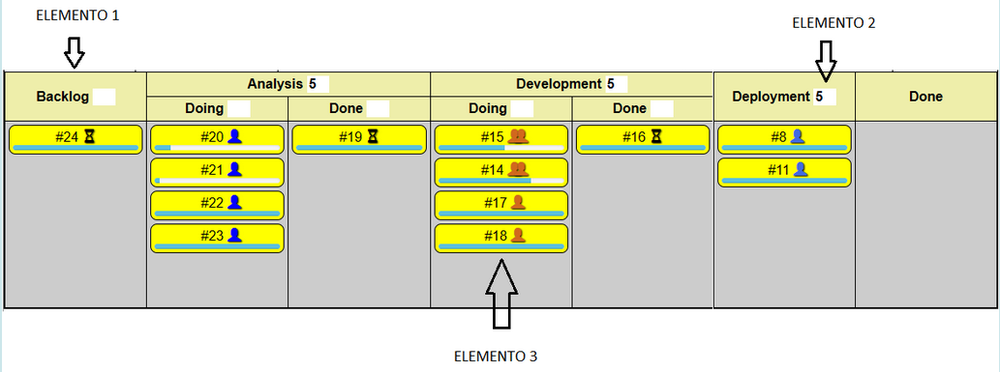

# Questionário - Aula 04

### Questão 01 - Selecione a opção falsa acerca de planejamento de projeto de software.
a. Planejamento adaptativo enfoca iterações integrantes de projeto de software.  
b. Plano de projeto é possível artefato em planejamento de software.  
c. Planejamento preditivo pode enfocar períodos longos do projeto.  
**d. Planejamento adaptativo requer planejamento inicial detalhado de projeto de software.**

### Questão 02 - Associe cada definição ao termo que melhor designa o conceito definido.
Medida quantitativa do grau com o qual sistema, componente ou processo apresenta determinado atributo. - **Métrica**  
Sistema de controles e processos requerido para atingir objetivos estratégidos definidos por corpo dirigente de organização. - **Gerenciamento (Management)**  
Ponto ou evento significativo em projeto, programa ou portfólio. - **Marco**  
Empreendimento com critérios definidos de início e fim, realizado para criar produto ou serviço de acordo com recursos e requisitos especificados. - **Projeto (Project)**  
Combinação da probabilidade de ocorrência e das consequências  de determinado evento futuro indesejável. - **Risco**

### Questão 03 - Selecione todas as opções que identificam possíveis papéis (roles) em projeto de software.
**a. Testador.**  
**b. Desenvolvedor.**  
**c. Documentador.**  
**d. Tradutor.**

### Questão 04 - Selecione todas as opções que informam fatores que afetam projeto de software.
**a. Processos de software adotados.**  
**b. Cultura da organização.**  
**c. Tamanho do produto de software.**  
**d. Tamanho da organização responsável pelo projeto.**

### Questão 05 - Selecione todas as opções que informam elementos de gerenciamento de projeto de software.
**a. Iniciação e definição do escopo do projeto de software.**  
**b. Planejamento do projeto de software.**  
**c. Revisão e avaliação do projeto de software.**  
**d. Execução do projeto de software.**

### Questão 06 - Considerando método Kanban, associe definição de conceito a termo que melhor designa o conceito definido.

Representação visual de um item de trabalho. - **Cartão Kanban (Kanban Card)**  
Restrição ao número máximo de itens de trabalho nas diferentes etapas do fluxo de trabalho. - **Work in Progress Limit (WIP Limit)**  
Sistema para entregar trabalho somente quando tanto a demanda existe quanto a capacidade de entrega está disponível. - **Pull System**  
Representação do número de tarefas sendo trabalhadas por um indivíduo ou equipe ao mesmo tempo. - **Work in Progress (WIP)**  
Número de itens de trabalho completos por unidade de tempo. - **Taxa de entrega (Delivery rate)**  
Tipo de reunião ou revisão que fornece feedback de um ou mais serviços com o propósito de revisar, coordenar ou melhorar o trabalho sendo entregue. - **Cadência (Cadence)**  
Quantidade de trabalho que um sistema kanban pode suportar enquanto o trabalho ainda flui de forma eficiente. - **Capacidade (Capacity)**  
Sistema onde o trabalho é inserido no sistema sem considerar se a capacidade está imediatamente disponível. - **Push System**  
A diferença de tempo entre um ponto no fluxo de trabalho e outro ponto no fluxo de trabalho. - **Lead Time**  
Recurso que possibilita exibição visual de cartões que representam os itens de trabalho em um sistema kanban. - **Quadro Kanban (Kanban Board)**  
Divisão horizontal de um quadro kanban com o propósito de otimizar o fluxo de trabalho. - **Raia (Swimlane)**  
Entregável resultante de demanda feita ao sistema. - **Item de trabalho (Work Item)**

### Questão 07 - Selecione todas as opções que designam definições verdadeiras sobre classes de cadências Kanban.
**a. Revisão da Estratégia (Strategy Review) - Revisão de alto nível onde ocorre revisão e ajuste da estratégia com base nas informações do mercado e dos clientes.**  
**b. Revisão de Risco (Risk Review) - Revisão que pode ser realizada em diferentes níveis da empresa e visa discutir e concordar sobre riscos relacionados a tarefas ou mudanças.**  
**c. Reabastecimento (Replenishment) - Reunião que visa reabastecer o sistema Kanban com novas tarefas. Procura garantir que a equipe tenha tarefas suficientes a realizar e que possa se comprometer com a realização dessas tarefas. Nessa reunião procura-se entender quais tarefas incorporar ao sistema Kanban, definir prazos para tarefas e garantir um fluxo contínuo de trabalho.**  
**d. Revisão de Operações (Operations Review) - Reunião que visa examinar aspectos operacionais. Pode considerar métricas que permitam à equipe identificar obstáculos, limitações de capacidade ou outros elementos que afetem o fluxo de trabalho. Procura identificar oportunidades para melhorar processos e alinhar o sistema Kanban a objetivos e metas da organização.**

### Questão 08 - Selecione a opção falsa acerca de ciclo de vida de projeto de software.
a. Fase de ciclo de vida de projeto de software é porção de ciclo de vida de projeto de software.  
b. Ciclo de vida de projeto de software pode ser dividido em fases.  
c. Ciclo de vida de projeto de software é porção do ciclo de vida de software.  
**d. Todo ciclo de vida de projeto de software é composto por quatro fases.**

### Questão 09 - Selecione todas as opções verdadeiras acerca de repositórios de software.
**a. Existem repositórios onde ocorre controle de versões.**  
**b. Repositórios de software podem armazenar coleções de artefatos.**  
**c. Existem repositórios onde há suporte ao trabalho colaborativo.**  
**d. Repositórios de software podem ser usados em projetos de software**

### Questão 10 - Selecione todas as opções verdadeiras.
**a. Projeto de software envolve aspectos organizacionais e tecnológicos, requer esforço coletivo e coordenação de esforços.**  
**b. Nas fases do ciclo de vida de projeto, diversas atividades são executadas, essas atividades podem ser agregadas em processos.**  
**c. Ciclo de vida de projeto pode ser decomposto nas seguintes fases genéricas: definição, planejamento, execução e fechamento.**   
**d. Existem plataformas para hospedar projetos de software onde é possível armazenar itens de informação e controlar versões deles.**  
**e. Ao longo de projeto de software, itens de informação produzidos podem ser armazenados e organizados em repositórios de projeto.**

### Questão 11 - Selecione todas as opções verdadeiras.
**a. Linhas de código e pontos de função são medidas a partir das quais métricas de produtividade podem ser calculadas.**  
**b. Gerenciamento de projeto pode englobar planejar, monitorar e controlar pessoas, processos e eventos em projeto.**  
**c. Processo de software pode fornecer método para definição de plano de projeto de desenvolvimento de software.**  
**d. Escopo do software descreve funções e características que devem ser fornecidas aos interessados (stakeholders).**  
**e. Para ser eficiente, a equipe do projeto deve ser organizada para maximizar capacidades e habilidades dos participantes.** 

### Questão 12 - Associe elementos a nomes considerando o método Kanban e o seguinte diagrama:

Elemento 2: **WIP**   
Elemento 1: **Quadro**  
Elemento 3: **Cartão (Card)**

### Questão 13 - Selecione a opção falsa acerca de projeto de software.
a. Projeto de software pode requerer esforço coletivo.  
**b. Processos em projeto independem de aspectos da organização responsável pelo projeto.**  
c. Produto de software pode ser desenvolvido por meio projeto.  
d. Projeto de software pode envolver vários processos.

### Questão 14 - Selecione todas as opções verdadeiras.
**a. Na abordagem adaptativa de planejamento, o plano de projeto inicialmente não é um plano detalhado, é detalhado a cada iteração.**  
**b. Na abordagem adaptativa de planejamento, o projeto pode ser decomposto em iterações, onde cada iteração é um pequeno projeto.**  
**c. O termo gerenciamento de projeto pode designar processo que engloba atividades de planejamento, delegação, monitoração e controle.**  
**d. Processo de gerenciamento de projeto pode considerar tempo, recursos, custos, qualidade, escopo, procedimentos, benefícios e riscos.**  
**e. Na abordagem preditiva de planejamento de projeto, tipicamente planeja-se o projeto por períodos que são relativamente longos.**

### Questão 15 - Selecione todas as opções que designam informação que faz sentido estar presente em cartão kanban.
**a. Tamanho ou estimativa - informação relativa ao esforço para realizar a tarefa.**  
**b. Prioridade - informação relativa à importância da tarefa em comparação a outras.**  
**c. Responsável - informação sobre membro da equipe responsável por realizar a tarefa.**  
**d. Título da tarefa - nome claro e conciso que designa a tarefa.**  
**e. Descrição - informação geral sobre a tarefa, destacando propósito e escopo da tarefa.**

### Questão 16 - Selecione a opção que não identifica elemento de gerenciamento em engenharia de software.
**a. Codificação.**  
b. Coordenação.  
c. Medição.  
d. Planejamento.

### Questão 17 - Associe definição ao termo que melhor a designa.
Pessoa ou organização que tem interesse direto ou indireto no resultado de projeto de software. - **Parte Interessada (Stakeholder).**  
Pessoa responsável por planejar, motivar, organizar e coordenar desenvolvedores em projeto de software. - **Gerente de Projeto.**  
Pessoa que tem habilidades técnicas necessárias para atuar na construção de produto de software. - **Desenvolvedor.**  
Pessoa que define problemas do negócio e frequentemente têm influência significativa no projeto de software. - **Gerente Senior.**  
Pessoa que interage com produto de software depois que é disponibilizado para uso operacional. - **Usuário.**

### Questão 18 - Associe definição ao termo que melhor designa o conceito definido.
Combinação de probabilidade de ocorrência e consequências de indesejável evento futuro. - **Risco.**  
Momento ou evento significativo em projeto, programa ou portfólio. - **Marco.**  
Empreendimento com critérios de início e término definidos que é realizado para criar produto ou serviço. - **Projeto.**  
Medida quantitativa de grau com o qual sistema, componente ou processo possui determinado atributo. - **Métrica.**

### Questão 19 - Selecione toda opção verdadeira acerca de projeto (project) e de risco em projeto de software.
**a. Plano de projeto de software pode conter informação acerca da organização do projeto, descrições de práticas e medições relevantes no projeto, marcos e objetivos do projeto. O termo marco pode designar instante ou evento significativo em projeto de software. Entrega de software consiste de possível marco em projeto de software.**  
**b. Processo de gerenciamento de risco (risk management process) tipicamente engloba atividades por meio das quais se procura antecipar riscos que possam afetar projeto de software ou qualidade de software sendo desenvolvido, e atividades por meio das quais se procura evitar a ocorrência desses riscos. Processo genérico de gerenciamento de risco engloba atividades voltadas à identificação de risco, à análise de risco, ao planejamento de risco e à monitoração de risco.**   
c. Riscos que afetam projeto de software independem de características do processo ou do ambiente organizacional onde o software é desenvolvido. Em projeto de software, risco de projeto pode afetar cronograma do projeto, risco de produto pode afetar a qualidade do produto de software sendo desenvolvido, risco de negócio pode afetar organização responsável pelo desenvolvimento do software. Projetos de software são pouco sujeitos a incertezas e gerenciamento de risco é irrelevante.  
d. O termo projeto (project) designa empreendimento que tem o intuito de criar produto ou serviço de acordo com recursos e requisitos especificados. Entre as características de projeto, tem-se ausência de datas de início e término, natureza não temporária e existência de projetos similares. Entre os critérios de sucesso no gerenciamento de projeto, tem-se os seguintes: entregar produto no prazo, manter custos dentro do orçamento e entregar produto que atenda às expectativas.

### Questão 20 - Selecione todas as opções verdadeiras acerca de Kanban.
**a. O método Kanban pode auxiliar na tomada de decisão ao promover o uso de um sistema de gerenciamento que facilita a visualização de itens de trabalho.**  
b. O método Kanban pode prover suporte ao gerenciamento de projeto de software, mas não pode prover suporte ao gerenciamento de projeto de outra classe de produto.  
**c. O método Kanban possibilita que a equipe do projeto estabeleça um limite do trabalho em progresso (work in progress limit), que é um limite ao número de itens de trabalho simultâneos.**  
d. No método Kanban é sugerido um fluxo de trabalho onde solicitações de trabalho são passadas para membros do projeto com prazos para conclusão (push model),  em vez de serem incorporadas a uma lista a ser acessada por membros do projeto quando capacidade de trabalho estiver disponível (pull model).  
**e. A visualização do trabalho é um princípio que o o método Kanban promove por meio de quadros (boards) onde cartões (cards) são organizados para comunicar o progresso do trabalho.**
