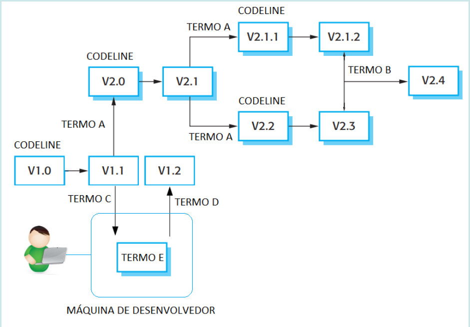
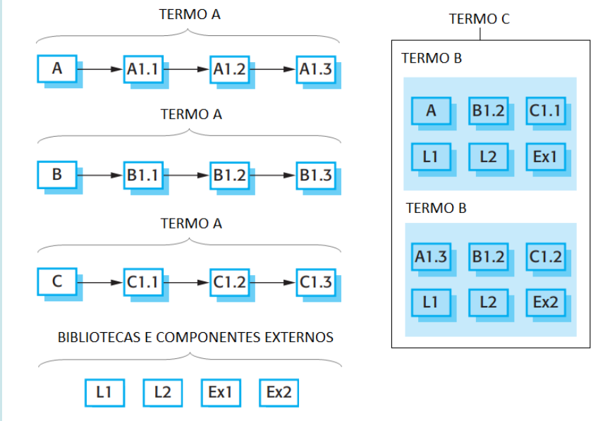

# Questionário - Aula 05

### Questão 01 - Selecione toda opção que identifica artefato que pode ser controlado em gerenciamento de configurações.
**a. Procedimento de teste.**  
**b. Especificação de requisitos.**  
**c. Plano de iteração.**  
**d. Plano de projeto.**  
**e. Código fonte (source code).**

### Questão 02 - Selecione a opção falsa acerca de responsabilidade do gerenciamento de configurações.
a. Gerenciamento de release.  
b. Controle de versões.  
c. Gerenciamento de modificações.  
**d. Projeto (design) de arquitetura de software.**

### Questão 03 - Selecione opção que não identifica artefato típico de processo de gerenciamento de configurações.
a. Convenção de nomes.  
b. Convenção para organização de diretórios.  
c. Convenção para organização de arquivos.  
**d. Padrão de codificação (coding standard) em linguagem de programação.**

### Questão 04 - Selecione toda opção que designa atividade em processo de gerenciamento de configurações.
**a. Verificar conformidade a requisitos especificados.**  
**b. Identificar características de item de configuração.**  
**c. Documentar características de item de configuração.**  
**d. Controlar modificações a características de item de configuração.**

### Questão 05 - Selecione opção falsa acerca de item de configuração.
**a. Pode ser um item mas não pode ser um agregado de itens.**  
b. Relevante em processo de gerenciamento de configurações.  
c. Tratado como unidade no contexto de processo de gerenciamento de configurações.  
d. Pode variar em tamanho, complexidade e tipo.

### Questão 06 - Selecione a opção que identifica processo executado na atualização de repositório.
a. Processo move.  
b. Processo copy.  
**c. Processo commit.**  
d. Processo check-out.
 
### Questão 07 - Selecione opção que identifica processo que resulta na construção de cópia de trabalho.
**a. Processo check-out.**  
b. Processo update.  
c. Processo check-in.  
d. Processo commit.

### Questão 08 - Selecione opção que identifica processo executado quando de merging.
a. Processo create.  
**b. Processo update.**  
c. Processo compare.  
d. Processo check-out.

### Questão 09 - Selecione opção que identifica ordem típica de execução de processos.
a. commit , check-out , update  
**b. check-out , commit , update**  
c. commit , update, check-out   
d. update , check-out , commit

### Questão 10 - Selecione toda opção que identifica sistema de controle de versões.
**a. Apache Subversion**  
**b. Concurrent Versions System (CVS)**  
**c. Git**  
d. GnuCash  
**e. Bazaar**

### Questão 11 - Selecione a opção falsa acerca de sistemas de controle de versões.
**a. Produto Apache Subversion provê controle de versões distribuído e não centralizado.**  
b. Produto Git possibilita acesso por meio de cliente com interface gráfica.  
c. Produto CVS possibilita armazenamento de artefatos em repositórios.  
d. Produto CVS provê controle de concorrência.

### Questão 12 - Selecione opção falsa acerca de sistema de controle de versões.
a. Elemento integrante da gestão de configurações.  
b. Pode possibilitar recuperação de versões existentes de artefato.  
c. Pode armazenar artefatos em repositórios.  
**d. Provê meios para inibir edição concorrente de artefato em projeto de softwar**  

### Questão 13 - Selecione termos que melhor completam o seguinte diagrama:

TERMO D $\rightarrow$ Check in,  
TERMO A $\rightarrow$ Branch,  
TERMO C $\rightarrow$ Check out,  
TERMO E $\rightarrow$ Cópia de trabalho,  
TERMO B $\rightarrow$ Merge.  

### Questão 14 - Selecione termos que melhor completam o seguinte diagrama:

TERMO A $\rightarrow$ Codeline,  
TERMO B $\rightarrow$ Baseline,  
TERMO C $\rightarrow$ Mainline.

### Questão 15 - Associe definição ao termo que melhor designa o conceito definido.

Sequência de baselines representando diferentes versões de sistema. $\rightarrow$ **Mainline**;
Entidade associada a projeto de software e controlada por processo de gerenciamento de configuração. $\rightarrow$ **Item de configuração**;
Versão de sistema disponibilizada para uso. $\rightarrow$ **Release**;
Coleção controlada de versões de elementos que compõem sistema. $\rightarrow$ **Baseline**;
Instância de item de configuração que difere de outras instâncias desse mesmo item. $\rightarrow$ **Versão**.

### Questão 16 - Selecione toda opção verdadeira acerca de gerenciamento de configuração de software.
**a. Plano de gerenciamento de configuração de software (software configuration management plan) consiste de artefato no qual é registrada informação acerca de resultados de planejamento de atividades em processo de gerenciamento de configuração de software (software configuration management process).**  
**b. Processo de gerenciamento de configuração de software (software configuration management process)  engloba atividades para identificação de configuração de software, controle de configuração de software, controle de estado de configuração de software, auditoria de configuração de software e gerenciamento de entrega de software.**  
**c. Plano de gerenciamento de configuração de software (software configuration management plan)  pode englobar a seguinte informação acerca de processo de gerenciamento de configuração de software (software configuration management process): propósito, escopo, termos usados, responsabilidades, autoridades, políticas aplicáveis, diretivas, procedimentos, identificação de configuração, controle de configuração, cronograma de atividades, ferramentas, recursos físicos e humanos.**  
d. Plano de gerenciamento de configuração de software (software configuration management plan) consiste de documento de referência usado em processo de gerenciamento de configuração de software (software configuration management process), portanto, esse documento não pode ser alterado ao longo de ciclo de vida de software.

### Questão 17 - Selecione toda opção verdadeira acerca de processos em gerenciamento de configuração de software.
a. Processo de gerenciamento de entrega (release management process) enfoca primariamente montagem (assembling) de componentes, dados e bibliotecas integrantes de programas, compilação e ligação (linking) de códigos integrantes de software com o propósito de criar software executável.  
b. Processo de construção de sistema (system building process) enfoca primariamente preparação de software para entrega (release) externa, acompanhamento de versões de software entregues a clientes.  
**c. Processo de gerenciamento de modificação (change management process) enfoca acompanhamento de solicitações de modificações em software, avaliação de custos e de impactos de modificações em software e decisão acerca de implementação de modificações em software.**  
**d. Processo de gerenciamento de versão (version management process) enfoca acompanhamento de versões de componentes de software e garantia que mudanças feitas a componentes de software não resultem em interferências indesejáveis entre as mesmas.**

### Questão 18 - Selecione toda opção verdadeira acerca de termos em gerenciamento de configuração de software.
**a. O processo de gerenciamento de configurações engloba processo de gerenciamento de versões (version management) e processo de gerenciamento de entrega (release management). O gerenciamento de versões controla versões dos artefatos integrantes do software e procura garantir que mudanças nesses artefatos não resultem em interferências indesejadas. O gerenciamento de entrega enfoca preparação de software para entrega externa e controle de versões entregues para uso.**  
b. Controle de versões é processo integrante do gerenciamento de configurações. Por meio de sistema de controle de versões é possível controlar modificações a artefatos compartilhados. No controle de versões, por meio de processo denominado check-in é possível criar cópia de trabalho (working copy). Por meio de processo denominado check-out é possível atualizar repositório e gerar nova versão de artefato. Por fim, por meio de processos update e merging é possível resolver conflitos.  
**c. Processo de gerenciamento de configurações pode definir como registrar e processar modificações propostas ao software e aos seus componentes, como decidir quais componentes modificar, como gerenciar diferentes versões do software e dos seus componentes, como distribuir modificações entre clientes. Ferramentas podem ser usadas no acompanhamento de propostas de modificações, assim como no armazenamento de versões do software e de seus componentes.**   
**d. O termo item de configuração de software (software configuration item) pode designar entidade em projeto de software colocada sob controle de configuração e tratada como entidade única em processo de gerenciamento de configuração. O termo versão pode designar instância de item de configuração que difere de outra instância desse item. O termo baseline pode designar coleção de versões de componentes que compõem sistema de software.**

### Questão 19 - Selecione todas as opções verdadeiras.
**a. Em sistema de controle de versão, o termo delta tipicamente designa diferença entre versões de item de informação.**  
**b. Sistema de controle de versão pode possibilitar que ramos (branch) sejam criados, e que itens em diferentes ramos sejam modificados.**  
**c. Em sistema de controle de versão, itens de informação podem ser armazenados em repositórios organizados em estrutura hierárquica.**  
d. Baseline é uma instância identificada de item de configuração mas não é uma versão formalmente aprovada de um item de configuração.  
**e. Processo de controle de versão pode conter atividades para estabelecimento, manutenção. identificação e controle de baselines.**

### Questão 20 - Selecione todas as opções verdadeiras.
**a. Processo de gestão de alterações de software pode englobar atividades para (1) identificar itens de configuração de software, (2) gerenciar alterações de itens de configuração e (3) facilitar a construção de versões de software.**  
**b. Sistema de controle de versão pode prover (1) repositório para armazenar itens de configuração, (2) recurso para gerir e armazenar versões de itens de configuração e (3) meios para facilitar a construção de versões de software.**  
**c. Em projeto de desenvolvimento de software, pode ser útil criar linhas de desenvolvimento sem que ocorram interferências entre elas, para isso, sistema de controle de versão pode possibilitar que ramos (branch) sejam criados.**  
**d. Em projetos de software, desenvolvedores tipicamente acessam sistemas de controle de versão por meio de produtos de software que agem como clientes de servidores.**   
**e. Existem diferentes classes de sistemas de controle de versão, por exemplo, sistema de controle de versão local, sistema de controle de versão centralizado e sistema de controle de versão distribuído.**
