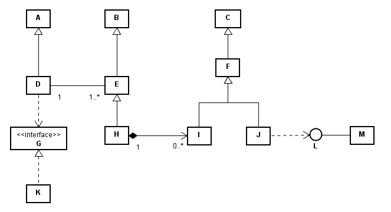
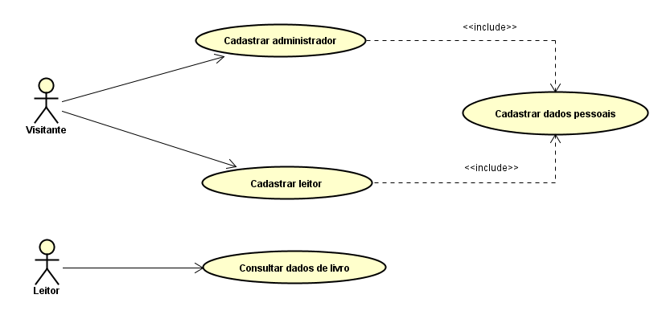
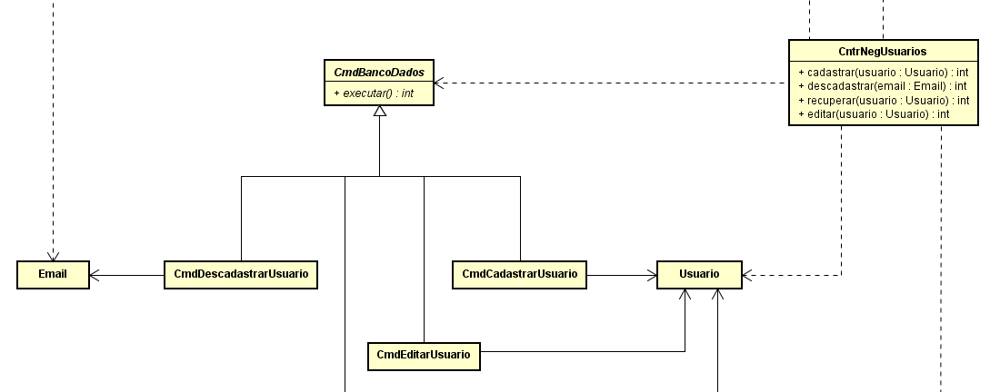
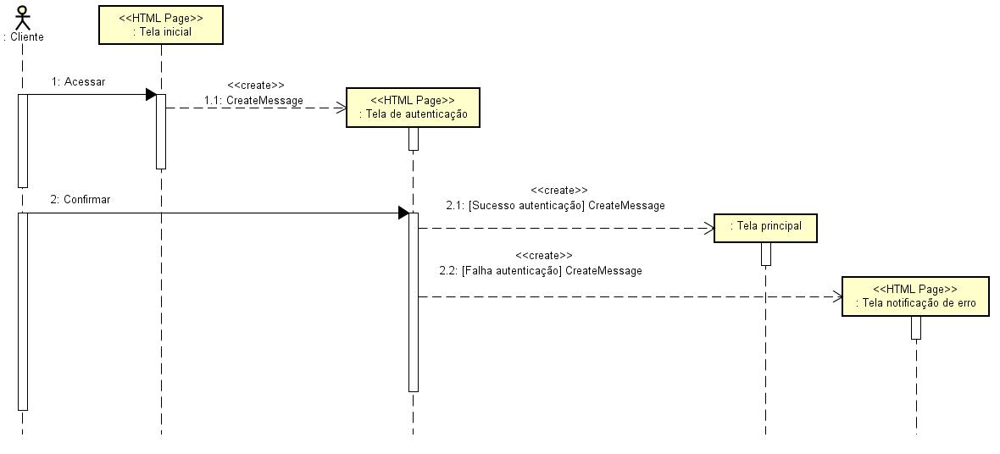
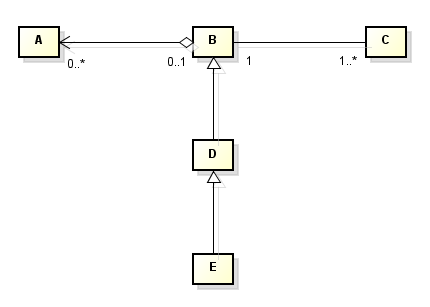
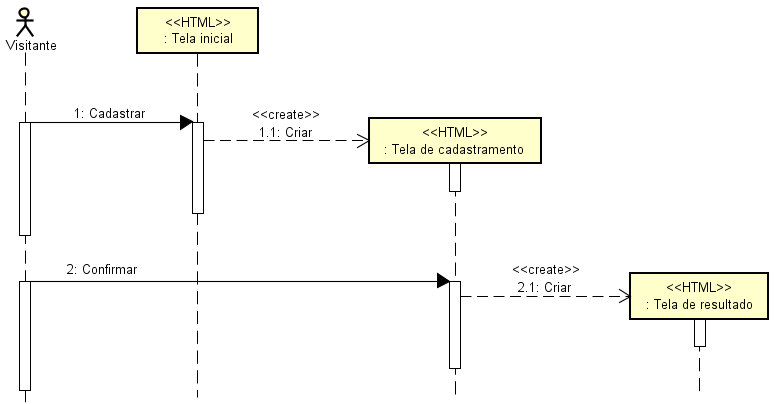
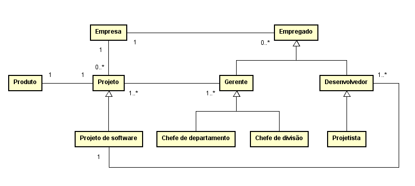
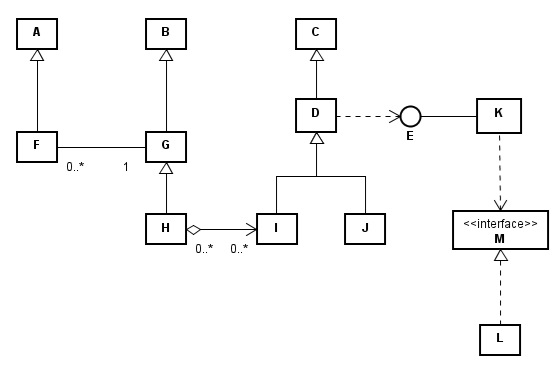
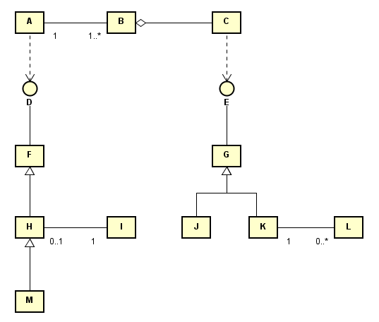

# Questionário - Aula 06

### Questão 01 - Selecione a opção falsa acerca de modelagem.
a. Modelagem pode enfocar representação de processo, dispositivo ou conceito.  
b. Paradigma orientado a objetos pode ser adotado em modelagem.  
c. Modelagem pode consistir de processo com diversas atividades.  
**d. Modelagem pode enfocar construção de novo modelo mas não manutenção de modelo existente.**

### Questão 02 - Selecione todas as opções verdadeiras acerca de modelos e modelagem.
**a. Modelagem procura promover efetividade na comunicação por meio de uso de vocabulário adotado no domínio e de linguagem de modelagem.**  
**b. Modelagem provê visões (views) do software por meio da adoção de conjunto de regras para expressar o modelo segundo cada uma das visões.**  
**c. Modelo é composto por elementos que comunicam informação necessária para responder perguntas que levaram à construção do modelo.**  
d. Bons modelos representam todos os aspectos e características de software em todas as possíveis condições e não abstraem qualquer informação.

### Questão 03 - Selecione todas as opções verdadeiras considerando o seguinte diagrama de classes:

a. Pode existir instância da classe I sem que exista instância da classe H.    
**b. Podem existir várias instâncias da classe E ligadas a uma instância da classe D.**  
**c. Classe H herda da classes B.**  
d. Classe D realiza a interface G e a classe K depende da interface G.  
e. Classe F herda das classes I e J.  
**f. Classe J depende da interface L e a class M realiza a interface L.**  
g. Classe A herda da classe D.  
**h. Classe H herda o relacionamento entre as classes E e D.**  

### Questão 04 - Selecione a opção falsa acerca de modelo.
a. Modelo pode consistir de representação de processo.  
b. Modelo pode consistir de representação de conceito.  
c. Modelo pode consistir de representação simplificada da realidade.  
**d. Modelo promove detalhamento em vez de supressão de aspectos do assunto modelado.**

### Questão 05 - Selecione a opção verdadeira acerca do seguinte trecho de diagrama:

a. Trecho de diagrama de sequência.  
b. Trecho de diagrama de atividades.  
c. Trecho de diagrama de implementação.  
**d. Trecho de diagrama de casos de uso.**

### Questão 06 - Selecione todas as opções verdadeiras acerca do seguinte trecho de diagrama de classes.

**a. Existe relacionamento de associação entre as classes `CmdCadastrarUsuario` e `Usuario`.**  
b. A classe `CmdBancoDados` é especialização da classe `CmdCadastrarUsuario`.  
**c. Existe relacionamento de herança entre as classes `CmdBancoDados` e `CmdEditarUsuario`.**  
**d. No diagrama tem-se trecho de hierarquia de classes.**  
**e. Existe relacionamento de dependência entre as classes `CntrNegUsuarios` e `CmdBancoDados`.**

### Questão 07 - Associe cada definição ao termo que melhor designa o conceito definido no contexto da modelagem orientada a objetos.

Entidade que é instância de classe e que pode existir em tempo de execução. $\rightarrow$ **Objeto**;  
Relacionamento todo-parte entre classes, onde instância de parte pode existir independentemente de instância de todo ao qual é ligada. $\rightarrow$ **Agregação**;  
Entidade que representa conhecimento e comportamento de objetos similares. $\rightarrow$ **Classe**;  
Relacionamento entre classes que possibilita expressar generalização e especialização entre classes. $\rightarrow$ **Herança**;  
Relacionamento todo-parte entre classes, onde instância de parte não pode existir independentemente de instância de todo ao qual é ligada. $\rightarrow$ **Composição**.

### Questão 08 - Selecione todas as opções que identificam diagramas UML.
**a. Diagrama de classes.**   
**b. Diagrama de atividades.**  
**c. Diagrama de implantação.**  
d. Diagrama organizacional.  
**e. Diagrama de sequência.**  

### Questão 09 - Selecione todas as opções verdadeiras acerca de princípios de modelagem.
a. Prover perspectiva única por meio da organização da informação segundo uma só visão.  
**b. Modelar aspectos essenciais.**  
c. Representar todos aspectos em todas possíveis condições.  
**d. Promover comunicação efetiva.**

### Questão 10 - Selecione opção que designa classe de modelo onde diagrama de atividades é relevante.
a. Modelo de informação.  
**b. Modelo comportamental.**  
c. Modelo estrutural.  
d. Modelo de dados.  

### Questão 11 - elecione todas as opções verdadeiras considerando o seguinte diagrama de sequência.

a. No diagrama é representada hierarquia de classes.  
b. No diagrama são representadas associações entre classes.  
**c. No diagrama são representadas interações entre instâncias de classes.**  
**d. Instância de Tela de autenticação é criada em decorrência de interação entre instância de Cliente e instância de Tela inicial.**  
**e. Acessar e Confirmar designam mensagens.**

### Questão 12 - Selecione toda opção verdadeira considerando o seguinte digrama de classes.

a. Considerando herança entre classes, B é especialização de D.  
**b. Considerando associação entre classes, a cada instância de B podem estar ligadas (linked) várias instâncias de C.**  
c. Considerando agregação entre classes, A representa o todo enquanto B representa a parte.  
**d. Considerando herança entre classes, métodos e atributos de B são herdados por E.**  

### Questão 13 - Selecione todas as opções verdadeiras considerando o seguinte diagrama de sequência:

**a. Processamento da Mensagem 3 resulta no envio da Mensagem 4.**  
b. Processamento de mensagem enviada por instância de B cria instancia de C.  
**c. Instância de C não existe quando instância de A envia Mensagem 6.**  
d. Instância de B envia Mensagem 7 para uma outra instância de B.  
**e. Instância de B existe antes de instância de A enviar Mensagem 1.**  

### Questão 14 - Selecione a opção verdadeira acerca do seguinte trecho de diagrama:

a. Trecho de diagrama de classes.  
b. Trecho de diagrama de implantação.  
c. Trecho de diagrama de atividades.  
**d. Trecho de diagrama de sequência.**

### Questão 15 - Selecione todas as opções verdadeiras no contexto da modelagem orientada a objetos.
a. Estados de objetos devem ser sempre expostos aos clientes dos serviços providos pelos objetos.  
**b. Método está relacionado ao comportamento dinâmico do objeto.**  
**c. Termos classe e objeto designam conceitos relevantes em modelagem orientada a objetos.**  
d. Estado de um objeto tipicamente independe dos serviços anteriormente solicitados a esse objeto

### Questão 16 - Selecione todas as opções verdadeiras considerando o seguinte diagrama de classes.

**a. Projetista herda da classe Empregado.**  
b. Existe herança entre Chefe de departamento e Chefe de divisão.  
c. Uma instância de Projeto pode estar ligada a mais de uma instância de Empresa.  
**d. Uma instância de Projeto pode estar ligada (linked) a mais de uma instância de Chefe de divisão.**  
**e. Uma instância de Projeto de software pode estar ligada a uma instância de Produto.**

### Questão 17 - Selecione a opção verdadeira acerca de relacionamento de agregação entre classes.
a. Relacionamento entre classe que representa conceito genérico e classe que representa conceito específico.  
b. Relacionamento tipicamente representado por meio de diagrama de sequência.  
c. Relacionamento hierárquico onde ocorre herança entre classes.  
**d. Relacionamento entre todo e suas partes.**

### Questão 18 - Associe cada definição ao termo que melhor designa o conceito definido.

Classe de modelos que primariamente enfocam composições físicas e composições lógicas de software. $\rightarrow$ **Estrutural**;  
Grau com o qual o modelo satisfaz requisitos, especificações de projeto (design) e não apresenta defeitos. $\rightarrow$ **Corretude**;  
Grau com o qual todos os requisitos foram implementados e verificados em um modelo. $\rightarrow$ **Completude**;  
Classe de modelos que primariamente identificam e definem funções de software. $\rightarrow$ **Comportamental**;  
Grau com o qual há ausência de conflitos entre requisitos, asserções, restrições, funções ou descrições de componentes em um modelo. $\rightarrow$ **Consistência**.

### Questão 19 - Selecione a opção falsa acerca de relacionamento de herança entre classes.
a. Relacionamento presente em hierarquia de classes.  
**b. Relacionamento entre todo e suas partes.**  
c. Relacionamento por meio do qual pode ser representada generalização.  
d. Relacionamento por meio do qual pode ser representada especialização.  

### Questão 20 - Selecione toda opção verdadeira acerca de princípios de modelagem de software.
**a. Prover perspectiva é princípio de modelagem. Segundo esse princípio, processo de modelagem deve enfocar software sendo modelado segundo determinada visão. Pode ser enfocada visão estrutural, comportamental, temporal e organizacional, e podem existir regras para expressar modelo segundo determinada visão.**  
b. Possibilitar comunicação efetiva é princípio de modelagem. Segundo esse princípio, processo de modelagem deve evitar uso de vocabulário adotado no domínio de aplicação do software sendo modelado e deve evitar uso de linguagem de modelagem (modeling language) quando da construção de modelo.  
**c. Em processo de modelagem, organizar a informação segundo determinada visão possibilita que esforço de modelagem enfoque aspectos que sejam relevantes no contexto da visão. Na construção de modelo segundo determinada visão, deve-se promover uso de notação, vocabulário, métodos e ferramentas adequadas.**  
d. Modelar o essencial é princípio de modelagem. Segundo esse princípio, processo de modelagem deve representar todos aspectos, todas características e todas condições de uso do software sendo modelado.

### Questão 21 - Selecione toda opção verdadeira acerca de propriedades de modelos.
**a. Em projeto de software, podem ser construídos variados modelos de sistema de software. Esses modelos podem ser usados para propósitos tais como facilitar entendimento e discussão acerca de sistema existente ou proposto, documentar sistema de software existente, gerar implementação de sistema de software.**   
b. Acerca das propriedades de modelos, tem-se que o termo consistência (consistency) designa grau com o qual todos os requisitos foram implementados e verificados no modelo. O termo completude (completeness) designa grau com o qual modelo não contém conflitos. O termo corretude (correctness) designa grau com o qual modelo satisfaz requisitos e especificações de projeto (design). O termo corretude também designa grau com o qual o modelo está livre de defeitos.  
**c. Em projeto de software, podem ser construídos modelos segundo diferentes perspectivas. Perspectiva externa que enfoca contexto ou ambiente do sistema. Perspectiva de interação que enfoca interações entre sistema e ambiente ou entre componentes do sistema. Perspectiva estrutural que enfoca organização do sistema ou estrutura de dados processados. Perspectiva comportamental que enfoca comportamento dinâmico do sistema e como ocorrem as respostas a eventos.**  
d. Modelo de software é representação de software. Pode ser construído modelo de software existente ou de software sendo desenvolvido. No desenvolvimento orientado a objetos, diagramas de classes integram modelos construídos segundo perspectiva comportamental, descrevem comportamento dinâmico do software. Por sua vez, diagramas de sequência integram modelos construídos segundo perspectiva estrutural, são usados para descrever estrutura estática do software.

### Questão 22 - Selecione opção que designa atributo de qualidade relativo à ausência de conflitos em modelo.
**a. Consistência.**  
b. Funcionalidade.  
c. Completude.  
d. Corretude.

### Questão 23 - Selecione todas as opções verdadeiras considerando o seguinte diagrama de classes:

**a. Pode existir instância da classe G não ligada a instância da classe F.**  
b. Classe K realiza a interface M enquanto a classe L depende da interface M.  
**c. Pode existir instância da classe I sem que exista instância da classe H.**  
d. Classe D realiza a interface E enquanto a classe K depende da interface E.  
**e. Classe J herda relacionamento entre a classe D e a interface E.**  
**f. Classe H herda das classes B e G.**   
g. Classe A herda da classe F.

### Questão 24 - Selecione todas as opções que designam diagramas UML tipicamente usados em modelos estruturais (structural models).
**a. Diagrama de implantação (deployment).**  
b. Diagrama de estados.  
**c. Diagrama de componentes.**  
d. Diagrama de atividades.  
**e. Diagrama de classes.** 

### Questão 25 - Selecione todas as opções verdadeiras considerando o seguinte diagrama de classes:

a. G herda atributos e métodos de J e K.  
**b. Instância de G provê serviços relacionados em E.**  
**c. Instância de A pode estar ligada (linked) a mais de uma instância de B.**  
**d. Instância de K pode não estar ligada (linked) a instância de L.**  
e. São herdados por M os atributos e métodos de H e o relacionamento entre H e I.  
f. Entre B e C tem-se relacionamento de agregação onde B consiste de parte (part) e C consiste de todo (whole).  
g. Instância de I está ligada (linked) a uma ou a mais instâncias de H.  
**h. Instância de A depende de serviços providos por instância de F.**
