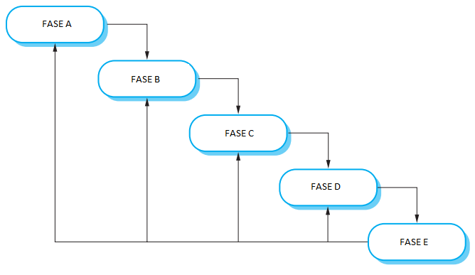
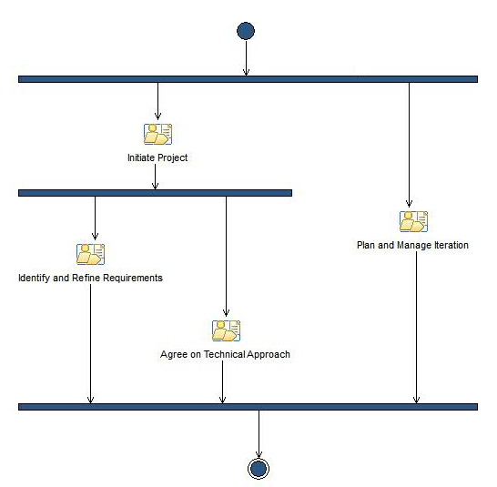

# Questionário - Aula 07

### Questão 01 - Selecione toda opção verdadeira acerca de modelos de desenvolvimento.
a. No modelo de desenvolvimento incremental podem ser intercaladas atividades de especificação, desenvolvimento e validação. O software é desenvolvido por meio de incrementos resultantes de iterações. Cada incremento pode incorporar nova funcionalidade requerida. Quando comparado ao modelo organizado em cascata (waterfall model), o modelo incremental resulta em maior custo quando de mudança de requisito e maior dificuldade em obter realimentação (feedback) do cliente.  
**b. No modelo organizado em cascata (waterfall model), atividades são agrupadas em fases. Pode existir fase de especificação e análise de requisitos, fase de projeto (design) de software, fase de implementação de software, fase de integração de software, fase de teste de software, fase de operação de software e fase de manutenção de software. Em princípio, cada fase deve ser iniciada apenas após a anterior ser concluída e cada fase pode resultar em artefatos variados.**  
**c. Quando é adotado modelo de desenvolvimento incremental (incremental development) em projeto de software complexo e de longa duração, onde diferentes partes do software são desenvolvidas por meio de atividades executadas por membros integrantes de diferentes equipes, podem ocorrer dificuldades relativas à estrutura do software sendo desenvolvido. Nesse contexto, é relevante o processo de refatoração (refactoring) para melhorar a qualidade do software.**  
d. No modelo organizado em cascata (waterfall model), especificação e análise de requisitos ocorre em fase inicial, enquanto a definição da arquitetura de software (software architecture) ocorre na fase de projeto (design). O modelo organizado em cascata deve ser adotado, principalmente, em projeto de desenvolvimento de software onde requisitos de software sejam pouco entendidos, sofram modificações frequentes e significativas durante ciclo de desenvolvimento.

### Questão 02 - Considerando o modelo de processo de software denominado cascata (waterfall) e o diagrama seguinte, associe nome a cada fase.

Fase C $\rightarrow$ **Implementação e teste de unidade**.  
Fase B $\rightarrow$ **Projeto (design) de sistema e software**.  
Fase D $\rightarrow$ **Integração e teste de sistema**.  
Fase E $\rightarrow$ **Operação e manutenção**.  
Fase A $\rightarrow$ **Definição e análise de requisitos**.

### Questão 03 - Selecione a opção verdadeira acerca de modelo de ciclo de vida iterativo.
a. Modelo tipicamente representado por diagrama V ou por cascata.  
b. Modelo que suprime a necessidade de realimentação (feedback) por parte dos envolvidos.  
c. Modelo que requer completa e detalhada especificação dos requisitos no início do ciclo.  
**d. Modelo onde incrementos são gradualmente produzidos por iterações.**

### Questão 04 - Selecione a opção falsa acerca de elementos integrantes de processo.
a. Papéis (roles) podem ser descritos em processo.  
**b. Processo não pode ser composto por outros processos.**  
c. Processo pode ser composto por uma ou mais atividades.  
d. Processo pode ser composto por itens de informação.

### Questão 05 - Considerando o modelo cascata (waterfall), associe a cada descrição o nome da fase com os propósitos descritos.

Definição de arquitetura do software, identificação e descrição de abstrações e de relacionamentos entre elas. $\rightarrow$ **Projeto (design) de sistema e software**.  
Instalação do software, uso do software, correção de defeitos que resultaram em falhas quando do uso do software. $\rightarrow$ **Operação e manutenção**.   
Interligação de partes dos programas do software e verificação do atendimento a requisitos por parte do software. $\rightarrow$ **Integração e teste de sistema**.  
Serviços, restrições e objetivos são estabelecidos por meio de consultas às partes interessadas (stakeholders). $\rightarrow$ **Definição e análise de requisitos**.  
Construção de código e verificação do atendimento a requisitos por partes de códigos integrantes de programas do software. $\rightarrow$ **Implementação e teste de unidade**.

### Questão 06 - Selecione toda opção verdadeira acerca do modelo de desenvolvimento em espiral.
a. Nesse modelo de desenvolvimento, protótipos não podem ser construídos, uma vez que a construção dos mesmos acarreta o aumento de riscos.  
**b. Modelo de desenvolvimento guiado por risco (risk-driven). Nesse modelo, riscos de projeto são identificados, estratégias são definidas dependendo dos riscos identificados, procura-se avaliar e reduzir riscos.**  
**c. Nesse modelo de desenvolvimento, cada laço (loop) na espiral é dividido em setores voltados à definição de objetivos, avaliação e redução de riscos, desenvolvimento e validação, planejamento.**   
**d. Modelo de desenvolvimento onde processo de software é representado por espiral em vez de ser representado por sequência de atividades. Cada laço (loop) na espiral representa fase no processo de software.**

### Questão 07 - Selecione todas as opções que designam atividades típicas da fase de projeto (design) de software.
**a. Projetar (design) banco de dados.**  
b. Construir e testar o código do produto de software.  
**c. Projetar (design) arquitetura de software.**  
d. Treinar usuários finais do produto de software.

### Questão 08 - Selecione a opção falsa acerca do modelo de ciclo de vida orientado a reuso.
a. Podem ser reusados componentes existentes ou desenvolvidos novos componentes.  
b. Podem ser reusados componentes variados.  
**c. Modelo que suprime a necessidade de adaptação de componentes.**  
d. Modelo que enfoca o reuso de componentes.

### Questão 09 - Selecione toda opção que designa propósito de quadrante em modelo de processo de software em espiral (spiral model).
**a. Planejamento da próxima fase.**  
**b. Identificação e definição de objetivos, alternativas e restrições.**  
**c. Avaliação de alternativas, identificação, redução e resolução de riscos.**  
d. Operação e manutenção.  
**e. Desenvolvimento e validação de produto.**

### Questão 10 - Selecione a opção falsa acerca de fluxo de atividades.
a. Pode ser representado por meio de diagrama de atividades.  
**b. Em todo fluxo de atividades, as atividades devem ser executadas sequencialmente.**  
c. Representa sequência de atividades.  
d. Existem situações nas quais faz sentido percorrer fluxo de atividades mais de uma vez.

### Questão 11 - Selecione toda opção verdadeira acerca do modelo de desenvolvimento embasado em entregas incrementais (incremental delivery).
a. Primeiras entregas disponibilizam protótipos descartáveis (throw-away), portanto elas não podem ser usadas por usuários para adquirir conhecimento acerca do uso do sistema que está sendo desenvolvido.  
b. Não é possível alterar requisitos de incrementos que serão futuramente construídos, é possível alterar requisitos apenas de incremento que está sendo construído no momento.  
**c. Definir requisitos, atribuir requisitos a incremento, projetar (design) arquitetura, desenvolver incremento, validar incremento, integrar incremento, validar sistema, implantar incremento, são atividades na entrega incremental.**  
d. Partes interessadas (stakeholders) no sistema sendo desenvolvido não podem por em serviço as primeiras entregas, pois as mesmas não enfocam requisitos de maior prioridade para essas partes.  
**e. Diferentes incrementos são definidos para entrega, cada incremento provê subconjunto dos serviços a serem disponibilizados pelo sistema, alocação de serviços aos incrementos pode considerar a prioridade de cada serviço.**

### Questão 12 - Selecione a opção verdadeira acerca de modelo de ciclo de vida sequencial.
a. Modelo adequado a todas as classes de projeto de software.  
**b. Modelo inadequado quando ocorrem rápidas mudanças em requisitos.**  
c. Modelo composto por fases que ocorrem concorrentemente.  
d. Modelo adequado quando ocorrem frequentes mudanças em requisitos.

### Questão 13 - Associe cada definição ao termo que melhor designa o conceito definido no contexto de classes de processos.
Classe que engloba processos de garantia de qualidade, verificação e validação. $\rightarrow$ **Classe de processos de suporte**.  
Classe que engloba processos de desenvolvimento, operação e manutenção de software. $\rightarrow$ **Classe de processos primários**.  
Classe que engloba processos de treinamento e gerenciamento de modelo de ciclo de vida de software. $\rightarrow$ **Classe de processos organizacionais**.  
Classe que engloba processos que envolvem mais de um projeto na organização, como processos em linha de produtos de software. $\rightarrow$ **Classe de processos inter-projetos (cross-project)**.

### Questão 14 - Selecione todas as opções verdadeiras.
**a. O modelo cascata sugere uma abordagem sequencial e sistemática para o desenvolvimento de software, começando com a especificação dos requisitos, avançando por fases de projeto (design), modelagem, construção e suporte ao produto de software desenvolvido**.  
**b. No modelo espiral, o primeiro ciclo pode resultar em especificação do software sendo desenvolvido; ciclos seguintes em torno da espiral podem resultar em protótipo do software sendo desenvolvido e  ciclos seguintes podem resultar em versões cada vez mais completas do software**.  
c. A adoção de um processo de desenvolvimento de software garante que o produto de software será entregue dentro do prazo, que estará de acordo com as necessidades dos interessados e que apresentará características técnicas que resultarão em produto de qualidade no longo prazo.  
**d. No modelo espiral, o produto de software é desenvolvido por meio de versões evolucionárias; nas primeiras iterações, a versão pode consistir de um protótipo; nas iterações posteriores, são produzidas versões cada vez mais completas do software que se encontra em desenvolvimento**.  
**e. São problemas que podem ocorrer na adoção do modelo cascata: projeto não se adequar a um fluxo sequencial, dificuldade em se definir  todos os requisitos no início do desenvolvimento e versão operacional do software indisponível até próximo do final do desenvolvimento**.

### Questão 15 - Selecione todas as opções verdadeiras acerca de processo.
**a. Processo engloba conjunto de atividades.**  
**b. Atividades integrantes de processo são atividades inter-relacionadas.**  
**c. Atividades integrantes de processo transformam entradas em saídas.**  
**d. Atividades integrantes de processo usam recursos.**

### Questão 16 - Selecione toda opção verdadeira acerca de processo, classes de processos de ciclo de vida.
**a. Em ciclo de vida de produto de software (software product life cycle), podem ser executadas atividades de processo voltado ao gerenciamento de configurações de software e atividades de processo voltado à garantia da qualidade de software. Essas atividades podem ser executados ao longo de ciclo de vida de produto de software.**  
**b. Processo (process) engloba de atividades relacionadas que interagem com o propósito de transformar entradas em saídas. Processo de software (software process) pode agregar outros processos. Descrição de processo de software pode englobar descrições de atividades, de artefatos e de papeis (roles) dos envolvidos.**  
c. A classe processos organizacionais engloba processos para gerenciar infraestrutura, reuso e modelos de ciclo de vida de software. A classe processos primários engloba processos de gerenciamento de configurações e processos de garantia da qualidade. A classe processos de suporte engloba processos de desenvolvimento, processos de operação e processos de manutenção de software.  
d. Ciclo de vida de desenvolvimento de software (software development life cycle) pode incluir processos para especificar e transformar requisitos em produto de software. Por sua vez, ciclo de vida de produto de software (software product life cycle)  pode incluir processos para implantar, prover manutenção, prover suporte, evoluir e retirar produto. Por fim, cada ciclo de vida de produto de software não pode incluir um ou mais ciclos de vida de desenvolvimento de software.

### Questão 17 - Selecione a opção falsa acerca do seguinte fluxo de atividades:

a. A execução da atividade Identify and Refine Requirements pode ocorrer concorrentemente à execução da atividade Agree on Technical Aproach.  
**b. A execução da atividade Initiate Project pode ocorrer concorrentemente à execução da atividade Agree on Technical Aproach.**  
c. A execução da atividade Initiate Project precisa ser encerrada antes do início da execução da atividade Identify and Refine Requirements.  
d. A execução da atividade Plan and Manage Iteraction pode ocorrer concorrentemente à execução de outra atividade.

### Questão 18 - Selecione opção falsa acerca de atividades típicas da fase de especificação de software.
a. Analisar requisitos.  
**b. Projetar (design) arquitetura de software.**  
c. Validar requisitos.  
d. Especificar requisitos.  
 
### Questão 19 - Selecione a opção falsa acerca de papel (role).
**a. Em determinado instante de tempo, cada papel só pode ser atribuído a uma pessoa.**  
b. Papel requer habilidades.  
c. Papel requer conhecimentos.  
d. Papel está relacionado a responsabilidades e comportamentos esperados.

### Questão 20 - Selecione todas as opções que identificam processos técnicos em ciclo de vida de software.
a. Gerenciamento de pessoal.   
**b. Integração.**  
c. Análise de sistemas.  
d. Definição de arquitetura.  
e. Descarte.
