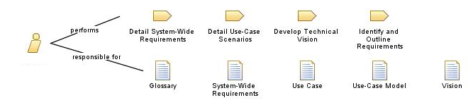
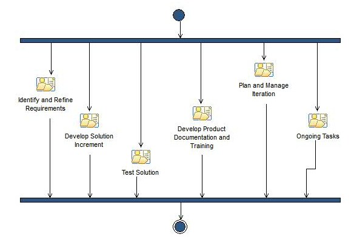
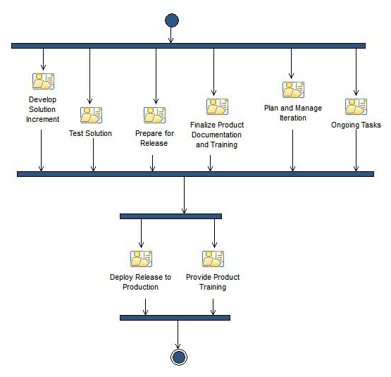
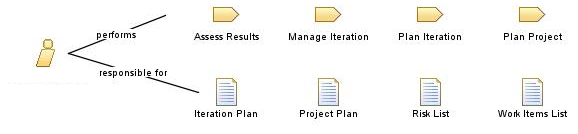
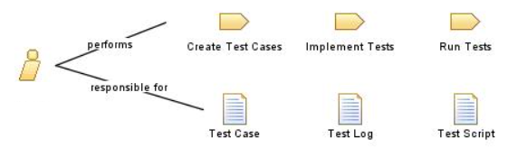

# Questionário - Aula 08 e Aula 09

### Questão 01 - Selecione a opção que designa propósito típico da fase de concepção no Processo Unificado.
**a. Definir arquitetura preliminar do sistema de software.**  
b. Distribuir entre clientes o sistema de software a ser posto em produção.  
c. Detalhar a maioria dos casos de uso.  
d. Realizar todos os casos de uso da versão sendo desenvolvida do sistema de software.

### Questão 02 - Selecione todas as opções que designam nomes de fases do ciclo de vida proposto no Processo Unificado de desenvolvimento de software.
**a. Transição.**  
b. Especificação de requisitos.  
**c. Concepção.**  
d. Projeto (design).  
e. Teste.  

### Questão 03 - Associe cada descrição a nome de fase de ciclo de desenvolvimento proposto no Processo Unificado.
Fase com os seguintes objetivos: desenvolver de modo iterativo sistema que possa migrar para comunidade de usuários; descrever requisitos remanescentes; complementar projeto (design), implementação e teste do sistema; disponibilizar versão beta do sistema; determinar se usuários estão prontos para implantação do sistema; minimizar custos e otimizar recursos. $\rightarrow$ **Construção**.  
Fase com os seguintes objetivos: garantir que sistema está pronto para entrega a usuários; realizar testes formais e beta com o propósito de avaliar se expectativas das partes interessadas (stakeholders) foram atendidas; corrigir defeitos e realizar melhorias; registrar informação acerca de lições aprendidas; melhorar processo e ferramentas usadas no projeto. $\rightarrow$ **Transição**.  
Fase com os seguintes objetivos: determinar visão geral, escopo e fronteiras do sistema; identificar as partes interessadas (stakeholders) no sistema; identificar critérios de sucesso do sistema; identificar principais funcionalidades do sistema; decidir quais são os requisitos críticos; determinar possível solução e avaliar se é tecnicamente viável; propor arquitetura candidata; propor estimativa geral de custo, cronograma e riscos associados ao projeto. $\rightarrow$ **Concepção**.  
Fase com os seguintes objetivos:  detalhar requisitos; projetar (design), implementar e testar arquitetura; projetar, implementar e testar arquitetura executável; reduzir riscos principais; melhorar precisão de cronograma e estimativa de custos; refinar e detalhar plano geral do projeto; prover base estável para maioria do esforço de desenvolvimento na próxima fase. $\rightarrow$ **Elaboração**.

### Questão 04 - Selecione todas as opções verdadeiras.
a. No Processo Unificado de Desenvolvimento de Software, cada fase pode conter várias iterações, o número de iterações em cada fase independe do tamanho e da natureza do projeto.  
**b. No Processo Unificado de Desenvolvimento de Software, cada ciclo de desenvolvimento é dividido em fases e termina com determinada versão do software.**  
**c. No Processo Unificado de Desenvolvimento de Software, nas fases ocorrem iterações e cada fase é concluída quando são alcançados determinados marcos (milestone).**  
**d. No Processo Unificado de Desenvolvimento de Software, é adotada a Unified Modeling Language (UML) na construção de modelos.**  
**e. O Processo Unificado de Desenvolvimento de Software recomenda que a equipe do projeto se concentre nos riscos mais críticos no início do ciclo de vida do projeto; resultados de cada iteração, especialmente na fase de elaboração, devem ser selecionados para garantir que os principais riscos sejam abordados primeiro.**

### Questão 05 - Selecione todas as opções verdadeiras acerca do Processo Unificado de desenvolvimento de software.
**a. Processo iterativo e incremental.**  
b. Processo que torna desnecessária a construção de modelo de casos de uso.  
**c. Processo genérico que pode ser configurado de acordo com o contexto.**  
d. Processo que suprime o desenho (design) de arquitetura de software.

### Questão 06 - Selecione opção que designa papel no Processo Unificado caracterizado pelo seguinte diagrama:

**a. Analista.**  
b. Desenvolvedor.  
c. Arquiteto.  
d. Testador.

### Questão 07 - Associe cada descrição ao termo que melhor a designa.
Fase que enfoca avaliação da viabilidade do desenvolvimento; identificação de escopo, entidades que interagirão com o software e casos de uso; descrição de casos de uso significativos; estabelecimento de critérios de sucesso; definição de recursos necessários e planejamento. $\rightarrow$ **Concepção**.  
Fase na qual o software migra para usuários; os usuários são treinados e lhes é provido suporte; sugestões dos usuários podem resultar em modificações; ao final dessa fase, é avaliado se o software atingiu os objetivos ou se é necessário um novo ciclo de desenvolvimento. $\rightarrow$ **Transição**.  
Fase que resulta no produto de software a ser entregue e na qual componentes de software são construídos e integrados; é avaliado se requisitos foram satisfeitos. $\rightarrow$ **Construção**.  
Fase na qual o domínio do problema é analisado; procura-se garantir que arquitetura, requisitos e planos estão estáveis; procura-se conhecer riscos, determinar custos e cronograma; é construído protótipo executável que realiza os casos de uso considerados mais críticos. $\rightarrow$ **Elaboração**.

### Questão 08 - Considerando o Processo Unificado (Unified Process), selecione toda opção que designa prática recomendada.
**a. Registrar informação acerca de requisitos de partes interessadas e gerenciar mudanças nos mesmos.**  
**b. Construir modelos com elementos gráficos para representar visões do software.**  
**c. Controlar qualidade do software com o propósito de garantir atendimento dos requisitos.**  
d. Adotar modelo de processo de desenvolvimento em cascata (waterfall) composto por quatro fases.  
**e. Estruturar sistema de software segundo arquitetura embasada em componentes.**

### Questão 09 - Selecione opção que designa fase do Processo Unificado caracterizada pelo seguinte diagrama:

a. Transição.  
b. Concepção.  
c. Elaboração.  
**d. Construção.** 

### Questão 10 - Selecione a opção que designa propósito típico da fase de transição no Processo Unificado.
a. Realizar casos de uso como propósito de avaliar arquitetura preliminar projetada para o sistema de software.  
b. Especificar a maioria dos casos de uso que caracterizam a versão sendo desenvolvida.  
c. Entrevistar partes interessadas (stakeholders) com o propósito de obter uma visão inicial dos requisitos do sistema de software.  
**d. Realizar testes envolvendo usuários do sistema de software.**

### Questão 11 - Selecione todas as opções que designam atividades de responsabilidade do papel gerente de projeto (project manager) no OpenUP.
a. Instalar e validar infraestrutura.  
**b. Gerenciar (manage) iteração.**  
**c. Planejar projeto.**  
d. Executar testes.

### Questão 12 - Selecione todas as opções que designam atividades de responsabilidade do papel desenvolvedor (developer) no OpenUP.
a. Identificar e esboçar (outline) requisitos.  
b. Conceber (envision) arquitetura de software.  
**c. Projetar (design) solução.**  
**d. Implementar (implement) solução.**

### Questão 13 - Selecione opção que designa fase do Processo Unificado caracterizada pelo seguinte diagrama:

a. Concepção.  
b. Construção.  
**c. Transição.**  
d. Elaboração.

### Questão 14 - Selecione opção que designa papel no Processo Unificado caracterizado pelo seguinte diagrama:

a. Desenvolvedor.  
b. Parte interessada (stakeholder).  
c. Analista.  
**d. Gerente de projeto.**

### Questão 15 - Selecione todas as opções que designam práticas relevantes no Processo Unificado de desenvolvimento de software.
**a. Gerenciar requisitos.**  
**b. Desenvolver software de modo iterativo.**  
**c. Controlar modificações ao software.**  
**d. Construir modelos com representações gráficas do software.**
e. Evitar uso de componentes quando do projeto (design) de arquitetura de software.

### Questão 16 - Selecione a opção que designa propósito típico da fase de construção no Processo Unificado.
a. Realizar teste beta do sistema de software.  
b. Elaborar modelo com casos de uso inicialmente identificados no ciclo de desenvolvimento.  
**c. Realizar casos de uso da versão do sistema de software sendo desenvolvida.**  
d. Projetar (design) arquitetura de software preliminar composta pelos principais subsistemas.  

### Questão 17 - Selecione a opção falsa acerca do OpenUP.
a. Provê descrições de papéis (roles) em projeto de software.  
**b. Divide ciclo de vida de projeto de software em duas fases.**  
c. Provê modelos (templates) que podem ser usados em projeto de software.  
d. Provê descrições de tarefas em ciclo de vida de software.

### Questão 18 - Selecione opção que designa papel (role) no Processo Unificado (Unified Software Development Process) caracterizado pelo seguinte diagrama:

**a. Testador (tester).**  
b. Arquiteto (architect).  
c. Desenvolvedor de curso (course developer).  
d. Dono de produto (product owner).

### Questão 19 - Selecione todas as opções verdadeiras acerca do Processo Unificado.
a. Processo deve ser adotado como descrito, não sendo possível configurá-lo quando adotado em real projeto de desenvolvimento de software.  
**b. Processo registra requisitos funcionais em casos de uso, que podem ser depois consultados em projeto (design), implementação e teste de software.**  
**c. Processo promove desenvolvimento iterativo, onde cada iteração é planejada, ocupa período de tempo e pode usar, criar ou modificar artefato.**  
**d. Processo enfoca arquitetura de software de modo a estruturar o software, minimizar riscos e organizar o desenvolvimento.**

### Questão 20 - Selecione opção que não informa nome de fase no OpenUP.
a. Transição.  
b. Elaboração.  
**c. Desenvolvimento.**  
d. Concepção.

### Questão 21 - Selecione todas as opções que designam atividades de responsabilidade do papel analista (analyst) no OpenUP.
a. Planejar projeto.  
**b. Desenvolver documento de visão técnica (vision).**  
c. Criar caso de teste.  
**d. Detalhar cenários de casos de uso.**

### Questão 22 - Considerando o Processo Unificado (Unified Process), associe cada descrição a nome de fase descrita.
Refinar projeto (design), construir entrega (release) do sistema que possa ser entregue para teste por usuários. $\rightarrow$ **Construção**.  
Finalizar documentação, treinar usuários, disponibilizar entrega (release) do sistema para uso em ambiente operacional. $\rightarrow$ **Transição**.  
Identificar e descrever requisitos, analisar e evoluir arquitetura candidata, construir arquitetura executável. $\rightarrow$ **Elaboração**.  
Identificar motivos para desenvolver sistema, definir objetivos e escopo do sistema, delinear arquitetura cadidata, identificar riscos. $\rightarrow$ **Concepção**.

### Questão 23 - Selecione a opção que designa propósito típico da fase de elaboração no Processo Unificado.
a. Treinamento de usuários finais do produto de software.  
b. Registro de visão preliminar do projeto de software por meio de documento de visão e escopo.  
c. Realização de teste beta com comunidade de usuários.  
**d. Projeto (design) e representação da arquitetura do sistema de software.**

### Questão 24 - Selecione todas as opções verdadeiras.
**a. São características do Processo Unificado de Desenvolvimento de Software: adoçao da Unified Modeling Language (UML) na construção de modelos; desenvolvimento guiado por casos de uso; foco na arquitetura de software; desenvolvimento iterativo e incremental.**  
b. O Processo Unificado de Desenvolvimento de Software reconhece a importância da comunicação com os interessados (stakeholders) e provê meios para descrição de requisitos funcionais e não funcionais; enfatiza o papel da arquitetura de software;  adota um modelo de processo em cascata.  
**c. No Open Unified Process (OpenUP), tarefas são definidas e decompostas em passos; a cada tarefa são associados papéis, entradas e saídas; as entradas e as saídas de tarefas são produtos do trabalho; cada papel descreve perfil de envolvido no processo de desenvolvimento.**  
**d. Existem diferentes arcabouços que apresentam características do Processo Unificado de Desenvolvimento de Software, por exemplo o Open Unified Process (OpenUP), onde encontram-se descrições de atividades executadas em iteração típica de cada fase, diagrama de atividades e informação sobre marcos.**  
**e. O Processo Unificado de Desenvolvimento de Software (Unified Software Development Process), também identificado pela sigla USDP, é um arcabouço (framework) para desenvolvimento de software que pode ser configurado para desenvolvimento de diversas classes de software.**

### Questão 25 - Selecione opção que designa papel no Processo Unificado caracterizado pelo seguinte diagrama:

**a. Analista.**  
b. Desenvolvedor.  
c. Arquiteto.  
d. Testador.
