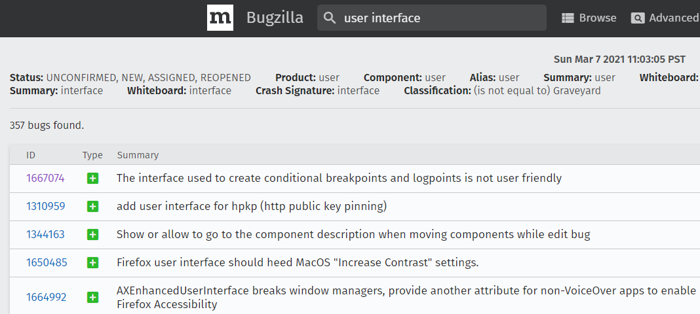

# Questionário - Aula 10 e Aula 11

### Questão 01 - Selecione todas as opções que designam elementos de infraestrutura relevantes em projeto de software aberto.
**a. Portal acessível por meio da Internet (web site).**  
**b. Listas de correio eletrônico e fóruns para troca de mensagens.**  
**c. Sistema para controle de versões (version control).**  
**d. Sistema para rastreamento de defeitos (bug tracking).**

### Questão 02 - Selecione toda opção verdadeira acerca de processo de manutenção em projeto de software aberto.
**a. Processo de manutenção pode ser integrado ao processo de desenvolvimento.**  
b. Processo de manutenção dispensa a participação de usuários do software.  
**c. Bugzilla é exemplo de ferramenta que pode ser usada para reportar defeito em artefato.**  
**d. Processo de desenvolvimento pode ser guiado por bugs reportados.**  
**e. Ferramenta para controle de versões é relevante em processo de manutenção.**

### Questão 03 - Selecione a opção falsa acerca de técnicas de projeto (design) em projeto de software aberto.
**a. Processo de refatoração (refactoring) tipicamente resulta em alteração de funcionalidade do software.**  
b. Projeto (design) de software pode adotar arquitetura de software previamente existente.  
c. Atividades de processo de refatoração (refactoring) podem ser executadas para promover modularização.  
d. Algumas decisões de projeto (design) são tomadas apenas quando problemas ocorrem.

### Questão 04 - Selecione a opção falsa acerca do controle de participação em projeto de software aberto.
a. Participação de desenvolvedores são gerenciadas durante o projeto.  
b. Modificações submetidas são avaliadas antes de integradas ao produto.  
c. Submissão de patch pode ser alternativa para submissão de contribuição.  
**d. Políticas de acesso são uniformes entre os diversos projetos de software.**

### Questão 05 - Selecione toda opção que designa característica de processo de desenvolvimento promovido por sistema de software com a seguinte tela:

**a. Processo onde atividades de manutenção são integradas ao processo de desenvolvimento.**  
**b. Processo onde ocorre manutenção corretiva e manutenção evolutiva.**  
c. Processo não iterativo que adota modelo de ciclo de desenvolvimento em cascata (waterfall model).  
**d. Processo que adota abordagem bug driven development.**

### Questão 06 - Selecione a opção falsa acerca de revisão em projeto de software aberto.
a. Existem projetos de software aberto nos quais são executadas atividades de processo de revisão.  
**b. Artefato resultante de projeto de software deve ser revisado só após se tornar grande e complexo.**  
c. Membros da comunidade de projeto de software podem executar atividades de revisão de artefato.  
d. Atividade de revisão pode ser executada antes da integração de código ao produto de software.

### Questão 07 - Selecione toda opção que identifica artefato típico em projeto de software aberto.
**a. Manual de usuário.**  
**b. Guia de instalação.**  
c. Modelo de casos de uso.  
**d. Guia de configuração.**  
**e. Padrão de codificação.**

### Questão 08 - Selecione a opção que designa característica do modelo de decisão centralizado em projeto de software aberto.
a. Todos membros do projeto podem ter o mesmo poder.  
**b. Atribuição da autoridade máxima ao indivíduo que atua como líder do projeto.**  
c. Ausência de níveis hierárquicos associados ao líder do projeto.  
d. Modificações tipicamente independem de opiniões do líder do projeto.

### Questão 09 - Selecione a opção que não designa fonte típica de requisitos em projeto de software aberto.
a. Produto de software similar ao que está sendo desenvolvido no projeto de software.  
**b. Modelo de análise de requisitos construído a partir de modelo de casos de uso.**  
c. Produto de software usado como ponto de partida do projeto de software.  
d. Protótipo de software usado como ponto de partida do projeto de software.

### Questão 10 - Selecione toda opção verdadeira acerca de processo de comunicação em projeto de software aberto (open source software project).
a. Meios de comunicação síncronos são usados e não são usados meios assíncronos uma vez que introduzem atrasos.  
**b. É relevante armazenar comunicação ocorrida de modo a possibilitar posterior acesso à informação comunicada.**  
**c. Sistemas que possibilitam trocas de mensagens podem ser relevantes no contexto de projeto de software.**  
**d. Listas de correio eletrônico e canais de internet relay chat (IRC) são usados em alguns projetos de software.**

### Questão 11 - Selecione a opção falsa acerca de portal de projeto no contexto de projeto de software aberto.
a. Portal de projeto pode ser usado em atividades de gerenciamento de projeto.  
b. Portal de projeto pode ser usado para disponibilizar diversos artefatos.  
**c. Portal de projeto não pode ser acessado via Internet por motivo de segurança.**  
d. Existem portais que hospedam diversos projetos de software aberto.  

### Questão 12 - Selecione toda opção verdadeira acerca de canal de comunicação em projeto de software aberto.
**a. Existem projetos de software aberto que disponibilizam canais para comunicação síncrona.**  
b. Troca de mensagem por meio de correio eletrônico é exemplo de comunicação síncrona.  
**c. Em projeto de software aberto é relevante armazenar informação acerca de comunicação ocorrida.**  
d. Em projeto de software aberto tipicamente é dada preferência à comunicação síncrona.

### Questão 13 - Selecione toda opção que designa característica do modelo de decisão por mérito em projeto de software aberto.
**a. Existem projetos de software aberto que adotam processo de decisão por mérito.**  
**b. Poder pode ser adquirido por meio da realização de contribuições ao projeto de software.**  
c. Tipicamente há um só líder ao longo da realização do projeto de software.  
d. Líder do projeto de software assume o papel de "ditador benevolente".  

### Questão 14 - Selecione toda opção verdadeira acerca de modelo para tomada de decisões em projeto de software aberto (open source software project).
**a. No modelo centralizado, autoridade pode ser centralizada em um indivíduo líder de projeto.**  
b. No modelo centralizado, modificações tipicamente não precisam ser aprovadas por líder de projeto.  
c. No modelo embasado em mérito, privilégio de voto tipicamente independe de contribuições realizadas por cada participante.  
**d. No modelo embasado em mérito, membros tem potencialmente o mesmo poder.**

### Questão 15 - Selecione a opção falsa acerca de características de processo de software aberto.
a. Desenvolvedores tipicamente não estão fisicamente próximos.  
b. Seleção de processos e ferramentas tipicamente não é por decisão unilateral.  
**c. Uma só organização tipicamente controla o projeto de software.**  
d. Melhorias podem decorrer de feedbacks providos por usuários.  

### Questão 16 - Selecione todas as opções que designam recursos frequentemente disponíveis em portal de projeto de software aberto.
**a. Fóruns para trocas de mensagens.**  
**b. Listas de correio eletrônico.**  
**c. Sistema para controlar versões de artefatos.**  
**d. Sistema para notificar bugs e disponibilizar informação acerca dos mesmos.**  
**e. Canais de chat (IRC).**  

### Questão 17 - Selecione todas as opções verdadeiras acerca do modelo de desenvolvimento de software aberto (open source).
**a. Quanto às ferramentas usadas em projetos de software aberto, cada projeto pode escolher quais usar. Existem ferramentas usadas em diferentes projetos. Na escolha de ferramenta, pode haver preferência por ferramenta que seja software aberto, facilite rápido desenvolvimento, possa ser acessada por navegador e tenha versões para diferentes plataformas.**  
b. Em projetos de software aberto, tipicamente são usados canais que possibilitam comunicação síncrona e não são usados canais que possibilitam comunicação assíncrona. Isso evita que informação comunicada precise ser registrada e também facilita a colaboração entre desenvolvedores que se encontrem geograficamente dispersos e trabalhando em diferentes fusos horários.  
**c. Existem projetos de software aberto que adotam processos de decisão embasados em desenvolvedor que assume o papel de ditador benevolente. Esse desenvolvedor age como árbitro e  tipicamente toma a decisão final quando não é possível consenso. Existem projetos de software aberto onde o ditador benevolente é o desenvolvedor fundador do projeto.**  
**d. Existem projetos de software aberto que adotam modelo similar a uma meritocracia. Nesses projetos, os direitos dos participantes decorrem de contribuições anteriormente realizadas. Direito de veto e direito de modificação do repositório do projeto são exemplos de direitos que podem ser adquiridos por participante do projeto.**

### Questão 18 -  Selecione opção verdadeira acerca de gerência de projeto de software aberto.
a. Gerência formal.  
**b. Gestão participativa.**  
c. Processo de seleção de ferramentas unilateral e sem participação da comunidade.  
d. Orçamento é sempre previamente definido.

### Questão 19 - Selecione todas as opções verdadeiras acerca do modelo de desenvolvimento de software aberto (open source).
**a. Em projetos de software aberto, produtos de software são tipicamente desenvolvidos por comunidades em linha (online). Poder e influência de cada membro da comunidade tipicamente depende das contribuições realizadas pelo mesmo. Na comunidade pode haver líder responsável por visão estratégica e tomar decisões finais acerca de quais contribuições são aceitas.**  
b. Em projetos de software aberto, códigos podem ser armazenados em repositórios controlados por sistema de controle de versão. Os códigos podem ser modificados por contribuições submetidas por desenvolvedores. Contribuições submetidas como patches não são revisadas, testadas e aprovadas antes de integradas ao código no repositório.  
**c. Em projetos de software aberto, podem existir portais que são usados, por membros da comunidade, como pontos de encontro. Por meio desses portais, tipicamente pode ser acessada informação variada acerca do projeto. Por exemplo, informação acerca de estado do projeto, participantes, atividades por realizar, solicitações de modificações, defeitos e códigos.**  
d. Em projetos de software aberto não é dada importância ao processo de modularização de software, uma vez que modularização resulta em arquitetura mais complexa, dificulta a concentração de cada desenvolvedor no entendimento de parte do software, dificulta o aprendizado gradual e a execução concorrente de atividades por parte dos desenvolvedores.

### Questão 20 - Selecione a opção falsa acerca de características de processo de software aberto.
a. Processo de desenvolvimento tipicamente enfatiza o refino iterativo e incremental.  
**b. Distribuição de versão de produto de software tipicamente ocorre apenas se a mesma estiver estável.**  
c. Ferramentas usadas em processo de desenvolvimento tipicamente são acessadas por meio de navegadores.  
d. Informação está tipicamente disponível às partes interessadas no produto de software.  

### Questão 21 - Selecione toda opção verdadeira acerca de canal de comunicação em projeto de software aberto.
**a. Listas de correio eletrônico podem ser usadas para segmentar tráfego de mensagens.**  
**b. Existem projetos de software aberto que disponibilizam diversos canais de chat para comunicação síncrona.**  
**c. Disponibilizar artefato com respostas a perguntas frequentes pode minimizar tráfego de mensagens.**  
**d. Correio eletrônico é canal de comunicação usado em diversos projetos de software aberto.**

### Questão 22 - Selecione a opção falsa acerca de processo de teste em projeto de software aberto.
a. Existem testes que podem ser automatizados.  
b. Podem ser usados frameworks para facilitar a construção de determinados testes.  
**c. Teste fumaça (smoke test) consiste de teste exaustivo de todas as funcionalidades do software.**  
d. Membros da comunidade tipicamente participam em processo de teste de software aberto.

### Questão 23 - Selecione toda opção que designa característica típica de projeto de software aberto (open source software project).
a. Desenvolvedores estão tipicamente localizados fisicamente próximos uns dos outros.  
b. Redução de tempo de entrega do software não é prioridade de projeto.  
**c. Desenvolvedor pode ser usuário final e melhoria pode decorrer de realimentação (feedback) provida por usuário.**  
**d. Projeto enfatiza melhorias incrementais e pode ocorrer distribuição instável mas operacional.**

### Questão 24 - Selecione a opção falsa acerca do processo de modularização em projeto de software aberto.
**a. Tem o intuito de possibilitar que cada desenvolvedor entenda detalhes do código do software.**  
b. Pode facilitar o aprendizado gradual por parte dos desenvolvedores.  
c. Pode facilitar a execução de atividades concorrentes no projeto de software.  
d. Relevante em projeto de software de grande porte

### Questão 25 - Selecione todas as opções que designam características frequentes de processos de desenvolvimento adotados em projetos de software aberto.
**a. Processo de desenvolvimento iterativo e incremental.**  
**b. Revisão de artefatos realizada por pares (peer review).**  
**c. Ênfase na realização de modificações pequenas e incrementais.**  
**d. Código revisado com o intuito de garantir aderência a estilos e padrões.**  
e. Toda contribuição de código (patch) resulta em modificação do repositório sem necessidade de aprovação prévia.

### Questão 26 - Selecione opção falsa acerca de projeto de software aberto.
a. Projeto pode ser desenvolvido por comunidade.  
b. Desenvolvedores podem estar geograficamente distribuídos.  
c. Aceso aos artefatos pode ocorrer por meio de portal de projeto.  
**d. Artefatos podem ser acessados apenas por gerentes de desenvolvimento.**

### Questão 27 - Selecione toda opção que designa atividade relevante ao sucesso de projeto de software aberto.
**a. Criar comunidade aberta e facilitar a comunicação entre integrantes da mesma.**  
**b. Definir processo para integração de mudanças realizadas ao código do produto de software.**  
**c. Adotar ambiente de desenvolvimento que promova a rápida construção de software.**  
**d. Entender expectativas dos envolvidos no projeto e identificar necessidades que o mesmo procura atender.**

### Questão 28 - Selecione todas as opções que designam características do modelo de gerenciamento embasado em mérito adotado em alguns projetos de software aberto.
**a. Poder é atribuído ao possibilitar escrita no repositório e veto a modificações submetidas por membros do projeto.**  
**b. Poder atribuído a membro do projeto tipicamente decorre da relevância das contribuições realizadas pelo membro.**  
c. Projeto de software fundado por um desenvolvedor que passa a ser o líder máximo do projeto.  
d. Repositório pode ser modificado por qualquer membro do projeto.  
e. Toda modificação precisa ser aprovada por desenvolvedor que assume o papel de líder máximo do projeto.

### Questão 29 - Selecione todas as opções que designam características do modelo de gerenciamento centralizado adotado em alguns projetos de software aberto.
**a. Líder do projeto de software tem autoridade para tomar decisões finais.**  
**b. Responsáveis por gerenciar projeto de software podem ocupar diferentes níveis hierárquicos.**  
c. Todos os membros do projeto de software tem o mesmo poder.
**d. Líder do projeto de software pode se comportar como ditador benevolente.**  
e. Contribuições dos membros do projeto de software não precisam ser aprovadas antes de integrarem o repositório.

### Questão 30 - Selecione a opção falsa acerca de documentação em projeto de software aberto.
a. Documentação de software pode ser desenvolvida de modo colaborativo.  
b. Documentação de código fonte pode ser publicada por meio ferramenta de software.  
c. Pode haver documentação de código não sincronizada com o código documentado.  
**d. Documentar software é desnecessário pois o desenvolvimento ocorre em comunidade.**
