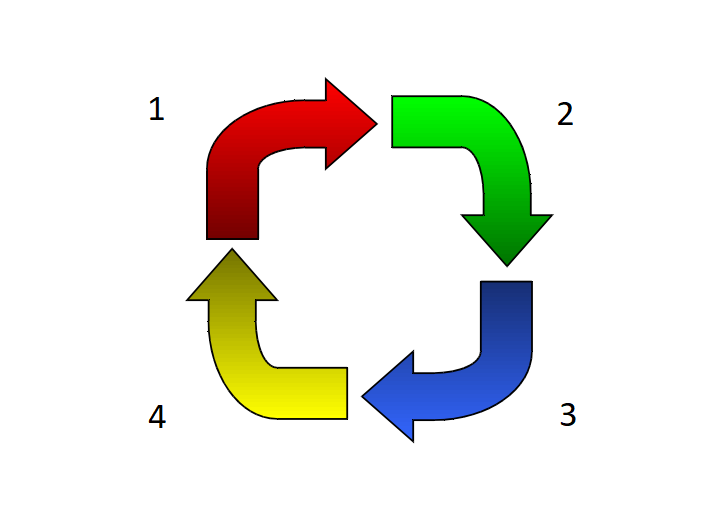

# Questionário - Aula 12 e Aula 13

### Questão 01 - Selecione todas as opções verdadeiras sobre Scrum.
**a. Scrum Team é uma equipe que deve ter capacidade de definir como melhor realizar o trabalho de modo iterativo e incremental.**  
**b. Um conjunto de eventos caracteriza o Scrum. por exemplo, Sprint, Sprint Planning, Daily Scrum, Sprint Review e Sprint Retrospective.**  
**c. Por meio de Sprint Backlog procura-se saber o trabalho a ser realizado e também monitorar o progresso do trabalho.**  
**d. Sprint Review é reunião ao final de Sprint com o intuito de avaliar o que foi feito no Sprint e adaptar Product Backlog.**  
**e. Sprint Retrospective é reunião entre Sprint Review e próximo Sprint Planning onde procura-se avaliar o último Sprint.**

### Questão 02 - Selecione toda opção que designa característica enfatizada na Programação Extrema (Extreme Programming).
a. Processo de desenvolvimento não incremental e redução da frequência de entregas (releases) de software.  
b. Minimização do envolvimento do cliente em processos presentes no desenvolvimento de software.  
**c. Posse coletiva do código promovida por técnicas como programação em pares (pair programming).**  
**d. Manutenção da simplicidade de projeto (design) e execução de atividades de refatoração (refactoring).**

### Questão 03 - Selecione todas as opções verdadeiras acerca de processo de teste adotado em Extreme Programming (XP).
**a. Adoção de abordagem denominada test-first, onde teste é construído antes do código a ser testado.**  
**b. Requisitos registrados em histórias de usuários são analisados quando de desenvolvimento de teste.**  
c. Processo prioriza execução manual dos testes com o propósito de evitar automação e uso de arcabouços (frameworks) de testes.  
d. Teste de aceitação realizado de modo incremental e desenvolvido sem participação de representante de partes interessadas (stakeholders).

### Questão 04 - Selecione a opção falsa acerca de elementos do arcabouço (framework) Scrum.
a. Sprint é janela de tempo na qual são executadas atividades que resultam em incremento ao produto.  
b. Plano de cada sprint é realizado por meio do evento denominado Sprint Planning.  
c. Sprint Goal é objetivo a ser alcançado por sprint.  
**d. Product Backlog é repositório contendo artefatos resultantes de sprint.**

### Questão 05 - Selecione todas as opções que designam princípios de métodos ágeis.
**a. Envolvimento de partes interessadas (stakeholders) no processo de desenvolvimento, avaliando iterações, provendo e priorizando requisitos.**  
**b. Desenvolvimento do software em incrementos e participação de partes interessadas (stakeholders) na definição de propósitos de incrementos.**  
**c. Reconhecimento de habilidades dos desenvolvedores, que podem estabelecer modos de trabalho sem processos serem rigidamente prescritos.**  
**d. Aceitação e reconhecimento de que os requisitos de software podem mudar, devendo projeto (design) de software acomodar as modificações.**  
**e. Priorização de simplicidade no projeto (design) do software e no processo de desenvolvimento, redução de complexidade onde for possível.**  
f. Prescrição detalhada de processos adotados no desenvolvimento e planejamento detalhado de cada iteração ainda no início do projeto.  
g. Extensiva documentação visando promover previsibilidade e facilitar manutenção quando da remoção de defeitos ou novos requisitos.  
h. Registro detalhado de requisitos por meio da construção de modelo de casos de uso ou de documento de especificação de requisitos.

### Questão 06 - Associe definição a termo que melhor designa o conceito definido no contexto do Scrum.
Evento que ocorre durante intervalo de tempo e no qual são executadas atividades que resultam em incremento ao produto. $\rightarrow$ **Sprint**.  
Evento de curta duração que é realizado diariamente no qual planeja-se o que será realizado e avalia-se progresso do trabalho. $\rightarrow$ **Daily Scrum**.  
Reunião realizada para avaliar o que foi feito em Sprint e adaptar Product Backlog. $\rightarrow$ **Sprint Review**.
Reunião onde avalia-se Sprint, identifica-se o que melhorar e cria-se plano para  melhorar processo de próximo Sprint. $\rightarrow$ **Sprint Retrospective**.

### Questão 07 - Selecione a opção falsa acerca de elementos do arcabouço (framework) Scrum.
a. Cada evento deve ter duração máxima e ocorrer em janela de tempo (time-box).  
b. Membros do Scrum Team devem colaborar na elaboração de plano de sprint.  
c. Capacidade de trabalho e competência são desejáveis aos membros do Scrum Team.  
**d. Development Team deve ser equipe de grande porte composta por dezenas de membros.**

### Questão 08 - Selecione a opção falsa acerca de teste na Programação Extrema.
a. Testes de unidade são desenvolvidos ao longo do desenvolvimento.  
b. Testes são executados em diferentes fases do desenvolvimento.  
**c. Teste de unidade é desenvolvido só após a codificação da unidade.**  
d. Teste funcional pode usar dados providos por parte interessada.

### Questão 09 - Selecione toda opção que designa princípio relacionado no manifesto para desenvolvimento ágil de software.
**a. Satisfazer cliente por meio de contínua entrega de produto de valor.**  
b. Mininizar comunicação face a face entre integrantes do projeto.  
c. Evitar interação entre representantes do cliente e desenvolvedores.  
d. Reduzir frequência de entregas e alongar prazos entre entregas.   
**e. Priorizar simplicidade e ser receptivo a solicitações de modificações.**

### Questão 10 - Selecione todas as opções verdadeiras acerca de Extreme Programming (XP).
**a. Processo onde desenvolvimento incremental é promovido por meio de frequentes entregas (releases) do software sendo desenvolvido.**  
**b. Requisitos registrados em histórias de usuários, que são usadas quando da definição de quais funcionalidades incluir nos incrementos.**  
**c. Representante de partes interessadas (stakeholders) participa do processo de desenvolvimento, por exemplo, na definição de teste de aceitação.**  
**d. Promoção de pessoas e não processos por meio de programação em pares, posse coletiva do código e redução de longos períodos de trabalho.**  
**e. Entrega (release) e integração frequente de software, adoção de abordagem test- first, refatoração para minimizar perda de qualidade de código.**  
f. Despreocupação com simplicidade de projeto (design) de software e realização de projeto que contemple todos os possíveis futuros cenários.

### Questão 11 - Selecione todas as opções que designam dificuldades à adoção de processo ágil.
**a. Necessidade de documentação para manutenção futura do software.**  
**b. Projeto de software que requer equipe com muitos desenvolvedores.**  
**c. Frequente substituição de membros da equipe de desenvolvimento.**  
**d. Dificuldade de envolvimento do cliente ao longo do desenvolvimento.**

### Questão 12 - Selecione todas as opções que designam princípios do manifesto ágil.
**a. Entregar software frequentemente.**  
**b. Manter ritmo estável de desenvolvimento.**  
**c. Promover simplicidade.**  
d. Minimizar interação entre desenvolvedores e partes interessadas.  
**e. Promover auto-organização de equipes integrantes do projeto.** 

### Questão 13 - Selecione todas as opções verdadeiras acerca de história de usuário (user story).
a. Primariamente usada para descrever requisito não funcional.  
**b. Deve ser possível estimar o esforço de implementação.**  
**c. Deve ser possível o teste.**  
d. Deve ser escrita por desenvolvedor sem requerer participação de cliente.

### Questão 14 - Associe definição a termo que melhor designa o conceito definido no contexto do Scrum.
Artefato no qual se encontra listado o que é requerido do produto sendo desenvolvido no projeto. $\rightarrow$ **Product Backlog**.  
Artefato que inclui itens selecionados de Product Backlog, plano para entrega de incremento ao produto e atingir Sprint Goal. $\rightarrow$ **Sprint Backlog**.  
Pessoa responsável por maximizar o valor do produto e por gerir Product Backlog. $\rightarrow$ **Product Owner**.  
Pessoa responsável por prover suporte na adoção do arcabouço (framework) Scrum. $\rightarrow$ **Scrum Master**.

### Questão 15 - Selecione todas as opções que designam princípios de processos ágeis.
a. Redução da comunicação oral.  
**b. Promoção da colaboração entre desenvolvedores.**  
**c. Promoção do desenvolvimento incremental.**  
d. Equipes com grande número de desenvolvedores.  
e. Equipes compostas por desenvolvedores geograficamente dispersos (em diferentes locais).

### Questão 16 - Selecione a opção falsa acerca do processo de planejamento na Programação Extrema.
**a. Planejamento detalhado de todo o projeto deve ser realizado no início do projeto.**  
b. História de usuário (user story) é considerada quando do planejamento.  
c. Planejamento de iterações ocorre durante a realização do projeto.  
d. Participação do cliente é incentivada quando do planejamento. 

### Questão 17 - Selecione toda opção verdadeira acerca da programação em pares (pair programming).
**a. Promove controle da qualidade por meio da revisão do código (code review).**  
**b. Promove posse coletiva e responsabilidade coletiva pelo código do software.**  
**c. Promove suporte ao processo de refatoração (refactoring) do código do software.**  
d. Programadores de cada par não podem ser trocados durante o desenvolvimento do software

### Questão 18 - Selecione todas as opções que designam características da Programação Extrema.
**a. Enfatiza a frequente integração de software.**  
b. Enfatiza a construção de modelo de casos de uso.  
**c. Enfatiza a realização de refatoração (refactoring).**  
d. Desencoraja mover pessoal entre atividades.

### Questão 19 - Considerando a seguinte representação de ciclo na Programação Extrema (Extreme Programming) seleciona a opção que atribui nomes corretos aos números:

a. 1 - Escutar, 2 - Codificar, 3 - Desenvolver teste, 4 - Refatorar código.    
b. 1 - Escutar, 2 - Codificar, 3 - Projetar testes, 4 - Executar testes.  
**c. 1 - Escutar, 2 - Desenvolver teste, 3 - Codificar, 4 - Refatorar código.**  
d. 1 - Especificar requisitos, 2 - Projetar, 3 - Implementar, 4 - Testar.  

### Questão 20 - Selecione todas as opções verdadeiras sobre Programação Extrema (Extreme Programming).
**a. Uma vez determinado o escopo da próxima versão, o cliente seleciona histórias de usuário para a próxima versão.**  
**b. As histórias de usuário mais relevantes são realizadas primeiro.**  
**c. A escolha das histórias de usuário deve considerar os seus custos.**  
d. Planejamento é inicialmente detalhado para todo o projeto e enfoca o tempo a ser gasto em cada história de usuário.  
e. Cada iteração tipicamente dura mêses; o planejamento de cada iteração deve ser cumprido e atualizado a cada iteração.

### Questão 21 - Selecione todas as opções que designam características típicas de processos ágeis.
**a. Descrições de necessidades dos usuário por meio de histórias de usuários (user story).**  
**b. Estimativas de prazos por meio da análise de histórias de usuários (user story).**  
**c. Frequente integração e realização de entregas, colocação do software em produção em curto espaço de tempo.**  
d. Cliente decide prazos e escopos das entregas, cliente participa do desenvolvimento.  
**e. Manutenção de ritmo de trabalho previsível, mensurável e sustentável.**

### Questão 22 - Selecione todas as opções que designam características da Programação Extrema.
**a. Incentivo à programação por duplas (pair programming).**  
**b. Incentivo à propriedade coletiva do código do software.**  
**c. Incentivo à simplicidade do projeto (design) do software.**  
d. Incentivo à implementação de requisitos funcionais ainda não requeridos.  
e. Incentivo ao desenvolvimento guiado por teste (test driven development).

### Questão 23 - Selecione toda opção que designa prática sugerida no método Extreme Programming (XP).
**a. Planejamento incremental.**  
**b. Integração contínua e disponibilização de pequenas entregas (releases).**  
**c. Projeto (design) simples e ênfase em processo de refatoração.**  
**d. Propriedade coletiva e programação em pares (pair programming).**  
e. Ênfase na construção de modelos e desenvolvimento guiado por casos de uso.
