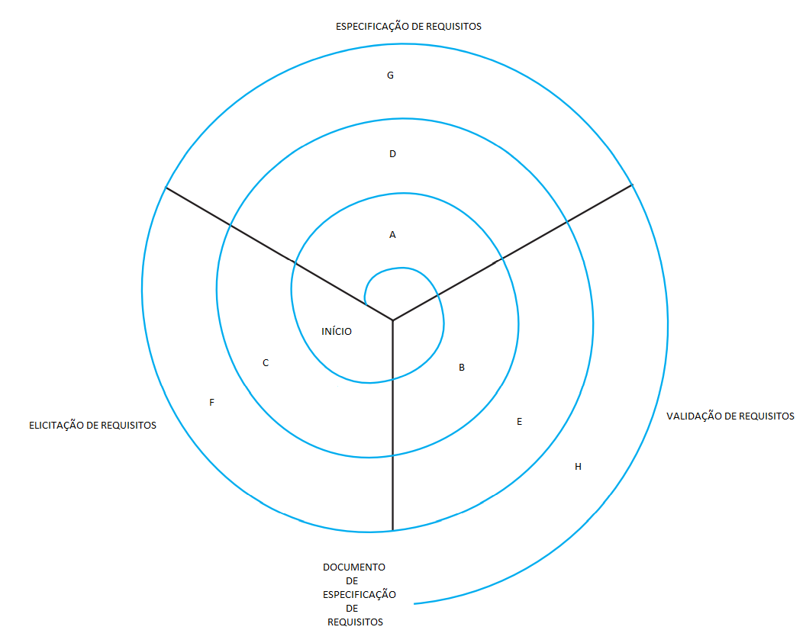

# Questionário - Aula 14

### Questão 01 - Selecione toda opção que identifica princípio da especificação de requisito.
**a. Reduzir duplicações e inconsistências.**   
**b. Reduzir riscos por meio de processo iterativo e incremental.**   
c. Enfocar aspectos relativos ao projeto (design) de software.  
d. Evitar participação de usuário.

### Questão 02 - Selecione todas as opções que designam atividades integrantes de processo de elicitação e análise de requisitos.
**a. Classificação e organização de requisitos.**   
**b. Priorização e negociação de requisitos.**   
**c. Descoberta de requisitos.**  
d. Projeto (design) e registro de arquitetura de software.

### Questão 03 - Associe cada definição ao termo que melhor designa o conceito definido.
Propriedade de software (software capability) necessitada por usuário para resolver problema ou para atingir objetivo. $\rightarrow$ **Requisito de software**.  
Período de ciclo de desenvolvimento de software no qual requisitos são definidos, documentados e revisados. $\rightarrow$ **Fase de requisitos de software**.  
Requisito que especifica função que software ou que componente de software deve executar. $\rightarrow$ **Requisito funcional**.  
Disciplina que enfoca a análise e a documentação de requisitos de software. $\rightarrow$ **Engenharia de requisitos de software**.  
Processo por meio do qual adquirente e fornecedor de software descobrem, revisam, articulam, entendem e documentam requisitos. $\rightarrow$ **Elicitação de requisitos**.  
Processo que enfoca planejamento e controle da identificação e alocação de requisitos de software. $\rightarrow$ **Gerenciamento de requisitos de software**.  
Restrição a serviço ou a função que é executada por software ou por componente de software. $\rightarrow$ **Requisito não funcional**.  
Processo por meio do qual requisitos de software são estudados e refinados. $\rightarrow$ **Análise de requisitos**.

### Questão 04 - Selecione a opção que designa artefato com os seguintes elementos na sua estrutura:

- Prefácio.
- Introdução (propósito, convenções, escopo do produto etc.).
- Glossário de termos usados no documento.
- Expecificação de requisitos de interfaces externas (interfaces com usuários, interfaces de software, interfaces de hardware etc.).
- Especificação de requisitos de usuários.
- Especificação de requisitos de sistema.
- Especificação de outros requisitos.
- Apêndices.

a. Caso de teste.   
b. Plano de projeto.   
c. Especificação de caso de uso.   
**d. Especificação de requisitos de software (software requirements specification).**

### Questão 05 - Selecione a opção falsa acerca de requisito de software.
a. Requisitos podem variar entre domínios de aplicação do software.  
b. Requisito pode informar acerca de atributo de qualidade do software.  
**c. Todo requisito de software decorre de necessidade de usuário do software.**  
d. Requisito pode informar acerca de funcionalidade a ser provida por software.

### Questão 06 - Selecione toda opção que designa requisito observável em tempo de execução.
**a. Desempenho.**  
b. Portabilidade.  
c. Manutenibilidade.  
**d. Funcionalidade.**

### Questão 07 - Selecione todas as opções que designam possíveis usuários de documento de especificação de requisitos.
**a. Engenheiros responsáveis por desenvolvimento de sistema.**  
**b. Partes interessadas em sistema (stakeholders).**  
**c. Engenheiros responsáveis por manutenção de sistema.**  
**d. Engenheiros responsáveis por teste de sistema.**

### Questão 08 - Selecione a opção falsa acerca de requisito de software.
a. Pode informar capacidade necessária para resolver problema.  
b. Pode informar funcionalidade a ser provida por software.  
**c. Requisito de software não pode ser abstrato ou intangível.**  
d. Pode informar característica a ser possuída por software.

### Questão 09 - Selecione todas as opções verdadeiras acerca de requisito.
**a. Restrições e condições podem estar associadas a um determinado requisito.**  
**b. Pode designar uma capacidade a ser atendida ou a ser possuída por sistema.**  
**c. Pode ser especificado por meio de padrão (standard) ou de outro documento.**  
**d. Pode ser informado por meio de enunciado que traduz ou expressa necessidade.**

### Questão 10 - Considerando a seguinte representação de processos em engenharia de requisitos, associe nome de processo à letra que melhor o posiciona no diagrama.

Especificação de requisitos de negócio - **A**,  
Especificação e modelagem de requisitos de sistema - **G**,  
Elicitação de requisitos de sistema - **F**,  
Estudo de viabilidade - **B**,  
Elicitação de requisitos de usuário - **C**,    
Especificação de requisitos de usuário - **D**,  
Prototipação - **E**,  
Revisão - **H**.

### Questão 11 - Selecione todas as opções verdadeiras acerca de requisito de software.
a. Segurança e confiabilidade são requisitos funcionais.  
**b. Mercado alvo é requisito relacionado ao negócio.**  
**c. Custo de desenvolvimento é requisito relacionado ao negócio.**  
d. Portabilidade é requisito só observável em tempo de execução.

### Questão 12 - Selecione toda opção que designa processo em Engenharia de Requisitos.
**a. Análise de requisitos.**  
**b. Especificação de requisitos.**  
c. Projeto de arquitetura de software.  
**d. Levantamento (coleta) de requisitos.**

### Questão 13 - Selecione todas as opções verdadeiras acerca de requisito de software.
**a. Tempo médio entre falhas (MTBF) é possível métrica de requisito não funcional relacionado à confiabilidade.**  
**b. Tempo requerido para treinamento é possível métrica de requisito não funcional relacionado à facilidade de uso.**  
**c. Transações processadas por unidade de tempo é possível métrica de requisito não funcional relacionado à velocidade.**  
**d. Percentual de eventos que causam falhas é possível métrica de requisito não funcional relacionado à robustez.**

### Questão 14 - Selecione toda opção que designa requisito primariamente observado em tempo de execução.
**a. Funcionalidade.**  
b. Reúso.  
**c. Desempenho (performance).**  
d. Portabilidade.

### Questão 15 - Selecione toda opção verdadeira acerca de elementos relativos à especificação de requisitos.
a. Apenas requisito funcional pode ser informado em documento de especificação de requisitos.  
b. Documento de visão e escopo tem propósito de descrever detalhadamente cada requisito de software.  
**c. Documento de visão e escopo pode prover informação acerca de escopo, objetivo, duração e custos.**  
**d. Regra de negócio pode prover informação acerca de condição requerida na condução de negócio.**

### Questão 16 - Selecione opção que designa artefato cuja construção resulta das seguintes atividades:

- Explorar problema a ser resolvido.
- Identificar causa primária do problema a ser resolvido.
- Formular enunciado acerca do problema a ser resolvido.
- Descrever objetivos do sistema usando termos que sejam entendidos por pessoal não técnico.
- Listar partes interessadas (stakeholders).
- Identificar e registrar informação acerca de fronteiras do sistema.
- Identificar e registrar informação acerca de requisitos funcionais e não funcionais.
- Verificar se os requisitos são necessários e se não existem conflitos entre os mesmos.

a. Glossário de termos.  
**b. Documento de visão e escopo.**  
c. Plano de iteração.  
d. Documento de descrição de caso de uso.

### Questão 17 - Selecione todas as opções verdadeiras acerca de requisito de software.
a. Requisito organizacional consiste de classe de requisito funcional, consiste de requisito que especifica restrição ao comportamento do produto de software.  
**b. Requisito externo é classe de requisito não funcional que engloba requisitos derivados de fatores externos ao sistema e ao processo de desenvolvimento do sistema.**  
**c. Requisitos éticos, legais, regulatórios, acerca de confiabilidade, segurança ou confidencialidade, são exemplos de requisitos não funcionais de sistema.**  
d. Requisito de produto consiste de classe de requisito funcional, é requisito derivado de política e procedimento da organização desenvolvedora do software.

### Questão 18 - Selecione opção falsa acerca de processo de levantamento de requisito.
a. Pode ser realizara reunião com participação de partes interessadas (stakeholders).  
b. Pode ser realizada entrevista com usuário.  
**c. Protótipo construído em levantamento de requisito deve enfocar detalhes pois não pode ser descartado.**  
d. Podem existir diversas fontes de requisitos.

### Questão 19 - Selecione a opção que não designa processo de requisito.
a. Análise de requisito.  
b. Levantamento de requisito.  
c. Especificação de requisito.  
**d. Projeto (design)  de arquitetura.**

### Questão 20 - Associe a cada definição o termo que melhor designa o conceito definido.
Requisito que especifica restrição à codificação ou construção de sistema ou componente de sistema. $\rightarrow$ **Requisito de implementação**.  
Requisito que especifica função que sistema ou componente de sistema deve provêr. $\rightarrow$ **Requisito funcional**.   
Subconjunto dos requisitos de usuário, composto por requisitos que especificam aquilo que o sistema deve fazer em termos de tarefas e serviços. $\rightarrow$ **Requisito funcional de usuário**.  
Requisito que especifica atributo de qualidade que influencia sucesso de sistema de software, e não serviço que o sistema proverá. $\rightarrow$ **Requisito não funcional**.

### Questão 21 - Associe cada descrição de requisito de software a uma classe de requisito de software.
Software deve verificar se aluno atende aos pré-requisitos antes de registrar o aluno em curso. $\rightarrow$ **Requisito funcional**.  
Software deve possibilitar que hóspedes avaliem qualidade de serviços providos pelo hotel. $\rightarrow$ **Requisito funcional**.  
Software deve possibilitar cadastramento, edição e descadastramento de cursos ofertados. $\rightarrow$ **Requisito funcional**.  
Software deve poder ser usado por advogados após treinamento que dure até cinco dias. $\rightarrow$ **Requisito não funcional**.  
Software deve possibilitar controle de sua qualidade por meio de teste de unidade (unit test). $\rightarrow$ **Requisito não funcional**.  
Software deve responder a cada solicitação de serviço em tempo máximo de dois segundos. $\rightarrow$ **Requisito não funcional**.  
Software deve possibilitar listar pacientes com consultas marcadas com médicos da clínica. $\rightarrow$ **Requisito funcional**.  
Software deve ser desenvolvido por projeto onde seja adotado processo ágil de desenvolvimento. $\rightarrow$ **Requisito não funcional**.

### Questão 22 - Selecione todas as opções que designam atividades em processo de gerenciamento de modificações de requisitos.
**a. Estimativa de custo de modificação solicitada.**  
**b. Análise de problema relativo a requisito e especificação de modificação.**  
**c. Implementação de modificação solicitada.**  
**d. Análise de modificação solicitada.**

### Questão 23 - Associe cada relação de atividades a nome de processo caracterizado pelas atividades relacionadas.
Elicitar, analisar, validar e gerenciar requisitos. $\rightarrow$ **Engenharia de requisitos**.  
Identificar requisitos, definir mapeamentos entre requisitos, avaliar impactos de modificações de requisitos e implementar modificações de requisitos. $\rightarrow$ **Gerenciamento de requisitos**.  
Descobrir requisitos, classificar e organizar requisitos, priorizar e negociar requisitos, especificar requisitos. $\rightarrow$ **Elicitação e análise de requisitos**.  
Prototipar, gerar casos de teste, revisar requisitos para verificar se os mesmos definem o sistema que as partes interessadas (stakeholders) requerem. $\rightarrow$ **Validação de requisitos**.
