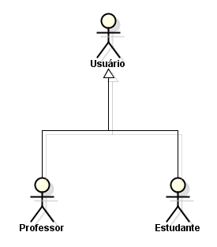
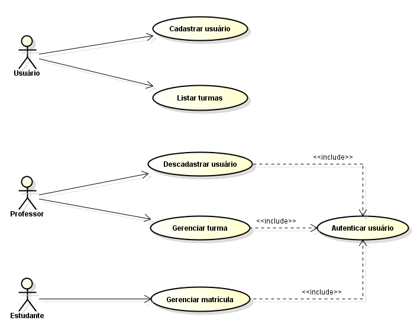
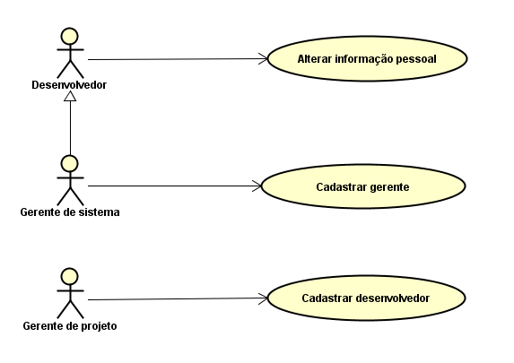
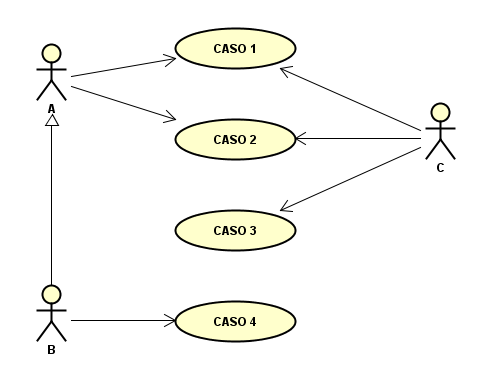
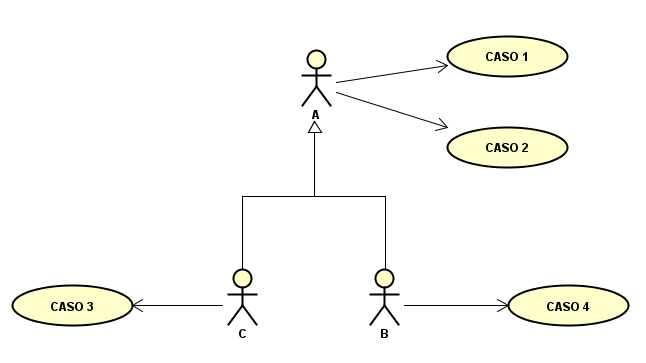
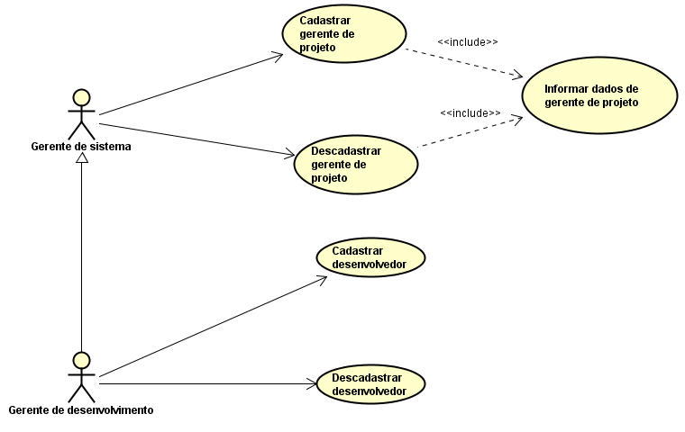

# Questionário - Aula 15

### Questão 01 - Selecione toda opção verdadeira acerca de elementos em modelo de caso de uso.
**a. Pode ocorrer relacionamento de inclusão entre casos de uso.**  
**b. Em hierarquia de atores podem ser herdados relacionamentos entre atores e casos de uso.**  
**c. Caso de uso pode prover informação acerca de diferentes trajetos de interação.**  
d. Propósito primário de cada caso de uso é descrever requisito não funcional.  
**e. Ator representa elemento que interage com sistema.**

### Questão 02 - Selecione todas as opções verdadeiras acerca de modelo de casos de uso.
**a. Relacionamento de inclusão entre casos de uso pode ser usado para evitar texto duplicado em diferentes casos de uso.**   
b. Modelo de casos de uso resulta principalmente de atividades em processo de projeto (design) e descreve como o sistema de software deve ser construído.  
**c. Caso de uso pode registrar informação acerca de requisito funcional de sistema, especificação de caso de uso pode ser narrativa acerca de funcionalidade provida por sistema de software.**     
d. Em modelo de casos de uso, ator pode representar grupo de usuários mas não outro sistema de software.

### Questão 03 - Selecione todas as opções verdadeiras considerando os seguintes diagramas integrantes de modelo de casos de uso:
Diagrama 1  

 
Diagrama 2  

a. O caso de uso Autenticar usuário inclui os casos de uso Descadastrar usuário, Gerenciar turma e Gerenciar matrícula.  
**b. Os atores Professor e Estudante herdam relacionamentos entre o ator Usuário e casos de uso.**  
c. Não existem relacionamentos entre o ator Professor e os casos de uso Cadastrar usuário e Listar turmas.  
**d. Os atores Professor e Estudante consistem de especializações do ator Usuário.**

### Questão 04 - Selecione opção que designa artefato cuja construção resulta das seguintes atividades:

- Escolher nome que seja único, significativo e não ambíguo para a interação descrita.
- Descrever propósito primário da interação descrita.
- Relacionar partes interessadas no serviço provido por meio da interação descrita.
- Especificar pré-condições.
- Descrever fluxo principal de ações.
- Descrever possíveis fluxos alternativos de ações.
- Verificar ser informação registrada em cada fluxo é correta, completa e consistente.
- Especificar pós-condições.

a. Documento de visão e escopo.  
**b. Documento de descrição de caso de uso.**  
c. Documento de especificação de requisitos de software (software requirements specification).  
d. Plano de projeto.  

### Questão 05 - Selecione toda opção verdadeira considerando o seguinte diagrama integrante de modelo de casos de uso:

**a. Desenvolvedor, Gerente de sistema e Gerente de projeto são atores.**  
b. Gerente de sistema é generalização de Desenvolvedor, enquanto Desenvolvedor é especialização de Gerente de Sistema.  
c. Existe relacionamento hierárquico entre Desenvolvedor e  Gerente de projeto.  
**d. Relacionamento entre Desenvolvedor e Alterar informação pessoal é herdado por Gerente de sistema.**

### Questão 06 - Selecione todas as opções verdadeiras considerando os seguintes diagramas de casos de uso.
Diagrama 1  

Diagrama 2  

**a. Diagramas podem integrar modelos nos quais é registrada informação sobre requisitos funcionais.**  
b. Apenas no diagrama 1 o ator C  está relacionado aos casos de uso denominados CASO 1 e CASO 2.  
c. No diagrama 1 e no diagrama 2, o ator A herda relacionamento entre ator B e caso de uso CASO 4.  
**d. Diagramas podem integrar modelos construídos em processo voltado à especificação de requisitos.**

### Questão 07 - Selecione toda opção verdadeira acerca do seguinte diagrama integrante de modelo de caso de uso.

**a. Existe relacionamento entre ator Gerente de desenvolvimento e caso de uso Cadastrar gerente de projeto.**  
b. Existe relacionamento entre ator Gerente de sistema e caso de uso Cadastrar desenvolvedor.  
c. Ator Gerente de Sistema herda relacionamentos entre Gerente de desenvolvimento e casos de uso.  
**d. Existem casos de uso que compartilham fluxo de interação.**
