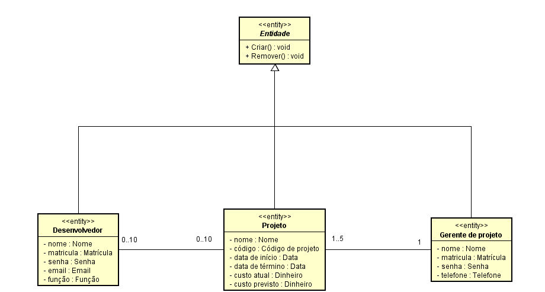
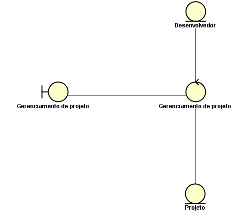
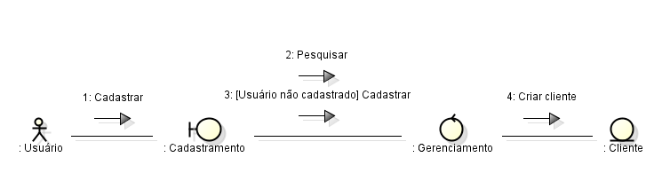
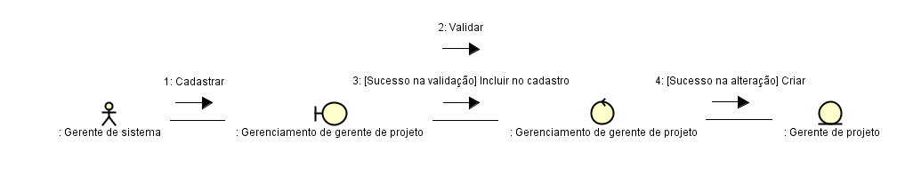
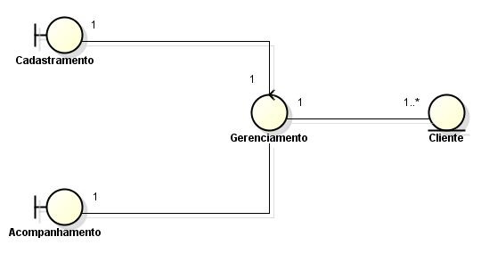

# Questionário - Aula 16

### Questão 01 - Selecione a opção falsa acerca de classe entidade (entity) em modelo de análise de requisitos.
a. Classe entidade pode modelar dado persistente.  
**b. Classe entidade pode conter atributo mas não comportamento relacionado ao dado representado.**  
c. Classe entidade pode estar relacionada a classe controladora (controller).  
d. Podem existir diversas classes entidade em modelo de análise de requisitos.

### Questão 02 - Selecione toda opção verdadeira acerca do seguinte diagrama integrante de modelo de análise de requisitos.

**a. No diagrama tem-se associação entre classe Desenvolvedor e classe Projeto.**  
**b. Na classe Projeto tem-se atributos privados.**  
**c. No diagrama tem-se relacionamento de herança entre classe Projeto e classe Entidade.**  
**d. A classe Desenvolvedor herda Criar e Remover.**  
e. A cada instância de Gerente de projeto só pode estar ligada (linked) uma instância de Projeto.

### Questão 03 - Selecione a opção falsa acerca do seguinte diagrama integrante de modelo de análise de requisitos.

**a. No diagrama tem-se herança entre classes.**   
b. No diagrama tem-se duas classes entidade (entity class).  
c. No diagrama tem-se associações entre classes.  
d. No diagrama tem-se classe fronteira (boundary class).

### Questão 04 - Selecione toda opção verdadeira acerca de classe controladora (controller) em modelo de análise de requisitos.
**a. Pode representar processamento que requer interação entre objetos em sistema de software.**  
**b. Pode representar cálculos complexos.**  
**c. Pode representar coordenação e controle entre objetos em sistema de software.**  
**d. Pode representar processo descrito em caso de uso.**

### Questão 05 - Selecione a opção falsa acerca de análise de requisitos.
a. Pode construir modelo composto por elementos que representem o mundo real.  
b. Pode enfocar analise, refino e estruturação de requisitos.  
**c. Procura construir modelo de projeto (design) do software.**  
d. Procura identificar e eliminar omissões presentes em especificação de requisitos.

### Questão 06 - Selecione todas as opções verdadeiras considerando o seguinte diagrama resultante de processo de análise de requisitos:

a. No diagrama, são representadas classes, associações entre classes e mensagens trocadas entre classes.  
**b. No diagrama, são representadas interações entre objetos, interações requeridas em cenário de uso do sistema.**  
**c. No diagrama, são representadas ligações (links) entre objetos e mensagens trocadas entre objetos.**  
d. Entre os elementos no diagrama, tem-se representação de classe de ator, denominada Usuário.

### Questão 07 - Selecione todas as opções verdadeiras acerca de modelo de análise de requisitos (analysis model).
**a. Modelo de análise de requisitos, construído segundo o paradigma de desenvolvimento orientado a objetos, pode conter diagramas onde são representadas classes e relacionamentos entre classes, pode também conter diagramas onde são representados objetos, ligações (links) entre objetos e mensagens entre objetos.**  
**b. Em modelo de análise de requisitos, construído segundo o paradigma de desenvolvimento orientado a objetos, classe em modelo de análise pode ter maior granularidade do que classe em modelo de projeto, e pode existir classe em modelo de análise que seja mapeada para mais de uma classe em modelo de projeto.**  
**c. Em processo de desenvolvimento de software, onde modelo de casos de uso tenha sido construído quando de processo de especificação de requisitos, modelo de análise de requisitos pode ser construído por meio da realização de casos de uso, cada realização de caso de uso pode ser descrita por meio de textos e diagramas.**  
d. Em modelo de análise de requisitos, construído segundo o paradigma de desenvolvimento orientado a objetos, cada classe presente no modelo de análise de requisitos corresponde a só uma classe presente em código, cada classe presente em modelo de análise de requisitos representa classe também presente em código.

### Questão 08 - Selecione toda opção verdadeira acerca de modelo de análise de requisitos.
**a. Procura facilitar entendimento e evolução de requisitos.**  
**b. Procura especificar de forma precisa os requisitos.**  
**c. Pode ser usado quando de projeto (design) de software.**  
**d. Pode ser usado quando de implementação de software.**

### Questão 09 - Selecione toda opção verdadeira acerca do seguinte diagrama integrante de modelo de análise de requisitos.

**a. No diagrama tem-se instância de classe de fronteira (boundary class).**  
**b. No diagrama não são informados nomes de objetos.**  
**c. No diagrama tem-se ligação (link) entre instância de classe controladora (controller class) e instância de classe entidade (entity class).**  
d. Mensagem Incluir no cadastro é enviada em qualquer cenário.  
**e. No diagrama são informadas condições de guarda (guard condition).**

### Questão 10 - Selecione a opção falsa acerca de classe fronteira (boundary class) em modelo de análise de requisitos.
**a. Propósito primário de classe fronteira é representar dado persistente em sistema de software.**  
b. Classe fronteira é associada a um ou mais atores.  
c. Propósito relevante de classe fronteira é prover informação acerca de interação entre sistema de software e ator.  
d. Podem existir diversas classes de fronteira em modelo de análise de requisitos.

### Questão 11 - Selecione todas as opções verdadeiras considerando o seguinte diagrama resultante de processo de análise de requisitos:

**a. Classe Cliente pode corresponder a entidade encontrada no domínio de aplicação do sistema de software.**  
**b. Classe Gerenciamento pode ser responsável por processamento que requer coordenação e interação entre objetos.**  
c. Cada instância da classe Cliente pode estar ligada (linked) a diversas instâncias da classe Gerenciamento.  
**d. Classe Cadastramento pode modelar interação entre ator e sistema de software, pode representar um ou mais formulários.**

### Questão 12 - Selecione todas as opções verdadeiras acerca de modelo de análise de requisitos (analysis model).
**a. Em modelo de análise de requisitos, construído segundo o paradigma de desenvolvimento orientado a objetos, classe entidade (entity class) consiste de classe cuja principal finalidade é representar informação, a informação representada pode requerer persistência e a classe pode representar abstração de entidade no negócio.**  
b. Em modelo de análise de requisitos, construído segundo o paradigma de desenvolvimento orientado a objetos, classe controladora (controller class) consiste de classe cuja principal responsabilidade é modelar interação que ocorre entre software e ator, classe controladora tipicamente representa abstração de tela ou formulário.  
**c. Em modelo de análise de requisitos, construído segundo o paradigma de desenvolvimento orientado a objetos, pode existir representação de classe caracterizada como classe fronteira (boundary class), classe caracterizada como classe controladora (controller class) ou classe caracterizada como classe entidade (entity class).**  
d. Em modelo de análise de requisitos, construído segundo o paradigma de desenvolvimento orientado a objetos, classe fronteira (boundary class) consiste de classe cuja finalidade é modelar comportamento dinâmico de processo de negócio, classe fronteira tipicamente relaciona-se com diversos objetos mas não com atores.
