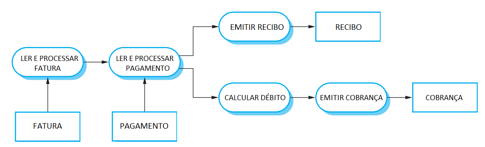

# Questionário - Aula 20

### Questão 01 - Selecione a opção que designa estilo de arquitetura adotado em sistema onde cada elemento é responsável por uma atividade e processamento segue o fluxo descrito.

a. Modelo-Visão-Controlador (Model-View-Controller).  
b. Cliente-servidor (client-server).  
**c. Duto e filtro (pipe and filter).**  
d. Camadas (layers).

### Questão 02 -Selecione opção que designa padrão de arquitetura de maior nível de granularidade.
**a. Estilo de arquitetura de software (software architecture style).**  
b. Linha de código.  
c. Padrão de projeto de software (software design pattern).  
d. Idioma de codificação (coding idiom).

### Questão 03 - Selecione a opção que designa estilo de arquitetura que apresenta as seguintes características:

1. Dados podem estar armazenados em repositório passivo ou ativo.
2. Núcleo é o repositório de dados.
3. Repositório é independente dos clientes.

**a. Centrado em dados.**  
b. Camadas (layers).  
c. Dutos e filtros (pipes and filters).  
d. Fluxo de dados.

### Questão 04 - Selecione a opção que designa estilo de arquitetura que apresenta as seguintes características:

1. Sucessivas transformações de dados.
2. No classe batch cada passo é concluído antes do próximo ser iniciado.
3. Na classe dutos e filtros, dados são transformados de modo incremental.

a. Cliente-servidor.  
b. Blackboard.  
**c. Fluxo de dados.**  
d. Camadas (layers).

### Questão 05 - Selecione toda opção verdadeira acerca de estilos de arquitetura de software (architectural styles).
**a. No estilo de arquitetura cliente-servidor, a arquitetura do software é composta por clientes que invocam serviços e por servidores que disponibilizam serviços, servidores podem ser implantados em diferentes nós de processamento, cada servidor é potencial ponto de falha e desempenho do sistema pode ser de difícil previsão.**  
**b. Model-View-Controller (MVC) consiste de estilo de arquitetura composto por modelo, visão e controlador; modelo consiste de elemento que encapsula estado e lógica de negócio, por sua vez, visão consiste de elemento que apresenta dados ao usuário e controlador consiste de elemento que trata eventos gerados por usuário.**  
c. Segundo o estilo de arquitetura camadas (layers), a arquittura do software é organizada em camadas com responsabilidades logicamente relacionadas, cada camada solicita serviços apenas à camada imediatamente acima (up call) e solicitações que resultem em saltos entre camadas (bridge) são encorajadas.  
**d. No estilo de arquitetura dutos e filtros (pipe and filter), a arquitetura do software é composta por filtros que são interligados por meio de dutos, cada filtro é responsável por parte do processamento dos dados, cada filtro executa determinadas transformações em dados que fluem, por meio de dutos, entre filtros integrantes do software.**

### Questão 06 - Associe a cada descrição o nome de visão de arquitetura (architectural view) que melhor designa a visão descrita.
Apresenta abstrações relevantes, tais como classes e instâncias dessas classes quando é adotado o paradigma de desenvolvimento orientado a objetos. $\rightarrow$ **Visão lógica.**  
Apresenta elementos que interagem em tempo de execução, sendo visão relevante quando da avaliação de requisitos não funcionais como desempenho. $\rightarrow$ **Visão de processos.**  
Apresenta decomposição do software em elementos a serem implementados por desenvolvedor ou por equipe, é visão relevante aos gerentes de projeto.  $\rightarrow$ **Visão de desenvolvimento.**  
Apresenta como elementos de software são mapeados para o hardware, consiste de visão relevante quando do planejamento da implantação do software. $\rightarrow$ **Visão física.**

### Questão 07 - Selecione toda opção verdadeira acerca de estilo de arquitetura de software.
**a. Pode enfocar estrutura composta por subsistemas.**  
**b. Restrições definem arquiteturas que satisfazem estilo.**  
c. Sempre enfoca elementos com menor nível de granularidade do que padrões de projeto (design pattern).  
d. Toda propriedade de projeto (design) independe de estilo de arquitetura adotado.

### Questão 08 - Selecione todas as opções verdadeiras acerca do estilo de arquitetura Model-View-Controller (MVC).
**a. No estilo de arquitetura Model-View-Controller (MVC), o elemento modelo (model) independe da interface com o usuário, é responsável por operações com dados. O elemento visão (view) define e gerencia apresentação de dados a usuários. Podem existir diferentes visões para um mesmo conjunto de dados. Por fim, o elemento controlador (controller) é responsável por interações com os usuários.**  
b. O estilo Model-View-Controller (MVC) possibilita independência entre dados e representações dos dados. Entre as possíveis desvantagens associadas à adoção desse estilo de arquitetura, tem-se as seguintes: diferentes programadores não podem codificar simultâneamente os diferentes elementos integrantes do estilo; esse estilo de arquitetura só é aplicável quando do desenvolvimento de aplicações para a World Wide Web.  
c. O estilo Model-View-Controller (MVC) é popular no desenvolvimento de aplicações para a World Wide Web. É um estilo de arquitetura que pode ser adotado apenas quando da construção de código em uma determinada linguagem de programação. Esse estilo de arquitetura resulta em dependência entre elementos integrantes do software, portanto consiste de estilo de arquitetura que reduz reuso de código.  
**d. Model-View-Controller (MVC) consiste de estilo de arquitetura que separa apresentação, interação e dados. O software é estruturado em elementos que interagem para prover os serviços. Esse estilo de arquitetura pode ser usado quando existem diferentes modos de visualizar e de interagir com dados. Pode também ser usado quando requisitos futuros acerca de interação e apresentação de dados são desconhecidos.**

### Questão 09 - Selecione toda opção verdadeira acerca do estilo de arquitetura camadas (layers).
a. Cada camada deve solicitar serviços apenas à camada imediatamente acima.  
**b. Solicitações que resultem em saltos entre camadas (bridge) não são recomendadas.**  
**c. Nem todo software tem o mesmo número de camadas.**  
d. Desenvolvedor de determinada camada sempre precisa conhecer detalhes internos de outras camadas.

### Questão 10 - Selecione toda opção verdadeira acerca do estilo Model-View-Controller (MVC).
**a. Estilo que promove desacoplamento entre interface com o usuário e lógica de aplicação.**  
b. Responsabilidade primária de elemento view é armazenar dados e implementar lógica de aplicação.  
c. Responsabilidade primária de elemento controller é construir interface com o usuário.  
**d. Estilo que facilita a produção de múltiplas visões para um mesmo conjunto de dados.**

### Questão 11 - Selecione toda opção verdadeira acerca de padrão de projeto (design pattern).
**a. Pode informar como refinar elementos de software ou relacionamentos entre os mesmos.**  
**b. Define microarquitetura.**
c. Tipicamente afeta estrutura do sistema de software como um todo e de modo abrangente.  
d. Tipicamente enfoca elementos de nível de granularidade inferior aos enfocados por idioma de codificação.  

### Questão 12 - Selecione todas as opções verdadeiras acerca de arquitetura de software.
**a. Padrão de arquitetura promove reuso de conhecimento acerca de arquitetura, descrição de padrão pode informar responsabilidades de elementos do padrão, como usar o padrão, vantagens e desvantagens do padrão.**  
b. Definição acerca de arquitetura de software é influenciada por requisitos funcionais, mas não é influenciada por requisitos não funcionais tais como manutenibilidade, testabilidade e desempenho.  
**c. Arquitetura de software pode ser documentada segundo perspectivas ou visões (views), possíveis visões são: visão conceitual, visão lógica, visão de processos, visão de desenvolvimento e visão física.**  
d. Estilo de arquitetura de software tem impacto pouco abrangente na arquitetura, tipicamente são adotados vários estilos quando do desenvolvimento de software; padrão de projeto (design pattern) tem impacto muito abrangente na arquitetura, por isso tipicamente é adotado só um padrão quando do desenvolvimento de software.  
**e. Decisões acerca de arquitetura de software podem incluir decisões acerca de distribuição de processamento, estilo de arquitetura adotado e modos para documentar e avaliar arquitetura.**  
**f. Descrição de arquitetura de software consiste de descrição de como sistema de software é organizado, essa descrição pode ser realizada por meio da construção de modelo.**

### Questão 13 - Selecione todas as opções verdadeiras acerca de arquitetura de software.
**a. São relevantes em projeto (design) de arquitetura de software: existência de arquitetura genérica que possa ser usada como modelo (template); distribuição de processamento; padrões de arquitetura; estratégias para estruturar software, decompor elementos do software e controlar operações de elementos do software; requisitos funcionais e não funcionais; critérios para avaliar arquitetura e  sua documentação.**  
b. Uma vez que os elementos integrantes de um software proveêm as funcionalidades desse software, em atividades de processo de projeto de arquitetura de software  (software architecture design), são considerados apenas requisitos funcionais; requisitos não funcionais, tais como desempenho e manutenibilidade, não são afetados por decisões tomadas quando do projeto (design) de arquitetura de software.  
**c. Projeto de arquitetura de software  (software architecture design)  enfoca organização de software, enfoca projeto (design) de estrutura de software, procura identificar elementos de software e relacionamentos entre os mesmos; resultado de processo de projeto de arquitetura pode ser modelo de arquitetura que descreve como um software é organizado em conjunto de elementos.**  
d. Modelo da arquitetura de software consiste de descrição de como software é organizado, de como os seus elementos trabalham em conjunto. Registar informação acerca de arquitetura de software pode facilitar a comunicação com partes interessadas (stakeholders) e o reuso de software. Pode ser construído modelo de arquitetura de software em desenvolvimento, mas não de software que foi anteriormente desenvolvido.

### Questão 14 - Selecione toda opção verdadeira acerca de atividades em processo de projeto (design) de arquitetura de software.
**a. Embora cada sistema de software possa ser único, sistemas de software em um mesmo domínio de aplicação podem apresentar arquiteturas similares que refletem aspectos fundamentais do domínio, existem alguns padrões de arquitetura que podem ser encontrados em arquiteturas de diferentes sistemas de software.**  
b. Entre as atividades integrantes de processo de projeto (design) de arquitetura de software, não é necessário atividade para avaliar diferentes arquiteturas candidatas, pois para determinado conjunto de requisitos de software, existe sempre apenas uma possível arquitetura candidata para o software sendo desenvolvido.  
**c. Processo de projeto (design) de arquitetura de software consiste de processo composto por atividades por meio das quais procura-se definir estrutura de software que satisfaça requisitos funcionais e não funcionais, nessas atividades são tomadas decisões que afetam a estrutura do software e o processo de desenvolvimento do mesmo.**  
**d. Existe relacionamento entre requisitos não funcionais e arquitetura de software, requisitos não funcionais acerca de desempenho, segurança, disponibilidade e manutenibilidade podem influenciar o projeto (design) da arquitura do software, podem também influenciar a escolha dos padrões de arquitetura adotados quando desse projeto.**

### Questão 15 - Selecione toda opção verdadeira acerca de idioma de codificação (coding idiom).
**a. Existem idiomas para uso quando de programação em linguagem C++.**  
b. Nível de granularidade de elementos de idioma é superior ao de elementos de estilo de arquitetura.  
**c. Uso de idioma pode estar relacionado a uso de determinada linguagem de programação.**  
d. Uso de idioma tem impacto abrangente na estrutura de software.

### Questão 16 - Selecione toda opção verdadeira acerca de arquitetura de software.
**a. Arquitetura de software pode ser avaliada considerando-se requisitos de software.**  
b. Arquitetura de software existe apenas se a mesma for registrada por meio de modelo de software.  
**c. Arquitetura de software engloba elementos de software e relacionamentos entre esses elementos.**  
**d. Arquitetura de software enfoca estrutura de software.**

### Questão 17 - Selecione todas as opções verdadeiras acerca do estilo de arquitetura camadas (layers).
**a. O estilo de arquitetura camadas (layers) organiza o software em camadas. Cada camada é responsável por prover serviços funcionalmente relacionados. Cada camada é responsável por provêr serviços a camada acima da mesma. A solicitação de serviço a camada acima (up call), ou a solicitação de serviço a camada que não se encontra imediatamente abaixo (bridge), são consideradas violações desse estilo de arquitetura.**  
b. Entre possíveis desvantagens do estilo de arquitetura camadas (layers), é possível relacionar as seguintes: dificuldade em prover clara separação entre camadas; existência de múltiplas camadas pode resultar em perda de desempenho; impossibilidade de substituir camadas, mesmo quando a interface entre camadas não sofre modificações; impossibilidade de distintas camadas serem construídas concorrentemente.  
c. Quando adotado o estilo camadas (layers), múltiplas camadas podem integrar o sistema de software. O desenvolvimento das camadas precisa ocorrer da camada inferior para a camada superior, pois  não é possível substituir código de camada não desenvolvida por código que se faça passar por essa camada. Portanto, adotar esse estilo de arquitetura implica em adotar o processo de integração de baixo para cima (bottom-up).  
d. Quando adotado o estilo camadas (layers), o desenvolvedor de certa camada não precisa conhecer a arquitetura interna de outras camadas, pode enfocar as interfaces das camadas das quais depende. Especificação de interface pode prover informação acerca de sintaxe, semântica e protocolo. Modificação de código de uma camada requer modificação de códigos de camadas que clientes da camada modificada, pois alteração de código sempre implica em modificação de interface.

### Questão 18 - Selecione toda opção verdadeira acerca de aspectos e atributos de arquitetura de software.
**a. Reaproveitamento de elementos pode ser fator relevante quando da definição de arquitetura de software.**  
**b. Distribuição de trabalho pode ser fator relevante quando da definição de arquitetura de software.**  
**c. Pode existir conjunto de requisitos de software que é satisfeito por diferentes arquiteturas de software.**  
**d. Integridade conceitual e completude podem ser relevantes atributos de arquitetura de software.**
