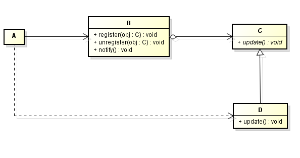
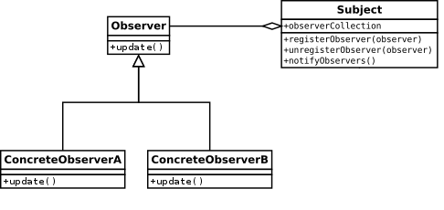
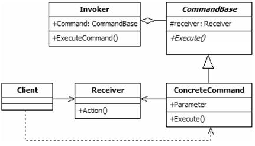
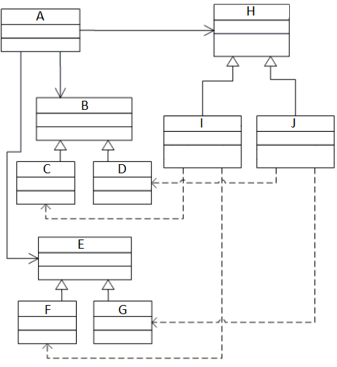
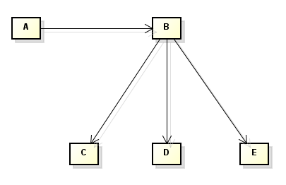
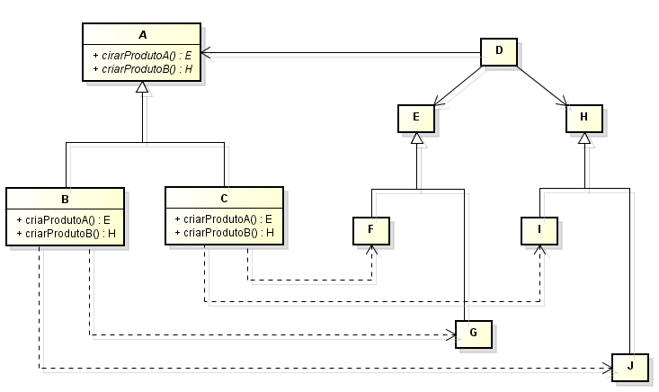
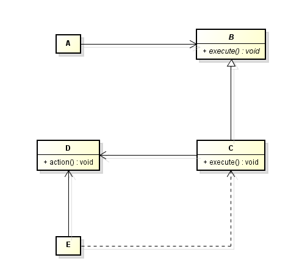
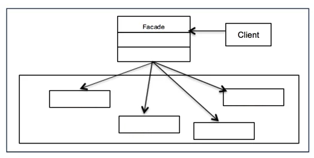

# Questionário - Aula 21

### Questão 01 - Associe cada nome de classe a letra considerando o padrão de projeto (design pattern) Observer e o seguinte diagrama:

Subject $\rightarrow$ **B.**  
ConcreteObserver $\rightarrow$ **D.**  
Client $\rightarrow$ **A.**  
AbstractObserver $\rightarrow$ **C.**

### Questão 02 - Selecione a opção que designa padrão de projeto (design pattern) com as seguintes características:

1. Garante que classe tem apenas uma instância.
2. Possibilita que classe controle como a mesma é instanciada.
3. Facilita acesso a instância única de classe.

a. Builder.  
b. Facade.  
**c. Singleton.**  
d. Adapter.

### Questão 03 - Selecione todas as opções verdadeiras considerando o padrão de projeto representado pelo seguinte diagrama:

**a. Método update é invocado por instância de Subject.**  
**b. Quando de alteração do seu estado, instância de Subject notifica instâncias de classes derivadas de Observer.**  
c. Instância de Subject não pode armazenar identificadores de diferentes instâncias de classes derivadas de Observer.  
d. Instância de classe derivada de Observer invoca método notifyObservers para informar que tem interesse em estado de instância de Subject.

### Questão 04 - Selecione todas as opções verdadeiras considerando o seguinte diagrama e conceitos acerca do padrão de projeto Command.

a. Código de método da classe Receiver invoca método da classe ConcreteCommand.  
**b. Pode ser instanciada a classe ConcreteCommand mas não a classe CommandBase.**  
c. ConcreteCommand herda de CommandBase a implementação de corpo do método Execute.  
d. Método membro Execute consiste de método abstrato na classe ConcreteCommand.

### Questão 05 - Associe descrição a nome de padrão de projeto (design pattern) descrito.

Padrão de projeto (design pattern) caracterizado pelas seguintes classes: classe com método para incluir identificador de objeto em lista, método para remover identificador de objeto de lista e método para notificar objetos cujos identificadores estão na referida lista; classe que declara interface com método invocado quando é necessário notificar evento; classes que implementam a interface declarada, cada classe com implementação de método que executa ação quando de notificação de evento. $\rightarrow$ **Observer.**  
Padrão de projeto (design pattern) caracterizado por classe que minimiza acoplamento entre elementos de sistema de software e que simplifica interações por meio de interface composta por métodos que possibilitam acesso a serviços providos por conjunto de subsistemas, conjunto de módulos, conjunto de classes, etc. $\rightarrow$ **Facade.**  
Padrão de projeto (design pattern) caracterizado pelas seguintes classes: classe abstrata que declara interface composta por método a ser invocado quando da solicitação de serviço; classes que implementam a interface declarada, cada classe provê diferente implementação para o método presente na interface e interage com objetos para prestar o serviço. $\rightarrow$ **Command.**  
Padrão de projeto (design pattern) caracterizado pelas seguintes classes: classes abstratas que declaram interfaces para famílias de produtos; classes que são implementações de produtos; classe abstrata que declara interface composta por métodos para criar produtos; classes compostas por implementações de métodos para criar produtos. $\rightarrow$ **Abstract Factory.**

### Questão 06 - Associe a cada classe o termo que melhor designa o propósito da classe no seguinte diagrama do padrão de projeto Abstract Factory.

Classe A. $\rightarrow$ **Cliente.**  
Classe B. $\rightarrow$ **Produto abstrato A.**  
Classe F. $\rightarrow$ **Produto B 1.**  
Classe J. $\rightarrow$ **Fábrica 2.**  
Classe H. $\rightarrow$ **Fábrica abstrata.**  

### Questão 07 - Selecione opção que designa padrão de projeto (design pattern) com as seguintes aplicações:

1. Quando sistema deve independer de como os seus produtos são criados, compostos e representados.
2. Quando sistema deve ser configurado com uma entre múltiplas famílias de produtos.
3. Quando se deseja revelar apenas interfaces e não suas implementações.

a. Facade.  
**b. Abstract Factory.**  
c. Strategy.  
d. Singleton.

### Questão 08 - Associe cada nome de classe a letra considerando o padrão de projeto (design pattern) Facade e o seguinte diagrama:

Client $\rightarrow$ **A.**  
Facade $\rightarrow$ **B.**  
Class2 $\rightarrow$ **D.**  
Class1 $\rightarrow$ **C.**  
Class3 $\rightarrow$ **E.**

### Questão 09 - Selecione a opção que designa padrão de projeto (design pattern) com as seguintes características:

- Define relacionamento um-para-muitos entre objetos, quando de mudança de estado de certo objeto, outros objetos podem ser notificados.
- Pode ser usado na implementação de visão em estilo de arquitetura Model-View-Controller (MVC).
- Padrão de projeto comportamental (behavioral design pattern).
- Define mecanismo de assinatura (subscrição) por meio do qual é possível informar que objeto tem interesse em estado de outro objeto.

**a. Observer.**  
b. Singleton.  
c. Facade.  
d. Command.

### Questão 10 - Selecione toda opção verdadeira acerca de sistemas compostos por objetos distribuídos.
**a. Elementos stub e skeleton escondem chamadas a métodos remotos.**  
b. Responsabilidade primária de elemento local stub é prover serviços a elemento remoto skeleton.  
**c. Procuram fazer com que objetos remotos pareçam objetos locais.**  
**d. Elemento local stub se faz passar por elemento remoto.**

### Questão 11 - Associe cada nome de classe a letra considerando o padrão de projeto (design pattern) Abstract Factory e o seguinte diagrama:

AbstractProductA $\rightarrow$ **E.**  
ConcreteProductB2 $\rightarrow$ **J.**  
ConcreteProductA2 $\rightarrow$ **G.**  
ConcreteFactory1 $\rightarrow$ **B.**  
ConcreteProductB1 $\rightarrow$ **I.**  
AbstractFactory $\rightarrow$ **A.**  
ConcreteFactory2 $\rightarrow$ **C.**  
ConcreteProductA1 $\rightarrow$ **F.**  
AbstractProductB $\rightarrow$ **H.**  
Client $\rightarrow$ **D.**

### Questão 12 - Associe cada nome de classe a letra considerando o padrão de projeto (design pattern) Command e o seguinte diagrama:

Invoker $\rightarrow$ **A.**  
ConcreteCommand $\rightarrow$ **C.**  
Client $\rightarrow$ **E.**  
Receiver $\rightarrow$ **D.**  
AbstractCommand $\rightarrow$ **B.**

### Questão 13 - Selecione todas as opções verdadeiras considerando o seguinte diagrama e conceitos acerca do padrão de projeto Facade.

**a. Na implementação de Facade são codificados métodos que invocam métodos membros de outras classes.**  
**b. Por meio de Facade é possível reduzir o acoplamento entre Client e classes que implementam os serviços.**  
c. Classe Facade não pode ser instanciada, uma vez que essa classe consiste de classe abstrata (abstract class).  
d. Código integrante de método membro da classe Facade invoca método que é membro da classe Client.

### Questão 14 - Selecione opção que designa classe de sistema caracterizado pelas seguintes atividades:

- Criar descritor.
- Ligar endereço de serviço.
- Aguardar solicitação de conexão.
- Aceitar conexão.
- Receber solicitação.
- Executar serviço.
- Enviar resposta a cliente.
- Fechar conexão.

a. Concorrente não orientado a conexão.  
**b. Interativo orientado a conexão.**  
c. Interativo não orientado a conexão.  
d. Concorrente orientado a conexão.
