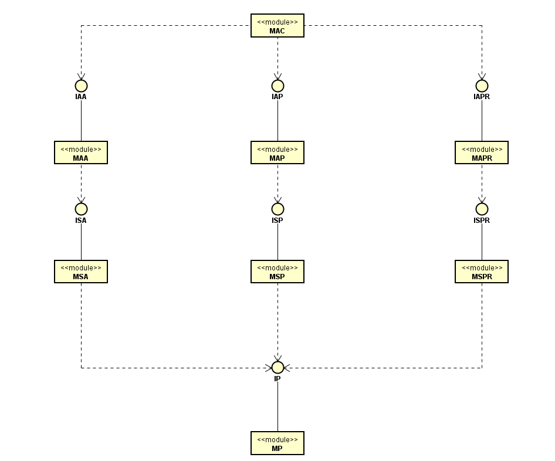
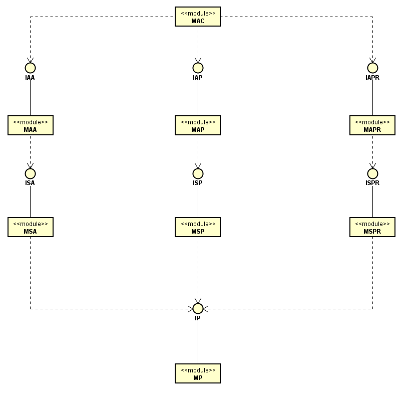
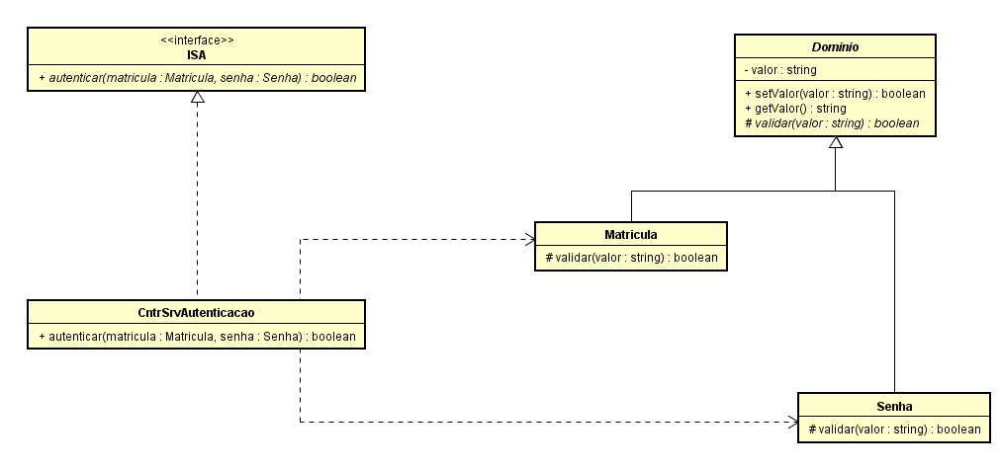
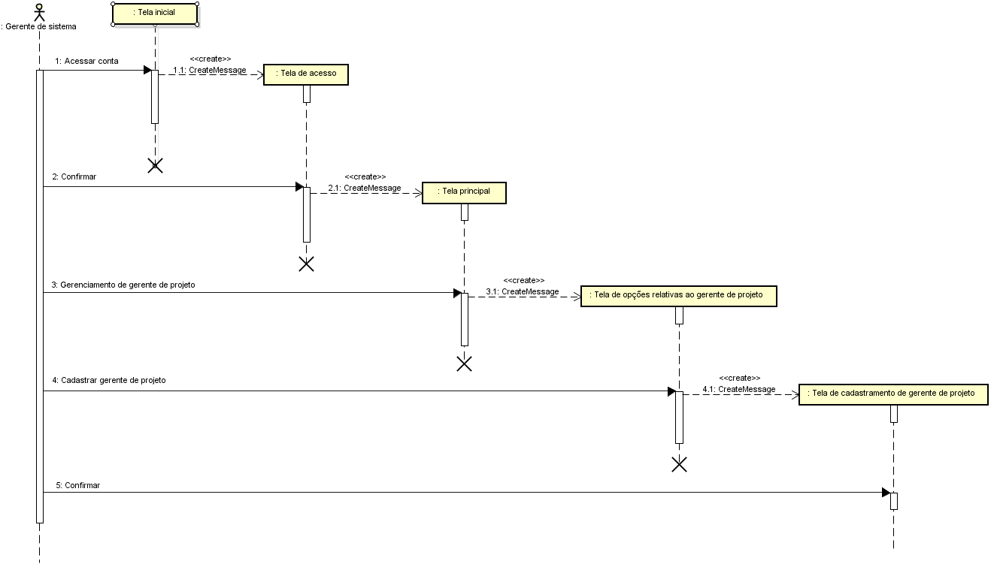
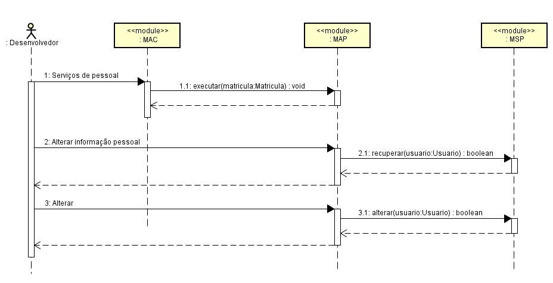
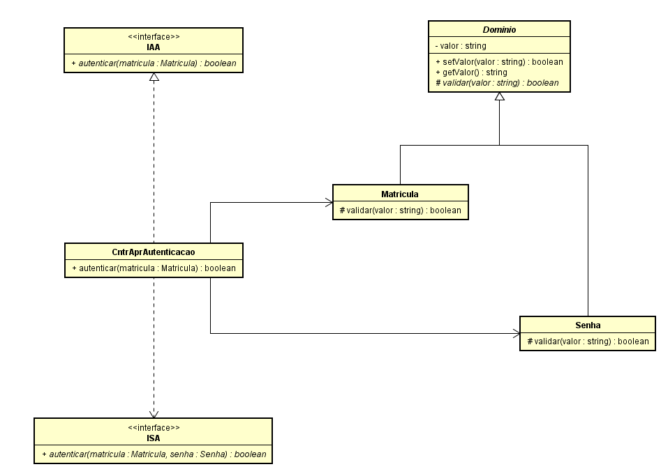
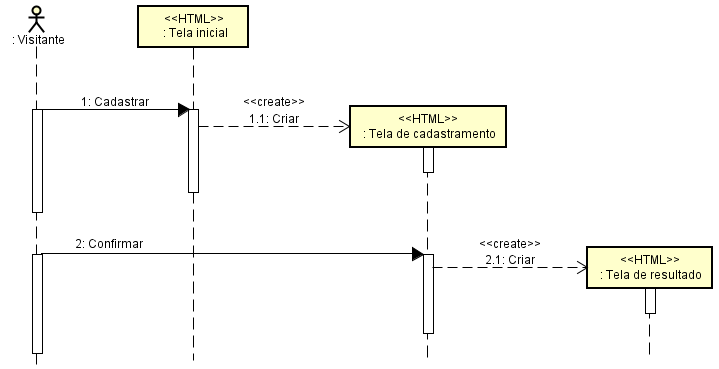
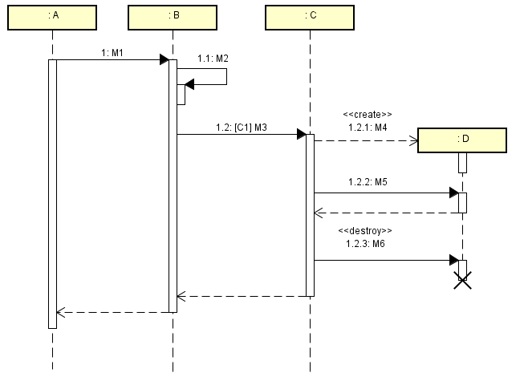
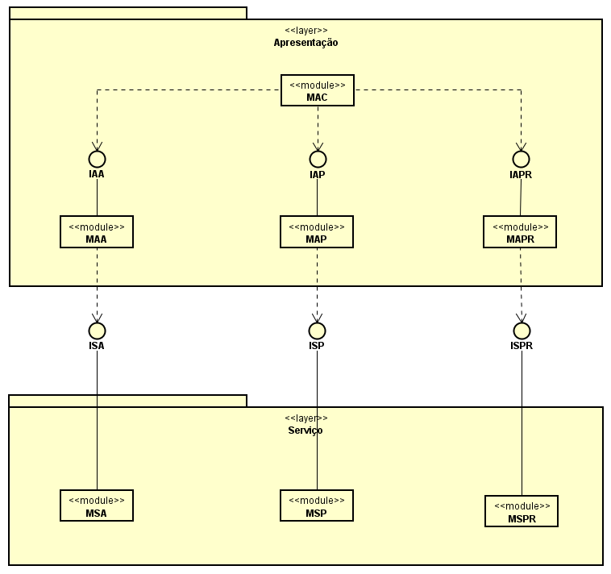

# Questionário - Aula 22

### Questão 01 - Selecione toda opção verdadeira acerca do seguinte diagrama.

Escolha uma ou mais:

a. Módulo MSP depende de serviços relacionados na interface ISP.  
b. Módulo MAC provê serviços relacionados em três interfaces.  
**c. Módulo MP provê serviços relacionados na interface IP para diferentes clientes.**  
d. Módulo MSPR provê serviços e depende de serviços.

### Questão 02 - Selecione toda opção verdadeira acerca do seguinte diagrama.

Escolha uma ou mais:

a. Módulo MP depende de serviços definidos na interface IP.  
b. Módulo MSA realiza a interface ISA.  
c. Módulo MAPR realiza a interface ISPR.  
**d. Módulo MAC depende de serviços definidos na interface IAPR.**

### Questão 03 - Selecione toda opção verdadeira acerca do seguinte diagrama de classes resultante de projeto (design) de software.

Escolha uma ou mais:

**a. A classe Matricula herda atributo denominado valor.**  
**b. Em ISA existe método abstrato denominado autenticar.**  
c. Na classe Senha existe método privado denominado validar.  
**d. Entre CntrSrvAutenticacao e ISA existe relacionamento de realização.**

### Questão 04 - Selecione todas as opções verdadeiras considerando o seguinte diagrama:

a. Diagrama contém informação acerca de estrutura do software, representa estrutura estática composta por classes e por relacionamentos entre classes.  
**b. Diagrama contém representação de mensagens enviadas por instância de ator para objetos integrantes do sistema.**  
**c. Diagrama contém informação acerca de comportamento dinâmico do software, representa estrutura dinâmica composta por objetos e por interações entre objetos.**  
**d. Diagrama representa sequência de interações que ocorre quando elemento externo ao sistema solicita serviço ao sistema.**

### Questão 05 - Selecione toda opção verdadeira acerca do seguinte diagrama.

Escolha uma ou mais:

**a. Módulo MAC informa matrícula ao solicitar serviço ao módulo MAP.**  
**b. Módulo MSP provê serviço ao módulo MAP.**  
c. Ator desenvolvedor interage por meio de interface construída pelos módulos MAC e MAP.  
d. Módulo MAP é cliente de serviços providos pelo módulo MAC.

### Questão 06 - Selecione toda opção verdadeira acerca do seguinte diagrama de classes.

Escolha uma ou mais:

**a. Classe Matricula herda métodos setValor e getValor.**  
b. Na classe CntrAprAutenticacao existe realização de método abstrato declarado em ISA.  
c. Instâncias da classe CntrAprAutenticacao são clientes de serviço declarado em IAA.  
**d. Existe associação entre a classe CntrAprAutenticacao e a classe Senha.**

### Questão 07 - Selecione toda opção verdadeira acerca do seguinte diagrama.

Escolha uma ou mais:

a. No diagrama são representados módulos de software e interações entre os mesmos por trocas de mensagens.  
**b. Por análise do diagrama é possível concluir que Tela de resultado é apresentada após Tela de cadastramento.**   
**c. No diagrama tem-se representação de interação de ator com elementos integrantes de interface com o usuário.**  
d. Por análise do diagrama é possível concluir que Cadastrar e Confirmar são nomes de métodos de classes.

### Questão 08 - Selecione todas as opções verdadeiras considerando o seguinte diagrama de sequência.

**a. Diagrama descreve comportamento dinâmico quando é prestado serviço solicitado por meio de mensagem M1.**  
**b. Existe instância de C antes da mensagem M1 ser enviada, e também após prestado o serviço solicitado por M1.**     
c. Prestação de serviço solicitado por meio de M1 sempre resulta em instância de D ser criada e depois destruída.  
d. Instância da classe D envia mensagem M2 para uma outra instância da classe D.  
e. Diagrama é composto por representações de instâncias de classes e de ligações (links) entre essas instâncias.

### Questão 09 - Selecione todas as opções verdadeiras considerando o seguinte diagrama de arquitetura de software:

a. Projeto (design) interno e codificação do módulo MAP requer conhecimento do projeto interno e da codificação do módulo MSP.  
**b. Serviços providos entre camadas são relacionados nas interfaces ISA, ISP e ISPR.**  
c. Serviços relacionados nas interfaces IAA, IAP e IAPR são exportados por uma das camadas.  
**d. Módulo MAA provê serviços relacionados na interface IAA e módulo MAC depende de serviços relacionados nas interfaces IAA, IAP e IAPR.**  
