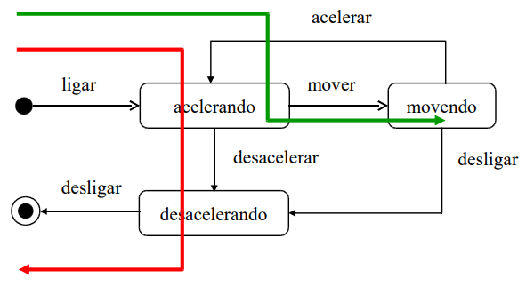
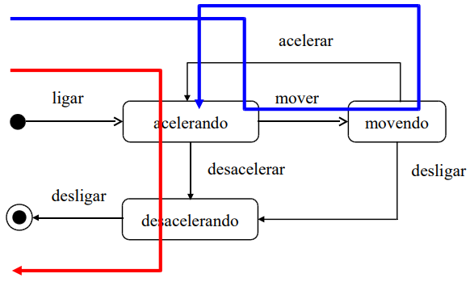
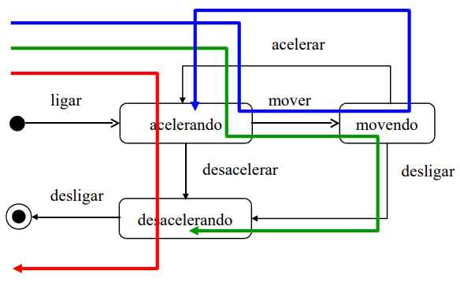
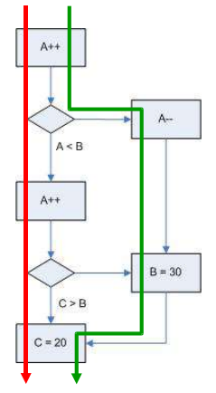
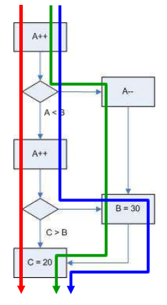

# Questionário - Aula 25

### Questão 01 - Selecione toda opção verdadeira acerca de critério de cobertura de código.

Escolha uma ou mais:

a. Critério de cobertura de código pode ser usado apenas em projeto de teste caixa preta (black box).  
**b. Escolha da critério de cobertura de código é influenciada pelos recursos disponíveis no projeto de software.**  
c. Satisfazer critério de cobertura de código tipicamente garante que não existe defeito no software.  
**d. Critério de cobertura de código provê informação acerca de quão completo é o teste.**

### Questão 02 - Selecione toda opção verdadeira acerca de teste caixa preta (black box).

Escolha uma ou mais:

**a. Técnica de teste que pode enfocar dados de entrada e dados de saída observados.**  
**b. Técnica de teste que pode ser usada em teste de sistema (system testing).**  
**c. Técnica de teste que enfoca resultados gerados pelo item em teste.**  
d. Técnica de teste que requer conhecimento detalhado acerca dos mecanismos internos do item em teste.

### Questão 03 - Selecione toda opção verdadeira acerca de automação de teste.

Escolha uma ou mais:

**a. Garantia de execução de casos de teste é potencial benefício da automação de teste.**  
b. Processo de teste de regressão consiste de processo que não pode ser automatizado.  
c. Processo de auditoria de código consiste de processo que não pode ser automatizado.  
**d. Armazenamento de dados para análise é potencial benefício da automação de teste.**

### Questão 04 - Selecione toda opção verdadeira acerca de teste com cenários.

Escolha uma ou mais:

**a. Cenário consiste de descrição de situação que o sistema de software encontrará.**  
b. Existem cenários funcionais mas não existem cenários não funcionais.  
**c. Especificação de requisito é possível fonte de cenário.**  
**d. Cenário pode capturar interações com usuários.**

### Questão 05 - Selecione todas as opções verdadeiras acerca de processo de projeto (design)  de teste embasado em classes de equivalência (equivalence partitioning).

a. Processo aplicável no projeto (design) de teste de sistema, mas não no projeto de teste de integração ou no projeto de teste de unidade.  
**b. Processo onde casos de teste representativos, possivelmente apenas um caso de teste, são selecionados para cada classe de equivalência.**  
**c. Processo supõe que se um caso de teste de uma classe não detecta um defeito, então os outros casos de teste dessa classe provavelmente não detectam esse defeito.**  
**d. Processo onde domínio de entrada é particionado segundo determinado critério ou relação.**  
**e. Processo supõe que se um caso de teste de uma classe detecta defeito, então os outros casos de teste dessa classe provavelmente detectam esse defeito.**

### Questão 06 - Selecione toda opção que designa atividade em projeto de teste usando classes de equivalência.

Escolha uma ou mais:

a. Em caso de teste positivo, usar valor de classe inválida.  
**b. Identificar classes inválidas.**  
c. Em caso de teste negativo, usar valor de classe válida.  
**d. Identificar classes válidas.**

### Questão 07 - Selecione toda opção verdadeira acerca de classe de equivalência.

Escolha uma ou mais:

**a. Técnica por meio da qual se procura reduzir quantidade de casos de teste.**  
**b. Elemento de uma classe de equivalência é equivalente aos outros elementos dessa classe.**  
c. Técnica que tem o propósito de reduzir a cobertura do teste.  
**d. Valores de entrada são considerados equivalentes caso sejam tratados da mesma forma pelo software.**

### Questão 08 - Associe a cada identificador de diagrama o critério de cobertura descrito por meio do diagrama.

Diagrama 1  

Diagrama 2  

Diagrama 3  

Diagrama 4  

Diagrama 5  

Exercitar cada estado ao menos uma vez. $\rightarrow$ **Diagrama 1**,  
Exercitar cada enunciado ao menos uma vez. $\rightarrow$ **Diagrama 4**,  
Exercitar cada transição ao menos uma vez.  $\rightarrow$ **Diagrama 3**,  
Exercitar cada evento ao menos uma vez. $\rightarrow$ **Diagrama 2**,  
Exercitar cada decisão ao menos uma vez. $\rightarrow$ **Diagrama 5**.

### Questão 09 - Selecione opção que designa técnica de projeto de teste com os seguintes princípios: se um caso de teste de uma partição identifica um defeito, então os outros casos de teste nessa partição provavelmente detectam esse defeito; se um caso de teste de uma partição não identifica um defeito, então os outros casos de teste nessa partição provavelmente não detectam esse defeito.

a. Critério de cobertura.  
**b. Classe de equivalência.**  
c. Projeto de teste embasado em cenários.  
d. Análise de domínio. 
 
### Questão 10 - Selecione toda opção verdadeira acerca de teste caixa branca (white box).

Escolha uma ou mais:

a. Não requer conhecimento sobre mecanismos internos do item em teste.  
**b. Técnica de teste que pode ser usada em teste de unidade (unit testing).**  
**c. Técnica de teste que enfoca estrutura do item em teste.**  
**d. Técnica de teste que pode ser suportada por métricas de cobertura.**

### Questão 11 - Selecione toda opção verdadeira acerca de casos de teste em classe de equivalência.

Escolha uma ou mais:

a. Se um caso de teste de uma classe detecta um defeito, então os outros casos de teste nessa classe provavelmente não detectam esse defeito.  
b. Se um caso de teste de uma classe não detecta um defeito, então os outros casos de teste nessa classe provavelmente detectam esse defeito.  
**c. Se um caso de teste de uma classe não detecta um defeito, então os outros casos de teste nessa classe provavelmente não detectam esse defeito.**  
**d. Se um caso de teste de uma classe detecta um defeito, então os outros casos de teste nessa classe provavelmente detectam esse defeito.**

### Questão 12 - Selecione toda opção verdadeira acerca da aplicabilidade de classe de equivalência.

Escolha uma ou mais:

**a. Teste de integração (integration testing).**  
**b. Teste de sistema onde dados assumem valores em conjuntos.**  
**c. Teste de sistema onde dados assumem valores em faixas.**  
**d. Teste de sistema (system testing).**

### Questão 13 - Selecione toda opção verdadeira acerca de projeto de teste por controle de fluxo do código.

Escolha uma ou mais:

a. Técnica aplicável apenas em projeto de teste caixa preta (black box).  
**b. Técnica onde podem ser identificados trajetos de execução do código.**  
**c. Técnica na qual podem ser analisados trajetos por grafos que descrevam fluxos de controle.**  
**d. Técnica na qual podem ser construídos grafos que descrevam fluxos de controle do código.**

### Questão 14 - Selecione todas as opções verdadeiras acerca de processo de projeto (design) de teste embasado em cenários (scenario testing).

a. Cenário não funcional enfoca atributo de qualidade não funcional, sendo o cenário tipicamente derivado de caso de uso.  
**b. Cenário pode consistir de narrativa que descreve modo como o software pode ser usado.**  
**c. Pode existir cenário que possibilite avaliar mais de um requisito e se a combinação desses requisitos causa problema.**  
**d. Processo onde cenários são identificados e usados no projeto (design) de casos de teste.**  
e. Cenário pode capturar interação com o usuário, mas não mudança em ambiente com a qual o software seja capaz de lidar.

### Questão 15 - Selecione toda opção verdadeira acerca de projeto de teste por controle de fluxo de código.

Escolha uma ou mais:

**a. Possível critério de cobertura é todas as decisões serem tomadas ao menos uma vez.**  
b. Não é possível projeto de teste por controle de fluxo de código caso exista loop no código em teste.  
**c. Possível critério de cobertura é todo enunciado ser executado ao menos uma vez.**  
**d. Possível critério de cobertura é todos os trajetos serem percorridos ao menos uma vez.**
