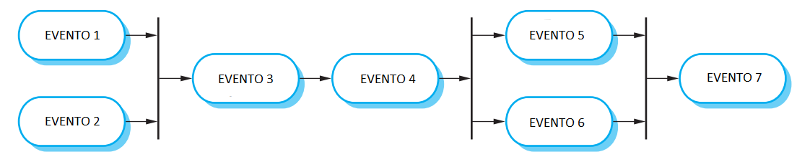

# Questionário - Aula 26

### Questão 01 - Selecione toda opção que designa responsabilidade do autor em processo de inspeção (inspection).

Escolha uma ou mais:

a. Anotar defeitos reportados durante cada reunião de revisão do artefato.  
**b. Apresecntar produto em reunião de abertura e participar de reunião de revisão do artefato.**  
c. Elaborar relatório ao final de cada reunião de revisão do artefato.  
**d. Revisar correções de defeitos realizadas.**

### Questão 02 - Selecione toda opção verdadeira acerca de revisão de software por pares (peer).

Escolha uma ou mais:

a. Revisão por pares (peer) só pode ser realizada por dupla de revisores.  
**b. Revisão por pares (peer) visa identificar defeitos e desvios em relação a padrões adotados.**
**c. Seções críticas de código ou de lógica complexa podem ser revisadas por pares (peer).**  
d. Revisão por pares (peer) tipicamente tem poder de aprovar produto revisado.

### Questão 03 - Selecione toda opção que designa métrica relevante em processo de inspeção.

Escolha uma ou mais:

**a. Número de defeitos posteriormente encontrados (escapes).**  
**b. Defeitos encontrados por unidade do produto.**  
**c. Tamanho do artefato sendo revisado.**  
**d. Tempo gasto.**  

### Questão 04 - Selecione toda opção verdadeira acerca de revisão de software.

Escolha uma ou mais:

**a. Revisão formal pode autorizar aprovação do artefato revisado e acarretar início da próxima fase do projeto.**  
**b. Inspeção e walkthrough são possíveis técnicas de revisão por pares.**  
**c. Participantes de revisão por pares tipicamente têm mesmo nível hierárquico do desenvolvedor do artefato sendo revisado.**  
**d. Revisão é processo onde artefato é avaliado para que seja comentado ou aprovado.**  

### Questão 05 - Selecione toda opção que designa papel de participante de processo de inspeção.

Escolha uma ou mais:

a. Testador.  
**b. Autor.**  
**c. Leitor.**  
**d. Moderador.**

### Questão 06 - Associe papel de participante de processo de inspeção de software (software inspection) às seguintes relações de atividades:

Relação 1
- Determinar partes do artefato a serem revisadas.
- Selecionar revisores.
- Agendar e conduzir reuniões.
- Garantir que revisores se prepararam para a reunião de revisão.
- Garantir horários das reuniões.
- Manter o foco de cada reunião.
- Garantir que defeitos identificados são registrados.
- Monitorar solução de defeitos.
- Garantir elaboração de relatório sobre a revisão

Relação 2
- Garantir que o artefato está pronto para revisão.
- Aderir a padrões.
- Apresentar artefato em reunião de abertura.
- Participar de reunião de revisão. 
- Resolver defeitos identificados.
- Participar de revisão de correções.

Relação 3
- Identificar defeitos.
- Usar listas de verificação (checklists) e outros documentos relevantes no contexto.
- Registrar defeitos.
- Registrar comentários.

Relação 4
- Anotar defeitos e considerações apresentadas na reunião de revisão.
- Registrar tempo gasto nas reuniões.
- Elaborar relatório da reunião de revisão.

Relação 5
- Entender o artefato sendo revisado. 
- Apresentar o artefato sendo revisado.
- Parafrasear cada linha.
- Controlar a velocidade da revisão.

Relação 4. $\rightarrow$ **Relator**,  
Relação 1. $\rightarrow$ **Moderador**,  
Relação 5. $\rightarrow$ **Leitor**,  
Relação 2. $\rightarrow$ **Autor**,  
Relação 3. $\rightarrow$ **Revisor**.

### Questão 07 - Selecione toda opção verdadeira acerca do processo de inspeção (inspection).

Escolha uma ou mais:

**a. É possível revisar modelo de software por meio de processo de inspeção.**  
**b. Participantes de processo de inspeção se preparam com antecedência.**  
**c. Participantes de processo de inspeção têm papeis definidos.**  
d. Processo de inspeção dispensa registro de dados acerca do processo.

### Questão 08 - Selecione toda opção verdadeira acerca de processo walkthrough.

Escolha uma ou mais:

**a. Processo não requer o uso de lista de verificação (checklist) durante a revisão.**  
**b. Registrar dados sobre o processo de revisão não é uma atividade obrigatória.**  
c. Revisor precisa ler artefato e registrar comentários antes de reunião de revisão.  
d. Revisor precisa passar por treinamento formal antes de participar de revisão.

### Questão 09 - Selecione toda opção que designa atividade em reunião de revisão de produto em processo de inspeção.

Escolha uma ou mais:

**a. Registrar informação acerca de defeito relatado.**  
**b. Relatar defeito identificado.**  
c. Corrigir defeito relatado.  
d. Escolher moderador.

### Questão 10 - Associe nomes de eventos a elementos no seguinte diagrama considerando processo de inspeção de software:

EVENTO 1 $\rightarrow$ **Planejamento**,  
EVENTO 6 $\rightarrow$ **Realização de melhorias**,  
EVENTO 5 $\rightarrow$ **Remoção de defeitos**,  
EVENTO 3 $\rightarrow$ **Preparação e revisão individual**,  
EVENTO 7 $\rightarrow$ **Acompanhamento (follow-up)**,  
EVENTO 2 $\rightarrow$ **Preparação do grupo**,  
EVENTO 4 $\rightarrow$ **Reunião de revisão**.

### Questão 11 - Selecione toda opção que designa atividade realizada em reunião de revisão no processo walkthrough.

Escolha uma ou mais:

a. Defeitos localizados são corrigidos.  
**b. Relator registra defeitos localizados.**  
**c. Participantes fazem comentários acerca do artefato sendo revisado.**  
**d. Autor apresenta artefato sendo revisado.**

### Questão 12 - Selecione opção que designa processo de revisão no qual o autor do artefato conduz participantes da revisão pelo artefato, participantes realizam perguntas e comentários acerca de possíveis problemas, correção de defeitos não ocorre durante o processo.

Escolha uma opção:

**a. Walkthrough.**  
b. Inspeção.  
c. Revisão pelo próprio autor.  
d. Revisão por dupla.

### Questão 13 - Selecione todas as opções verdadeiras acerca de processo de revisão denominado walkthrough.

**a. Autor do artefato sendo revisado apresenta o artefato aos participantes da revisão durante reunião de revisão.**  
b. Revisores devem seguir lista de verificação (checklist) e registrar defeitos identificados antes da reunião de revisão.  
c. Processo encerra apenas depois dos defeitos identificados serem corrigidos pelo autor do artefato revisado.  
**d. Plano de projeto, especificação de requisitos e código são exemplos de artefatos que podem ser revisados.**

### Questão 14 - Associe cada relação de atividades ao participante de processo de inspeção responsável pelas atividades.

Garantir que o artefato está pronto para revisão, apresentar artefato em reunião de abertura, participar de reunião de revisão, remover defeitos. $\rightarrow$ **Autor de artefato**,  
Identificar defeitos, usar listas de verificação, registrar informação sobre defeitos antes de reunião de revisão, participar de reunião de revisão. $\rightarrow$ **Revisor**,  
Entender artefato sendo revisado, apresentar elementos de artefato durante reunião de revisão, controlar velocidade de reunião de revisão. $\rightarrow$ **Leitor**,  
Anotar defeitos e comentários reportadas em reunião de revisão, anotar tempo gasto em reunião, elaborar relatório sobre reunião de revisão. $\rightarrow$ **Relator**,  
Selecionar revisores, agendar e conduzir reuniões, garantir que revisores se prepararam para reunião de revisão, monitorar remoção de defeitos. $\rightarrow$ **Moderador**.

### Questão 15 - Selecione toda opção que designa responsabilidade de moderador em processo de inspeção (inspection).

Escolha uma ou mais:

a. Apresentar cada elemento do produto durante reunião de visão e controlar a velocidade de realização dessa reunião.  
**b. Garantir elaboração de relatório sobre a revisão realizada.**
c. Realizar pessoalmente as correções de defeitos identificados pelos revisores.  
**d. Conduzir a reunião de revisão.**
