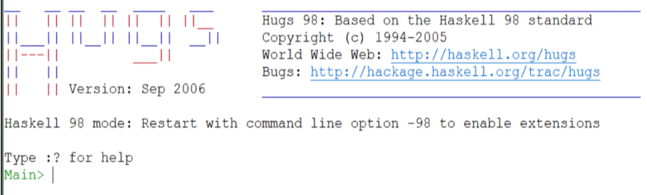

# Paradigma Funcional - Linguagem Hugs
- Programar em uma LP exige pensar com os **significados** das suas **construções**.
- Cada **paradigma** (visão) tem construções que lhe são peculiares:
  - **Procedural** (ou imperativo): Solução <u>algorítmica</u> (passo a passo).
  - **Funcional:** Declara a solução como <u>valores a retornar</u>.
    - Usa extensivo de recursão.
  - **Relacional** (ou lógico): Declara a solução como <u>relação</u> entre <u>entidades</u> do discurso.
  - **Orientado a objetos:** Descreve o problema em <u>termos do próprio problema</u>, ao invés de descrevê-lo em termos de um algoritmo que o computador vai rodar.


### Linguagens Declarativas

- Realizam o processamento **simbólico**. 
- Processam **listas** (ES).
- Bloco básico de construção: **funções**.
- Declaram o problema fazendo sua **especificação** (não
  resolvendo <u>passo a passo</u>).
- Implementam funções complexas e metas programas.
- Tratam **símbolos** e **operações** da **lógica matemática** com
  relativa facilidade.

## Introdução à Linguagem Hugs98

- **Referência:** Hugs98 User Manual
  **Autores:**
  - Mark P. Jones
  - John C. Peterson
- https://www.haskell.org/hugs/

### Ambiente Hugs

- É um interpretador com o ciclo que lê, avalia e exibe resultados.
- **Funções primitivas:** Lidas do `Prelude`.
  - Se a função está no preludio ela pode executa-la.

- **Funções globais:** são visíveis, ocupam espaços na memória
- **Funções locais:** não permanecem na memória, são usadas e descartadas.
- Funções definidas pelo usuário:
  - Usando expressões `let` ou `where`
  - Carregadas de um **arquivo de texto**.
- **Ordem de execução** são as chamadas das <u>funções.</u>
- `=` : Sinal de **reescrita** o que tiver ao lado direito será **substituindo** pelo o que está no lado esquerdo, reduzindo a complexidade
- Funções sem nome; Lambda
- Interpretador:



### Comandos do Prelude (Hugs)

| Comando               | Descrição                                                |
| --------------------- | -------------------------------------------------------- |
| `:?`                  | Exibe a lista de comandos disponíveis                    |
| `:type <expr>`        | Mostra o tipo de uma expressão                           |
| `:load <filenames>`   | Carrega módulos/arquivos especificados                   |
| `:also <filenames>`   | Carrega arquivos adicionais sem remover os já carregados |
| `:reload`             | Recarrega o último conjunto de arquivos                  |
| `:project <filename>` | Usa um arquivo de projeto                                |
| `:edit <filename>`    | Abre um arquivo para edição                              |
| `:edit`               | Edita o último módulo utilizado                          |
| `:browse <modules>`   | Lista nomes definidos em um módulo                       |
| `:find <name>`        | Abre o arquivo contendo a definição do nome              |
| `:names [pat]`        | Lista nomes atualmente no escopo                         |
| `:info <names>`       | Mostra informações sobre nomes                           |
| `:module <module>`    | Define o módulo para avaliação de expressões             |
| `<expr>`              | Avalia uma expressão                                     |
| `:set <options>`      | Define opções da linha de comando                        |
| `:set`                | Mostra opções atuais                                     |
| `:! <command>`        | Executa comando do sistema (shell)                       |
| `:cd <dir>`           | Muda o diretório atual                                   |
| `:gc`                 | Força coleta de lixo                                     |
| `:version`            | Mostra a versão do Hugs                                  |
| `:quit`               | Sai do interpretador                                     |

### Comparação - MDC

- **Funcional:**
  - **Verificação dinâmica:** Não é explicitado o tipo da variável.
  - `=`: Sinal de reescrita. 
  - O que separa os argumentos são os **espaços em branco**.
  - Letra **minúscula**: Variável.
  - Letra **maiúscula**: Constante.
  - \` ` : Transforma uma função em operador.

```hugs
mdc a 0 = a
mdc a b = mdc b (a ´mod´ b)
```

- Como funciona a execução:
  1. Casamento de padrões (pattern matching).
     - Ele tenta casar os argumentos com as definições **de cima para baixo**.
  2.  **Reescrita** (reescreve expressões)
     - O `=` **não é atribuição**, é uma **regra de transformação**.

    - Exemplo:
    ```hugs
    mdc 250 50
    mdc 50 (250 mod 50)
    mdc 50 0
    50
    ```

    1. Tenta casar com: `mdc a 0 = a`
        - Não casa, porque 50 != 0
    2. Vai para a próxima regra: `mdc a b = mdc b (a `mod` b)`
        - Substitui: a = 250, b = 50
        - `mdc 50 (250 `mod` 50)`
    3. Calcula: 250 `mod` 50 = 0
        - Então vira: `mdc 50 0`
    4. Aplica agora a primeira regra: mdc a 0 = a
        - `50`

> [!IMPORTANT]
>
> - Hugs funciona como matemática: `f x = x + 1`, "Sempre que eu vir `f x`, posso trocar por `x + 1`".

- **Imperativo:**

```
function mdc(a,b:integer):integer
    var t:integer;
	begin
		while b<> 0 do begin
        	t := b; b:=a mod b; a:= t;
		end;
		mdc :=a ;
	end;
```

- **Lógico:**

```prolog
mdc(A,0,A).
mdc(A,B,X) :-
BB is A mod B, mdc(B,	BB, X).
```

### Expressões `let` e `where`

- `let <definição> in <expressão>`.
- `let` $\{ d_1, d_2, \ldots, d_n  \}$  `in` expressão.

```hugs
Prelude> let soma a b = a+b in soma 12 15
27 :: Integer
```

- `<expressão> where <definição>`. 
- expressão `where` $\{ d_1, d_2, \ldots, d_n  \}$
```hugs
Prelude> fat 5 where fat n = product [1..n] # Produtório '..'
120 :: Integer
# []: lista 
```

- Avaliação preguiçosa: Avaliação só é feita se necessária.
- **Cabeça** da lista: **primeiro** elemento da lista.
- Infere automaticamente que a lista é de inteiro.

### Re-escrita

- Permite transformar (re-escrever) termos em outros.
- É a base do processo de **avaliação** de expressões.
- **Programas funcionais** são executados usando a <u>redução</u> ou <u>re-escrita</u> de termos.

- Exemplo: 
```hugs
append [ ] ys = ys
append (x:xs) ys = x:append xs ys
append [1,3,5] [4,6] = 1:append [3,5] [4,6]
    = 1:3:append [5] [4,6]
    = 1:3:5:append [ ] [4,6]
    = 1:3:5:[4,6]
    = [1,3,5,4,6]
```
- `:` Operador de composição de lista
- `x`: é a cabeça da lista
- `xs`: corpo da lista
- A cada passo a cabeça da lista é consumida, concatenando os elementos
- É uma função recursiva
- A lista é homogênea, uniforme.

### Função e Operadores
- São estruturas da LF que aplicadas a **parâmetros** e **operandos** retornam valores.
- **Funções** são em geral <u>prefixadas</u>, <u>associativas à esquerda</u> e com <u>prioridade máxima (10)</u>.
- Exemplo:
```hugs
f a b = (f a) b
```
- **Operadores** são em geral <u>infixados</u> e podem ter suas prioridades e <u>associatividades declaradas</u>.
- Exemplo:
```hugs
x^y^2 = x^(y^2), mas
x+y+2 = (x+y)+2
```

#### Funções
- Tem nomes com **letras** e **dígitos**, começando com letra.
- São **prefixadas**:
  - `fatorial n = product [1..n]`
  - ```hugs
    mdc a b
    	| b == 0 = a
    	| otherwise = mdc b (a `mod` b)
    ```

> [!NOTE]
>
> - Uma **função** pode ser tratada de forma **infixada** se for envolvida por **apóstrofes** .

#### Função Lambda
- É uma função **anônima**.
- é definida como: `(\args -> corpo)`
- Exemplo: `(\x y -> x^2 + y^2)`

```hugs
Prelude> (\x -> x^2) 3
9 :: Integer
Prelude> map (\x ->x^2) [1,2,3,4]
[1,4,9,16] :: [Integer]
```

> [!NOTE]
>
> - Quando usar funções Lambda ?

#### Funções com Guardas

- Uma função é definida como:
```hugs
eq_1    mdc a 0 = a
eq_2    mdc a b = mdc b (mod a b)
...     fat 0 = 1
eq_n    fat (n+1) = (n+1) * fat n
```

- Onde cada equação tem uma das formas:
    - `f p1 p2 ... pk | <guarda> = expressão`;
    -  `f p1 p2 ... pk = expressão`;

```hugs
mdc a b
    | b == 0 = a
    | otherwise = mdc b (a `mod` b)
```

#### Expressões Case

- Uma expressão case tem a forma geral: `case <exp> of { p1 match_1 ; ... ; pn match_n }`.

```hugs
merge xs ys = case (xs,ys) of
(z:zs, w:ws) | z <= w -> z:merge zs ys
             | z>w -> w:merge xs ws
([],ws)-> ys
(zs,[])-> xs

Main> merge [1,3..9] [2,4..10]
[1,2,3,4,5,6,7,8,9,10] :: [Integer]
```

```hugs
fat n = case n of
    0 -> 1
    1 -> 1
    (k+1) -> (k+1)*fat k
if e1 then e2 else e3
    = case e1 of { True -> e2 ; False -> e3 }
```
- e2 e e3 podem ser if também!

```hugs
qsort ls =
    case ls of
        [] -> []
        [x] -> [x]
        otherwise -> qsort ys ++ [x] ++ qsort zs
    where
        (x:xs) = ls
        ys = [y | y <- xs, y < x]
        zs = [z | z <- xs, z >= x]

Main> qsort [8,5,7,3,4]
[3,4,5,7,8] :: [Integer]
```

```hugs
pega n ys = case (n,ys) of
    (0,_) -> []
    (_,[]) -> []
    (n,x:xs) -> x : pega (n-1) xs

Main> pega 3 [8,5,7,3,4]
[8,5,7] :: [Integer]

Main> pega 7 [8,5,7,3,4]
[8,5,7,3,4] :: [Integer]
```

#### Operadores
- **Operador** tem nome formado por <u>símbolo especial</u> (não letras ou dígito) e é <u>infixado</u>:

```hugs
Prelude> map (\x ->x^2) [1,2,3,4]
[1,4,9,16] :: [Integer]

Prelude> 5 == 9
False :: Bool

Prelude> [1,2,3] ++ [5,6] ou (++) [1,2,3] [5,6]
[1,2,3,5,6] :: [Integer]
```

- Operadores são definidos de forma similar a funções:
```hugs
[] \/ ys = ys
(x:xs) \/ ys | membro x ys = xs \/ ys
             | otherwise = x: xs \/ ys
membro z [] = False
membro z (w:ws) = z==w || membro z ws
```

- Funções e operadores podem fazer uso de **definições locais** com `let` ou `where`.

```hugs
xs \/ ys | xs == [] = ys
         | membro x ys = resto
         | otherwise = x:resto where (x:t)=xs; resto = t \/ ys
```

> [!IMPORTANT]
>
> - `\/` é a união de listas.

- A definição de um operador leva em conta:
    - Prioridade;
    - Associatividade;
    - Comportamemto;
- Prioridade
  
    2 * 3 + 4 = (2 * 3) + 4 =10 ?
    
    = 2 * (3 + 4) =14 ?

- Associatividade:
    1 - 2 - 3 = (1-2) - 3 = -4 ?

    = 1-(2-3) = 2

    x $\oplus$ y $\oplus$ z = (x $\oplus$ y) $\oplus$ z - à esquerda infixl

    = x $\oplus$ (y $\oplus$ z) - à direita infixr

    = erro! - não associado. infix
