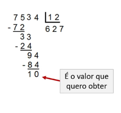

# Recursão 

- Em `Haskell` não é possível controlar o estado do programa ou de variáveis de controle, **não existem estruturas de repetição**.
    - É a única **estrutura de controle** entre comandos em uma linguagem funcional pura.
- Toda repetição necessária deve ser efetuada através da **recursão**.
- O **controle de sequência** intra-comando, em expressões, é definido pelas **prioridades** e **associatividades** das funções e operadores.
- É o processo da função **chamar a si mesma**, <u>direta</u> ou <u>indiretamente</u>.
    - Ou seja, uma **função recursiva** é uma função definida em termos dela mesma.
- É divida em três partes:
    1. **Parição** do problema em <u>subproblemas</u>;
    2. **Base final** da recursão, quando os problemas são pequenos que podem ser resolvidos diretamente, geralmente de maneira trivial (**caso base**);
    3. **Combinação** das respostas parciais, formando a <u>resposta total</u>.

### Exemplo - Fatorial
```haskell
-- Fatorial com Guardas
fatorial :: Int -> Int
fatorial n
    | n == 0 = 1 
    | n > 0 = n * fatorial (n - 1)

-- Fatorial sem Guardas
fat :: Int -> Int
fat 0 = 1
fat 1 = 1
fat n = n * fat (n - 1) -- e se n < 0 ? Retorna um ERRO !!
```

- O primeiro guarda estabelece que o fatorial de 0 é 1: **caso base**.
- O segundo guarda estabelece que o fatorial de um número positivo é o produto deste número e do fatorial de seu antecessor: **caso recursivo**.

> [!NOTE]
> 
> - A função é definida em termos dela mesma, ou seja, a resposta depende de **outra chamada da mesma função**.
> - No exemplo, Se `n < 0` ocorrerá um erro.
> - Como foi colocado 0 e 1 ele entende a assinatura da função, ou seja, já infere que os parâmetros da funções são inteiros.
>  - Nesse caso, já infere que os **parêmetros** são inteiros e a **saída** são do tipo **inteiro**


### Exemplo
- Escreva uma **função recursiva** que calcule o resto inteiro da divisão de dois números, utilizando <u>subtrações sucessivas</u>.



- **Caso base:** Divisor é maior que o dividendo ou divisor e dividendo são iguais, ou seja, quando o resto é **zero**.
    - **Ex:** Dividir 2 por 5, o resto é o próprio 2. 
- **Caso geral:** 

```haskell
divRec :: Int -> Int -> Int
divRec a b 
    | b > a = a 
    | b == a = 0
    | otherwise = divRec(a - b) b

-- Execução
ghci> divRec 15 4
3
ghci> divRec 15 7
1
```

## Recursão com Cauda
- **Recursão em cauda** é um tipo especial de recursão, onde o resultado da chamada recursiva **não precisa ser processado** de maneira alguma para produzir o resultado final.
- O `Haskell` **otimiza chamadas com recursão em cauda**, de maneira a economizar recursos e aumentar a eficiência.
- Ex: A função fatorial não possui recursividade em cauda, uma vez que o resultado da chamada recursiva fatorial (n-1) é <u>multiplicado por n</u> para produzir o resultado final.

### Exemplo - Potência de 2
- Calcula a potência de 2 sem usar a recursão com cauda (precisa multiplicar), a chamada recursiva é dada por: 2 * potencia2 (n-1). 
```haskell
potencia2 :: Int -> Int
potencia2 n 
    | n == 0 = 1
    | n > 0 = 2 * potencia2 (n - 1)
```

- Calcula recursivamente a potência de 2, porém utiliza a recursão com cauda, é **pura**, ou seja, **não precisa de cálculo adicional**.
- Foi adicionado um argumento, que contará o valor acumulado da resposta.
```haskell
potencia2Cauda :: Int -> Int -> Int
potencia2Cauda n acumulado 
    | n == 0 = acumulado
    | n > 1 = potencia2Cauda (n-1) (acumulado * 2)
```

- **Execução:**
```haskell
ghci> potencia2 10
1024
ghci> potencia2Cauda 10 1
1024
```

### Exemplo - Fatorial

```haskell
fatorialCauda :: Integer -> Integer -> Integer
fatorialCauda n acc
    | n == 0 = acc
    | n > 0 = fatorialCauda (n - 1) (n * acc)

-- Execução
ghci> fatorialCauda 7 1
5040
ghci> fatorialCauda 6 1
720
ghci> fatorialCauda 3 1
6
```

> [!CAUTION]:
>
> Para a recursão em cauda como foi acresentado um parâmetro deverá ser apresentado um valor inicial ao utilizar a função, nesse caso, 1.

## Exercícios
1. Escreva uma função **recursiva** que receba como parâmetro dois números inteiros positivos x e n, e retorne o resultado de x*n, realizando sucessivas somas.

```haskell
somaSuc :: Int -> Int -> Int
somaSuc x n 
    | n == 1 = x
    | n > 1 = x + somaSuc x (n - 1) 

-- Vai diminindo o valor de n até que n == 1 e soma o último n da pilha de soma.
-- Execução
ghci> somaSuc 10 7
70
ghci> somaSuc 12 7
84
```

2. Escreva uma função **recursiva** para o cálculo do MDC de dois números inteiros.
```txt
- mdc(x,y) = mdc(x-y, y) se x > y
- mdc(x,y) = mdc(y, x) se x < y
- mdc(x,y) = x se x == y
```

```haskell
mdc :: Int -> Int -> Int
mdc x y 
    | x > y = mdc (x-y) y
    | x < y = mdc y x
    | x == y = x

-- Execução
ghci> mdc 13 11
1
ghci> mdc 36 24
12
ghci> mdc 1 1
1
```

3. Escreva um programa em Haskell com **recursão em cauda** para calcular o n-ésimo número da sequência de Fibonnaci.

```haskell
-- Exercício 03 - Fibonacci com Cauda
fib :: Int -> Int -> Int -> Int
fib n a1 a2 
    | n == 0 = a1
    | n == 1 = a2
    | n > 1 = fib (n - 1) (a1 + a2) a2 

-- Execução
ghci> fib 10 1 1
89
ghci> fib 9 1 1
55
ghci> fib 8 1 1
34
```
