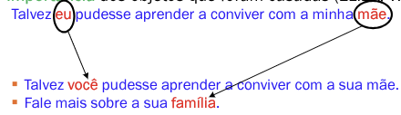

# Paradigma Funcional - Linguagem Prolog

Pertence ao **Paradigma Lógico**.
- Basea-se em **fatos** e **regras**, não em instruções como nas linguagens imperativas.

Foi criado em 1972 por **Colmerauer** e ***Rousell***.  

É mais adequada para problemas onde é necessário descrever conhecimento:
- Aplicações que realizam computação simbólica;
- Compreensão de linguagem natural;
- **Sistemas especialistas**.

## O que é Prolog ?
- `Prolog` é uma linguagem **declarativa** voltada para computação **simbólica** e não numérica. 
- Em vez de instruções imperativas, você descreve **fatos e regras** em uma **base de conhecimento** e faz perguntas ao sistema.

### Características:
- **Paradigma:** programação **lógica**, declarativa.
- Execução é feita por um **interpretador** que possue três componentes: **base de conhecimento**, **memória de trabalho** e **máquina de inferência**.
- Modelo de programação: definir **relações** e consultar essas relações, formulação de consultas.

### Base de Conhecimento
- Programas Prolog dependem de uma **base de conhecimento** com **fatos e regras**.
- Assume-se a Hipótese do Mundo Fechado: o que **não** está na base é considerado **falso**. 
    - Essa hipótese ajuda a garantir **decidibilidade** em muitas consultas.

### Unificação e Busca
- Usa casamento, **unificação**, de termos para **combinar objetivos** com cláusulas da base, semelhante ao mecanismo em outras linguagens/padrões, por exemplo, `hugs`.
- A busca é, normalmente, **linear/sequencial** na base de conhecimento e controlada por **ponteiros** e pela ordem das cláusulas e dos literais.

### Contexto Histórico
- Primeira e mais conhecida linguagem do paradigma de **programação lógica**.
- Proposta originalmente como um **provador de teoremas** especializado por volta de 1970.
- Autores fundadores: ***Alain Colmerauer*** e ***Philippe Roussel*** (Universidade de Aix-Marseille) e Robert Kowalski (Universidade de Edinburgh).
- Não se tornou dominante na engenharia de software geral. 
- Foi seriamente avaliada na década de 1980 como linguagem de propósito geral, mas hoje é usada principalmente em domínios específicos, especialmente **problemas de IA** e **linguística computacional**.
- Mais popular na Europa, enquanto nos EUA linguagens como Lisp tiveram maior presença em IA.

### Implementações e SWI-Prolog

Existem várias implementações: TAP-Prolog, CIAO-Prolog, Win-Prolog, SWI-Prolog (entre outras).
- `SWI-Prolog` começou a ser desenvolvido em 1987 e é um interpretador amplamente usado.

Exemplo de instalação:
```bash
sudo apt update
sudo apt install swi-prolog
swipl
``` 

Ao interagir no interpretador, você verá prompts para entrada:
```prolog
?- (prompt principal)
| (prompt secundário, para continuação de entradas)
```

### Metáfora da Programação em Lógica
- **Teoria Lógica (TL)** = Programa = Banco de Dados dedutivo = BC.
- **Programar** é declarar **axiomas** e **regras**.
- Axiomas da **TL**
    - Fatos da BC 
    - Parte <u>extensional</u> do BD dedutivo
    - Dados <u>explícitos</u> de um BD tradicional
- Regras da **TL** (e da **BC**):
    - parte <u>intencional</u> do BD dedutivo
- Teoremas da **TL** 
    - **Deduzidos** a partir dos **axiomas** e das **regras**.
    - Dados <u>implícitos</u> do BD dedutivo.

## Regras de Produção
- **Esquema de representação** no qual o conhecimento é representado por **regras** situação-ação.

> SE `<condição>` ENTÃO `<ação>`.

- Especialistas tendem a expressar técnicas de solução de problemas em termos destas regras.
- A **condição** estabelece o contexto para aplicação da regra. 
- A **ação** corresponde ao procedimento que acarreta uma conclusão ou mudança (no estado corrente).
- Descrevem **relações** entre **objetos do domínio** de acordo com os valores que os **atributos** podem ter.
    - Incorporam conhecimento <u>prático</u> (**heurístico**), sem um modelo formal.
- Cada **regra** aproxima um fragmento **independente** do conhecimento.
    - Não pode colocar Raciocíno **Causal** com Raciocíno **Diagnóstico**.
    - O conhecimento existente pode ser refinado com a **adição de regras**, permitindo um **crescimento incremental** da base de conhecimentos.
- A performance do sistema cresce proporcionalmente ao crescimento da base de conhecimentos.
- As **definições lógicas** do problema são vistas como uma representação de conhecimento **procedimental**.
    - Aquela em que as **informações de controle** necessárias ao uso do conhecimento **estão embutidas** no próprio conhecimento.

### Exemplo
**SE** animal de estimação e pequeno **ENTÃO** bicho de apartamento.  
**SE** gato ou cachorro ENTÃO animal de estimação.  
**SE** poodle ENTÃO cachorro e pequeno.  
Fido **é** poodle.

- É necessário ampliar a representação de conhecimento procedimental com um **interpretador que siga as instruções** (de controle) **embutidas**.
- Um sistema típico de regras consiste de uma base de conhecimentos (BC), uma memória de trabalho (MT) e uma máquina de inferências.
- **A BC é composta de fatos e regras**.
    - **Regras:** declarações sobre **classes** de objetos 
        - Definem a lógica de processamento.
        - SE condição (antecedente) ENTÃO ação (consequente).
    - **Fatos:** Declarações sobre **objetos específicos**.

### Memória de Trabalho
- Representa o <u>estado do problema</u> em um dado instante. 
    - Permite a **comunicação** entre regras.
- Possui <u>dados dinâmicos</u> de curta duração que **existem** enquanto uma regra estiver sendo <u>interpretada</u>.
    - Variáveis da regra **não** são **estáticas**.
    - O escopo é a própria regra.
- Ação da regra implica modificações na memória de trabalho ou **efeitos colaterais eventuais**.

### Memória de Inferência
Responsável por:

- **Execução** das regras.
- **Determinação** de quais são relevantes, dada uma configuração da memória de trabalho.
- Escolha de quais regras <u>aplicar</u>.

Ciclo de Execução:

- Seleção das regras;
- **Resolução de conflitos:** Na existência de mais de uma regra a aplicar. 
- **Ação:** Execução da(s) regra(s) selecionada(s) com as consequentes alterações na MT ou efeitos colaterais.

### Ciclo de Execução
1. **SELEÇÃO DAS REGRAS (matching)**
    - Casamento das regras com **dados** da MT;
    - Conjunto de **conflito** (regras casadas).
2. **ESTRATÉGIAS UTILIZADAS**
    - Guiada por **dados** (*forward-chaining*).
    - Guiada por **metas** (*backward-chaining*).
3. **ESTADO INICIAL (dados da MT)**
4. **RACIOCÍNIO PARA FRENTE**
    - Casamento: MT com **condições** das regras.
    - Estados: gerados com **disparo das ações.**
    - Meta: permanece a **mesma**. 
    - Parada: **asamento** com meta.
5. **RACIOCÍNIO PARA TRÁS**
    - Início: configuração objetivo final (**meta**).
    - Casamento: MT com **ação** da meta (mesmo em parte).
    - Estados: gerados com as **condições**.
    - Meta: **estado atual**
    - Parada: casamento com **estado inicial**.

### Exemplo de Raciocínio
- **Fatos:** Estados Iniciais
    - marco é homem.
    - césar é homem.
- **Regra 1**: SE X é homem ENTÃO X é pessoa
- **Meta:** Existe pessoa?


- Figura (a): *forward-chaining*
- Figura (b): *backward-chainin* 

> [!IMPORTANT]
>
> Prolog usa raciocínio *backward*.

### Resolução de Conflitos
- Seleção da **ordem de aplicação das regras** do conjunto de conflito. 
- Preferência baseada na **ordem** em que as regras aparecem (`Prolog`).
    - `Prolog` sempre pega a primeira se falhar vai para a segunda.
    - **Importância** dos objetos que foram casadas (ELIZA, Weizenbaum, 1966).



- Eliza foi o primeiro Chat Bot criado.
- Em **Estados:** Consiste em, temporariamente, disparar **todas as regras selecionadas** e utilizar uma **função heurística para avaliar os resultados** de cada uma delas, e **priorizá-las** segundo o seu mérito.

## Implicação

- Representação da Implicação via **tabela verdade**  

| $A$ | $B$ | $A \to B$ |
| :-: | :-: | :-------: |
|  V  |  V  |     V     |
|  V  |  F  |     F     |
|  F  |  V  |     V     |
|  F  |  F  |     V     |


- **Equivalência Semântica:** $A \to B \Leftrightarrow \neg A \lor B$.

| $\neg A$ | $B$ | $\neg A \lor B$ |
| :------: | :-: | :-------------: |
|    V     |  V  |       V         |
|    V     |  F  |       F         |
|    F     |  V  |       V         |
|    F     |  F  |       V         |
