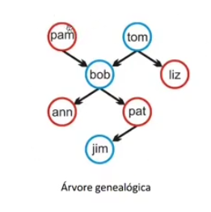

# Estrutura, Fatos e Regras
Um programa `Prolog` é uma coleção de **fatos** e **regras**.

## Termos

- São usados para construir programas e estruturas de dados.
- Um termo pode ser:
  - uma constante
  - uma variável
  - um termo composto

```prolog
<termo> ::= <simples> | <termo-composto>

<simples> ::= <constante> | <variável>

<constante> ::= <átomo> | <número>
```

## Variáveis

- Nomeiam entidades do universo do discurso.
- Representam valores desconhecidos.
- Iniciam com letra **maiúscula** ou `_`.
- Podem conter letras, dígitos e `_`.

```prolog
<variável> ::= _
              | <maiúscula>
              | <variável><letra>
              | <variável><dígito>
              | <variável>_

% Exemplos
X
X_25
Avo
Gente
G12
Pai_sangue
_chica
_b
_
```

### Variável Anônima
- Representa algo que **“não importa”**.
- É representada por `_`.

```prolog
haschild(X) :- parent(X,_).
```

### Comparação

```prolog
likes(mary,_), likes(_,mary).
likes(mary,X), likes(X,mary).
```

- No primeiro caso, os `_` são independentes.
- No segundo caso, `X` deve representar o mesmo valor.


## Constantes

- Representam valores fixos.
- Podem ser:
  - átomos
  - números

### Átomos

- Átomos são nomes textuais usados para identificar:
  - dados
  - predicados
  - operadores
  - módulos
  - arquivos
  - etc.

- Podem ser reconhecidos pelo predicado:

```prolog
atom(X).
```

```prolog
<átomo> ::= <átomo-alfa>
           | <átomo-simb>
           | <átomo-apostrofado>
           | <átomo-especial>
```

### Átomo Alfabético

- Deve iniciar com letra minúscula.
- Pode conter letras, dígitos e `_`.

```prolog
<átomo-alfa> ::= <letra-minúscula>
                | <átomo-alfa><letra>
                | <átomo-alfa><dígito>
                | <átomo-alfa>_

% Exemplos
anna
nil
avo
amora
a2
a_
big_32
xMax
```

### Átomo Simbólico

```prolog
<átomo-simb> ::= <caracter-simb>
                | <átomo-simb><caracter-simb>
```

### Caracteres Permitidos

```prolog
#  $  &  *  +  -  .  /  :  <  =  >  @  \  ^  ~ %

% Exemplos 
&
&:
++
<<
>>
<--
..
*-/*
```

> [!NOTE]
>
> Desde que não seja um operador primitivo.

### Átomo Apostrofado

```prolog
<átomo-apostrofado> ::= 'qualquer sequência de caracteres'

% Exemplos

'Tom'
'Avo'
'123'
'alo mundo'
'x_>:'
'x'
```

### Átomo Especial

```prolog
<átomo-especial> ::= ! | []
```

| Átomo | Significado |
|---|---|
| `!` | cut |
| `[]` | lista vazia |


### Números

- Também são constantes.
- Podem ser inteiros ou reais.

```prolog
<número> ::= <inteiro> | <real>

% Inteiros
23
5753
-42

% Reais
3.14
-0.57
1.23
0.123E-10
-1.32e102
```

- Podem ser reconhecidos por:

```prolog
number(X).
```

## Termos Compostos

- São estruturas formadas por:
  - um átomo
  - seguido de argumentos entre parênteses


```prolog
<termo-composto> ::= <lista>
                    | <estrutura>
```

- Pode ser identificado pelo predicado:

```prolog
compound(X).
```

## Estrutura

- Semelhante a um registro.
- Possui:
  - nome
  - campos/argumentos

```prolog
nome(t1,t2,...,tn)
nome/n

% Exemplos
parent(pam,bob).
deseja(cruzeiro,voltar(serie,a)).
deseja(cruzeiro,voltar(serie,a),ano(2020)).
data(28,setembro,2020).
```

- Um termo composto **não é uma função**.
- É apenas uma estrutura de dados.


## Operadores 

```prolog
% Relacionais
<operadores-relacionais> ::= < | = | =< | >= | >

% Aritméticas
<aritmética> ::= <aritmética-genérica>
               | <aritmética-bitwise>
```

## Caracteres Básicos Utilizados

### Letras e dígitos

```prolog
A,B,...,Z
a,b,...,z
0,1,...,9
```

### Caracteres especiais

```prolog
+ - * / < > = : . & _ ~
```

## Cláusulas Prolog
São **fatos**, **regras** ou **consultas**.

**Base de conhecimentos (BC):** Fatos, regras.
- Arquivo texto que é carregado via `consult(arquivo-texto)`.

**Prompt interpretador:** Consultas


## Fato
Fatos são sempre verdadeiros, mas as regras precisam ser validadas.  
- São **Relação verdadeira** entre termos, via predicado.
- Fato é uma **cláusula sem nenhuma condição**.

Como criar um fato em uma base `Prolog`:

```prolog
gosta(marcelo, leda).
gosta(marcelo, cruzeiro).
homem(x). % Siginifica que "x é um homem"
mulher(x). % Siginifica que "x é um mulher"
genitor(x,y). % Significa que "x é genitor de y" ou "y é gerado de x"
```

> ![NOTE] 
>
> mulher, homem e genitor são chamados de **functor**.

### Predicado
- É responsabilidade do programador definir os **predicados** corretamente.
- Predicado expressa uma **relação** entre termos.
- Um **predicado** é uma <u>declaração</u> que deve ser **verdadeira** ou **falsa** dependendo do valor de suas variáveis.

```prolog
<functor> (t1,t2,...,tn). 
```

### Aridade
- Quantidade de parâmetros do **functor/predicado**.
- Expressa por `<functor>/aridade`. 

```prolog
gosta/2 ou gosta/3
```

- Predicados com mesmo functor podem ter diferentes aridades:
```prolog
gosta(joao, ler, livros).
gosta(joao,maria).
```

### Fatos Universais
- Fatos com variáveis **universalmente quantificadas**.
- **Functor** e átomo iniciam com letra **minúscula**.

```prolog
mais(0,X,X).                % fato
mais(A,B,C) :- C is A + B.  % regra
vezes(1,X,X).               % fato
vezes(A,B,C) :- C is A * B. % regra
```

### Variável
- Está associada a um indivíduo não especificado, é uma incógnita de valor único. 
- **É local a uma sentença**.

### Exemplo



```prolog
% Fatos
homem(tom).
homem(bob).
homem(jim).

mulher(pam).
mulher(ann).
mulher(pat).
mulher(liz).

genitor(tom, bob).
genitor(tom, liz).
genitor(pam, bob).
genitor(bob, ann).
genitor(bob, pat).
genitor(pat, jim).

% Consultas
% pam é mulher ?
?- mulher(pam). 
true.

% Quem são as mulheres na nossa base de conhecimento ?
?- mulher(X). 
X = pam ;
X = ann ;
X = pat ;
X = liz.

% Quem são os filhos de Bob ?
?- genitor(bob,X).
X = ann ;
X = pat.

% Quem são os pais de Bob ?
?- genitor(X,bob).
X = tom ;
X = pam.

% Quem é genitor de quem ?
?- genitor(X,Y).
X = tom,
Y = bob ;
X = tom,
Y = liz ;
X = pam,
Y = bob ;
X = bob,
Y = ann ;
X = bob,
Y = pat ;
X = pat,
Y = jim.
```

> [!NOTE] 
>
> Ao digitar `;` após uma resposta, o `PROLOG` procura procura por outra resposta!  
> `;` == `OU`.

## Consultas
É o meio **recuperar informações** em Prolog.  
A cláusula `proximo(Brasil, Japao)` é uma consulta `Prolog` pois "Brasil" e "Japao" são **termos**, mais especificamente **variáveis**.  
Para responder as consultas o `Prolog` utiliza:

- **Matching:** Checa se determinado padrão está presente, para saber quais fatos e regras podem ser utilizados.
- **Unificação:** Substitui o **valor de variáveis** para determinar se a consulta é **satisfeita** pelos fatos ou regras da base.
- **Resolução:** Verifica se uma consulta é **consequência lógica** dos <u>fatos e regras</u> da base.
- **Recursão:** Utiliza **regras** que **chamam si mesmas** para realizar demonstrações.
- **Backtracking:** Para checar **todas as possibilidades** de resposta.

O interpretador verifica se a `query` é uma **consequência lógica** dos fatos.      
**Query:** É uma pergunta sobre a base de conhecimento.

### Exemplos

```prolog
% Base de Conhecimeto
pai(joao,mane).
pai(joao, ze).
pai(joao, quim).
pai(mane,maria).
pai(ze, zefa).
pai(ze, ruth).

irmas(A,B) :- pai(P,A), pai(P,B),  A \== B. 
avo(A,N) :- pai(P,N), pai(A,P).
tio(T,S) :- pai(P,S), irmas(P,T).

% Execução
?- pai(P,zefa).
P = ze 

?- irmas(quim,A).
A = mane;
A = ze;
false.

?- tio(T,zefa).
T = mane;
T = quim;
false.

?- avo(A,N).
A = joao , N = maria;
A = joao , N = zefa;
A = joao , N = ruth;
false
```

### Outro Exemplo
```prolog
livro(autor('Fernando Albuquerque'), titulo('Orientacao a Objetos')).
livro(autor('Pedro Rezende'), titulo('Criptografia em Redes')).
livro(autor('Maristela Holanda'), titulo('Modelos de BD')).
livro(autor('Marcelo Ladeira'), titulo('Mineração de Dados')).
livro(autor('Fernando Albuquerque'), titulo('Redes de Computadores')).
livro(autor('Maria Emilia'), titulo('Genoma Humano')).
livro(autor('Mauricio Ayala'), titulo('Funcoes de Reescrita')).
livro(autor('Andre Drummond'), titulo('Infraestrutura de TI')).
livro(autor('Thiago de Paulo'), titulo('Mineração de Textos')).
livro(autor('Maria de Fatima'), titulo('IA na Educacao')).
livro(autor('Wilson Veneziano'), titulo('Informatica na Educacao')).
livro(autor('Li Weigang'), titulo('Transporte Aereo')).
livro(autor('Genaina Nunes'), titulo('Especificacoes de Requisitos')).
artigo(autor('Marcelo Ladeira'), titulo('UnBBayes: A Java Framework for Reasoning')).
artigo(autor('Marcos Caetano'), titulo('5G the next generation')).
artigo(autor('Rodrigo Bonifacio'), titulo('Adopting DevOps')).

% Consultas
?- livro(X,Y).
X = autor('Fernando Albuquerque'),
Y = titulo('Orientacao a Objetos') ;
X = autor('Pedro Rezende'),
Y = titulo('Criptografia em Redes') ;
X = autor('Maristela Holanda'),
Y = titulo('Modelos de BD') ;
X = autor('Marcelo Ladeira'),
Y = titulo('Mineração de Dados')
?- livro(autor('Fernando Albuquerque'),Y).

/* Há um ponteiro apontando para o fato corrente na base.
* Quando uma solicitação é feita, o ponteiro é atualizado para refletir o novo fato que atende a solicitação.
* Quando o ponteiro chega ao fim da base, a solicitação corrente falha.
*/

Y = titulo('Orientacao a Objetos') ;
Y = titulo('Redes de Computadores');
false.

% Backtracking (retrocesso)
?- artigo(autor(X),_).
X = 'Marcelo Ladeira' ;
X = 'Marcos Caetano' ;
X = 'Rodrigo Bonifacio‘.

?- artigo(autor(X),_), write(X), nl, fail.
Marcelo Ladeira
Marcos Caetano
Rodrigo Bonifacio
false.
```

###  Consulta Existencial:
```prolog
?- mais(3,X,8).  % existe um X + 3 = 8 ?
?- pai(P,joao).  % existe um P pai de joao ?
```

### Consulta Conjuntiva e Variáveis Cotizadas:
```prolog
?- pai(joao, F), pai(F,N).  % Quem são os netos de joão? 
?- pai(P,maria), tio(T,P).  % Quem é o tio avó de Maria?

% Quem é pai ou mãe de quem?
?- parent(X,Y).
X = pam;
Y = bob;
X = tom;
Y = bob;
X = tom;
Y = liz
```

> [!NOTE]
>
> - Ao utilizar o `;` ocorre um **backtrack**, libera-se a última variável instanciada.

### Conectivo AND
- Usa-se a vŕigula (`,`) para expressar o conectivo `AND`.
- Quem é um **pai** ou **mãe** X de Ann? Também o é de Pat?

```prolog
% Está querendo saber se ann e pat são irmãos
?- parent(X,ann),parent(X,pat).
X = bob
```

- Após verificar que `parent(bob,ann)` é válido, ele volta com o **ponteiro** para o **início** da **base de conhecimento**.

### Exemplos


```prolog
% Exemplo 01
?- parent(bob,pat). % Query
true.
?- parent(liz,pat).
fail. 
?- parent(X,liz). % Pergunta quem é o pai/mãe da liz, X é uma variável.
X = tom 
?- parent(bob, X). % Quer saber quem são os filhos de bob.
X = ann;
X = pat

% Exemplo 02

% Fatos
animal(urso).
animal(peixe).
animal(peixinho).
animal(lince).
animal(raposa).
animal(coelho).
animal(veado).
animal(guaxinim).
planta(alga).
planta(grama).
come(urso, peixe).
come(urso, raposa).
come(urso, veado).
come(lince, veado).
come(peixe, peixinho).
come(peixinho, alga).
come(guaxinim, peixe).
come(raposa, coelho).
come(coelho, grama).
come(veado, grama).
come(urso, guaxinim).

% Consultas
% Quem são as plantas ?
?- planta(X).
X = alga ;
X = grama.

% A raposa come algum outro animal ou planta ?
?- come(raposa,_).
true.

% Tem algum animal que come algum outro animal ou planta ?
?- come(_,_).
true .

% Existe algum animal que come a grama e Quem são ?
?- come(X,grama).
X = coelho ;
X = veado.

% Quem são os animais herbívoros ?
?- come(X, grama) ; come(X, alga).
X = coelho ;
X = veado ;
X = peixinho.

?- come(X,Y), planta(Y).
X = peixinho,
Y = alga ;
X = coelho,
Y = grama ;
X = veado,
Y = grama ;
false.
```

## Regras
Regras **facilitam a execução de consultas** e tornam um programa muito mais expressivo.  
Uma cláusula `Prolog` é equivalente à uma fórmula em lógica de 1º Ordem, então, em `Prolog` existem os conectivos:

- `:-`: Se, equivale a **implicação**.
- `,`: e, equivale a **conjunção**.
- `;`: ou, equivale a **disjunção**.

Exemplo: A fórmula $A(x) \rightarrow B(x) \lor (C(x) \land D(x))$, seria escrita em `Prolog` como: 

```prolog
a(X) :- b(X); (c(X) , d(X))
```

Prolog não utiliza **quantificadores** explicitamente, porém, trata todas as regras como se elas estivessem **universalmente quantificadas** e usa ~ EU (**Eliminição Universal**).

**Consultas** são realizadas sobre **regras** do mesmo modo como ocorrem sobre fatos.  
Uma regra se divide em **conclusão** (ou **cabeça**) e condição da seguinte forma:

```prolog
Conlusão(Arg) :- Condição1(Arg) conectivo Condição2(Arg) ... 
```

Utilizando ***matching***, `Prolog` encontra quais regras podem ser utilzadas para satisfazer uma consulta. Cada vez que um ***matching*** ocorre a satisfação da regra passa a ser a **meta atual**.


### Metas
**Meta** só é verdadeira se suas **submetas também o forem**.

Para provar que meta é verdadeira, deve-se provar antes que suas submetas também são.
- Meta e Submetas são **relações predicativas** entre termos. 
- Termos nomeiam objetos do discurso.

```prolog
meta :- sm_1, sm_2,..., sm_k
cabeça :- corpo.
```

O operador `:-` é denominado **pescoço** (neck).

#### Exemplo
Para todo X e Y, Y é filho de X se X é um pai ou mãe de Y

```prolog
offspring(Y,X) :- parent(X,Y).

% offspring: Cabeça, só pode ter uma. 
% :- : Pescoço só pode ter uma. 
% parent(X,Y): Corpo, pode ter diversos membros, seriam as condições.
```

**Semântica:** se `parent(X,Y)` então `offspring(Y,X)`.  
**Definição Recursiva:**
- Para todo X e Z, X é um **antepassado** de Z se X é pai ou mãe de Z.
- Para todo X e Z, X é um **antepassado** de Z se existe Y tal que:
    - X é pai ou mãe de Y e
    - Y é um antepassado de Z.


- `predecessor(X,Z)` só vai ocorrer se `parent(X,Z)` for **verdadeiro**.

```prolog
% Exemplo 01
?- predecessor(pam,X).
X = bob;
X = ann;
X = pat;
X = jim;
fail.

?- predecessor(W,jim).
W = pat

% Exemplo 02
/* Regras:
* prole(X,Y) :- genitor(Y,X)
* mae(X,Y) :- genitor(X,Y), mulher(X);
* avos(X,Z) :- genitor(X,Y) , genitor(Y,Z).
*/

% Pam é filho de Bob ?
?- prole(pam,bob).
false.

% Bob é filho de Pam ?
?- prole(bob,pam).
true.

% Bob é filho de Quem/ Quem são os pais de Bob ?
?- prole(bob,X).
X = tom ;
X = pam.

% Tom é filho de Quem/ Quem são os pais de Tom ?
?- prole(tom,X).
false.

% Tom tem algum filho ?
?- prole(_,tom).
true .

% Quem são os filhos de Tom ?
?- prole(X,tom).
X = bob ;
X = liz

% Pam é mae de Bob ?
?- mae(pam,bob).
true.

% Tom é mãe de Bob ?
?- mae(tom,bob).
false.

% Quem é a mãe de Bob ?
?- mae(X,bob).
X = pam.

% Pam é mãe de quem ?
?- mae(pam,X).
X = bob.

% Liz é mãe de alguém ?
?- mae(liz,X).
false.

% Existe alguma mãe na base ?
?- mae(X,Y).
X = pam,
Y = bob.

% Tom é avô de Ann ?
?- avos(tom,ann).
true.

% Pam é avó de Ann ?
?- avos(pam,ann).
true.

% Quem são os avós de Ann ?
?- avos(X,ann).
X = tom ;
X = pam.

% De quem Tom é avô ?
?- avos(tom,X).
X = ann ;
X = pat.

% Liz possui netos ?
?- avos(liz,X).
false.
```

## Exercícios

### 1. Considere a seguinte base de fatos em Prolog:
```prolog
% Fatos
aluno(joao, calculo)
aluno(maria, calculo)
aluno(joel, programacao)
aluno(joel, estrutura)

frequenta(joao, puc)
frequenta(maria, puc)
frequenta(joel, ufrj)

professor(carlos, calculo)
professor(ana_paula, programacao)
professor(pedro, programacao)

funcionario(pedro, ufrj)
funcionario(ana_paula, puc)
funcionario(carlos, puc)
```

Escreva as seguinte regras em Prolog:  
a. Quem são os alunos do Professor X ?
    
```prolog
% Regra
sao_alunos_do_professor(A,X) :- professor(X,Materias) , aluno(A,Materias).

% Consulta
?- sao_alunos_do_professor(A,pedro).
A = joel.

?- sao_alunos_do_professor(joel,P).
P = ana_paula ;
P = pedro ;
false.

% Joel é aluno de algum professor ?
?- sao_alunos_do_professor(joel,_).
true ;
```
    
b. Quem são as pessoas que estão associadas a uma universidade X ? (alunos e professores)
    
```prolog
alunos_associados(Aluno, Faculdade) :- frequenta(Aluno, Faculdade). 
professores_associados(Professor, Faculdade) :- funcionario(Professor, Faculdade). 
associados(Pessoa, Faculdade) :- alunos_associados(Pessoa, Faculdade) ; professores_associados(Pessoa, Faculdade). 

% Consulta
?- associados(joel, _).
true .

?- associados(joel, C).
C = ufrj ;
false.

?- associados(mary, C).
false.

?- associados(pedro, C).
C = ufrj.

?- associados(pedro, ufrj).
true.

?- associados(pedro, ifmg).
false.
```

### 2. Elabore um programa em Prolog que forneça o nome da capital de qualquer estado da região sudeste. 

```prolog
estados(rj, 'Rio de Janeiro').
estados(sp, 'São Paulo').
estados(mg, 'Belo Horizonte').
estados(es, 'Vitória').

capital(Estado, Capital) :- estados(Estado, Capital). 

% Consulta
?- capital(mg,C).
C = 'Belo Horizonte'.
```

### 3. Implemente um programa para determinar quais tipos sanguíneos podem doar/receber sangue de quais tipos. A tabela seguinte fornece a informação necessária para a implementação. Depois faça as consultas para saber se um tipo pode doar para outro tipo, e se um tipo pode receber de outro tipo:

|     |  A  |  B  |  AB |  O  |
| :-: | :-: | :-: | :-: | :-: |
|  A  | Doa/Recebe | - | Doa | Recebe |
|  B  | - | Doa/Recebe | Doa | Recebe |
|  AB | Recebe | Recebe | Doa/Recebe | Recebe |
|  O  | Doa | Doa | Doa | Doa/Recebe |

```prolog
doa(a,a). 
doa(a,ab). 
doa(b,b). 
doa(b,ab). 
doa(ab,ab). 
doa(o,a). 
doa(o,b). 
doa(o,ab). 
doa(o,o). 

recebe(a,a).
recebe(a,o).
recebe(b,b).
recebe(b,o).
recebe(ab,a).
recebe(ab,b).
recebe(ab,ab).
recebe(ab,o).
recebe(o,o).

% Consultas
?- doa(a,X).
X = a ;
X = ab.

?- recebe(a,X).
X = a ;
X = o.

?- doa(a,o).
false.

?- doa(a,ab).
true.

?- recebe(a,ab).
false.
```

## Predicados Bidirecionais

```prolog
% Base de Conhecimento
pai(joao,mane).
pai(joao, ze).
pai(joao, quim).
pai(mane,maria).
pai(ze, zefa).
pai(ze, ruth).

irmas(A,B) :- pai(P,A), pai(P,B), A \= B. 
avo(A,N) :- pai(P,N), pai(A,P).
tio(T,S) :- pai(P,S), irmas(P,T).

% Execução
?- pai(P,zefa).
P = ze 

?- pai(ze, F)
F = zefa;
F=ruth;
false.

?- tio(T,zefa).
T = mane;
T = quim;
false.

?- avo(A,N).
A = joao, N = maria;
A = joao, N = zefa;
A = joao, N = ruth;
false.
```
