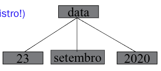

# Paradigma Funcional - Linguagem Prolog

## O que é Prolog ?
- **Linguagem Declarativa**
    - Não tem instruções.
- Primeira e mais usada linguagem do paradigma programação em lógica.
    - Proposta em 1970 como **provador de teoremas** especializado.
    - Alain Colmerauer e Phillipe Roussel (Universidade de Aix-Marseille). 
    - Robert Kowalski (Universidade de Edinburgh).
    - Outras pessoas importantes... **Helder Coelho**, Universidade de Lisboa. 
- **Não** usada extensivamente na prática de **engenharia de software**.
    - Seriamente avaliada nos 80s como **linguagem de propósito geral**.
        - linguagem do Projeto V Geração do Japão.
    - Hoje é usada em contextos específicos.
        - Maioria relacionados a **IA**.
        - Mais utilizada na Europa.
        - EUA: A linguagem `LISP` é mais utilizada em IA.  
- O desenvolvimento `SWI PROLOG` inicio em 1987.

### Metáfora da Programação em Lógica
- **Teoria Lógica (TL)** = Programa = Banco de Dados dedutivo = BC.
- **Programar** é declarar **axiomas** e **regras**.
- Axiomas da **TL**
    - Fatos da BC 
    - Parte <u>extensional</u> do BD dedutivo
    - Dados <u>explícitos</u> de um BD tradicional
- Regras da **TL** (e da **BC**):
    - parte <u>intencional</u> do BD dedutivo
- Teoremas da **TL** 
    - **Deduzidos** a partir dos **axiomas** e das **regras**.
    - Dados <u>implícitos</u> do BD dedutivo.

### O que é PROLOG ?
- **Uma linguagem de programação para computação simbólica não numérica**.
    - **Interpretador**.
    - Base de conhecimentos, Memória de trabalho e Máquina de inferência.
- Com o que se parece programar em Prolog?
    - Definir relações e formular perguntas sobre as relações.
- O que é o `SWI-PROLOG` ?
    - Um **Interpretador**.

```prolog
?- prompt principal
| - prompt secundario
```

- O prolog precisa ter uma base.
- O que não estiver na **base de conhecimento**, nesse caso um mundo fechado, é falsa.
    - Hipotése de mundo fechado é para gerar decidibilidade.
- Usa **casamento padrão** assim como no `hugs`.
- Percorre a base de conhecimento de forma **linear** usando **ponteiros**.

### Exemplo


```prolog
?- parent(bob,pat). % Query
true.
?- parent(liz,pat).
fail. 
?- parent(X,liz). % Pergunta quem é o pai/mãe da liz, X é uma variável.
X = tom 
?- parent(bob, X). % Quer saber quem são os filhos de bob.
X = ann;
X = pat
```

- **Base de conhecimento** é uma **relação**.

> [!NOTE] 
>
> Ao digitar `;` após uma resposta, o `PROLOG` procura procura por outra resposta!  
> `;` == `OU`.

- O interpretador verifica se a `query` é uma **consequência lógica** dos fatos. 
    - **Query:** É uma pergunta sobre a base de conhecimento.

```prolog
% Quem é pai ou mãe de quem?
?- parent(X,Y).
X = pam;
Y = bob;
X = tom;
Y = bob;
X = tom;
Y = liz
```

- Ao utilizar o `;` ocorre um **backtrack**, libera-se a última variável instanciada.

#### Conectivo AND
- Usa-se a vŕigula (`,`) para expressar o conectivo `AND`.
- Quem é um **pai** ou **mãe** X de Ann? Também o é de Pat?

```prolog
% Está querendo saber se ann e pat são irmãos
?- parent(X,ann),parent(X,pat).
X = bob
```

- Após verificar que `parent(bob,ann)` é válido, ele volta com o **ponteiro** para o **início** da **base de conhecimento**.

### Exemplo - PROLOG com Regras
- Para todo X e Y, Y é filho de X se X é um pai ou mãe de Y
    - `offspring(Y,X) :- parent(X,Y)`.
    - `offspring`: Cabeça, só pode ter uma. 
    - `:-`: Pescoço só pode ter uma. 
    - `parent(X,Y)` = Corpo, pode ter diversos membros, seriam as **condições**. 
    - **Semântica:** se `parent(X,Y)` então `offspring(Y,X)`.

- **Definição Recursiva:**
    - Para todo X e Z, X é um **antepassado** de Z se X é pai ou mãe de Z.
    - Para todo X e Z, X é um **antepassado** de Z se existe Y tal que:
        - X é pai ou mãe de Y e
        - Y é um antepassado de Z.


- `predecessor(X,Z)` só vai ocorrer se `parent(X,Z)` for **verdadeiro**.

```prolog
?- predecessor(pam,X).
X = bob;
X = ann;
X = pat;
X = jim;
fail.

?- predecessor(W,jim).
W = pat
```

## Regras de Produção
- **Esquema de representação** no qual o conhecimento é representado por **regras** situação-ação.

> SE `<condição>` ENTÃO `<ação>`.

- Especialistas tendem a expressar técnicas de solução de problemas em termos destas regras.
- A **condição** estabelece o contexto para aplicação da regra. 
- A **ação** corresponde ao procedimento que acarreta uma conclusão ou mudança (no estado corrente).
- Descrevem **relações** entre **objetos do domínio** de acordo com os valores que os **atributos** podem ter.
    - Incorporam conhecimento <u>prático</u> (**heurístico**), sem um modelo formal.
- Cada **regra** aproxima um fragmento **independente** do conhecimento.
    - Não pode colocar Raciocíno **Causal** com Raciocíno **Diagnóstico**.
    - O conhecimento existente pode ser refinado com a **adição de regras**, permitindo um **crescimento incremental** da base de conhecimentos.
- A performance do sistema cresce proporcionalmente ao crescimento da base de conhecimentos.
- As **definições lógicas** do problema são vistas como uma representação de conhecimento **procedimental**.
    - Aquela em que as **informações de controle** necessárias ao uso do conhecimento **estão embutidas** no próprio conhecimento.

### Exemplo
**SE** animal de estimação e pequeno **ENTÃO** bicho de apartamento.  
**SE** gato ou cachorro ENTÃO animal de estimação.  
**SE** poodle ENTÃO cachorro e pequeno.  
Fido **é** poodle.

- É necessário ampliar a representação de conhecimento procedimental com um **interpretador que siga as instruções** (de controle) **embutidas**.
- Um sistema típico de regras consiste de uma base de conhecimentos (BC), uma memória de trabalho (MT) e uma máquina de inferências.
- **A BC é composta de fatos e regras**.
    - **Regras:** declarações sobre **classes** de objetos 
        - Definem a lógica de processamento.
        - SE condição (antecedente) ENTÃO ação (consequente).
    - **Fatos:** Declarações sobre **objetos específicos**.

### Memória de Trabalho
- Representa o <u>estado do problema</u> em um dado instante. 
    - Permite a **comunicação** entre regras.
- Possui <u>dados dinâmicos</u> de curta duração que **existem** enquanto uma regra estiver sendo <u>interpretada</u>.
    - Variáveis da regra **não** são **estáticas**.
    - O escopo é a própria regra.
- Ação da regra implica modificações na memória de trabalho ou **efeitos colaterais eventuais**.

### Memória de Inferência
- Responsável por:
    - **Execução** das regras.
    - **Determinação** de quais são relevantes, dada uma configuração da memória de trabalho.
    - Escolha de quais regras <u>aplicar</u>.
- Ciclo de Execução:
    - Seleção das regras;
    - **Resolução de conflitos:** Na existência de mais de uma regra a aplicar. 
    - **Ação:**
        - execução da(s) regra(s) selecionada(s) com as consequentes alterações na MT ou efeitos colaterais.

#### Ciclo de Execução
1. **SELEÇÃO DAS REGRAS (matching)**
    - Casamento das regras com **dados** da MT;
    - Conjunto de **conflito** (regras casadas).
2. **ESTRATÉGIAS UTILIZADAS**
    - Guiada por **dados** (*forward-chaining*).
    - Guiada por **metas** (*backward-chaining*).
3. **ESTADO INICIAL (dados da MT)**
4. **RACIOCÍNIO PARA FRENTE**
    - Casamento: MT com **condições** das regras.
    - Estados: gerados com **disparo das ações.**
    - Meta: permanece a **mesma**. 
    - Parada: **asamento** com meta.
5. **RACIOCÍNIO PARA TRÁS**
    - Início: configuração objetivo final (**meta**).
    - Casamento: MT com **ação** da meta (mesmo em parte).
    - Estados: gerados com as **condições**.
    - Meta: **estado atual**
    - Parada: casamento com **estado inicial**.

##### Exemplo de Raciocínio

**Fatos**
- marco é homem.
- césar é homem.
**Regra 1**: SE X é homem ENTÃO X é pessoa
**Meta:** Existe pessoa?
**Solução**
- Estado inicial: fatos
- Figura (a): *forward-chaining*
- Figura (b): *backward-chainin* 
- Prolog usa raciocínio *backward*.


#### Resolução de Conflitos
- Seleção da **ordem de aplicação das regras** do conjunto de conflito. 
- Preferência baseada na:
    - Na **ordem** em que as regras aparecem (`Prolog`).
        - `Prolog` sempre pega a primeira se falhar vai para a segunda.
    - **Importância** dos objetos que foram casadas (ELIZA, Weizenbaum, 1966).


- Eliza foi o primeiro Chat Bot criado.
- Em **Estados:**
    - Consiste em, temporariamente, disparar **todas as regras selecionadas** e utilizar uma **função heurística para avaliar os resultados** de cada uma delas, e **priorizá-las** segundo o seu mérito.

## Linguagem Prolog
- Programação em Lógica:
    - Definições lógicas são vistas como programas. 
    - Em Prolog definições lógicas são **cláusulas de Horn**.
- É praxe representar apenas o conhecimento **positivo** como **asserções afirmativas**.
- Hipótese do Mundo Fechado:
    - As declarações **relevantes e verdadeiras** estão **contidas** na BC ou podem ser **derivadas** a partir de fatos, regras e a BC.
- Negação: Ausência da declaração.
    - Não é uma negação lógica.
- Resolução por **refutação**: 
    - $P$ é consistente **se falhar a prova** de $\neq P$.

## Implicação

- Representação da Implicação via **tabela verdade**  

| $A$ | $B$ | $A \to B$ |
| :-: | :-: | :-------: |
|  V  |  V  |     V     |
|  V  |  F  |     F     |
|  F  |  V  |     V     |
|  F  |  F  |     V     |


- **Equivalência Semântica:** $A \to B \Leftrightarrow \neg A \lor B$.

| $\neg A$ | $B$ | $\neg A \lor B$ |
| :------: | :-: | :-------------: |
|    V     |  V  |       V         |
|    V     |  F  |       F         |
|    F     |  V  |       V         |
|    F     |  F  |       V         |

### Cláusulas de Horn
- **Cláusula que tem, no máximo, um literal positivo**
    - "Well Formed Formula" em forma conjuntiva normal e sem conectivo $\land$.
    - Prefixo quantificadores universais ($\forall$) aplicado a predicados conectados por $\lor$.

#### Lógica Decidível
- <u>Notação Lógica</u>
    - $\forall x ( (\text{estimacao}(x) \land \text{pequeno}(x)) \to \text{bichoapt}(x) ) $
    - $\forall x ( ( \text{gato}(x) \lor \text{cachorro}(x)) \to \text{estimacao}(x) ) $
    - $\forall x ( \text{poodle}(x) \to (\text{cachorro}(x) \land \text{pequeno}(x)) ) $
    - $\text{poodle}(fido)$

- <u>Cláusulas de Horn</u>
    - $\neg \text{estimacao}(x) \lor \neg \text{pequeno}(x) \lor \text{bichoapt}(x)$, foi aplicado Demorgan.
    - $\neg \text{gato}(x) \lor \text{estimacao}(x)$, Após aplicar Demorgan foi divido em duas parte.
    - $\neg \text{cachorro}(x) \lor \text{estimacao}(x)$, parte dois. 
    - $\neg \text{poodle}(x) \lor \text{cachorro}(x)$, Dividiu em duas partes pois só pode ter um literal,só "ou", pela Cláusula de Horn.
    - $\neg \text{poodle}(x) \lor \text{pequeno}(x)$
    - $\text{poodle}(fido)$

> [!NOTE]
>
> Uma teória em sistema lógico é decidível se existe um algoritmo eficiente para determinar se fórmulas arbitrárias pertencem a ela.


## Características
- Quantificadores universais **não** são explicitados.
- Conectivos `,` e `;`, respectivamente $\land$ e $\lor$.
- A regra $p \to q$ é representada como `q :- p`. 
- **Cabeça** `:-` lista de predicados.

- <u>Cláusulas de Horn</u>
    - $\neg \text{estimacao}(x) \lor \neg \text{pequeno}(x) \lor \text{bichoapt}(x)$
    - $\neg \text{gato}(x) \lor \text{estimacao}(x)$
    - $\neg \text{cachorro}(x) \lor \text{estimacao}(x)$
    - $\neg \text{poodle}(x) \lor \text{cachorro}(x)$
    - $\neg \text{poodle}(x) \lor \text{pequeno}(x)$
    - $\text{poodle}(fido)$

<u>Notação Prolog</u>
```prolog
bichoapt(X):- estimação(X), pequeno(X).
estimação(X):-gato(X). 
estimação(X):-cachorro(X).
cachorro(X):-poodle(X).
pequeno(X):-poodle(X).
poodle(fido).
```

### Fatos Prolog
- Cláusulas de Horn com premissa única **True** implícita.
    - $C. \Leftrightarrow True \to C$

- Regras Prolog: utiliza cláusulas de Horn 
```prolog
C :- P1, ... ,Pn. <-> P1 & ... & Pn -> C
```

- Premissas de cláusulas com a mesma conclusão são implicitamente **disjuntivas**:
```prolog
C :- P1, ... ,Pn.
C :- Q1, ... ,Qm.
<-> (P1 & ... & Pn) v (Q1 & ... & Qm) -> C
```

### Máquina de Inferências
- **Inferência:**
    -  Resolução por <u>refutação</u>.
- **Seleção das regras:**
    - Raciocínio **para trás** com indexação das regras pelo **functor** e **casamento** (*matching*) precedido pelas instanciações das variáveis das regras (**unificação**).
- **Resolução de conflitos:**
    - Preferência baseada em regras (ordem).

## Interpretador Prolog

### Controle e busca
- **Aplica regra de resolução:**
    - Possui estratégia **linear** 
        - Sempre tenta unificar **último fato** a provar com a **conclusão** de uma cláusula do programa;
    - Na ordem de escrita das cláusulas no programa;
    - Encadeamento de regras **para trás**,
    - **Busca em profundidade** e da esquerda para direita das premissas das cláusulas,
        - **backtracking sistemático** e **linear** quando a **unificação falha**,
        - Sem occur-check na unificação.

> [!NOTE]
>
> - Estratégia eficiente mas incompleta.

### Verificação de Ocorrência
- Unificação de Prolog é sem **occur-check**, quando chamado com uma variável X e um literal l, <u>instancia X com l</u>, **sem verificar** antes se X ocorre em l.
- Junto com a **busca em profundidade**:
    - Faz com que Prolog possa entrar em **loop** com **regras recursivas**, 

```prolog
c(X) :- c(p(X)). % gera lista infinita de objetivos:
c(p(U)), c(p(p(U))), c(p(p(p(U)))), ...
```

> [!NOTE]
> 
> - Cabe ao programador não escrever tais regras,
> - Torna a **unificação linear** no lugar de quadrática no tamanho dos termos a unificar.

### Vantagens
- Ampla expressividade.
- Representação de associações empíricas (**heurísticas**) em domínios não estruturados.
- Codificação da experiência de especialistas na resolução de problemas.
- Possui sintaxe e semântica simples.
- **Aplicação:**
    - Sistemas especialistas, em especial, de diagnóstico.
- **Prototipação:**
    - Crescimento incremental da BC. 

### Desvantagens
- **Falta de estruturação da BC dificulta.**
    - Introduzir modificações na BC.
    - Localizar informações desejadas.
    - Representar estruturas <u>inerentes ao domínio</u> tais como:
        - Taxonomia de classes
        - Relações temporais
        - Relações estruturais
        - Herança de atributos
- Regras podem ser modularizadas de forma a se obter **subconjuntos independentes** e **complementares**, o que facilita o processo de resolução de conflitos.
- Não facilita a distinção semântica entre propriedades essenciais e propriedades <u>complementares</u> dos objetos.

## Estrutura de um Programa Prolog

### Termos
- Usados para construir programas e estruturas de dados.

#### Constantes
- Atomos e números são definidos sobre os caracteres:
```prolog
A,B,..,Z a,b,...,z 0,1,...,9
```

- Caracteres especiais: 
```prolog
+ - * / < > = : . & _ ~
```

##### Átomos
- Strings de letras, dígitos e o underscore, iniciando com **MINÚSCULA**
```prolog
anna x_25 nil
```

- String de Caracteres Especiais
```prolog
* . =  @ # $
```

- Átomos Especiais
```prolog
:: == .:. [] !
```

- Strings de caracteres entre aspas simples
```prolog
'Tom' 'x_>:'
```

##### Números
- Reais:  3.14  -0.57 1.23 1.23^4
- Inteiros:  23 5753 -42

#### Variáveis

- Iniciam com **MAIÚSCULA** ou **underscore**.
- Seguido de qualquer número de letras, digitos ou "_". 

```prolog
X_25 _chica X Barao Fred
```

- **Variável Anônima** (pense como "não importa!")
    - Um simples underscore:
    ```prolog
    haschild(X) :- parent(X,_).
    ```
    - Comportamento igual ou diferente ?
    ```prolog
    likes(mary,_), likes(_,mary).
    likes(mary,X), likes(X,mary).
    ```

#### Termos Composto
- Átomo seguido por uma sequência de um ou mais termos, entre parenteses e separados por vírgula.

```prolog
parent(pam,bob).
deseja(cruzeiro,voltar(serie,a)).
```

- **Não** é uma função! É uma estrutura de dados (tipo um registro!)
- **Exemplo:**  Entradas via interpretador

```prolog
assert(data(23, setembro, 2020)).
data(Dia, setembro, 2020).
Dia = 23
```



### Cláusulas Prolog
- fatos, regras ou consultas.
- **Base de conhecimentos (BC):** Fatos, regras.
    - Arquivo texto que é carregado via `consult(arquivo-texto)`.

- **Prompt interpretador:** Consultas
    - BC é modificada via:
    ```prolog
    assert /1 % Insere fato ou regra
    retract /1 % Elimina fato ou regra
    ```

### Construções Básicas

#### Fatos Universais
- Fatos com variáveis **universalmente quantificadas**.
- **Functor** e átomo iniciam com letra **minúscula**.

#### Exemplos
```prolog
mais(0,X,X).                % fato
mais(A,B,C) :- C is A + B.  % regra
vezes(1,X,X).               % fato
vezes(A,B,C) :- C is A * B. % regra
```

#### Variável
- Está associada a um indivíduo não especificado, é uma incógnita de valor único. **É local a uma sentença**.

## Usando o Prolog

- Para usar o Prolog você precisa saber:
    1. Invocar o Prolog.
    2. Sair do Prolog: `^Z` 
        ```prolog
        halt. % Retorna ao chamador
        ```

- Usar um editor de arquivo texto para editar um programa.
- Carregar um programa: 
```prolog
load ou load_files(arquivo).  % fonte ou objeto
consult(arquivo).  % fonte
consult(user).  % carrega via teclado. Fim ^Z
reconsult(arquivo).  % recarrega arquivo
```

> [!NOTE]
>
> `%`: É o símbolo de comentário de linha

- Capacidade especial de algumas implementações:
```prolog
% Armazenar a BC atual em um arquivo
save(arquivo).  % salva a BC no arquivo, objeto
save_predicates(predicados, arquivo). % salva os predicados em arquivo, código

% Recuperar o arquivo salvo
restore(arquivo).  % recupera o código objeto
load ou load_files(arquivo).   % objeto
```

### Fato
- **Relação verdadeira** entre termos, via predicado.
- Fato é uma **cláusula sem nenhuma condição**.
- **Exemplo:**  
```prolog
gosta(marcelo, leda).
gosta(marcelo, cruzeiro).
```

#### Sintaxe de predicado:
- Predicado expressa uma relação entre termos.
```prolog
<functor> (t1,t2,...,tn). 
```

#### Aridade
- **Quantidade de termos** no predicado. Expressa por `<functor>/aridade`. 
- **Exemplo:** 
```prolog
gosta/2 ou gosta/3
```

- Predicados com mesmo functor podem ter diferentes aridades:
```prolog
gosta(joao, ler, livros).
gosta(joao,maria).
```

### Regra
- `cabeça :- corpo`.
- o operador `:-` é denominado **pescoço** (neck). 

```prolog
meta :- sm1, sm2,..., smk
```

- **meta** só é verdadeira se suas **submetas também o forem**.
- Para provar que meta é verdadeira, deve-se provar antes que suas submetas também são.
- meta e submetas são **relações predicativas** entre termos. 
- Termos nomeiam objetos do discurso.
