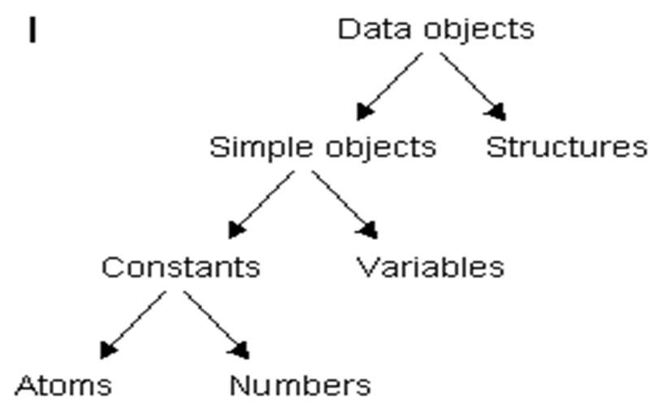

# SWI-Prolog

## Consulta 
- É o meio de **recuperar informações** em Prolog
- Exemplo:

```prolog
% Base de Conhecimeto
pai(joao,mane).
pai(joao, ze).
pai(joao, quim).
pai(mane,maria).
pai(ze, zefa).
pai(ze, ruth).

irmas(A,B) :- pai(P,A), pai(P,B),  A \== B. 
avo(A,N) :- pai(P,N), pai(A,P).
tio(T,S) :- pai(P,S), irmas(P,T).

% Execução
?- pai(P,zefa).
P = ze 

?- irmas(quim,A).
A = mane;
A = ze;
false.

?- tio(T,zefa).
T = mane;
T = quim;
false.

?- avo(A,N).
A = joao , N = maria;
A = joao , N = zefa;
A = joao , N = ruth;
false
```

- Responder a uma consulta é determinar se ela é uma **consequência** do programa (axiomas da teoria).

- **Consulta Existencial:**
```prolog
?- mais(3,X,8).  % existe um X + 3 = 8 ?
?- pai(P,joao).  % existe um P pai de joao ?
```

- Consulta **conjuntiva** e Variáveis cotizadas:
```prolog
?- pai(joao, F), pai(F,N).  % Quem são os netos de joão? 
?- pai(P,maria), tio(T,P).  % Quem é o tio avó de Maria?
```

## Predicados Bidirecionais

```prolog
% Base de Conhecimento
pai(joao,mane).
pai(joao, ze).
pai(joao, quim).
pai(mane,maria).
pai(ze, zefa).
pai(ze, ruth).


irmas(A,B) :- pai(P,A), 
pai(P,B),  A\==B. 
avo(A,N) :- pai(P,N), pai(A,P).
tio(T,S) :- pai(P,S), irmas(P,T).

% Execução
?- pai(P,zefa).
P = ze 

?- pai(ze, F)
F = zefa;
F=ruth;
false.

?- tio(T,zefa).
T = mane;
T = quim;
false.

?- avo(A,N).
A = joao, N = maria;
A = joao, N = zefa;
A = joao, N = ruth;
false.
```

```prolog
concat([],Ys,Ys).     % fato
concat([X|Xs],Ys,[X|Zs]) :- concat(Xs,Ys,Zs).     % regra

?- concat([1,2,3,4], [a,b,c,d], Rs).  
Rs = [1,2,3,4,a,b,c,d]

?- concat(Xs, Ys, [1,2,3,4,a,b,c,d]). 
Xs = [], Ys = [1,2,3,4,a,b,c,d];
Xs = [1], Ys = [2,3,4,a,b,c,d];
Xs = [1,2], Ys = [3,4,a,b,c,d];
Xs = [1,2,3], Ys = [4,a,b,c,d];
Xs = [1,2,3,4], Ys = [a,b,c,d];
Xs = [1,2,3,4,a], Ys = [b,c,d];
Xs = [1,2,3,4,a,b], Ys = [c,d] 

?- concat(Xs, [a,b,c,d], [1,2,3,4,a,b,c,d]).
Xs = [1,2,3,4];
false.
5
```

## Relações

```prolog
membro(X,[X|Xs]).                   % fato
membro(X,[Y|Xs]) :- membro(X,Xs).   % regra

% Execução
?- membro(4, [1,2,3,4,5,6]).  
true.

?- membro(x, [1,2,3,4,5,6]).  
false.

?- membro(X, [1,2,3,4,5,6]).  
X = 1;
X = 2;
X = 3;
X = 4;
X = 5;
X = 6;
false.
6
```

## Predicado Unidirecional

- Fatorial
```prolog
fat(0,1):-!. % !: Cut, corta a pesquisa, não permite backtrack
fat(1,1):-!.
fat(N,F) :- N1 is N - 1, fat(N1,F1), F is N * F1.
 
% Tudo que não for avaliada tem retorno por default true.
% F vai acumulando os valores.

% Execução
?- fat(0,F).
F = 1

?- fat(5,F). 
F = 120

?- fat(5,120). 
true.

?- fat(5,100). 
false.

?- fat(N,120).
ERROR: is/2: Arguments are not sufficiently instantiated
```

- Fibonacci
```prolog
fib(N,F) :- fibx(N,1,1,F), !. 
fibx(0,A,_,A). 
fibx(N,A,B,F) :- N1 is N - 1, AB is A + B, fibx(N1,B,AB,F).

% Execução
?- fib(0,F). 
F = 1

?- fib(1,1). 
true.

?- fib(10,F). 
F = 89

?- fib(20,F). 
F = 10946

?- fib(100,F). 
F =  573147844013817084101.

?- fib(N,1). 
N = 0

?- fib(N,89).
ERROR: Arguments are not sufficiently instantiated
```

## Termos (Data objects)




### Variável 
- Nomeia entidades do universo do discurso. 
```prolog
<termo> ::= <simples>|<termo composto>
<simples> ::= <constante>|<variável>
<variável> ::= _ |<maiúscula>|<variável><letra>|
<variável><dígito>| <variável>_ 
```

```prolog
X  _   _x   Avo   Gente   G12  Pai_sangue    _b
```

- É uma incógnita. 
- Designa uma entidade até o momento desconhecida. 

### Termo: Não-Variável

```prolog
<constante> ::= <átomo> | <número>
```

- Há o predicado `atomic(Termo)` que retorna truequando o Termo é atômico, não estruturado. 

```prolog
<número> ::= <inteiro> | <real>
% Exemplo: 
4, -10, 5.3, 0.123E-10, -1.32e102
```

- Pode ser reconhecido por `number(X)`. 
```prolog
<operadores-relacionais> ::=  < | = | =< | >= | >
<aritmética> ::=  <aritmética-genérica> |
<aritmética bitwise>
```

## Aritmética em Prolog

- Exemplos:
```prolog
X is 1+2.
X = 3.
X is ceiling( 2.1 ). % Menor inteiro não menor que. 
X = 3.
X is ceiling( -2.1).
X = -2.
```

### Operadores Aritméticos
| Nome/Aridade | Explicação |
|--------------|------------|
| abs / 1 | valor absoluto (ISO) |
| + / 2 | adição (ISO) |
| acos / 1 | arco cosseno |
| asin / 1 | arco seno |
| atan / 1 | arco tangente (ISO) |
| /\ / 2 | and bit a bit (ISO) |
| \ / 1 | bit complement (ISO) |
| << / 2 | shift bit a bit para a esquerda (ISO) |
| \/ / 2 | or bit a bit (ISO) |
| >> / 2 | shift bit a bit para a direita (ISO) |
| ceiling / 1 | menor inteiro não menor que (ISO) |
| cos / 1 | cosseno (ISO) |
| cosh / 1 | cosseno hiperbólico |
| e / 0 | número 2.71828... |
| exp / 1 | e**exp (ISO) |
| ** / 2 | exponenciação (ISO) |
| float / 1 | conversão para float (ISO) |
| / / 2 | divisão (ISO) |
| index / 3 | localiza substring em string |
| // / 2 | divisão inteira (ISO) |
| random / 1 | gera número aleatório inteiro |
| floor / 1 | maior inteiro não maior que |
| length / 1 | comprimento da string |
| log / 1 | logaritmo neperiano (ISO) |
| log10 / 1 | logaritmo decimal |
| mod / 2 | módulo de divisão inteira (ISO) |
| * / 2 | multiplicação (ISO) |
| pi / 0 | número 3.14159... |
| rem / 2 | resto de divisão inteira (ISO) |
| round / 1 | inteiro mais próximo (ISO) |
| sign / 1 | retorna -1, 0 ou +1 (ISO) |
| - / 1 | inverte o sinal (ISO) |
| sin / 1 | seno (ISO) |
| sinh / 1 | seno hiperbólico |
| sqrt / 1 | raiz quadrada (ISO) |
| - / 2 | subtração (ISO) |
| tan / 1 | tangente |
| tanh / 1 | tangente hiperbólica |
| truncate / 1 | parte inteira de um real (ISO) |


- Operadores aritméticos que froçam Prolog a avaliar uma expressão como uma expressão aritmética.

| Operador / Aridade | Explicação |
|--------------------|------------|
| < / 2 | menor do que (ISO) |
| > / 2 | maior do que (ISO) |
| =< / 2 | menor ou igual a (ISO) |
| >= / 2 | maior ou igual a (ISO) |
| =\= / 2 | diferente (ISO) |
| =:= / 2 | igual (ISO) |

## Avaliador de Expressões
- `X is E`: X é uma **variável não ligada**, E é uma **expressão aritmética**
- `E1 op E2`:
    - Onde $op \in \{ <, \le, \geq, >, =:=, =\backslash= \}$
    - E1 e E2 são expressões aritméticas avaliadas antes da comparação.

```prolog
?- X = 2, Y = 5, R is sqrt(X^2+Y).
X = 2. 
Y = 5.
R = 3

?- X = 2, Y = 5, Y - X =\= X.
X = 2. 
Y = 5

?- X = 2, Y = 5, Y - X < Y, write(ok),nl.
ok   
X = 2.
Y = 5
```

### Exemplo
```prolog
?- raizes.
quer achar as raizes de a*x*x+b*x+c ?(s/n)
Informe coef a > 1.
Informe coef b > 1.
Informe coef c > -12.
x1 = 3
x2 = 4

quer achar as raizes de a*x*x+b*x+c ? (s/n)
Informe coef a > 1.
Informe coef b > 1.
Informe coef c > 12.
Nao tem raizes reais

quer achar as raizes de a*x*x+b*x+c ? (s/n)
false
```

```prolog
raizes:- simNao('quer achar as raizes de a*x*x+b*x+c ?'), 
obtemcoef(A,B,C),
D is B^2-4*A*C,

( D >= 0,  
X1 is (-B + sqrt(D))/(2*A), 
X2 is (-B - sqrt(D))/(2*A), nl, 
write('x1 = '), write(X1),  nl,
write('x2 = '), write(X2);

D < 0, nl, write('Nao tem raizes reais.') 
),

raizes. 

simNao(Msg) :- nl, write(Msg), repeat, 
write(‘ (s/n): '),
get_char(N), nl, member(N,[’S’,’s’,’N’,’n’]), !, member(N,[’S’,’s’]).

obtemcoef(A,B,C) :-
obtem('Informe coef a > ', A),
obtem('Informe coef b > ', B),
obtem('Informe coef c > ', C).
obtem(Msg,X) :- nl, write(Msg), read(X).
```

## Átomo
- Átomos são **nomes textuais** usados para **identificar dados**, **predicados**, **operadores**, **módulos**, **arquivos**, **janelas**, etc. 
- Pode ser reconhecido pelo predicado atom(X).

```prolog
<átomo> ::= <átomo-alfa>|<átomo-simb>| <string><átomo-apostrofado> |<átomo-especial>
<átomo-alfa> ::= <letra-minúscula> | <átomo-alfa><letra>| <átomo-alfa><dígito> | <átomo-alfa> _ 
%Exemplos: 
a, avo, amora, a2, a_, big_32, xMax, etc.
<átomo-simb> ::= <caracter-simb>|<atomo simb><caracter-simb> 
<caracter-simb> ::= #|$|%|&|*|+|-|.|/|:|<|=|>|@|\|^|`| ~ 

% Exemplos: 
&  &:   ++    <<    >>    <-- ..    *-/*
% Obs.: desde que não seja operador primitivo

<átomo-apostrofado> ::= 
% 'qualquer seqüência de caracteres'

% Exemplo: 
'Avo' '123' 'alo mundo'    'a' 

% Um caracter em si é um átomo, exemplo:  'x'
<string> ::= "qualquer sequência de caracteres"

<átomo especial> ::= ! | [] 
% Tais átomos têm funções especiais na linguagem Prolog.
% ! = cut
% [] = representa lista vazia
```

### Termo Composto
```prolog
<termo-composto> ::= <lista> | 
<estrutura> 
```

- Pode ser identificado por predicado: `compound(X)`
- **Subtipos**: Listas e Estruturas

## Lista
- Sequência de termos entre colchetes , separados por vírgulas:
- **Exemplos:**

```prolog
[t1, t2, t3, ..., tn]
[ ] % Representa a lista vazia
[t1, t2, t3, ..., ti | Xs] % Representa uma lista com os primeiros i termos, e os demais estão representados pela cauda Xs (variável).
[X|Xs] representa uma lista com pelo menos 1 termo.
[X|Xs] = [1,2,3] % X = 1 e Xs = [2,3]
[X,Y|Xs] = [1,2,3,4] % X=1, Y=2, e Xs =[3,4]
```

- Método `take`.
```prolog
take(0,_,[]).
take(_,[],[]).
take(N,[X|Xs],[X|Ys]) :- N>0, N1 is N - 1, take(N1,Xs,Ys).

% Execução
?- take(3,[a,b,c,d,e], Rs).
Rs = [a,b,c] ;
false.
```

- Método `drop`.
```prolog
drop(0,Xs,Xs).
drop(_,[],[]).
drop(N,[X|Xs],Ys) :- N>0, N1 is N - 1,  drop(N1,Xs,Ys).

% Execução
?- drop(3,[a,b,c,d,e], Rs).
Rs = [d,e] ;
false.
```

## Estrutura
- Semelhante a um registro, com tipo, nome, e campos. 
- Com sintaxe geral:
    - nome(t1,t2,...,tn),  
    - nome/n
- **Exemplos:**
```prolog
parent(pam,bob).
deseja(cruzeiro,voltar(serie,a),ano(2020)).
data(28, setembro, 2020)
```
