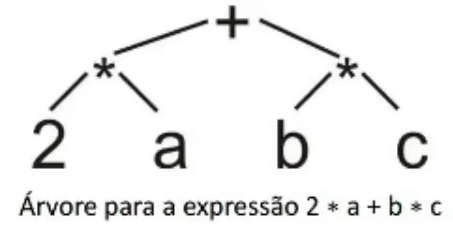

# Aritmética
`Prolog` é mais indicada para resolução de problemas **simbólicos**, mas também oferece suporte à **aritmética**.

Podemos utilizar duas notações para representar expressoẽs em `Prolog`:
- **Infixa:** 2 * a + b * c
- **Preixa:** + (*(2,a), *(b,c)) 

`Prolog` trata as representações de **forma equivalente**, pois, internamente utiliza **árvores** para representar as expressões.Assim, basta mudar a ordem de caminhamento para obter uma ou outra forma.



## Operadores
São ofericidos diversos operadores para cálculos aritméticos, alguns deles são:

| Nome/Operador | Aridade | Significado / Explicação |
|---|---|---|
| `+` | 2 | adição (ISO) |
| `-` | 2 | subtração (ISO) |
| `*` | 2 | multiplicação (ISO) |
| `/` | 2 | divisão (ISO) |
| `//` | 2 | divisão inteira (ISO) |
| `mod` | 2 | módulo da divisão inteira (ISO) |
| `rem` | 2 | resto da divisão inteira (ISO) |
| `**` | 2 | exponenciação (ISO) |
| `^` | 2 | potenciação |
| `is` | 2 | atribui uma expressão numérica a uma variável |
| `abs` | 1 | valor absoluto (ISO) |
| `acos` | 1 | arco cosseno |
| `asin` | 1 | arco seno |
| `atan` | 1 | arco tangente (ISO) |
| `cos` | 1 | cosseno (ISO) |
| `cosh` | 1 | cosseno hiperbólico |
| `sin` | 1 | seno (ISO) |
| `sinh` | 1 | seno hiperbólico |
| `tan` | 1 | tangente |
| `tanh` | 1 | tangente hiperbólica |
| `exp` | 1 | exponenciação (`e^x`) |
| `ln` | 1 | logaritmo natural |
| `log` | 1 | logaritmo neperiano (ISO) |
| `log10` | 1 | logaritmo decimal |
| `sqrt` | 1 | raiz quadrada (ISO) |
| `float` | 1 | conversão para float (ISO) |
| `ceiling` | 1 | menor inteiro não menor que (ISO) |
| `floor` | 1 | maior inteiro não maior que |
| `round` | 1 | inteiro mais próximo (ISO) |
| `truncate` | 1 | parte inteira de um real (ISO) |
| `sign` | 1 | retorna `-1`, `0` ou `+1` (ISO) |
| `-` | 1 | inverte o sinal (ISO) |
| `/\` | 2 | and bit a bit (ISO) |
| `\/` | 2 | or bit a bit (ISO) |
| `\` | 1 | complemento de bits (ISO) |
| `<<` | 2 | deslocamento de bits para a esquerda (ISO) |
| `>>` | 2 | deslocamento de bits para a direita (ISO) |
| `random` | 1 | gera número aleatório inteiro |
| `index` | 3 | localiza substring em string |
| `length` | 1 | comprimento da string |
| `e` | 0 | constante `2.71828...` |
| `pi` | 0 | constante `3.14159...` |

Existem predicados de conversão. tais como:
- `integer(X)`: Converte X para **inteiro**; 
- `float(X)`: Converte X para **ponto flutuante**.

### Operadores de Comparação
Operadores aritméticos que **forçam** `Prolog` a avaliar uma expressão como uma **expressão aritmética**.

`Prolog` também possui predicados para comparação, os operadores são:

| Operador/Aridade | Significado                                                      |
| :--------------: | :--------------------------------------------------------------: |
|    `> / 2`       | Maior que                                                        |
|    `< / 2`       | Menor que                                                        |
|    `>= / 2`      | Maior ou igual a                                                 |
|    `=< / 2`      | Menor ou igual a                                                 |
|    `=:= / 2`     | Igual                                                            |
|    `\= / 2`      | Diferente                                                        |
|    `\+ / 2`      | Negação — retorna sucesso se o predicado for falso e vice-versa  |

Os operadores `=` e `=:=` realizam diferentes tipos de comparação
- `=`: Checa se os "objetos" são **iguais**, ou **atribui valores** para as variáveis;
    - **Unificação** de termo.
- `=:=`: Avalia se os **valores** são **iguais**.

### Avaliador de Expressões

`X is E`: X é uma variável não ligada. E é uma expressão aritmética.

`E1 op E2` : E1 e E2 são expressões **aritméticas avaliadas** antes da comparação.
- Onde op $\in$ { <, =<, >=, >, =:=, =\= }.

```prolog
?- X = 2, Y = 5, R is sqrt(X^2+Y).
X = 2.
Y = 5.
R = 3

?- X = 2, Y = 5, Y - X =\= X.
X = 2.
Y = 5

?- X = 2, Y = 5, Y - X < Y, write(ok),nl.
ok
X = 2.
```

## Exemplos

### Comparação
```prolog
?- 1 + 2 = 2 + 1.
false.

?- 1 + 2 = 1 + 2.
true.

?- 1 + 2 =:= 2 + 1.
true.

% Prefixada
?- 1 + 2 =:= +(2,1).
true.
```

### Atribuição
```prolog
% Atribuição
?- X is 1+2.
X = 3.

?- X is ceiling( 2.1 ).
X = 3.

?- X is ceiling( -2.1).
X = -2.

?- X is sqrt(9).
X = 3.0.

?- X is sqrt(9), write(X).
3.0
X = 3.0.

soma(A, B, S) :-  S is A + B.

?- soma(10, 20, X).
X = 30.

% Os valores do lado direito do is tem que estar instanciados
?- soma(10, B, X).
ERROR: Arguments are not sufficiently instantiated
ERROR: In:
ERROR:   [13] _21774 is 10+_21782
ERROR:   [11] toplevel_call(user:user: ...) at /usr/lib/swi-prolog/boot/toplevel.pl:1317
ERROR: 
ERROR: Note: some frames are missing due to last-call optimization.
ERROR: Re-run your program in debug mode (:- debug.) to get more detail.

?- B = 10, soma(10, B, X).
B = 10,
X = 20.

?- soma(10, 20, 30).
true.

?- soma(10, 20, 31).
false.
```

## Exercícios 

### 1. Crie uma regra Prolog que peça no console um número inteiro e imprima na tela se o número é maior que 100 ou se é menor ou igual 100.

```prolog
maiorQueCem() :- 
    write('Digite um número inteiro: '),
    read(X),
    (
        (X > 100, write('Maior que 100'))
        ;
        (X =< 100, write('Menor ou igual 100'))
    ).

% Consultas
?- maiorQueCem().
Digite um número inteiro: 99.
Menor ou igual 100
true.

?- maiorQueCem().
Digite um número inteiro: 100.
Menor ou igual 100
true.

?- maiorQueCem().
Digite um número inteiro: 101.
Maior que 100
true .
```

### 2. Suponha os seguites fatos:
```prolog
nota(joao, 5.0).
nota(mariana, 9.0).
nota(joaquim, 4.5).
nota(maria, 6.0).
nota(cleuza, 8.5).
nota(mara, 4.0).
nota(joana, 8.0).
nota(jose, 6.5).
nota(mary, 10.0).
```

Considerando que:
- Nota de $7$ á $10.0$ = Aprovado;
- Nota de $5.0$ á $6.9$ = Recuperação;
- Nota de $0.0$ á $4.9$ = Reprovação;

Escreva uma regra para identificar a situação de um determinado aluno.
```prolog
nota(joao, 5.0).
nota(mariana, 9.0).
nota(joaquim, 4.5).
nota(maria, 6.0).
nota(cleuza, 8.5).
nota(mara, 4.0).
nota(joana, 8.0).
nota(jose, 6.5).
nota(mary, 10.0).

situacao(Nome) :- 
    nota(Nome, Nota),
    (
        (Nota >= 7, Nota =< 10, write('Aprovado'))
        ;
        (Nota >= 5, Nota < 7, write('Recuperação'))
        ;
        (Nota >= 0, Nota < 5, write('Reprovado'))
    ).

% Consulta
?- situacao(jose).
Recuperação

?- situacao(Aluno).
Recuperação
Aluno = joao ;
Aprovado
Aluno = mariana ;
Reprovado
Aluno = joaquim ;
Recuperação
Aluno = maria ;
Aprovado
Aluno = cleuza ;
Reprovado
Aluno = mara ;
Aprovado
Aluno = joana ;
Recuperação
Aluno = jose ;
Aprovado
Aluno = mary ;
false.
```

### 3. Crie um programa em Prolog que calcule o IMC de uma pessoa:
```prolog
imc() :- 
    write('Informe seu Peso(Kg): '),
    read(Peso),
    write('Informe sua Altura(m): '),
    read(Altura),
    Imc is Peso / (Altura * Altura),
    write(Imc). 

imc2(Peso, Altura, Imc) :- Imc is Peso / (Altura * Altura).

imc3(Peso,Altura) :- 
    X is Peso / (Altura * Altura),
    write('Seu Imc é: '), write(X).

% Consulta
?- imc().
Informe seu Peso(Kg): 90.
Informe sua Altura(m): |: 1.72.
30.42184964845863
true.

?- imc3(90,1.72).
Seu Imc é: 30.42184964845863
true.

?- imc2(90,1.72,Imc).
Imc = 30.42184964845863.
```

## Exemplos
```prolog
?- ponto(A,B) = ponto(1,2).
A = 1,
B = 2.

?- 2 + 2 = 4.
false.

?- ponto(A,B) = ponto(X,Y,Z).
false.

?- t(p(-1,0), P2, P3) = t(P1, p(1,0), p(0,Y)).
P2 = p(1, 0),
P3 = p(0, Y),
P1 = p(-1, 0).
```
