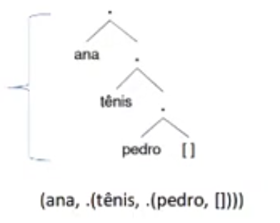

# Listas

Uma lista é uma sequência ordenada de elementos de qualquer tipo de dados de `Prolog`.

Os elementos contidos em uma lista devem ser separados por vírgula, e precisam estar entre colchetes.

```prolog
[pam, liz, pat, ann, tom, bob, jim]
[1, 2, 3, 4, 5]
[a, [b,c], d, e] % onde [b,c] é o segundo elemento da lista
[t1, t2, t3, ..., tn]
[ ] % Representa a lista vazia
[t1, t2, t3, ..., ti | Xs] % Representa uma lista com os primeiros i termos, e os demais estão representados pela cauda Xs (Variável).
```

Lista podem ser de dois tipos:
- **Vazias:** Não contém nenhum elementp, representadas por `[]`.
- **Não Vazias:** Contém pelo menos um elemento.

> [!NOTE]
>
> Toda lista tem uma lista vazia dentro dela, o qual é o último elemento.



Lista não vazias possuem duas partes:
- **Cabeça (*head*):** Corresponde ao **primeiro elemento** da lista.
- **Cauda (*tail*):** Corresponde aos **elementos restante da lista**, ou seja, a lista sem o primeiro elemento.

```prolog
[pam, liz, pat, ann, tom, bob, jim]
% pam é a cabeça [liz, pat, ann, tom, bob, jim] é a cauda
[1, 2, 3, 4, 5]
% 1 é a cabeça, [2, 3, 4, 5] é a cauda
[a, [b,c], d, e] 
% a é a cabeça, [[b,c], d, e] é a cauda
```

### Operador Pipe()
Uma lista não vazia pode ser representada de forma a apresentar **explicitamente** a sua cabeça e a sua cauda, usando a sintaxe `[Cabeça|Cauda]`.

```prolog
% lista [b]
?- L = [b|[]].
L = [b].

% lista [a, b]
?- L = [a|[b|[]]].
L = [a, b].
```

Essa sintaxe é útil em consultas quando queremos **decompor uma lista** em cabeça e cauda:

```prolog
?- [Head|Tail] = [mia, vincent, jules, yolanda].
Head = mia,
Tail = [vincent, jules, yolanda].

?- [X,Y | W] = [[], dead(zed), [2, [b, chopper]], [], z].
X = [],
Y = dead(zed),
W = [[2, [b, chopper]], [], z].

[X|Xs] % Representa uma lista com pelo menos 1 termo
[X|Xs] = [1,2,3] % X = 1 e Xs = [2,3]
[X,Y|Xs] = [1,2,3,4] % X = 1, Y = 2, e Xs =[3,4]
```

## Unificação de Listas

| Lista 1                | Lista 2                   | Unificação                          |
|------------------------|---------------------------|-------------------------------------|
| [mesa]                 | [X\|Y]                    | X/mesa, Y/[ ]                       |
| [a,b,c,d]              | [X,Y\|Z]                  | X/a, Y/b, Z/[c,d]                   |
| [ana,Y\|Z]             | [[X,foi],[ao,cinema]]     | X/ana, Y/foi, Z/[[ao,cinema]]       |
| [ano,bissexto]         | [X,Y\|Z]                  | X/ano, Y/bissexto, Z/[ ]            |
| [ano,bissexto]         | [X,Y,Z]                   | não unifica                         |
| [data(7,Z,W),hoje]     | [X\|Y]                    | X/data(7,Z,W), Y/[hoje]             |
| [data(7,W,1993),hoje]  | [data(7,X,Y),Z]           | X/W, Y/1993, Z/hoje                 |

## Exemplos
```prolog
% Primeiro elemento de uma lista
pertence(X, [X|_]).
pertence(X, [_|T]) :- pertence(X, T).

% Consulta
?- pertence(2, [1,3,4,5,2,7,8]).
true ;
false.

?- pertence(2, [1,3,4,5,7,8]).
false.

?- pertence(X, [1,3,4,5,7,8]).
X = 1 ;
X = 3 ;
X = 4 ;
X = 5 ;
X = 7 ;
X = 8 ;
false.

% Último elemento de uma lista
eh_ultimo(X, [X]). % Ou [X|[]]
eh_ultimo(X, [_|T]) :- eh_ultimo(X,T).

?- eh_ultimo(1, [1,2,3,4,5]).
false.

?- eh_ultimo(5, [1,2,3,4,5]).
true ;
false.

?- eh_ultimo(Ultimo, [1,2,3,4,5]).
Ultimo = 5 ;
false.

% Dois elementos são consecutivos
% 1 e 2 são consecutivos na lista [2,3,4,5,1,2].
consecutivos(X,Y, [X,Y|_]).
consecutivos(X,Y, [_|T]) :- consecutivos(X,Y,T).

?- consecutivos(2,3, [1,2,1,2,3,4,5,6]).
true ;
false.

?- consecutivos(1,2, [1,2,1,2,3,4,5,6]).
true ;
true ;
false.

?- consecutivos(7,2, [1,2,1,2,3,4,5,6]).
false.

?- consecutivos(X,Y, [1,2,1,2,3,4,5,6]).
X = 1,
Y = 2 ;
X = 2,
Y = 1 ;
X = 1,
Y = 2 ;
X = 2,
Y = 3 ;
X = 3,
Y = 4 ;
X = 4,
Y = 5 ;
X = 5,
Y = 6 ;
false.

% Tamanho de uma lista
tamanho([],0).
tamanho([_|T],N) :- tamanho(T,N1), N is N1 + 1.

?- tamanho([a,b,c,ef,f,g],Tamanho).
Tamanho = 6.

?- tamanho([a,b,c,ef,f,g],6).
true.

% Take: Pegar os primeiros N elementos
take(0,_,[]).
take(_,[],[]).
take(N,[X|Xs],[X|Ys]) :- N > 0, N1 is N - 1, take(N1,Xs,Ys).

?- take(3,[],Rs).
Rs = [] ;
false.

?- take(3,[a,b,c,d,e],Rs).
Rs = [a, b, c] ;
false.

% Retirar os primeiros N elementos
drop(0,Xs,Xs).
drop(_,[],[]).
drop(N,[X|Xs],Ys) :- N>0, N1 is N - 1, drop(N1,Xs,Ys).

?- drop(3,[a,b,c,d,e],Rs).
Rs = [d, e] ;
false.

% Concatenação
concat([],Ys,Ys).
concat([X|Xs],Ys,[X|Zs]) :- concat(Xs,Ys,Zs). % Vo

?- concat([1,2,3,4], [a,b,c,d], Rs).
Rs = [1,2,3,4,a,b,c,d]

?- concat(Xs, Ys, [1,2,3,4,a,b,c,d]).
Xs = [] , Ys = [1,2,3,4,a,b,c,d] ;
Xs = [1] , Ys = [2,3,4,a,b,c,d] ;
Xs = [1,2] , Ys = [3,4,a,b,c,d] ;
Xs = [1,2,3] , Ys = [4,a,b,c,d] ;
Xs = [1,2,3,4] , Ys = [a,b,c,d] ;
Xs = [1,2,3,4,a] , Ys = [b,c,d] ;
Xs = [1,2,3,4,a,b] , Ys = [c,d]

?- concat(Xs, [a,b,c,d], [1,2,3,4,a,b,c,d]).
Xs = [1,2,3,4] ;
false.

% Verificar se um dado inteiros está presente na lista
membro(X,[X|Xs]).
membro(X,[Y|Xs]) :- membro(X,Xs).

?- membro(4, [1,2,3,4,5,6]).
true ;
false.

?- membro(x, [1,2,3,4,5,6]).
false.

?- membro(X, [1,2,3,4,5,6]).
X = 1 ;
X = 2 ;
X = 3 ;
X = 4 ;
X = 5 ;
X = 6 ;
false.
```

### Univ
Operador `=../2` **transforma** termo em uma lista.
- Apenas um dos seus operandos pode ser **variável**.

```prolog
?- struct(hello, X) =.. L.
L = [struct, hello, X].

?- Term =.. [baz, foo(1)].
Term = baz(foo(1))

?- Pai = [pai, joao, ze].
Pai = [pai,joao,ze]

?- P =.. [pai,joao,X], call(P). % relembre pai(joao,maria)!
P = pai(joao,maria) , X = maria

% call/1 : Chama o argumento como uma meta a ser avaliada
```

## Exercícios

### 1. Crie uma regra que receba uma duas listas e informe se a Lista L1 é prefixo da lista L2.

```prolog
% Ex: [1,2] [1,2,3,4,5,6,7]
% --> [1,2] [1,2]
prefixo([], _).
prefixo([H1|T1], [H2|T2]) :- H1 = H2, prefixo(T1,T2).

% Consulta
?- prefixo([1,2],[1,2,3,4,5]).
true.
?- prefixo([1,2],[1,2]).
true.
?- prefixo([1,2],[3,2]).
false.
```

### 2. Crie uma regra que receba uma duas listas e informe se a Lista L1 é sufixo da lista L2.

```prolog
% Ex: [1,2] [1,2,3,4,5,1,2]
% [1,2] [1,2] 
% [1] [1] 
sufixo(L,L).
sufixo(L1,[_|T2]) :- sufixo(L1, T2).

% Consultas
?- sufixo([1,2],[1,2]).
true ;
false.

?- sufixo([1,2],[1,2,3,4,5,1,2]).
true ;
false.

?- sufixo([1,2],[1,2,3,4,5,1,3]).
false.
```

### 3. Crie uma regra que receba uma lista e retorna outra lista com os pares.

```prolog
% [1,2,3,4,5,6,7] [2,4,6]
pares([], []). 
pares([H|T], S) :- 
    pares(T,T1), 
    (  
        (H mod 2) =:= 0 -> S = [H|T1]
        ;
        S = T1
    ). 

% Consulta
?- pares([1,2,3,4,5,6,7],Pares).
Pares = [2, 4, 6].
```

### 4. Defina um predicado chamado todos_as(L), que retorna verdadeiro somente se todos os elementos da lista L são o átomo 'a'  

```prolog
todos_as([a]).
todos_as([a|T]) :- todos_as(T).

% Consulta
?- todos_as([a]).
true ;
false.

?- todos_as([a,a,a,a,a,a,a]).
true ;
false.

?- todos_as([a,a,a,a,b,a,a]).
false.
```

### 5. Defina um predicado chamado contem_1(L) que retorna verdadeiro se a lista L contém pelo menos um elemento 1

```prolog
contem_1([1|_]).
contem_1([H|T]) :- H \= 1, contem_1(T).

contem1([1]).
contem1([H|T]) :- (H = 1, !) ; contem1(T).

% Consulta
?- contem_1([1]).
true.

?- contem_1([2,3,1,4,5,6]).
true.

?- contem_1([2,3,4,5,6,1]).
true.

?- contem_1([1,1,1,1]).
true.

?- contem1([2,3,4,5,6,7,0,9]).
false.

?- contem1([2,3,4,5,6,1,7,0,9]).
true.
```

### 6. Considere a seguinte base de conhecimento:

```prolog
traducao(one,um).
traducao(dois,two).
traducao(three,tres).
traducao(four,quatro).
traducao(five, cinco).
traducao(six, seis).
traducao(seven, sete).
traducao(eight, oito).
traducao(nine, nove).
```

Crie uma regra, lista_traducao(E,P), que traduz uma lista de numerais em inglês na lista correspondente com os numerais em português.

```prolog
% Exemplo:
?- lista_traducao([one,nine,two],X)
X = [um,nove,dois]
```

```prolog
lista_traducao([],[]).
lista_traducao([H1|T1],[H2|T2]) :- traducao(H1,H2), lista_traducao(T1,T2).

% Consultas
?- lista_traducao([one,nine,two],X).
X = [um, nove, dois].

?- lista_traducao([seve,four,eight],X).
false.

?- lista_traducao([seven,four,eight],X).
X = [sete, quatro, oito].
```
