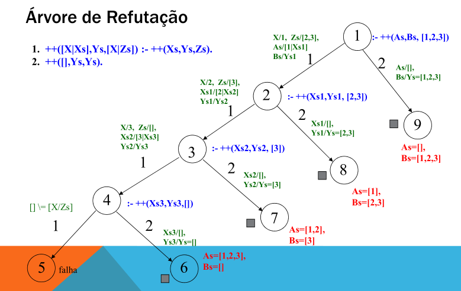
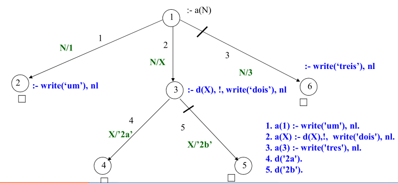

# Controle de Fluxo


Existem algumas maneiras de controlar como o programa pode ser executado:

- Ordem das cláusulas no programa;
- Ordem das submetas dentro de cada cláusula;
- Busca em profundidade (tenta satisfazer uma submeta antes de seguir para a próxima);
- Retrocede, tentando uma outra alternativa de regra ou instância de valores para o mesmo predicado.

Existem cláusulas no `Prolog` que ajudam a controlar o **fluxo de execução** do programa.

- [Cut](#cut).
- [Fail](#fail)
- [Repeat](#repeat).

## Ordem das Cláusulas
Dependendo da ordem das cláusulas, ele pode entrar em **loop infinito**, ou apresentar um melhor ou pior desempenho.

### Loop Infinito
```prolog
fat(N, F) :- N1 is N-1, fat(N1, F1), F is N * F1.
fat(0,1).
```

> [!NOTE]
>
> Assim, a ordem influi para tornar o programa **decidível** !

### Desempenho
```prolog
% Opção a. 
++([],Ys,Ys).
++([X|Xs],Ys,[X|Zs]) :- ++(Xs,Ys,Zs).

% Opção b. 
++([X|Xs],Ys,[X|Zs]) :- ++(Xs,Ys,Zs).
++([],Ys,Ys).
```

A opção "b" apresenta melhor desempenho, sem risco de loop, pois o padrão [X|Xs] impede o casamento com lista vazia.
- Se X e Xs forem constantes,caso de serem variáveis o **desempenho é pior**.

> [!NOTE]
>
>  (++)/3 é uma outra forma de representação do predicado concat/2.

```prolog
append([],Ys,Ys).
append([X|Xs], Ys, [X|Zs]) :- append(Xs,Ys,Zs).

?- append(As, Bs, [1,2,3]).
As = [] ,
Bs = [1,2,3] ;
As = [1] ,
Bs = [2,3] ;
As = [1,2] ,
Bs = [3] ;
As = [1,2,3] ,
Bs = [] ;
false.

++([X|Xs], Ys, [X|Zs]) :- ++(Xs,Ys,Zs).
++([],Ys,Ys).
?- ++(As, Bs, [1,2,3]).
As = [1,2,3] ,
Bs = [] ;
As = [1,2] ,
Bs = [3] ;
As = [1] ,
Bs = [2,3] ;
As = [] ,
Bs = [1,2,3]
```


 
### Ordem das Submetas

```prolog
tio(T,S) :- irmao(P,T), pai(P,S).
```

T pode ter vários irmãos, mas S só tem um pai. Assim,

```prolog
tio(T,S) :- pai(P,S), irmao(P,T).
```

É mais eficiente, pois não provoca retrocesso, ao tentar buscar outro P irmão de T que possa ser pai de S.

## Retrocesso (*Backtracking*)

### Meta
- **Sucede**, se **todas as submetas** no corpo sucedem.
- **Falha**, se ao **menos uma submeta** no corpo falha.
- Quando há falha, o Prolog tenta satisfazer a meta com outras alternativas, buscando um casamento a partir de onde a meta falhou.
- Esse processo de **tentar satisfazer todas as submetas**, antes de dá-la por falha é o ***backtracking***.

```prolog
simNao(Msg) :- 
    nl, write(Msg), repeat,
    write(' (s/n) '), 
    get_char(N), nl,
    member(N,"SsNn"), !,
    member(N,"Ss").

?- simNao(‘Quer jogar primeiro? ').
Quer jogar primeiro? (s/n)
t
(s/n)
n
false.
```

## Conectivos Lógicos

### , (virgula) - conjunção.
**Todas** as submetas ligadas precisam ser **verdadeiras** para a meta da cláusula ser verdadeira.

```prolog
irmas(A,B) :- pai(P,A), pai(P,B), A \== B.
```

### ; (ponto e vírgula) - Disjunção.
**Ao menos** um dos disjuntos deve **suceder** para que a meta da cláusula suceda.

```prolog
irmas(A,B) :- 
    (pai(P,A), pai(P,B)
    ;
    mae(M,A), mae(M,B) ), A \== B.

not(P) :- P, !, fail; true. % sucede se P falha.
```

### -> Se Então
```prolog
% Se P então Q. P -> Q 
?- X = 2 -> Y is X + 3, Y < 7 -> Z is Y+4.
X = 2,
Y = 5,
Z = 9
?- X = 2 -> Y is X + 3, Y > 7 -> Z is Y+4.
false.
```

## Cut
O retrocesso (***backtracking***) é um processo pelo qual **todas** as alternativas de solução para uma dada consulta são **tentadas exaustivamente**.

> [!NOTE]
>
> No `Prolog` o retrocesso é **automático**.

Contudo, é possível controlá-lo através de um predicado especial chamado **corte**, que é representado por `!`.

Visto como uma cláusula, seu valor é **sempre verdadeiro**.

Sob **retrocesso**, o predicado que o contém **falha**.

Sua função é provocar um efeito colateral que interfere no **processamento padrão** de uma consulta.

### Exemplo - Usando no Final de uma Regra

$$
f(x)=
\begin{cases}
0, & \text{se } x < 3 \\
2, & \text{se } 3 \le x < 6 \\
4, & \text{se } x > 6
\end{cases}
$$

```prolog
% Corte Verde: Não altera a lógica do problema.
f(X,0) :- X < 3, !.
f(X,2) :- X >= 3, X < 6, !.
f(X,4) :- X > 6.

% Consulta
?- f(1,Y).
Y = 0.

?- f(3,Y).
Y = 2.

?- f(7,Y).
Y = 4.

% Corte Vermelho: Altera a lógica do problema.
f1(X,0) :- X < 3, !.
f1(X,2) :- X < 6, !.
f(X,4).

% Consultas
?- f1(1,Y).
Y = 0.

?- f1(3,Y).
Y = 2.

?- f1(7,Y).
Y = 4.
```

### Exemplo - Usando no Meio de uma Regra

```prolog
% Quando encontra o corte a clausula de baixo não é executada
a(1).
b(2).
c(1).
p(X) :- a(X), !, b(X).
p(X) :- c(X).
```

## Fail
Sempre retorna uma **falha na unificação**.
- Força o programa a fazer um **backtracking**,  repetindo os predicados.

### Exemplo
```prolog
aluno(marcelo).
aluno(andre).
aluno(roberto).

escreverSemFail(X) :- aluno(X), write(X).
escreverComFail :- aluno(X), write(X), nl, fail.

?- escreverSemFail.
marcelo
true.

?- escreverComFail.
marcelo
andre
roberto
false.

?- write('ola'), nl, fail.
ola
false.

```

## Repeat
O predicado `repeat` **força** um programa a gerar **soluções** alternativas via **retrocesso**.

Similar as **estruturas de repetição** (`while`, `for`...) das linguagens imperativas. 

Força um repetição e termina só quando a cláusula como um todo é verdadeira ou quando encontra um **cut** (`!`).

```prolog
repeat, write('ola'), nl, fail.
ola
ola
ola
ola
...

% Evitar loop infinito
repeat
    lerDados
    processarDados
    condição
```

### Exemplo - Advinhar o número
```prolog
lerDados(G) :- 
    write('Digite um número de 1 a 5: '), 
    read(G).

processarDados(G,N) :- 
    G =:= N,
    write('Acertou!!!'), nl.

% fail faz que volta para o repeat
processarDados(G,N) :- G \= N, write('Tente Novamente'), nl, fail.

adivinheNumero :-  
    N is random(5) + 1,
    repeat,
        lerDados(G),
        processarDados(G,N).

?- adivinheNumero.
Digite um número de 1 a 5: 1.
Acertou!!!
true .

?- adivinheNumero.
Digite um número de 1 a 5: 1.
Tente Novamente
Digite um número de 1 a 5: |: 2.
Tente Novamente
Digite um número de 1 a 5: |: 3.
Acertou!!!
true .
```

### Exemplo - Advinhar a palavra

```prolog
repete :- 
    repeat,
    write('Digite uma palavra: '),
    read(Palavra),
    (
        (Palavra == fim -> !)
        ;
        (write('Errou, Tente Novamente!!'), nl, fail)
    ).

?- repete.
Digite uma palavra: lucas.
Errou, Tente Novamente!!
Digite uma palavra: |: unb.
Errou, Tente Novamente!!
Digite uma palavra: |: fim.
true.
```

### Exemplo - Bhaskara
```prolog
raizes:- 
    simNao('quer achar as raizes de a*x*x+b*x+c ?'),
    obtemcoef(A,B,C),
    D is B^2-4*A*C,
    ( 
        D >= 0, X1 is (-B + sqrt(D))/(2*A),
        X2 is (-B - sqrt(D))/(2*A), nl,
        write('x1 = '), write(X1), nl,
        write('x2 = '), write(X2)
        ;
        D < 0, nl, write('Nao tem raizes reais.') 
    ), 
    raizes.

simNao(Msg) :- 
    nl, write(Msg), repeat,
    write(' (s/n): '),
    get_char(N), nl, member(N,[’S’,’s’,’N’,’n’]), !, 
    member(N,[’S’,’s’]).

obtemcoef(A,B,C) :-
    obtem('Informe coef a > ', A),
    obtem('Informe coef b > ', B),
    obtem('Informe coef c > ', C).
    obtem(Msg,X) :- nl, write(Msg), read(X).

% Consulta
?- raizes.
quer achar as raizes de a*x*x+b*x+c ?(s/n)
Informe coef a > 1.
Informe coef b > 1.
Informe coef c > -12.
x1 = 3
x2 = 4

quer achar as raizes de a*x*x+b*x+c ? (s/n)
Informe coef a > 1.
Informe coef b > 1.
Informe coef c > 12.
Nao tem raizes reais

quer achar as raizes de a*x*x+b*x+c ? (s/n)
false.
```

### Exemplo - Cidade
```prolog
cidades :- 
    repeat, nl, 
    write(' cidade (ultima = fim) >'),
    read(X), 
    assertz(cidade(X)), X = fim, !.

vizinhos :- 
    repeat, cidade(X),
    ( 
        X = fim, !
        ;
        nl, write('Informe os vizinhos de '),
        write(X),
        read(Ys), 
        assertz(vizinhos(X,Ys))
    ), fail.

?- cidades.
cidade
go.
cidade
bsb.
cidade
bh.
cidade
fim.
true.

?- vizinhos.
Informe os vizinhos de go
[bsb,cuiaba, bh].
Informe os vizinhos de bsb
[go, bh].
Informe os vizinhos de bh
[bsb, go].
true.

?- listing([vizinhos/2, cidade/1]).
/* vizinhos/2 */
vizinhos(go, [bsb,cuiaba,bh]).
vizinhos( bsb, [go,bh] ).
vizinhos( bh, [bsb,go] ).

/* cidade/1 */
cidade( go ).
cidade( bsb ).
cidade( bh ).
cidade( fim ).
true.
```

## Cut - Fail
O cut é usado em geral para **manusear exceções** e **restringir** o espaço de busca.

```prolog
cidadao(joao).
cidadao(susana).
cidadao(roberta).
cidadao(ricardo).
cidadao(marcelo).

idade(joao, 36).
idade(susana, 15).
idade(roberta, 31).
idade(ricardo, 22).
idade(marcelo, 17).

analfabeto(joao).

% Consultas
?- elegivel(joao).
false. % busca mínima, cut ok

?- elegivel(ricardo).
true. % busca mínima, cut ok

?- elegivel(X).
false. % como? Nesse caso devo tirar o “!“ ?

?- elegivel(X). % tirando o cut
?- elegivel(X).
X = joao ;
X = roberta ;
X = ricardo ;
false.
```

Sempre sempre o **cut** é a melhor opção!!
```prolog
elegivel1(X) :- cidadao(X), analfabeto(X), fail.
elegivel1(X) :- cidadao(X), not(analfabeto(X)), idade(X,Y), Y >= 18.

% Consultas
?- elegivel1(X).
X = roberta ;
X = ricardo ;
false.

?- elegivel1(joao).
false.

?- elegivel1(roberta).
true.

?- elegivel1(marcelo).
false.

?- elegivel1(marcelo).
false.
```

O espaço de busca de uma consulta é o conjunto de **todas as respostas possíveis**.

O corte é usado para reduzir o espaço de busca, instruindo o interpretador a **não retroceder** sobre os predicados que **precedem o cut**.

**Desvantagens:**
- Sacrifica a clareza do programa.
- Causa disruptura brusca na execução do programa.

Efeito sobre consultas compostas.
```prolog
?- a(X), b(Y), !, c(X,Y,Z) % obtenha um único valor para X e Y e avalie c(X,Y,Z).
```

Efeito sobre cláusulas de um mesmo predicado.
- Se uma das cláusulas tem um corte no seu corpo, e o Prolog o alcança, então ele não faz retrocesso sobre outras cláusulas do conjunto.
- (Ex.: ++, e a(N) com árvore de refutação). Estude o caso de ++ com corte, sobre a árvore de refutação.

```prolog
?- idade(joao, Y), !.
Y = 36
% Obs.: dado que cada pessoa só tem uma idade, o corte é desejável

?- idade(X,Y),!, Y > 18.
X = joao ,
Y = 36
obs.: Neste último caso, quer-se mais de uma resposta, para diferentes valores de X, contudo, o cut impediu.
```

### Outro Exemplo
```prolog
a(1) :- write('um'), nl.
a(X) :- d(X), write('dois'), nl.
a(3) :- write('tres'), nl.
d('2a').
d('2b').

% Consulta
?- a(N).
um
N = 1;
dois
N = '2a' ;
dois
N = '2b' ;
tres
N = 3

a(1) :- write('um'), nl.
a(X) :- d(X),!, write('dois'), nl.
a(3) :- write('tres'), nl.
d('2a').
d('2b').

?- a(N).
um
N = 1;
dois
N = '2a'

% Para aqui pois o cut impede o backtracking de X impedindo ocorrer os casos de '2b' e 3.
```




### Outro Exemplo - Corte na Submeta
```prolog
temRG(X) :- homem(X), idade(X,Y),!,Y > 18.

homem(joao).
homem(marcelo).
homem(ricardo).

mulher(susana).
mulher(roberta).
idade(susana, 15).
idade(roberta, 31).
idade(ricardo, 22).
idade(marcelo, 17).

?- temRG(X).
X = joao
?- 
Obs.: reduz-se o espaço de busca, mas idade(joao, 36) não atende o que se pretende.
```

Existem algumas maneiras de isolar o efeito do corte:
```prolog
idade(joao, 36) :- !.
idade(susana, 15) :- !.
idade(roberta, 31) :- !.
idade(ricardo, 22) :- !.
idade(marcelo, 17) :- !.

?- temRG(X).
X = joao ;
X = ricardo ;
false.

?- idade(X,Y).
X = joao ,
Y = 36
```

Contudo o corte no predicado idade/2 **não permite múltiplas respostas**.

A solução seria criar um predicado `souma(P)` **enseja um uso adequado do cut**, quando a **pretensão** é **eliminar buscas desnecessárias**, ou restringir a uma só resposta.
- Não precisa usar `cut` diretamente na consulta
- Não precisa usar `cut` sobre cláusulas na base.
- `souma(P)` falha sob retrocesso, mas **não impende** que variáveis em **predicados anteriores**, no mesmo corpo, sejam revaloradas.
- É assim uma **solução mais limpa** para o `cut`.

```prolog
souma(P) :- P, !.
temRG1(X) :- homem(X), souma(idade(X,Y)), Y > 18.
```

## Exercício

### 1. Considere o programa:
```prolog
m(1).
m(2) :- !.
m(3).
m1(X,Y) :- m(X), m(Y).
m2(X,Y) :- m(X), !, m(Y). % Não executa o backtracking do X
```

Diga quais são todas respostas do `Prolog` aos seguintes objetivos:
```prolog
?- m(X).
/*
X = 1 ;
X = 2 ;
false.
*/

?- m1(X,Y).
/*
X = Y, Y = 1 ;
X = 1,
Y = 2 ;
X = 2,
Y = 1 ;
X = Y, Y = 2 ;
false.
*/

% Como não executa o backtracking do X ele só é instanciado com 1, não procura para as próximas ocorrências.
?- m2(X,Y).
/*
X = Y, Y = 1 ;
X = 1,
Y = 2 ;
false.
*/

?- m(3).
/*
false.
*/
```

### 2. Crie um programa em `Prolog` que leia, calcule e imprima o quadrado desse número, o programa deve continuar a execução até que o usuário digite a palavra 'stop'.

```prolog
quadrado :-
    repeat,
    write('Dígite um número: '),
    read(X),
    (
        (X = stop, !)
        ;
        (Quadrado is X * X, write(Quadrado), nl, fail)
    ). 

?- quadrado.
Dígite um número: 4.
16
Dígite um número: |: 8.
64
Dígite um número: |: stop.

true.
```
