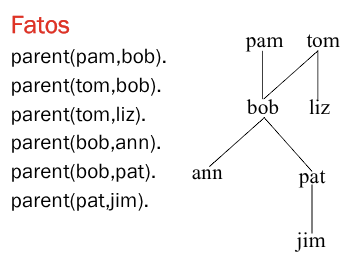
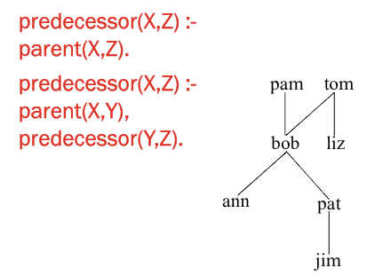
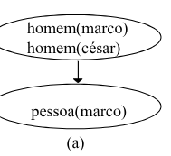
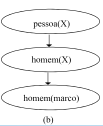

# Paradigma Funcional - Linguagem Prolog

## O que é Prolog ?
- **Linguagem Declarativa**
    - Não tem instruções.
- Primeira e mais usada linguagem do paradigma programação em lógica.
    - Proposta em 1970 como **provador de teoremas** especializado.
    - Alain Colmerauer e Phillipe Roussel (Universidade de Aix-Marseille). 
    - Robert Kowalski (Universidade de Edinburgh).
    - Outras pessoas importantes... **Helder Coelho**, Universidade de Lisboa. 
- **Não** usada extensivamente na prática de **engenharia de software**.
    - Seriamente avaliada nos 80s como **linguagem de propósito geral**.
        - linguagem do Projeto V Geração do Japão.
    - Hoje é usada em contextos específicos.
        - Maioria relacionados a **IA**.
        - Mais utilizada na Europa.
        - EUA: A linguagem `LISP` é mais utilizada em IA.  
- O desenvolvimento `SWI PROLOG` inicio em 1987.

### Metáfora da Programação em Lógica
- **Teoria Lógica (TL)** = Programa = Banco de Dados dedutivo = BC.
- **Programar** é declarar **axiomas** e **regras**.
- Axiomas da **TL**
    - Fatos da BC 
    - Parte <u>extensional</u> do BD dedutivo
    - Dados <u>explícitos</u> de um BD tradicional
- Regras da **TL** (e da **BC**):
    - parte <u>intencional</u> do BD dedutivo
- Teoremas da **TL** 
    - **Deduzidos** a partir dos **axiomas** e das **regras**.
    - Dados <u>implícitos</u> do BD dedutivo.

### O que é PROLOG ?
- **Uma linguagem de programação para computação simbólica não numérica**.
    - **Interpretador**.
    - Base de conhecimentos, Memória de trabalho e Máquina de inferência.
- Com o que se parece programar em Prolog?
    - Definir relações e formular perguntas sobre as relações.
- O que é o `SWI-PROLOG` ?
    - Um **Interpretador**.

```prolog
?- prompt principal
| - prompt secundario
```

- O prolog precisa ter uma base.
- O que não estiver na **base de conhecimento**, nesse caso um mundo fechado, é falsa.
    - Hipotése de mundo fechado é para gerar decidibilidade.
- Usa **casamento padrão** assim como no `hugs`.
- Percorre a base de conhecimento de forma **linear** usando **ponteiros**.

### Exemplo



```prolog
?- parent(bob,pat). % Query
true.
?- parent(liz,pat).
fail. 
?- parent(X,liz). % Pergunta quem é o pai/mãe da liz, X é uma variável.
X = tom 
?- parent(bob, X). % Quer saber quem são os filhos de bob.
X = ann;
X = pat
```

- **Base de conhecimento** é uma **relação**.

> [!NOTE] 
>
> Ao digitar `;` após uma resposta, o `PROLOG` procura procura por outra resposta!  
> `;` == `OU`.

- O interpretador verifica se a `query` é uma **consequência lógica** dos fatos. 
    - **Query:** É uma pergunta sobre a base de conhecimento.

```prolog
% Quem é pai ou mãe de quem?
?- parent(X,Y).
X = pam;
Y = bob;
X = tom;
Y = bob;
X = tom;
Y = liz
```

- Ao utilizar o `;` ocorre um **backtrack**, libera-se a última variável instanciada.

#### Conectivo AND
- Usa-se a vŕigula (`,`) para expressar o conectivo `AND`.
- Quem é um **pai** ou **mãe** X de Ann? Também o é de Pat?

```prolog
% Está querendo saber se ann e pat são irmãos
?- parent(X,ann),parent(X,pat).
X = bob
```

- Após verificar que `parent(bob,ann)` é válido, ele volta com o **ponteiro** para o **início** da **base de conhecimento**.

### Exemplo - PROLOG com Regras
- Para todo X e Y, Y é filho de X se X é um pai ou mãe de Y
    - `offspring(Y,X) :- parent(X,Y)`.
    - `offspring`: Cabeça, só pode ter uma. 
    - `:-`: Pescoço só pode ter uma. 
    - `parent(X,Y)` = Corpo, pode ter diversos membros, seriam as **condições**. 
    - **Semântica:** se `parent(X,Y)` então `offspring(Y,X)`.

- **Definição Recursiva:**
    - Para todo X e Z, X é um **antepassado** de Z se X é pai ou mãe de Z.
    - Para todo X e Z, X é um **antepassado** de Z se existe Y tal que:
        - X é pai ou mãe de Y e
        - Y é um antepassado de Z.



- `predecessor(X,Z)` só vai ocorrer se `parent(X,Z)` for **verdadeiro**.

```prolog
?- predecessor(pam,X).
X = bob;
X = ann;
X = pat;
X = jim;
fail.

?- predecessor(W,jim).
W = pat
```

## Regras de Produção
- **Esquema de representação** no qual o conhecimento é representado por **regras** situação-ação.

> SE `<condição>` ENTÃO `<ação>`.

- Especialistas tendem a expressar técnicas de solução de problemas em termos destas regras.
- A **condição** estabelece o contexto para aplicação da regra. 
- A **ação** corresponde ao procedimento que acarreta uma conclusão ou mudança (no estado corrente).
- Descrevem **relações** entre **objetos do domínio** de acordo com os valores que os **atributos** podem ter.
    - Incorporam conhecimento <u>prático</u> (**heurístico**), sem um modelo formal.
- Cada **regra** aproxima um fragmento **independente** do conhecimento.
    - Não pode colocar Raciocíno **Causal** com Raciocíno **Diagnóstico**.
    - O conhecimento existente pode ser refinado com a **adição de regras**, permitindo um **crescimento incremental** da base de conhecimentos.
- A performance do sistema cresce proporcionalmente ao crescimento da base de conhecimentos.
- As **definições lógicas** do problema são vistas como uma representação de conhecimento **procedimental**.
    - Aquela em que as **informações de controle** necessárias ao uso do conhecimento **estão embutidas** no próprio conhecimento.

### Exemplo
**SE** animal de estimação e pequeno **ENTÃO** bicho de apartamento.  
**SE** gato ou cachorro ENTÃO animal de estimação.  
**SE** poodle ENTÃO cachorro e pequeno.  
Fido **é** poodle.

- É necessário ampliar a representação de conhecimento procedimental com um **interpretador que siga as instruções** (de controle) **embutidas**.
- Um sistema típico de regras consiste de uma base de conhecimentos (BC), uma memória de trabalho (MT) e uma máquina de inferências.
- **A BC é composta de fatos e regras**.
    - **Regras:** declarações sobre **classes** de objetos 
        - Definem a lógica de processamento.
        - SE condição (antecedente) ENTÃO ação (consequente).
    - **Fatos:** Declarações sobre **objetos específicos**.

### Memória de Trabalho
- Representa o <u>estado do problema</u> em um dado instante. 
    - Permite a **comunicação** entre regras.
- Possui <u>dados dinâmicos</u> de curta duração que **existem** enquanto uma regra estiver sendo <u>interpretada</u>.
    - Variáveis da regra **não** são **estáticas**.
    - O escopo é a própria regra.
- Ação da regra implica modificações na memória de trabalho ou **efeitos colaterais eventuais**.

### Memória de Inferência
- Responsável por:
    - **Execução** das regras.
    - **Determinação** de quais são relevantes, dada uma configuração da memória de trabalho.
    - Escolha de quais regras <u>aplicar</u>.
- Ciclo de Execução:
    - Seleção das regras;
    - **Resolução de conflitos:** Na existência de mais de uma regra a aplicar. 
    - **Ação:**
        - execução da(s) regra(s) selecionada(s) com as consequentes alterações na MT ou efeitos colaterais.

#### Ciclo de Execução
1. **SELEÇÃO DAS REGRAS (matching)**
    - Casamento das regras com **dados** da MT;
    - Conjunto de **conflito** (regras casadas).
2. **ESTRATÉGIAS UTILIZADAS**
    - Guiada por **dados** (*forward-chaining*).
    - Guiada por **metas** (*backward-chaining*).
3. **ESTADO INICIAL (dados da MT)**
4. **RACIOCÍNIO PARA FRENTE**
    - Casamento: MT com **condições** das regras.
    - Estados: gerados com **disparo das ações.**
    - Meta: permanece a **mesma**. 
    - Parada: **asamento** com meta.
5. **RACIOCÍNIO PARA TRÁS**
    - Início: configuração objetivo final (**meta**).
    - Casamento: MT com **ação** da meta (mesmo em parte).
    - Estados: gerados com as **condições**.
    - Meta: **estado atual**
    - Parada: casamento com **estado inicial**.

##### Exemplo de Raciocínio

**Fatos**
- marco é homem.
- césar é homem.
**Regra 1**: SE X é homem ENTÃO X é pessoa
**Meta:** Existe pessoa?
**Solução**
- Estado inicial: fatos
- Figura (a): *forward-chaining*
- Figura (b): *backward-chainin* 
- Prolog usa raciocínio *backward*.




#### Resolução de Conflitos
- Seleção da **ordem de aplicação das regras** do conjunto de conflito. 
- Preferência baseada na:
    - Na **ordem** em que as regras aparecem (`Prolog`).
        - `Prolog` sempre pega a primeira se falhar vai para a segunda.
    - **Importância** dos objetos que foram casadas (ELIZA, Weizenbaum, 1966).


- Eliza foi o primeiro Chat Bot criado.
- Em **Estados:**
    - Consiste em, temporariamente, disparar **todas as regras selecionadas** e utilizar uma **função heurística para avaliar os resultados** de cada uma delas, e **priorizá-las** segundo o seu mérito.

## Linguagem Prolog
- Programação em Lógica:
    - Definições lógicas são vistas como programas. 
    - Em Prolog definições lógicas são **cláusulas de Horn**.
- É praxe representar apenas o conhecimento **positivo** como **asserções afirmativas**.
- Hipótese do Mundo Fechado:
    - As declarações **relevantes e verdadeiras** estão **contidas** na BC ou podem ser **derivadas** a partir de fatos, regras e a BC.
- Negação: Ausência da declaração.
    - Não é uma negação lógica.
- Resolução por **refutação**: 
    - $P$ é consistente **se falhar a prova** de $\neq P$.
