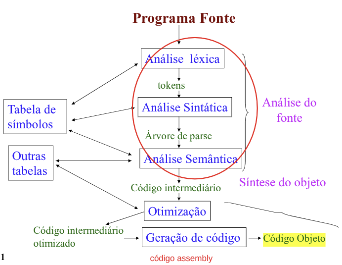

# Estrutura do Programa em Subprogramas

## Definição de Subprogramas Separados 
- Unidade sintática distinta do programa (arquivo), <u>compilada em separado</u> e **ligada** ao programa em **tempo de carga**.
- Requer declarar **todos os dados** do subprograma (de forma explícita ou implícita), inclusive os partilhados.

### Exemplo - Fortran
```fortran
C programa principal
common /A/ integer I, char C, real*8 F

C subprograma matriz
subprogram matriz
commom /A/ integer j, real*8 G
```

## Definição de Dados Separados
- **Agrupa as operações** que manipulam um objeto. 
- Implementa mecanismo de classes e herança.
- Próprio de linguagens <u>orientadas a objeto</u>.
- Requer ligação das classes em **tempo de execução**.
- **Exemplo:** `Java`, `C++`, `Smalltalk`.

## Definição de Aubprogramas Aninhados
- Subprogramas são declarados dentro do programa que os utiliza.
- Um subprograma pode declarar outros subprogramas, internos a ele. 
- Permite checagem de **tipo estática** para referências não locais (variáveis externas).
- Não requer ligador!
- Linguagens estruturadas em blocos.
- **Exemplo:** `Pascal` e `Algol`.

## Definição Separada de Interfaces
- Módulos ou pacotes (***packages***) de **interfaces** (arquivos tipo `.h`). 
    - Interface centralizada em um único arquivo.
- Módulos ou pacotes de **implementação** (arquivos tipo `.c`).
- Módulos compilados podem ser ligados para criar um **programa executável**.
- **Exemplo:** `C`, `ML` e `Ada`

> [!NOTE]
>
> `.h` reune em apenas **um arquivo a interface**. 
> - Se for alterada, será para todos os que fizerem um ***include*** dessa interface!

```c
/* arquivo pilha.h */
/* arquivos header (include) exportam declarações para clientes */

typedef struct pilha
{ 
    int elementos[100];   /* pilha de inteiros */
    int topo = 0;   /* inicia com zero */
};

void empilha (pilha, int i);
int desempilha (pilha);
/******   fim de arquivo   *********/

/* arquivo pilha.c */

/* implementa as operações da pilha */
#include "pilha.h"

void  empilha(pilha s, int i)   { 
    s.elementos[s.topo++] = i; 
}

int desempilha (pilha s) { 
    return s.elementos[--s.topo]; 
}
/****** fim do arquivo *****/

/* um cliente de pilha */
#include "pilha.h"

void main() { 
    pilha s1, s2; /* declara duas pilhas */
    int i;
    
    empilha(s1, 5); 
    empilha(s2, 6); 
    
    i = desempilha(s1);
} 
```

## Definição de Subprogramas sem Programa Principal
- Um arquivo é uma sequência de expressões.
- Um subprograma é declarado em um arquivo.
- Um subprograma pode declarar localmente dados e outros subprogramas.
- Um arquivo pode conter vários subprogramas. 
- Um subprograma pode invocar qualquer número de subprogramas, declarados em qualquer arquivo.
- Um arquivo pode conter variáveis fora de funções (variáveis globais).
- Qualquer variável usada em uma função que não lhe é local, é global.
- Os arquivos são carregados para dentro de um ambiente de execução.
- Em tempo de carga (***load***), funções e variáveis ficam definidas.
- Uma função pode ser invocada e executada diretamente no ambiente.
- **Exemplos:** `Lisp`, `Haskell`, `Prolog`.

```lisp
;; arquivo takedrop.lsp
(defun takedrop(n xs)
    (cond
    ((or (= n 0) (null xs)) (list nil xs)
    (T (let ( (td (takedrop (- n 1) (cdr xs))) 
            (y (car td))    (z (cdr td)) )
        (list (cons (car xs) y) z)  )))) )

* * * * * * * * * * * * * * * * * * * * 
;; arquivo mergesort.lsp
(load takedrop.lsp)
(defun merge(xs ys comp)
    (progn
        (cond
            ((null xs) ys)
            ((null ys) xs)
            ((apply comp (setq x (car xs)) (setq y (car ys)) )  
                (cons x (merge (cdr xs) ys comp))  )
        (T  (cons y (merge xs (cdr ys) comp))  ))))

* * * * * * * * * * * * * * * * * * * * 
(defun mergesort (xs comp) ; classifica lista p/ comp
    (cond
        ((nul (cadr xs)) xs) ;; tamanho de xs é menor que 2 
        (T  (let (  (n (truncate (length xs) 2)  
            (rs (takedrop n xs)) ( ys (car rs)) 
                (zs (cadr rs))  )
            (merge (mergesort ys comp) (mergesort zs comp) comp) )))) 
(defun fib(n) 

(progn (defun fibx (a b n) 
    (cond ((= n 0)  a)
        (T (fibx b (+ a  b)  (- n 1))) ))
(fibx 1 1 n) )))

;; ======== Ambiente Lisp
$ (load mergesort.lsp)
TAKEDROP  MERGE  MERGESORT  FIB

$ (mergesort ‘(5 4 3 2 1)  ‘<)
(1 2 3 4 5)   

$ (fib 5) 8 
29
```

## Estágios da Tradução
**Divisão Lógica**
- **Análise** de todo o programa fonte e **síntese** do programa executável após o **término** da análise. 
- Em muitas implementações de tradutores a análise e síntese se alternam, frequentemente com base no tratamento comando-a-comando.

**Número de passos**
- Grosseiramente, os tradutores são classificados pelo **número de passos**:
- Leituras do arquivo fonte original e dos demais arquivos gerados a partir deste.



### Análise Léxica - *Scanner*
- Grupa **sequência de caracteres** em constituintes elementares do fonte (símbolos):
    - identificadores, delimitadores, operadores, números, palavras chaves, palavras opcionais, comentários, ...
- Identifica os **itens léxicos** (***tokens***) e os repassa aos outros estágios do tradutor. 
- Identifica o **tipo** de cada token e lhe anexa um **rótulo de tipo**. 
- Converte números para sua **representação binária** (inteiro e reais). 
- Inclui **identificadores na TABELA DE SÍMBOLOS** e substitui referências ao identificador pelo **endereço** dado pelo semântico.
    - PC simula memória!
- Em geral o **scanner** (analisador léxico) é modelado como um **autômato de estados finitos**.

### Análise Sintática - *Parsing*
- Identifica as unidades sintáticas do programa usando os itens léxicos:
    - Comandos, 
    - Declarações, 
    - Expressões,
    - ...
- Após identificar uma unidade sintática, chama o **analisador semântico** para processar essa unidade.  
- O analisador sintático coloca os diversos elementos da unidade sintática em uma **pilha**. A seguir eles são recuperados e processados pelo **analisador semântico**.
- Há muito esforço na busca de técnicas de análise eficientes, sobretudo aquelas baseadas em **gramáticas formais** (tais como a BNF). 

### Análise Semântica
- É uma **ponte** entre as fases de análise e síntese.
- Mantém a **tabela de símbolos** (TS), detecta a maioria dos erros e, se **não houver pré-passo**, expande macros e executa diretivas (executáveis em tempo) de compilação.
- Em traduções simples, pode gerar o **código objeto**.
- Em geral, gera um forma **interna de código objeto** que passa por um estágio de otimização do tradutor antes de ser gerado o **código objeto final**.

- O analisador semântico = ${analisador_1, \ldots ,analisador_k}$ 
- O $analisador_i$ manipula um tipo particular de unidade sintática do programa, a unidade $i, i = 1, k$.
- Os analisadores interagem via informações armazenadas em várias estruturas de dados, em especial a TS.

#### Exemplo: 
- O as1 trata apenas **declarações** e as2 trata apenas **expressões**.
    - `x = y * 1.23 + 52;`, `x = (float)y * 1.23 + (float)52`.
    - Se x é real e y inteiro, então y e 52 podem ser promovidos para reais, os operadores * e + também podem ser considerados reais e a precedência dos operadores explicitadas.  
- As funções do analisador semântico variam muito e dependem da LP e da organização lógica do tradutor.

### Síntese do Programa objeto
- Gera o código executável **a partir da saída do analisador semântico**.
- Pode incluir otimização do código, **com base em algoritmos bem conhecidos**.
- O uso de subprogramas traduzidos em separado, ou de biblioteca de subprogramas exige o estágio de **ligação** e **carga**, mas não necessariamente a inclusão de código externo, p. 
    - Ex: código de `.dll`.

### Otimização
Expressão: A = B + C + D

**Código Intermediário** - Semântico:
1. T1 = B + C  
2. T2 = T1 + D  
3. A = T2

Código Direto e Ineficiente gerado 
```assembly
MOV AX,B   ; op destino,origem
ADD AX,C
MOV T1,AX
MOV AX,T1
ADD AX,D
MOV T2,AX
MOV AX,T2
MOV A,AX
```

Código Otimizado
```assembly
MOV AX,B
ADD AX,C
ADD AX,D
MOV A,AX
```

Muitos usam recursos sofisticados para otimizar: 
- Cálculos de valores comuns.
- Eliminar atribuições constantes em loops.
- Cálculo de subscritos.
- Uso de multiplicadores.
- Variáveis temporárias, etc. 

### Geração de Código
Após o programa ter sido otimizado é gerado código: 
- Em linguagem de máquina real ou em `assembly`,  
- Ou linguagem de máquina para um **computador virtual**.
    - Como com o uso do `javac` para programas em Java!

O código de saída pode ser: 
- Diretamente executado ou montado ou ligado e carregado, requer **código relocável!**
    - Usa endereço relativos e pode ser colocado em qualquer posição de memória!
    - Endereço real = Endereço de base + offset. 
