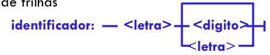
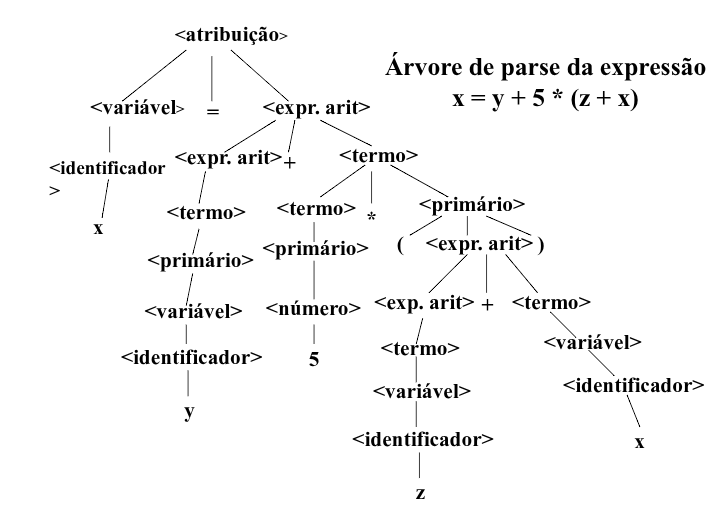
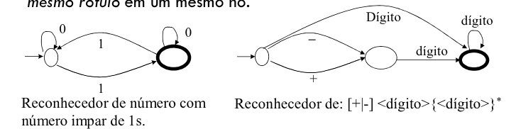
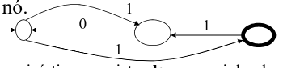
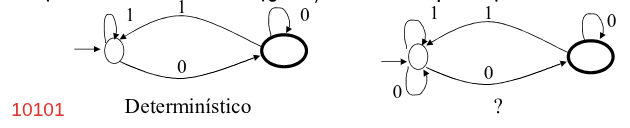
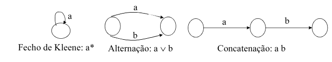
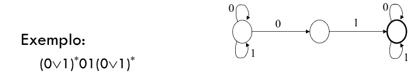
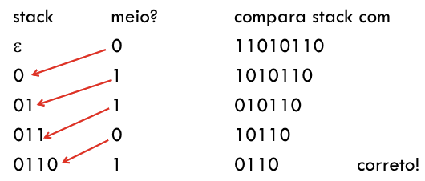

# Tradução - Modelos Formais

## Gramática
Consiste num conjunto de regras (produções) que definem itens léxicos e combinações desses para formar sentenças válidas em uma linguagem.
- Uma gramática formal usa uma notação formal, isto é **restrita** e **específica**.

Classes de gramáticas úteis para a teoria de compilação:
- BNF (gramática livre de contexto),
- Gramática regular.

Uma linguagem é **qualquer conjunto de strings** (de tamanho finito) de caracteres escolhidos de um alfabeto fixo de símbolos finitos.

## Gramática *Backus-Naur Form* (BNF)
Uma gramática BNF é composta de um **conjunto finito de regras gramaticais** BNF, descrevendo uma linguagem.
- É uma **metalinguagem** ou seja uma linguagem usada para descrever outras linguagens.
- Gramática BNF é a definição formal da sintaxe de uma LP usando a notação BNF:
    - ***terminais:*** São palavras primitivas (itens léxicos) da LP. 
    - `::=` é definido como.
    -  `<>`: ca é uma categoria sintática, símbolo não terminal, definido em  termos de outras  entidades. 
    - `|`: Ou.

### Notações Equivalentes
- `[...]` : Indica elementos **opcionais**.
- `[ | ]` : Indica **alternativas** de escolha.
- `{...}*` : Indica sequência **arbitrária de instâncias** (zero ou mais repetições) de elementos sintáticos.
- `<identificador>  ::= <letra>{<letra>|<dígito>}*`.
- `<inteiro> ::= [+|-] <dígito> {<dígito>}*`.

Alguns extensões usam a notação `{...}+` significando uma ou mais ocorrências do elemento sintático envolvido: 
- `<inteiro> ::= [+|-] {<dígito>}+`

Diagrama de Trilhas:



Regra de Produção
- Obtida pela substituição de `::=` pelo símbolo $\rightarrow$ e representação de não terminais como uma única letra maiúscula.
- Exemplo:
    - `<X> ::= <B> | <C>`
    - X $\rightarrow$ B | C

Dada uma gramática, pode-se utilizar uma regra de substituição simples para gerar strings válidas na linguagem:
- Substitua qualquer não terminal pela expressão no lado direito de uma regra de produção que o contenha no lado esquerdo.
    - S $\rightarrow$ SS | (S) | (), Gera sequências de parênteses corretas.
    - S $\Rightarrow$ (S) $\Rightarrow$ (SS) $\Rightarrow$ (()S) $\Rightarrow$ (()())

### Árvore de Análise (*Parse*)
Uma string representa um **programa sintaticamente válido** em uma gramática BNF se passar, sem erro, por uma **análise sintática**, utilizando as **regras da gramática**. Essa análise gera uma árvore de parse.

Exemplo: `x = y + 5*(z+x);` 

Regras 
```
<atribuição> ::= <variável> = <ea>
<ea> ::= <term> | <ea> + <term> | <ea> - <term>
<term> ::= <primário> | <term>*<primário> | 
<term>/<primário>
<primário> ::= <variável> | <número> | (<ea>)
<variável> ::= <identificador> [(<lista de subscritos>)]
<lista de subscritos> ::= <ea> | <lista de subscritos>,<ea>
```



### Limitações Sintáticas
A estrutura da BNF é simples e muito poderosa mas não consegue expressar regras sintáticas com dependência contextual do tipo:
- o **mesmo identificador** não pode ser declarado mais de uma vez no mesmo bloco, pesquisa na tabela de símbolos.
- Todo identificador deve ser **declarado** em um bloco envolvendo o ponto onde é usado, em LP com checagem do **tipo estática**.
- Um **array** deve ser referenciado com o **mesmo número de subscritos** com o qual é definido.
- Um operador deve ser avaliado com os tipos de dados corretos.
    - Operações de ***cast***!!

BNF é uma gramática livre de contexto, isto é o lado esquerdo de uma regra só pode conter **um símbolo**.

## Autômato de Estados Finitos
- Na fase de análise léxica o programa fonte é transformado numa **sequência de tokens** (itens léxicos). 
- Tokens podem ser reconhecidos por um modelo de máquina de estados também chamada autômato de estados finitos.
- Formalmente um $\text{FSA} = (E, e_i, E_f, A_e, A_0)$, onde: 
    - $E$ = conjunto finito de estados (nós no grafo),
    - $e_i$ = estado inicial (um nó no grafo),
    - $E_f$ = conjunto de estados finais,  Ef E, 
    - $A_e$ = alfabeto de entrada (rótulos para os arcos),
    - $A_0$ = conjunto de arcos orientados ligando elementos de E

Cada nó pode ter **zero ou mais arcos de saída**, incluindo **múltiplos arcos** com o mesmorótulo. Cada nó pode ter zeroou mais arcos de chegada.

### Determinístico ou Não Determinístico
**Determinístico:** FSA sem repetição de arcos de saídas com o mesmo rótulo em um mesmo nó.



**Não determinístico:** FSA com **repetição de arcos de saída** com o **mesmo rótulo** em um mesmo nó.
- Tem **ambiguidade** e alternativas.



Uma string é aceita pelo FSA **não determinístico** se **existe algum** caminho do nó inicial para o nó final, usando a string como entrada.

### Gramáticas Regulares
- Possuem regras da forma: `<não-terminal> ::= terminal <não-terminal> | terminal`.
    - ***terminal:*** é um token que não é preciso uma categoria sintática para definí-los. 
        - Operadores, tipos primitos, palavras chaves, ...
- São **casos especiais** de gramática BNF.
- **O conjunto de linguagens aceitas por FSA é equivalente às linguagens geradas por gramáticas regulares.**

Exemplo: `<B> ::= 0<B>| 1<B> | 0`
1. A regra de produção B $\rightarrow$ 0B | 1B | 0,  gera **binários pares**.
2. FSA determinístico  (gera/reconhece pares). 



### Expressões Regulares
**Terceira forma de definição de linguagens** (**equivalente** a FSA e a gramática regular).

- `<er> ::= terminal |<a> v <b> |<a><b> |(<a>) |{<a>}*`

Onde:
- Um **símbolo terminal** é uma expressão regular,
- `a v b` é a **alternação** das expressões regulares a ou b, 
- `ab` é a **concatenação** das expressões regulares a e b,
- `a*`, **fecho de Kleene**, representa zero ou mais repetições de a. 
    - Isto é, $\epsilon, a, aa, aaa, \ldots $

Converter um FSA para uma expressão regular nem sempre é óbvio.

Converter expressões regulares em um FSA é direto, com a aplicação das estruturas:



Exemplo: Reconhece se tem algum sequência de 01.



## Autômatos Pushdown (PDA)
- Gerar strings em uma linguagem $\Rightarrow$ **gramáticas BNF**.
- Reconhecer strings na linguagem $\Rightarrow$ **autômato *pushdown***
- PDA é um FSA com uma **pilha associada**. 
- Os movimentos do PDA são os seguintes: 
    1. um símbolo de entrada é lido e o topo do stack também é lido;
    2. os dois símbolos são comparados. O PDA entra em um novo 
    estado e escreve zero ou mais símbolos na pilha;
    3. a aceitação de uma string ocorre se a pilha ficar vazia (ou de 
    forma equivalente, se o PDA atingir um estado final).
- Para reconhecer $a^nb^n$, empilhe a. Para cada entrada b, **desempilhe** um a. A string é aceita se o término dos b ocorrer com **pilha vazia**.

### PDA Não Determinístico
PDA não determinístico é um autômato que possui **mais de um estado com a mesma entrada**. 
- Uma string é aceita se existe uma sequência possível de movimentos que aceita a string.

#### Exemplo: PDA determinístico e não determinístico são DIFERENTES!
Palindromes S $\rightarrow$ 0S0 | 1S1 | 2 são reconhecidas pelo PDA determinístico, com os seguintes movimentos: `101020101`.

PDA Determinístico:
1. empilhe todos os 1 e 0 lidos. 
2. mude de estado com 2. 
3. desempilhe se cada entrada for igual ao topo da pilha. 
4. a string é aceita se encerrar a entrada com stack vazia.

PDA não Determinístico:  
S $\rightarrow$ 0S0 | 1S1 | 0 | 1 gera 011010110 ?  

PDA não determinístico reconhece essa string? Somente se apostar (chutar) onde está o meio!



S $\Rightarrow$ 0S0 $\Rightarrow$ 0 1S1 0 $\Rightarrow$ 01 1S1 10 $\Rightarrow$ 011 0S0 110 $\Rightarrow$ 0110 1 0110

PDA não determinístico reconhece **qualquer gramática livre de contexto**.

## Algoritmos Eficientes de Parsing
Uma gramática descreve a estrutura do programa de um modo **top-down** especificando todo o programa, **depois** os subprogramas, comandos, declarações, etc.

O parser atua no sentido **bottom-up** para gerar uma árvore de parse a partir de uma **sequência de tokens**, representando o fonte:
- A estrutura é construída analisando a entrada (tokens) da esquerda para a direita (LR), à medida que os tokens são lidos.
- A sequência de tokens pode não constituir um programa **válido!**

Cada tipo de gramática formal está **relacionado** com um tipo de autômato.

### Estratégia Geral
- Um autômato é uma **máquina abstrata** capaz de ler uma 
**fita** com uma **sequência de caracteres** e produzir uma **fita de saída** com outra **sequência de caracteres**.
- Se a BNF for **ambígua** o autômato é **não determinístico**:
    - Existem opções de movimento e o autômato deverá apostar qual é o mais apropriado em um certo instante.
- **Tradução** de linguagem requer **autômato determinístico**.
- **Gramática Regular:** **Sempre** existe um autômato determinístico equivalente.
- **Gramática BNF não ambígua:** Foi desenvolvido o ***parsing recursivo descendente*** para reconhecer **sentenças válidas**.

### Parsing Recursivo Descendente
**Gramática BNF não ambígua**, reconhecida por <u>PDA determinístico</u>, **pode ser descrita por gramática LR (left to right)**, desenvolvida pelo ***Knuth***.
- **SLR** (simple LR) e **LALR** (look ahead LR): Subclasses de gramáticas LR com algoritmos de parsing eficientes.

LP atuais usam gramáticas SLR, LR ou LL para que os parsers possam ser obtidos automaticamente via **YACC**.
- **YACC:** Dado uma gramática regular, gera código para.

$LR(k):$ Gramáticas que olham $k$ símbolos a frente, da esquerda para a direita, para tomar decisão de parsing.
- $LR(1):$ Gramáticas que precisam olhar apenas **um símbolo a frente** para decidir qual o elemento sintático encontrado. 

**Parsing** é o processo de construir uma árvore de análise para um dado string de entrada:
- Em geral **não** analisa tokens.
- Um **parser recursivo descendente** constrói uma árvore de parse usando uma abordagem **top-down**.
- **Cada não terminal na gramática** tem um subprograma associado a ele que analisa as formas sentenciais que o não terminal pode gerar.
- Os subprogramas de parsing recursivo descendente não podem ser construídos a partir de gramáticas recursivas à esquerda.

#### Exemplo: Expressão Aritmética - Algol
```
<ea> ::= <term> | <ea> + <term> | <ea> - <term>
```

**Representação equivalente mais adequada para parsing.**

```
<ea> ::= <term> { [+|-] <term> }*
<term> ::= <primary> { [*|/] <primary> }
<atribuição> ::= <variavel> = <ea>
<primary> ::= <variavel> | <numero>(<ea>)
```

Se reconhece um termo, se seguido de + ou -, reconhece um novo termo e assim 
sucessivamente. 

**Convenções:**
- `nextchar`: 1º caracter do não terminal.
- `getchar`: Ler um caracter da entrada.
- `Identifier`: Scanner p/ ler identificador.
- `Number`: Scanner p/ ler número.

```algol
procedure AssingStmt
begin 
    Variable;
    if nextchar <> '=' then 
        error
    else 
        begin 
            nextchar := getchar; 
            Expression 
        end
end;

procedure Expression
begin
    Term;
    while (nextchar = '+') or (nextchar = '-') do 
    begin 
        nextchar := getchar; 
        Term 
    end
end;

procedure Term;
begin
    Primary;
    while (nextchar = '*') or (nextchar = '/') do 
    begin 
        nextchar := getchar; 
        Primary
    end
end; 

procedure Variable;
begin
    Identifier;
    if nextchar = '(' then 
    begin
        nextchar := getchar;  SubsList; 
        if nextchar = ')' then 
            nextchar := getchar
        else 
            Error /* falta ')' */
    end 
end;

procedure Primary; 
begin
    if nextchar = letter then 
        Variable  
    else if nextchar = digit then 
        Number
    else if nextchar = '(' then
        begin
            nextchar := getchar;           
            Expression;
            if netxchar = ‘)’ then 
                nextchar := getchar
            else 
                Error /* falta ')' */
        end  
    else 
        Error  /* falta '(' */   
end;
```
