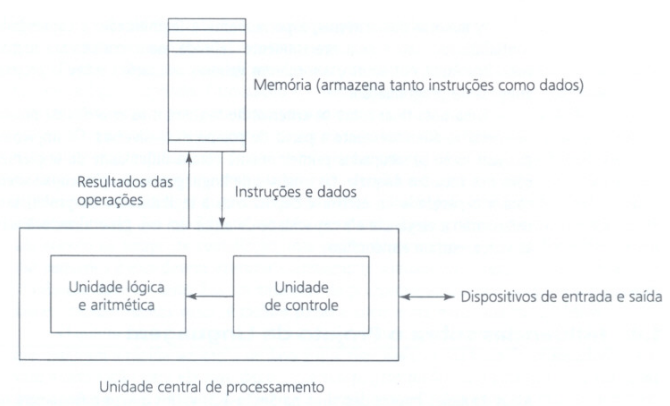
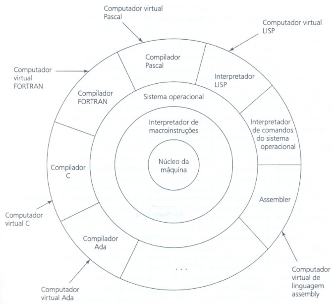
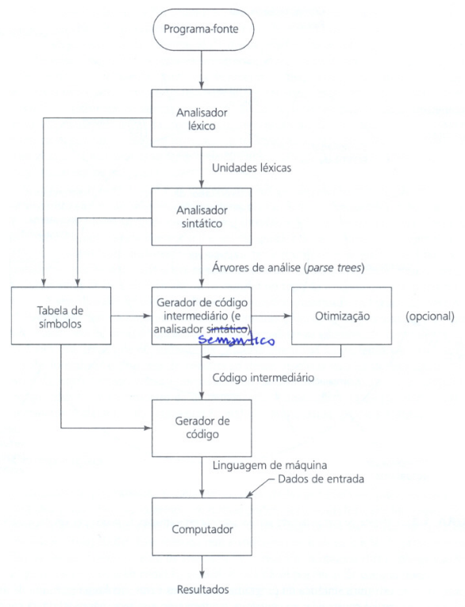
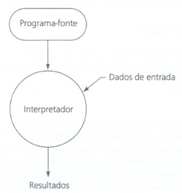
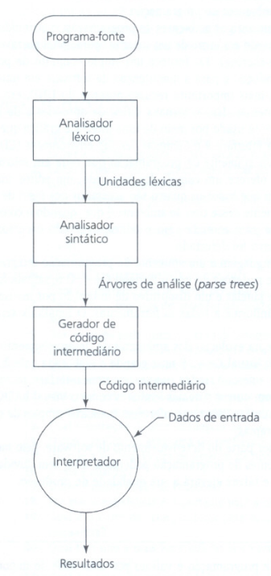

# Conceitos de Linguagem de Programação

## Motivos para Estudar 

### 1. Aumento da capacidade de expressar ideias
- A linguagem que utilizamos influencia nossa **capacidade intelectual** e a **profundidade de abstração** dos nossos pensamentos.
- As linguagens de programação **impõem limites** às <u>estruturas de controle</u>, de <u>dados</u> e às <u>abstrações</u> que um programador pode usar, limitando os tipos de algoritmos construídos.
- Ao conhecer novos recursos, o programador pode **simular funcionalidades** em linguagens que não as suportam <u>nativamente</u>. 
  - Ex: Criar subprogramas para manipulação de strings em `Pascal` após conhecer o `FORTRAN`.

### 2. Melhor embasamento para a escolha de linguagens
- Muitos profissionais tendem a usar linguagens com as quais já estão familiarizados, mesmo que não sejam as mais adequadas para um novo projeto.
- O conhecimento de uma variedade maior de recursos permite uma **escolha consciente e técnica** da <u>melhor ferramenta</u> para cada situação.

### 3. Facilidade no aprendizado de novas linguagens
- A computação está em constante evolução, o **aprendizado contínuo** é fundamental na profissão.
- Compreender os **conceitos fundamentais** torna muito mais fácil entender como eles são aplicados em novas linguagens 
  - Ex: Entender abstração de dados facilita aprender Java.

- O domínio desses conceitos também ajuda na leitura de manuais e literaturas técnicas.

### 4. Compreensão da importância da implementação
- Entender como uma linguagem é implementada ajuda a compreender o **porquê de certas escolhas de projeto**.
- Esse conhecimento permite usar a linguagem de forma mais inteligente e eficiente, além de ajudar a identificar e **corrigir certos tipos de bugs**.
- Permite visualizar a execução e comparar a **eficiência relativa** de diferentes construções. 
  - Ex: Saber que <u>algoritmos recursivos</u> costumam ser mais lentos que os iterativos.

### 5. Capacidade de projetar novas linguagens
- Muitos programadores acabam projetando interfaces de sistemas complexos que funcionam como linguagens (menus, comandos, formatos de entrada).
- O estudo crítico das linguagens fornece critérios de projeto que podem ser aplicados na criação desses sistemas e na **avaliação de produtos** de software.

### 6. Avanço global da computação
- Nem sempre as linguagens mais populares são as **melhores tecnicamente**; às vezes a popularidade se deve ao **desconhecimento de conceitos superiores** pelos tomadores de decisão.
- Um exemplo histórico foi a preferência pelo FORTRAN em vez do ALGOL 60, em parte porque os programadores da época não compreendiam benefícios como a **recursão e a estrutura em blocos** do ALGOL.
- Se os profissionais forem mais bem informados, linguagens de melhor qualidade tendem a se sobrepor mais rapidamente às inferiores.

## Domínios de Programação

### 1. Aplicações Científicas
- **Foco:** Computações aritméticas intensas com **ponto-flutuante**.
- **Estruturas comuns:** Uso predominante de **arrays (vetores) e matrizes**, além de laços de contagem e seleções.
- **Prioridade:** A **eficiência** de execução sempre foi a preocupação central.
- **Linguagens principais:** `FORTRAN`, a primeira, `ALGOL 60` e suas descendentes.

### 2. Aplicações Comerciais
- **Foco:** Produção de **relatórios detalhados**, <u>armazenamento preciso</u> de **números decimais** e dados de caracteres.
- **Características:** Capacidade de realizar operações <u>aritméticas decimais específicas</u>.
- **Linguagens principais:** `COBOL`(1960) continua sendo a mais comum para este fim. 
- Atualmente, <u>sistemas de planilhas</u> e <u>bancos de dados</u> também suprem essa área em pequenos negócios.

### 3. Inteligência Artificial (IA)
- **Foco:** Computação **simbólica**, usa-se nomes em vez de números, e manipulação de **listas encadeadas**.
- **Necessidades:** <u>Alta flexibilidade</u>, como a capacidade de criar e executar código durante a execução do programa.
- **Linguagens principais:** `LISP`, <u>Paradigma Funcional</u>, em 1959 e `Prolog`, Programação <u>Lógica</u>, década de 70.

### 4. Programação de Sistemas
- **Foco:** Desenvolvimento de **softwares básicos**, como sistemas operacionais e ferramentas de suporte.
- **Prioridade:** **Eficiência de execução** (velocidade) e recursos de **baixo nível** para interface com dispositivos de hardware.
- **Linguagens principais:**  PL/S, BLISS e Extended ALGOL.
- A `Linguagem C` tornou-se fundamental por ser eficiente, de baixo nível e facilitar a <u>portabilidade</u> entre máquinas (como visto no UNIX).

### 5. Linguagens de Scripting
- **Funcionamento:** Execução de uma <u>lista de comandos</u>,`scripts`, contidos em um arquivo.
- **Evolução:** Começaram como coleções simples de comandos de shell para gerenciamento de arquivos e evoluíram para linguagens completas.
- **Linguagens principais:** `sh` (shell), `awk`, `Tcl` (combinada com `tk` para <u>interfaces gráficas</u>) e `Perl`. 
- A Perl ganhou grande popularidade com o advento da Web para programação CGI, *Common Gateway Interface*.

### 6. Linguagens para Propósitos Especiais
- **Foco:** Áreas de aplicação muito restritas e específicas.
- **Exemplos:** 
  - `RPG`: Geração de relatórios comerciais; 
  - `APT`: Controle de máquinas programáveis;
  - `GPSS`: Simulação de sistemas.

## Critérios de Avaliação 
- O foco principal da avaliação de uma linguagem é o seu impacto no **ciclo de vida do software**, especialmente no <u>desenvolvimento</u> e na <u>manutenção</u>. 
- Embora cientistas da computação discordem sobre o peso de cada característica, os quatro critérios a seguir são amplamente aceitos como fundamentais.

### 1. Legibilidade
- É a **facilidade** com que um programa pode ser lido e entendido. 
- Tornou-se o critério mais importante após o reconhecimento de que a **manutenção** é a fase mais cara do software.
- **Simplicidade Global:** Linguagens com muitos <u>componentes básicos</u> ou <u>múltiplas formas de realizar a mesma operação</u> (multiplicidade de recursos) são mais **difíceis** de ler.
- **Ortogonalidade:** Significa que um pequeno conjunto de <u>construções primitivas</u> pode ser **combinado** de forma consistente, sem exceções às regras. 

> [!CAUTION]
>
> - A **Ortogonalidade excessiva** pode gerar complexidade desnecessária.

- **Instruções de Controle:** A capacidade de ler o código de <u>cima para baix</u>o (evitando saltos como o `goto`) aumenta a **clareza**.
- **Tipos e Estruturas de Dados:** A presença de <u>tipos adequados</u> (como booleanos em vez de usar números como sinalizadores) torna o código mais intuitivo.
- **Sintaxe:** <u>Identificadores</u> com tamanho adequado e <u>palavras especiais</u> que indicam claramente sua função (Ex: `end if` vs `end`) ajudam na compreensão.

### 2. Capacidade de Escrita 
- Mede a **facilidade** com que uma linguagem cria programas para um determinado domínio.
- **Abstração:** Capacidade de definir e usar estruturas ou <u>operações complexas</u> ignorando <u>detalhes internos</u>. Divide-se em:
  - **Abstração de processo:** Uso de subprogramas.
  - **Abstração de dados:** Uso de classes ou registros para representar entidades (Ex: uma árvore binária).
  - **Expressividade:** Refere-se a formas <u>convenientes</u> de especificar operações, como o operador `count++` em `C`, que é mais breve que `count = count + 1`.

### 3. Confiabilidade
- Um programa é confiável se funciona conforme o esperado em todas as condições.
- **Verificação de Tipos:** Testar erros de tipo preferencialmente em <u>tempo de compilação</u>, o que é mais barato e seguro do que em tempo de execução.
- **Manipulação de Exceções:** Capacidade do programa de <u>interceptar erros em tempo de execução</u> e tomar medidas corretivas.
- **Aliasing:** Ter dois nomes referenciando a mesma célula de memória é considerado um recurso perigoso e prejudicial à confiabilidade.
- **Relação com Legibilidade/Escrita:** Se um programa é fácil de ler e escrever, as chances de ele conter erros e ser difícil de corrigir diminuem drasticamente.

### 4. Custo
- O custo total de uma linguagem envolve diversos fatores:
  - **Treinamento:** Depende da <u>simplicidad</u>e da linguagem.
  - **Escrita e Compilação:** Linguagens que exigem otimização podem ser mais lentas para compilar, mas resultam em execução mais rápida.
  - **Má Confiabilidade:** Falhas em <u>sistemas críticos</u> podem gerar custos financeiros e humanos enormes.
  - **Manutenção:** É o fator de custo mais pesado, podendo ser de **duas a quatro vezes maior** que o custo de desenvolvimento.

### 5. Outros Critérios Importantes
- **Portabilidade:** Facilidade de mover programas entre diferentes implementações, fortemente ligada à **padronização** da linguagem.
- **Generalidade:** <u>Aplicabilidade</u> da linguagem em diversas áreas.
- **Boa Definição:** Precisão do documento oficial que define a linguagem.

## Influências sobre o Projeto da Linguagem

### 1. Influência da Arquitetura do Computador
- O projeto das linguagens mais populares foi moldado pela **arquitetura von Neumann**, que prevaleceu nos últimos 35 anos.
- **Arquitetura von Neumann:** Caracteriza-se pela **separação entre a Memória** (onde dados e programas são armazenados) e a **Unidade Central de Processamento (CPU)**. 
  - As <u>instruções</u> e <u>dados</u> precisam ser **transmitidos** ("canalizados") entre esses dois pontos.

- **Linguagens Imperativas:** São <u>projetadas especificamente</u> para essa arquitetura. Seus recursos centrais modelam o funcionamento da máquina:
  - **Variáveis:** Modelam as <u>células de memória</u>.
  - **Instruções de Atribuição:** Modelam a <u>canalização de dados</u>.
  - **Iteração (Repetição):** É a forma mais <u>eficiente</u> nesta arquitetura, pois as **instruções** ficam em **células adjacentes**, o que acaba desencorajando o uso da <u>recursão</u>.

- **Linguagens Funcionais:** Realizam computações aplicando **funções a parâmetros**, sem necessariamente usar <u>variáveis</u> ou <u>iteração</u>. 
  - Apesar de seus benefícios teóricos, elas ainda não substituíram as imperativas porque **não** são tão **eficientes** em computadores de arquitetura **von Neumann**.

  

### 2. Evolução das Metodologias de Programação
- As mudanças na forma como os softwares são desenvolvidos também forçaram a evolução das linguagens, especialmente devido ao aumento do <u>custo do programador</u> em relação ao hardware.
- **Década de 1970 (Programação Estruturada):** Surgiram as metodologias de **projeto top-down** e **refinamento passo a passo**. 
  - As linguagens da época foram criticadas pela falta de <u>verificação de tipos e excesso de instruções de salto</u> (`goto`).

- **Final da Década de 1970 (Orientação a Dados):** O foco mudou para o uso de **tipos de dados abstratos**, que <u>encapsulam</u> o processamento e os dados.
- **Meados da Década de 1980 (Programação Orientada a Objetos - POO):** Evoluiu a partir da abstração de dados, adicionando **herança** (que aumenta a reutilização de software) e **vinculação dinâmica de tipos**. 
  - Linguagens como `Smalltalk`, `Java`, `C++` e `Ada 95` incorporaram esses conceitos.

- **Tendências Recentes (Concorrência):** A necessidade de <u>criar e controlar unidades de programa</u> que executam **simultaneamente** (concorrência) é um requisito moderno. 
  - Linguagens como `Ada` e `Java` já suportam.

## Categorias de Linguagem
- As linguagens são geralmente classificadas em <u>quatro paradigmas</u> principais:
  - **Imperativas:** Focam em <u>especificar o algoritmo</u> com grandes detalhes e uma ordem de execução específica.
  - **Orientadas a Objeto (OO):** Desenvolveram-se a partir das linguagens imperativas. Embora o paradigma de desenvolvimento seja diferente (focado em **objetos** em vez de **procedimentos**), as extensões necessárias para suportar OO não são complexas.
    - *Exemplo:* C e Java possuem expressões e estruturas de controle quase idênticas, embora a semântica e os subprogramas sejam muito diferentes.

  - **Funcionais.**
  - **Lógicas (Baseadas em Regras):** Diferem radicalmente das outras por não exigirem uma <u>ordem particular de execução</u>. O programador **especifica as regras**, e o **sistema de implementação** <u>escolhe a ordem</u> para produzir o resultado.
    - *Exemplo:* **Prolog** é a linguagem lógica mais popular.

- **Observação sobre Linguagens de Marcação (ex: HTML):** Não são consideradas linguagens de programação porque **não especificam computações**, apenas descrevem a aparência de documentos. No entanto, critérios de projeto como facilidade de leitura e escrita ainda se aplicam a elas.

## *Trade-Offs* no Projeto da Linguagem
- O projeto de uma linguagem é uma tarefa de engenharia complexa porque os critérios de avaliação costumam ser **conflitantes entre si**. Alguns dos principais trade-offs mencionados são:
- **Confiabilidade vs. Custo de Execução:**
  - A linguagem **Ada** prioriza a **confiabilidade** ao exigir a <u>verificação de índices de arrays</u>, o que torna a **execução mais lenta**.
  - A linguagem **C** prioriza a **eficiência de execução** ao <u>não exigir essa verificação</u>, sendo mais rápida, porém <u>menos confiável</u>.

- **Capacidade de Escrita vs. Legibilidade:**
  - A linguagem **APL** oferece uma escrita muito **poderosa** e **compacta** através de **muitos operadores**, permitindo programas <u>extremamente curtos</u>.
  - Em contrapartida, essa compactação torna a **legibilidade péssima**, exigindo muito tempo para que outra pessoa (ou o próprio autor) entenda o código.

- **Flexibilidade vs. Segurança:**
  - Os "registros variantes" em **Pascal** oferecem flexibilidade ao permitir que uma **célula de memória** <u>armazene diferentes tipos</u> (como ponteiros ou inteiros), permitindo até aritmética de ponteiros.
  - No entanto, essa prática é perigosa porque contorna a v**erificação de tipos** da linguagem, **diminuindo a segurança do programa**.

## Métodos de Implementação
- **Linguagem de Máquina:** É o conjunto de <u>instruções primitivas</u> (macroinstruções) que o computador entende diretamente.
- **Computadores Virtuais:** Como projetar hardware para cada <u>linguagem de alto nível</u> seria caro e inflexível, usa-se o **software de sistema** (como o Sistema Operacional e compiladores) para criar "camadas" sobre a máquina real.
- Cada camada funciona como um **computador virtual**, oferecendo interfaces de nível mais alto para o usuário ou programador.

### Compilação
- Neste método, o programa em <u>linguagem-fonte</u> é totalmente **traduzido** para <u>linguagem de máquina</u> antes da execução.
- **Vantagem:** Execução muito rápida.
- **Etapas do Processo:**
  1. **Analisador Léxico:** Agrupa <u>caracteres em unidades</u> (**identificadores**, **operadores**) e ignora comentários.
  2. **Analisador Sintático:** Constrói estruturas chamadas <u>árvores de análise</u> (*parse trees*) que representam a <u>estrutura do programa</u>.
  3. **Gerador de Código Intermediário:** Cria um <u>programa</u> em um nível entre a fonte e a máquina (nível Intermediário). O **analisador semântico** atua aqui verificando erros de tipo.
  4. **Otimização:** Melhora o código para torná-lo <u>menor ou mais rápido</u> (Opcional).
  5. **Gerador de Código:** Converte o código intermediário em <u>linguagem de máquina</u>.

- **Vinculação (Linking):** O <u>linkeditor</u> conecta o código do usuário a <u>programas do sistema</u> (como os de entrada e saída) e <u>bibliotecas</u>, gerando o módulo de carga (executável).

### Arquitetura von Neumann e a Execução
- **Ciclo Buscar-Executar (*Fetch-Execute*):** Os programas **residem na memória**, mas são **executados** na **CPU**. 
  - O processo segue o algoritmo: Buscar instrução $\rightarrow$ Incrementar contador $\rightarrow$ Decodificar $\rightarrow$ Executar.

- **Gargalo de von Neumann:** A <u>velocidade da conexão</u> entre a **memória e o processador** é o principal limitante da velocidade do computador, pois as **instruções** são costumam ser **executadas** mais rápido do que podem ser **transferidas**.

### Interpretação Pura
- O programa é **traduzido** e **executado** <u>instrução por instrução</u> por outro programa chamado **interpretador**.
- **Vantagem:** Facilita muito a <u>depuração</u> (`debug`), pois as mensagens de erro podem apontar exatamente a linha do código-fonte.
- **Desvantagens:** <u>Execução muito lenta</u> (10 a 100 vezes mais devagar que a compilada) e exige **mais espaço em memória**, pois a <u>tabela de símbolos</u> deve estar presente.
- **Exemplos:** Scripts de `shell` do UNIX, arquivos `.BAT` e linguagens como `APL` e `LISP`.

### Sistemas de Interpretação Híbrida
- É um meio-termo que **traduz a linguagem de alto nível** para uma linguagem **intermediária** para facilitar a **interpretação**.
- **Vantagem:** É mais **rápido** que a <u>interpretação pura</u> porque a **decodificação** da fonte ocorre <u>apenas uma vez</u>.
- Exemplos:
  - `Perl`: Parcialmente compilada para **detectar erros** antes da interpretação.
  - `Java`: Traduzida para **código de bytes** (`bytecode`), que é interpretado pela <u>Java Virtual Machine</u> (`JVM`), garantindo portabilidade.

  

## Ambientes de Programação

### O que é um Ambiente de Programação?
- Consiste no **conjunto de ferramentas** utilizadas para o desenvolvimento de software.
- Pode variar de um **sistema simples** (apenas editor de texto, compilador e linker) até coleções complexas de ferramentas integradas com uma **interface de usuário uniforme**.
- **Ponto central:** As características de uma <u>linguagem não são o único fator</u> que determina a capacidade de desenvolvimento; o ambiente ao seu redor é fundamental.

### Exemplos e Evolução Histórica
- **UNIX:** Um dos mais antigos (década de 70), oferece ferramentas poderosas, mas historicamente era difícil de aprender por falta de uma interface uniforme. Atualmente, utiliza interfaces gráficas como o **CDE** (Common Desktop Environment).
- **Borland C++:** Focado em microcomputadores IBM-PC, integra compilador, editor e depurador em uma interface gráfica. Um recurso de destaque é a capacidade de o compilador **levar o cursor do editor diretamente para o erro de sintaxe** detectado.
- **Smalltalk:** Foi pioneiro no uso de **janelas e mouse** para oferecer uma interface uniforme, sendo considerado um ambiente mais elaborado e poderoso que o Borland C++.
- **Ferramentas Modernas (Visual Studio, Delphi, JDK):** Representam o passo mais recente, oferecendo grandes coleções de ferramentas integradas que facilitam, por exemplo, a **construção simples de interfaces gráficas** para os programas.

### Impacto no Desenvolvimento
- Ambientes integrados e complexos melhoram significativamente o **desenvolvimento e a manutenção** de software.
- O uso de ambientes poderosos é a tendência para o futuro, visando aumentar a **produtividade** dos programadores e elevar a **qualidade** da produção de software.
