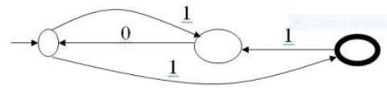
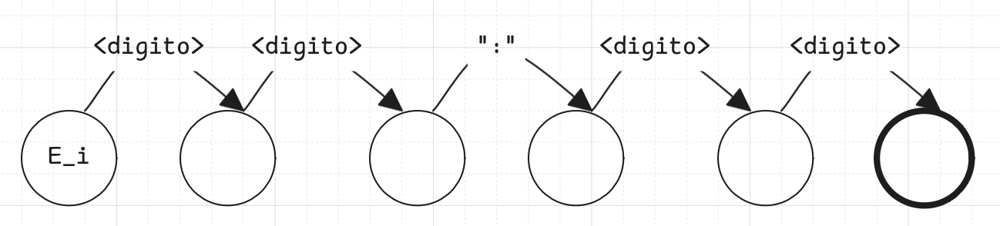

# Prova 02

## Parte I

### Questão 01: Responda (nesse mesmo arquivo) falso, verdade ou NS (não sei). Duas erradas anulam uma certa. Branco conta como errada. Cada resposta correta recebe 0,4 pontos. Em caso da resposta ser falso, justifique porque ela é falsa.

| Questão | Resposta |
| :-----: | :------: |
| 1. A análise semântica mantém a tabela de símbolos, detecta a maioria dos erros e, se não houver erros, gera código intermediário. | V |
| 2. Nas linguagens compiladas atuais, a análise semântica também é a responsável por eliminar comentários e delimitadores redundantes, expandir macros e fazer a montagem condicional. | F |
| 3. A análise sintática utilizar scanners modelados como FSA para identificar os tokens do programa. | F |
| 4. As semânticas possíveis para A ← 2 + 3 são atribuir valor 5 ou operação “2+3” para A. Com checagem de tipo dinâmica, o tipo de A decide a semântica. Com checagem estática, o tipo de A depende do valor a ele atribuído. | F |
| 5. BNF é uma gramática livre de contexto, simples e poderosa que consegue expressar regras sintáticas com dependência contextual. | F |
| 6. A string 101101 é reconhecida pelo autômato. | V |
| 7. A string arara pode ser reconhecida por um autômato push down determinístico. | F |
| 8. Na fase de síntese do código, constituem exemplos de otimização algorítmica: efetuar cálculos de valores comuns, eliminar atribuições constantes em loops, efetuar cálculo de subscritos, e eliminar variáveis temporárias. | V |
| 9. O conjunto de linguagens aceitas por FSA é equivalente às linguagens geradas por gramáticas ou expressões regulares. | V |
| 10. O parser grupa sequência de caracteres em constituintes elementares do fonte (símbolos) na análise léxica. | F |
| 11. Regras sintáticas definidas por uma sintaxe formal (gramática) são suficientes para determinar a interpretação correta de uma sentença. | F |
| 12. Sintaxe de uma LP é o conjunto de regras que determinam quando uma sentença é bem formada. | V |
| 13. Um PDA é um FSA com uma pilha associada que pode ser utilizado para reconhecer strings em uma linguagem com sentenças geradas por regras de uma gramática regular. | F |
| 14. Uma gramática regular possui regras da forma: `<não-terminal> ::= terminal <não-terminal> \| terminal`. | V |
| 15. Uma linguagem é qualquer conjunto de strings (de tamanho finito) de caracteres escolhidos de um alfabeto fixo de símbolos finitos. | V |

Justificativas  
2. Os comentários e delimitadores são eliminados na Análíse Léxica, e não na Análíse Semântica.   
3. A Análise Léxica utiliza scanners modelados como FSA para identificar os tokens do programa, e não a Análise Sintática.  
4. Houve uma inversão dos significados. Na checagem do tipo estática o tipo de A decide a semântica, enquanto na checagem do tipo dinâmica  o tipo de A depende do valor a ele atribuído.  
5. BNF não consegue expressar regras sintáticas com dependência contextual.  
7. Palíndromos que não tem um elemento central explícito não podem ser reconhecidos por um autômato push down determinístico.  
10. O scanner grupa sequência de caracteres em constituintes elementares do fonte (símbolos) na análise léxica, e não o parser.  
11.  Regras sintáticas definidas por uma sintaxe formal (gramática)  não são suficientes para determinar a interpretação correta de uma sentença pois a interpretção correta depende também da semântica para entregar o significado correto de acordo com o contexto.  
13. Gramáticas regulares são reconhecidas por FSA simples sem pilha, enquanto PDA são modelos utilizados especificamente para reconhecer linguagens geradas por BNF ou gramáticas livres de contexto.

Imagem da Questão 06



## Parte II

### Questão 2 – Porque é difícil para um tradutor determinar a igualdade de dois objetos de dados do mesmo tipo (0,5)? Exemplifique (0,5). Qual foi a abordagem para afirmar que os tipos dos dois objetos do seu exemplo são equivalentes (1,0)? [2,0]

É difícil para um tradutor determinar a igualdade entre dois objetos de dados porque essa igualdade pode ser definida de diferentes formas pela linguagem. Dois objetos podem possuir a mesma representação em memória, mas significados diferentes, ou possuir nomes diferentes e, ainda assim, serem considerados equivalentes dependendo do critério adotado pela linguagem.

Exemplo
```c
struct Coordenada {
    int x;
    int y;
};

struct Prova {
    int nota1;
    int nota2;
};
```

Foi utilizada a abordagem de Equivalência Estrutural. Nessa abordagem, dois tipos são considerados equivalentes quando possuem a mesma estrutura interna, independentemente do nome atribuído a eles.

No exemplo, ambas as estruturas são compostas por dois campos inteiros na mesma ordem. Assim, são estruturalmente equivalentes, embora representem conceitos diferentes (uma coordenada e uma prova).

### Questão 3: Escreva um código C com programa principal e função recursiva chamada por ele (0,5). Descreva o suporte necessário e como funciona a execução de uma função recursiva. (1,0). Apresente o conteúdo do segmento de código e do registro de ativação ao final da segunda chamada da função recursiva (1,0). [2,5]

```c
#include <stdio.h>

int fatorial(int n) {
    if (n <= 1)
        return 1;
    return n * fatorial(n - 1);
}

int main() {
    int n = 2;
    int resultado = fatorial(n);

    printf("Fatorial: %d\n", resultado);
    return 0;
}
```

A execução de uma função recursiva utiliza um suporte dividido em uma parte estática (segmento de código) e uma parte dinâmica (registro de ativação) armazenada na pilha de execução. A tradução da definição da função produz um gabarito utilizado em todas as chamadas. A cada invocação é criado um novo registro de ativação contendo parâmetros, variáveis locais, endereço de retorno e dados de controle, permitindo que várias ativações da mesma função coexistam simultaneamente. Ao término da execução, o epílogo remove esse registro da pilha e devolve o controle para a chamada anterior.

Ao final da segunda chamada (`fatorial(1)`), o segmento de código permanece único e compartilhado por todas as ativações, enquanto o registro de ativação ativo é o de `fatorial(1)` e o registro de `fatorial(2)` permanece na pilha aguardando o retorno da chamada recursiva.

Segmento de Código

| Componente | Conteúdo |
|------------|----------|
| Prólogo | Cria o registro de ativação da função. |
| Código executável | Implementação da função `fatorial()`. |
| Constante/Literal | Valor `1`, utilizado no caso base. |
| Epílogo | Remove o registro de ativação e retorna para a chamada anterior. |

Registro de Ativação de `fatorial(1)` (ativo)

| Campo | Conteúdo |
|-------|----------|
| Resultado | `1` |
| Parâmetro | `n = 1` |
| Variáveis locais | Não possui |
| Endereço de retorno | Retorno para `fatorial(2)` |
| Dados de controle | Ponteiro dinâmico e informações de controle |
| Temporários | Espaço para valores temporários durante a execução |

Estado da pilha de execução

| Ordem | Registro de Ativação |
|-------|-----------------------|
| Topo | **RA de `fatorial(1)`** (ativo) |
| ↓ | **RA de `fatorial(2)`** (aguardando o retorno de `fatorial(1)` para calcular `2 × 1`) |
| Base | **RA de `main`** (`n = 2`, `resultado`) |

### Questão 4: Apresente um exemplo (e informe o significado) gerado por cada um dos seguintes formalismos: BNF, EBNF, FSA, gramática regular e expressão regular. (0,5 cada) [2,5]

BNF: É uma metalinguagem formal usada para descrever outras linguagens através de regras rígidas.

```plaintext
<data> ::= <dia>"/"<mes>"/"<ano>
<dia> ::= <digito><digito>
<mes> ::= <digito><digito>
<ano> ::= <digito><digito><digito><digito>
```

Essa gramática descreve cadeias que representam datas no formato DD/MM/AAAA. Por exemplo, a cadeia 26/06/2026 é reconhecida pela gramática como uma data válida.

EBNF: É uma extensão da BNF que adiciona operadores para representar repetição, agrupamento e elementos opcionais, tornando a gramática mais compacta.

```plaintext
<data> ::= <dia> "/" <mes> "/" <ano> [<hora>]
<dia> ::= <digito><digito>
<mes> ::= <digito><digito>
<ano> ::= <digito><digito><digito><digito>
<hora> ::= " " <digito><digito> ":" <digito><digito>
```

Essa gramática descreve datas no formato DD/MM/AAAA, podendo conter opcionalmente um horário. Por exemplo, 26/06/2026 e 26/06/2026 19:00 pertencem à linguagem.

FSA: É um autômato de estados finitos utilizado para reconhecer tokens durante a análise léxica. É formado por um conjunto finito de estados, um estado inicial, um conjunto de estados finais, um alfabeto de entrada e um conjunto de transições (arcos) entre os estados.



Esse autômato reconhece cadeias no formato HH:MM. Por exemplo, a cadeia 19:00 é reconhecida pelo autômato.

Gramática Regular: É um caso especial da gramática BNF, cujas produções possuem a forma: `<não-terminal> ::= terminal <não-terminal> | terminal`. Ela gera linguagens regulares, equivalentes às linguagens reconhecidas por autômatos de estados finitos.

```plaintext
<S> ::= 0<S> | 1<S> | 1
```

Essa gramática gera cadeias binárias terminadas em 1. Por exemplo, 1, 101, 001 e 1101 pertencem à linguagem.

Expressão Regular: É um formalismo utilizado para descrever linguagens regulares por meio de padrões. É equivalente aos autômatos de estados finitos e às gramáticas regulares.

```plaintext
(0 ∨ 1) * 1
```

Essa expressão regular reconhece cadeias binárias terminadas em 1. Por exemplo, 1101 satisfaz essa expressão regular.
