# Introdução e Contexto Histórico

## Introdução

### A Revolução do Computador

Avanços tecnológicos na computação 
- Impulsionados pela **Lei de Moore** (1965, rev 1975) 

Viabilizam novas aplicações como:
- Computadores em automóveis 
- Telefones celulares 
- Projeto Genoma 
- Computação vestível 
- WWW 

Computadores são pervasivos

### Principal Componente do Computador: Microprocessador

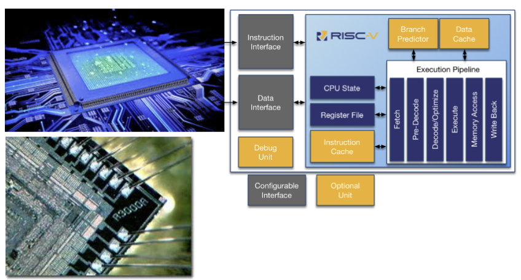

### Classes de Sistemas Computacionais

**Supercomputadores** 
- Aplicações científicas e cálculos de engenharia de altíssimo 
desempenho. 
- Milhares de processadores interligados por conexões de alta velocidade, com terabytes (tebibytes) de memória. 
- Pequena fração do mercado 

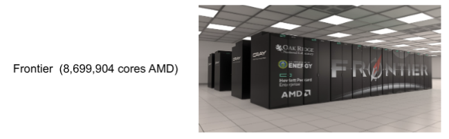

**Servidores** 
- Recursos compartilhados entre vários usuários 
- Acessados via rede 
- Geralmente sistemas de software específicos 
- Ex: Servidores de arquivo, servidores de streaming, webservers até servidores em data centers e cloud
- Alta dependabilidade (confiabilidade, segurança, disponibilidade e mantenabilidade), geralmente alto custo.

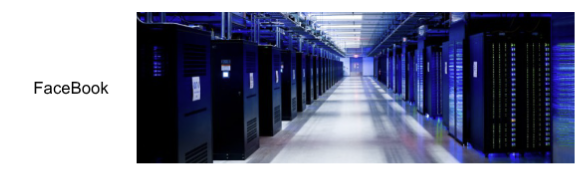

**Pessoais**
- Recursos utilizados geralmente por um único usuário 
- Geralmente programas de terceiros 
- Ex: Desktops, notebooks, tablets, smartphones, etc
- Compromisso entre custo e desempenho para o usuário

**Embarcados** 
- Parte de um produto 
- Software de difícil customização, geralmente integrado ao hardware. 
- **Ex:** Eletroeletrônicos (TV, DVD, Conversores, eletrodomésticos,...), Automóveis/Barcos/Aviões, Industriais, Brinquedos, Robôs, IoT. 
- Geralmente baixo custo e baixa dependabilidade, embora alguns precisem de baixa taxas de falhas (**Sistemas Redundantes**, por exemplo, avião).

### Era Pós-PC
- 1940 - 1970: Criação. Grandes computadores  (ENIAC)
- 1970 - 2000:  Popularização. Computadores pessoais (PCs)
- 2000 - Hoje:  Individualização. Dispositivos portáteis pessoais (tablet), embarcados (TV), internet das coisas (IoT), computação vestível, computação em nuvem.

### O que é Organização e Arquitetura de Computadores

Software de Aplicação 
- Linguagem de alto nível 

**Software do Sistema** 
- **Compilador:** Traduz LAN para ASM 
- **Sistema Operacional:** Opera a máquina 
    - Trata entrada e saída de dados 
    - Gerencia memória e armazenamento 
    - Escalona processos 

**Hardware** 
- Processador, memória, controladores

**Arquitetura do conjunto de instruções + Organização da máquina**

É uma abstração, ISA: Normatiza quais as instruções que o processador é capaz de executar.

Estuda a Interface entre software e hardware.

### Níveis de Programação

**Linguagem de alto nível** 
- Maior aprofundamento revela mais informações. 
- Maior produtividade e portabilidade  

**Linguagem de Montagem** 
- Representação textual das instruções 

**Nivel de hardware** 
- Dígitos binários 
- Codificação de instruções e dados

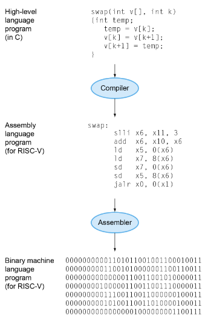

### Componentes
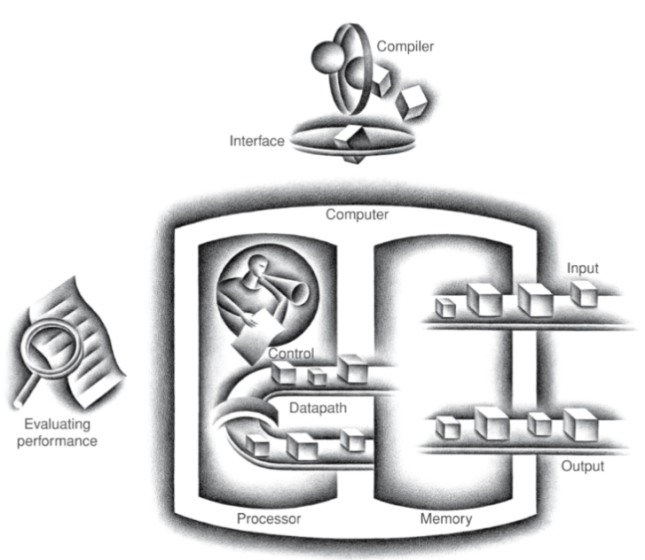

Os 5 componentes do  computador 
- Se aplicam a qualquer tipo de computador 

Foco principal: O **Processador**
- Parte de **controle**  
- Parte **operativa**

Entrada e saída inclui: 
- Interfaces 
    - Telas, teclados, mouses 
- Armazenamento 
    - Discos, pen drives, DVD 
- Comunicação 
    - Ethernet, wireless

### Dispositivos Pós-PC
Tela sensível ao toque 

Integra monitor, teclado e mouse em um único dispositivo 

Tela capacitiva: 
- Permite multiplos toques simultâneos 
- Dominante no mercado

### Processadores
- Unidade **operativa** (***datapath***): Opera sobre dados 
- Unidade de **controle**: Sequencia as operações 
- Memória **cache**: SRAM pequena e rápida para consulta

Processadores em celulares:  
- Apple: A11 - Bionic    
- Qualcomm: Snapdragon 845 
- Samsung: Exynos 9810 
- Huawei: Kirin 970

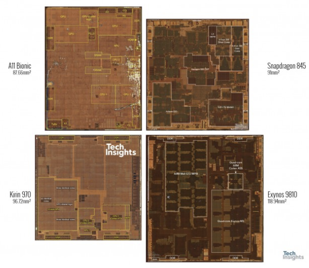

### Decimal x Binário
Diferenciando potências **decimais/base 10** de potências **binárias/base 2**

| Decimal term | Abbreviation | Value | Binary term | Abbreviation | Value | % Larger |
| ------------ | ------------ | ----: | ----------- | ------------ | ----: | -------: |
| kilobyte     | KB           |   10³ | kibibyte    | KiB          |   2¹⁰ |       2% |
| megabyte     | MB           |   10⁶ | mebibyte    | MiB          |   2²⁰ |       5% |
| gigabyte     | GB           |   10⁹ | gibibyte    | GiB          |   2³⁰ |       7% |
| terabyte     | TB           |  10¹² | tebibyte    | TiB          |   2⁴⁰ |      10% |
| petabyte     | PB           |  10¹⁵ | pebibyte    | PiB          |   2⁵⁰ |      13% |
| exabyte      | EB           |  10¹⁸ | exbibyte    | EiB          |   2⁶⁰ |      15% |
| zettabyte    | ZB           |  10²¹ | zebibyte    | ZiB          |   2⁷⁰ |      18% |
| yottabyte    | YB           |  10²⁴ | yobibyte    | YiB          |   2⁸⁰ |      21% |

### O que é: Organização e Arquitetura de Computadores?

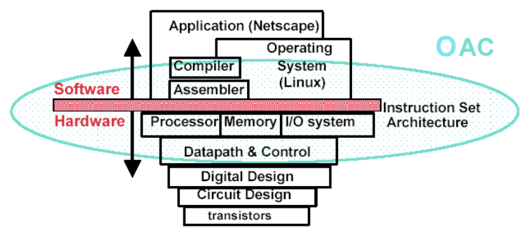

**Arquitetura do conjunto de instruções + Organização da máquina**

### O que é um computador ?
**Componentes:** 
- Processador(es) 
- Dispositivos de entrada (mouse, teclado,...) 
- Dispositivos de saída (monitor, impressora,...) 
- Dispositivos de memória (DRAM, SRAM, HD, CD, DVD,...) 
- Dispositivos de comunicação (Ethernet, USB, IEEE1394, ...) 

Nosso foco principal: **O processador**, **caminho de dados** e **controle**. 
- Implementado usando milhões de transistores 
- Impossível de entender olhando para os transistores 

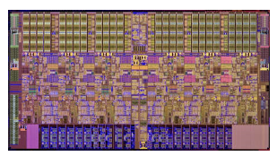

### Como os computadores funcionam ?

É preciso entender abstrações como: 
- Software de Aplicação (usuário) 
- Software Básico (ou de sistema) (SO, drivers, etc) 
- Linguagem de montagem (Assembly) 
- Linguagem de máquina (0101010011010011) 
- Aspectos da organização da máquina (processador, memórias, etc) 
- Lógica sequencial, máquinas de estado finito 
- Lógica combinatória, circuitos aritméticos, portas lógicas 
- Lógica booleana, 1s e 0s 
- Transistores usados para construir portas lógicas (CMOS/TTL) 
- Física dos semicondutores 
- Propriedades dos átomos e moléculas 
- Mecânica quântica

### Arquitetura do Conjunto de Instruções (ISA)
Uma abstração muito importante 
- **Interface** entre o <u>hardware</u> e o <u>software</u> de baixo nível  
- Padroniza instruções, padrões de bits de linguagem de máquina, etc.
    - Define o que o processador pode fazer  
- **Vantagem:** Permite diferentes implementações de uma arquitetura  
- **Desvantagem:** Algumas vezes impede o uso de inovações

ISAs modernas:  
- IA-32 (x86) 
- EM64T  
- PowerPC  
- SGI 
- MIPS 
- SUN SPARC 
- ARM 
- HP PA-RISC e outras

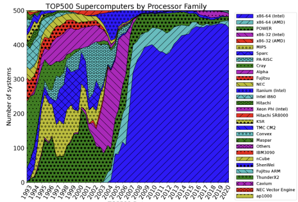

### Arquitetura x Organização x Implementação
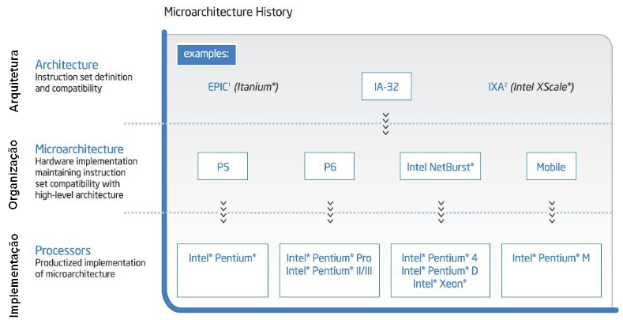

## Contexto Histórico
No início do século 17 iniciou-se a automação de tarefas com máquinas, com resultados utilizados até hoje!

### Máquina de Pascal
- Fazia **soma** e **subtração** em <u>decimal</u> mecanicamente. 
- Mais tarde no mesmo século foram adicionadas multiplicação e divisão à máquina. 
- **Cartões perfurados** codificados com instruções para a máquina vieram da indústria de tecelagem.

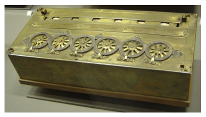

### A Calculadora de Babbage
Um dos grandes sucessos e fracassos no caminho do desenvolvimento de computadores.  

Uma calculadora mecânica automática que nunca funcionou. A Analytical Engine foi a 3ª máquina de calcular projetada por Babbage e a que mais contribuiu para o desenvolvimento da computação.

Charles Babbage não conseguiu solucionar problemas mecânicos tentando construir sua máquina.  
- A máquina de Babbage ficou num sonho. Era muito complexa para os profissionais da época.

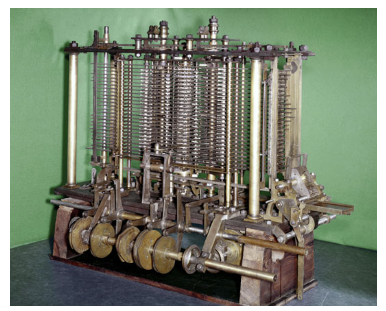

O sucesso de sua máquina, utilizado até os dias de hoje, foi a idéia que Babbage teve de como ela deveria processar as informações. 
Babbage dividiu sua máquina em três partes:
- Armazenamento
- Engenho
- Controle

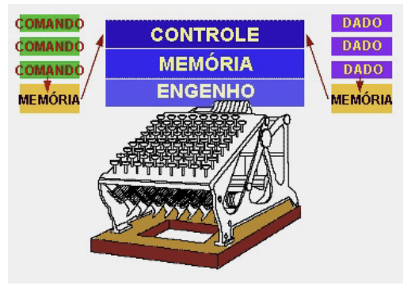

O projeto de Babbage teria um conjunto de instruções bem simples, limitado a operações como: 
- "pegar um número do cartão de dados em curso" 
- "somar 1 ao número em curso" 
- "subtrair 1 do número em curso" 
- "ir para o próximo cartão de dados" ...

> [!IMPORTANT]  
> A ideia de Babbage sobre a estruturação de informação dentro de um dispositivo foi utilizada, finalmente com algum sucesso, no início do século 20.

### Konrad Zuse: O primeiro computador
- **1935–1938 - Z1:** Konrad Zuse constrói a Z1, considerado o primeiro computador do mundo controlado por programa.
  - Apesar de alguns problemas de engenharia mecânica, possuía os elementos básicos das máquinas modernas.
  - Utilizava o **sistema binário**.
  - Apresentava a separação entre **armazenamento e controle**, característica padrão dos computadores modernos.
  - O pedido de patente de Zuse de 1936 (Z23139/GMD Nr. 005/021) também sugere uma **arquitetura de von Neumann**, posteriormente reformulada em 1945.
  - A arquitetura previa que **programas e dados pudessem ser modificados e armazenados na memória**.

- **1941 - Z3:** Zuse conclui a Z3, considerada o primeiro computador **programável e plenamente funcional** do mundo.

- **1945 - Plankalkül:** Zuse descreve a **Plankalkül**, considerada a primeira linguagem de programação de alto nível.
  - A linguagem continha diversos recursos que posteriormente se tornariam comuns nas linguagens de programação modernas.
  - A **FORTRAN** surgiria quase uma década depois.
  - Zuse também utilizou a Plankalkül para projetar o **primeiro programa de xadrez** do mundo.

- **1946 - Zuse-Ingenieurbüro Hopferau:** Zuse funda a primeira **startup de computadores** do mundo.
  - A empresa foi denominada **Zuse-Ingenieurbüro Hopferau**.
  - O capital de risco foi obtido por meio da **ETH Zürich** e de uma opção da **IBM** sobre as patentes de Zuse.

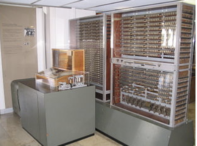

### MARK I

A série de computadores Mark (I,II,II,IV) foi desenvolvida na Universidade de Harvard durante os anos 40,sob liderança de Howard Aiken 

O primeiro,**Mark  I**, foi desenvolvido com o apoio da recém criada IBM e da  Marinha dos EUA, sob o nome Automatic Sequence Controlled Calculator (ASCC),entrou  em operação em 1944 e foi utilizado até 1959.

Armazenava e contava números mecanicamente, utilizando 3000 discos de armazenamento  decimais, 1400 chaves rotativas e mais de 800 km de fios. 
- Transmitia e lia os dados eletricamente. 

Era programado por cartões perfurados, pesava 5 toneladas e realizava uma operação de multiplicação em 6 segundos.

### O MARK I – Arquitetura Harvard

Os dados eram armazenados em local diferente das instruções (programa). 
- **Programa:** Papel perfurado 
- **Dados:** Dispositivos Eletromecânicos 

As instruções também eram armazenadas num formato diferente dos dados. 

A técnica de armazenamento de dados e instruções separadamente tornou-se conhecida como Arquitetura Harvard.

### O Mark I de Manchester - The Baby Machine
- Construído entre 1946 e 1948 na Universidade de Manchester - UK 
- **Memória digital**  
- Arquitetura: 
    - Palavras com 32 bit de comprimento; 
    - Endereçamento simples; 
    - Cálculo aritmético binário em série; 
    - Uma memória RAM com 32 words, extensível até 8.192 words; 
    - Uma velocidade de cálculo de 1,2 ms por instrução;

### Evolução Tecnológica: a Válvula
- 1906: Invenção da Válvula Termiônica.
- Alta tensão  entre A e K com corrente controlada pela tensão da grade ($V_{gk}$).
- **Vantagem:** Tempo de comutação (on/off) muito menor que relés eletromecânicos. 
- **Desvantagem:** Alta tensão e dissipação térmica.

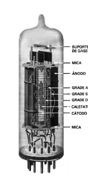

### ENIAC – 1º Computador Eletrônico
No início dos anos 40 este computador foi desenvolvido na Universidade da Pennsylvania, utilizando 18000 válvulas e 1500 relés para movimentar a informação através da máquina, chamado de Electronic Numerical Integrator And 
Calculator.

Podia fazer 5000 adições por segundo ou 357 multiplicações por segundo. 
- Capacicade de processamento.

Era programado por **cartões perfurados** e podia ler dois números por segundo.
- Velocidade de IO, entrada e saída.

O ENIAC, construído na Segunda Guerra Mundial, foi o primeiro computador de finalidade geral 
- Usado para calcular tabelas de disparo de artilharia 
- 24 metros de comprimento por 2,5 metros de altura e dezenas de centímetros de profundidade 
- Cada um dos 20 registradores de 10 dígitos tinha 60 centímetros de comprimento 
- Usava 18.000 válvulas

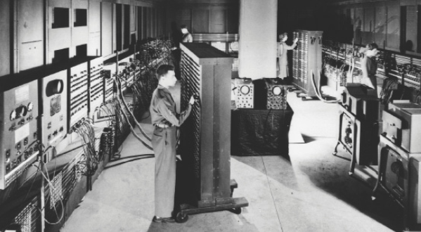

### A arquitetura von Neumann
Em  meados dos anos 40, ***John Von Neumann*** mostrou que as instruções poderiam ser representadas na mesma linguagem utilizada para os dados.

**Instruções e dados** poderiam, então,ser armazenados "juntos **dentro do computador**".

O primeiro computador com esta Arquitetura **von Neumann** foi o experimental Manchester Baby, também chamado de Small-Scale Experimental Machine (SSEM), que tornou-se operacional em 1948.

Num típico sistema von Neumann, **instruções e dados** estão inseridos juntos na  **mesma memória**. Muitas vezes com os dados seguindo imediatamente as instruções. 
- Instruções são apenas números, não podendo ser distinguidas dos dados.

A arquitetura von Neumann e o conceito de **programa armazenado** tornou-se padrão  para os sistemas computacionais.
- As instruções são direcionadas/vem de uma a partir de uma parte especifica em memória.
    - PC: Program Couter
- É possível sobrescrever instruções.

Combinar instruções e dados na mesma memória traz algumas **vantagens**: 
- **Uso eficiente da memória:** Um único bloco (grande) de memória ao invés de dois menores. 
- **Instruções são facilmente manipuláveis:** Como instruções e dados estão armazenados juntos, movimentar blocos de instruções (programas) é mais simples, ou ... 
- **Facilidade em carregar programas na memória:** Basta ler as instruções do disco ou outra memória secundária e executá-las.

Combinar instruções e dados na mesma memória traz algumas **desvantagens**: 
- **Dados podem sobrescrever instruções:**  Sem alguma precaução especial do hardware (proteção de memória), uma escrita incorreta na memória pode **sobrescrever** algumas instruções. 
    - Como os sistemas von Neumann não fazem distinção entre dados e instruções, a  máquina pode tentar **executar dados como instruções**, com resultados imprevisíveis.

- **Largura de banda limitada:** Armazenar instruções e dados juntos significa que ambos percorrem o **mesmo caminho** até o processador. 
    - Este é o **gargalo da arquitetura von Neumann**. 
    - O processador deve executar um grande número de instruções por segundo e ler uma grande quantidade de dados ao mesmo tempo.

### Mudanças no hardware
No final dos anos 50 foi introduzido o uso do transistor. 1/200 do tamanho da 
válvula.

Geravam muito menos calor que as válvulas e eram muito, muito mais rápidos (as distâncias eram muito menores): podiam suportar até 100.000 chaveamentos por segundo.

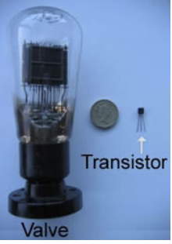

### Revolução da Eletrônica
- Válvulas 
- Transistores 
- Circuitos Integrados 
- LSI 
- VLSI

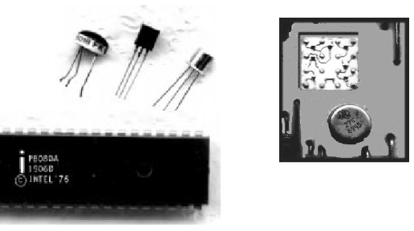

Conceitos de organização, paralelismo e hierarquia de memória são os mesmos de mainframes das décadas de 60 e 70 a diferença está na tecnologia.
- 1970: poucos milhares de transistores num chip 
- 2005: centenas de milhões de transistores num chip 
- 2010: mais de 2 bilhões de transistores num chip

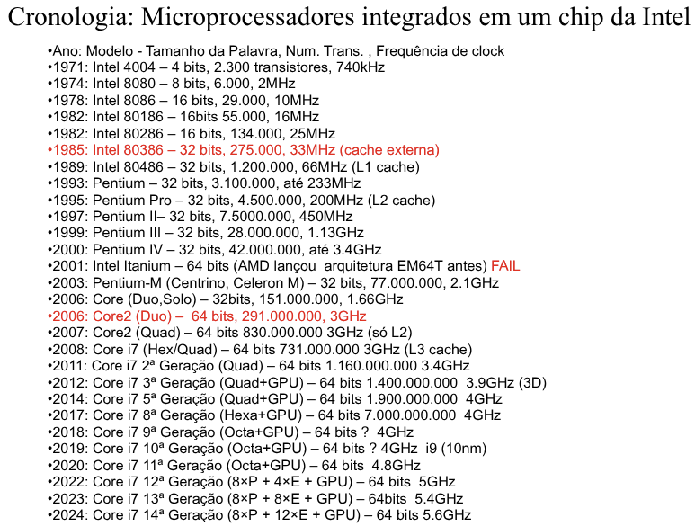

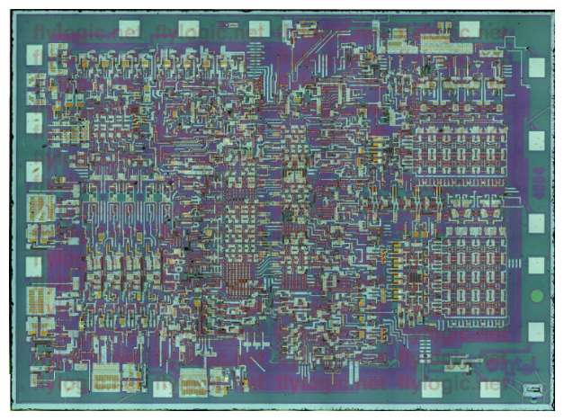

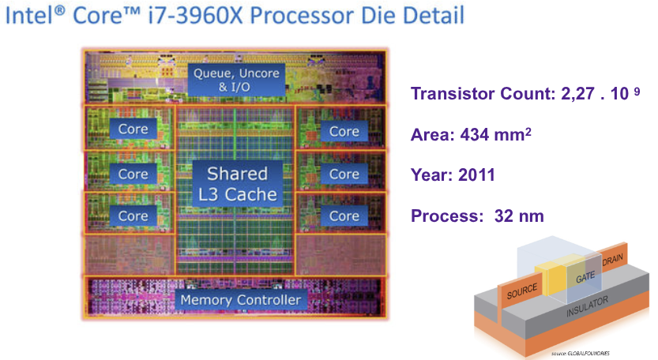

### A Arquitetura Harvard Modificada
A **arquitetura Von Neumann** tornou-se muito popular, porém as suas limitações (principalmente o **gargalo de Von Neumann**) pareciam insuperáveis. 

O avanço da microeletrônica (barateamento dos dispositivos de memória) e a popularização do **conceito de hierarquia de memória**, trouxe a arquitetura Harvard de volta. 

A Arquitetura Harvard Modificada é **atualmente** utilizada em praticamente todos os sistemas computacionais.

O retorno da arquitetura Harvard foi impulsionada inicialmente pelos Processadores  Digitais de Sinais, e utilizada ainda hoje,na sua forma pura,em diversos processadores e microcontroladores de baixo custo. 
- **Ex:** DSPs, microcontroladores PIC, 8051, etc.

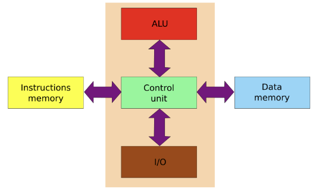

A Arquitetura Harvard Modificada é atualmente utilizada em praticamente todos os sistemas computacionais.  

Une  os  benefícios da maior largura de banda (acesso a instruções e dados simultaneamente) com o conceito de programa armazenado.

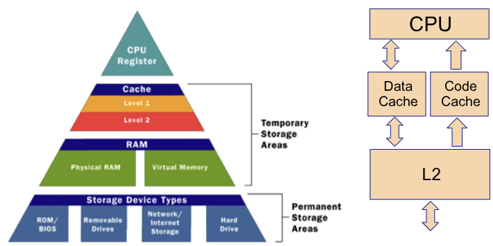

### Chips

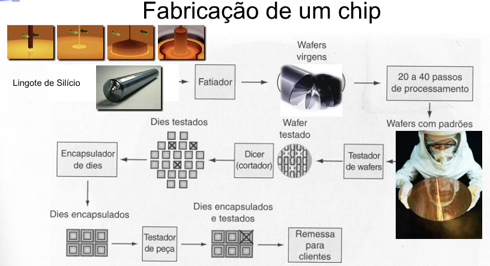

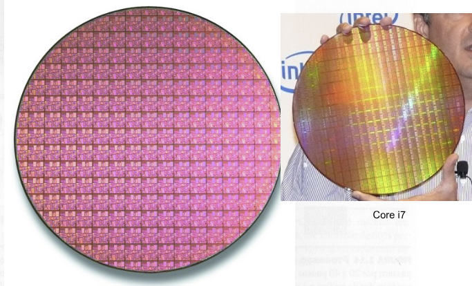

Por que chips fabricados em grandes volumes tem custo menor ?  (verificar quais alternativas se aplicam) 
- [ ] Com grandes volumes, o processo de manufatura pode ser adaptado a um projeto específico, aumentando o rendimento 
- [ ] Dá menos trabalho desenvolver um chip para produção em massa do que um chip para baixa produção 
- [ X ] As máscaras utilizadas no processo de fabricação são caras, assim o custo por chip diminui com o aumento do volume 
- [ X ] O custo de desenvolvimento do chip é independente do volume; assim, o custo por chip diminui com o volume de fabricação 
- [ ] Chips produzidos em massa usualmente são de tamanho menor que os de baixo volume, resultando em um maior rendimento por bolacha de silício

### Lei de Moore
A capacidade de integração de transistores dobra a cada 18 a 24 meses.

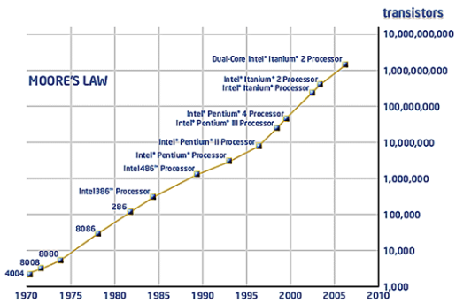
