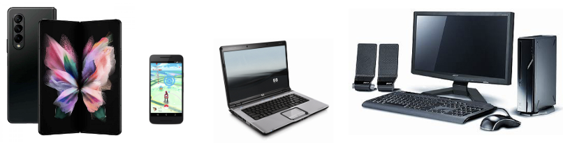
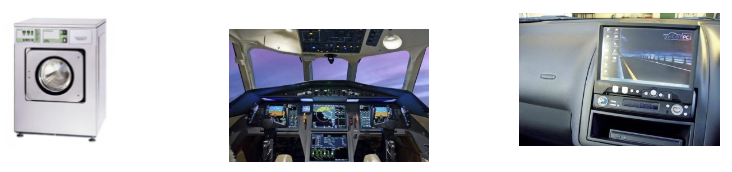
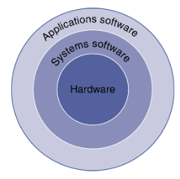
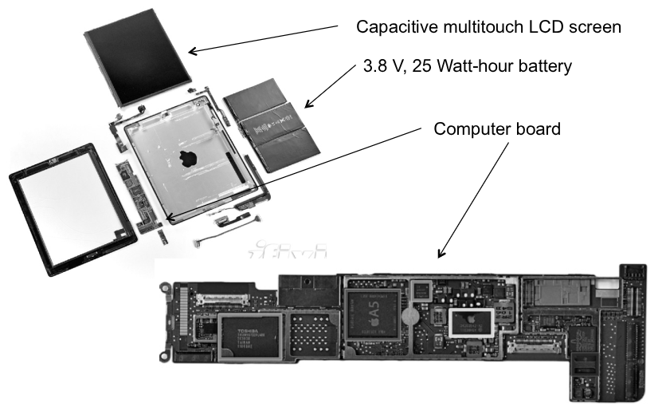
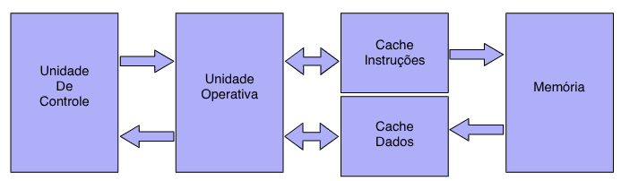

# Introdução e Contexto Histórico

## Introdução

### A Revolução do Computador

Avanços tecnológicos na computação 
- Impulsionados pela **Lei de Moore** (1965, rev 1975) 

Viabilizam novas aplicações como:
- Computadores em automóveis 
- Telefones celulares 
- Projeto Genoma 
- Computação vestível 
- WWW 

Computadores são pervasivos

### Principal Componente do Computador: Microprocessador

### Classes de Sistemas Computacionais

**Supercomputadores** 
- Aplicações científicas e cálculos de engenharia de altíssimo 
desempenho. 
- Milhares de processadores interligados por conexões de alta velocidade, com terabytes (tebibytes) de memória. 
- Pequena fração do mercado 

**Servidores** 
- Recursos compartilhados entre vários usuários 
- Acessados via rede 
- Geralmente sistemas de software específicos 
- Ex: Servidores de arquivo, servidores de streaming, webservers até servidores em data centers e cloud
- Alta dependabilidade (confiabilidade, segurança, disponibilidade e mantenabilidade), geralmente alto custo.

**Pessoais**
- Recursos utilizados geralmente por um único usuário 
- Geralmente programas de terceiros 
- Ex: Desktops, notebooks, tablets, smartphones, etc
- Compromisso entre custo e desempenho para o usuário

**Embarcados** 
- Parte de um produto 
- Software de difícil customização, geralmente integrado ao hardware. 
- **Ex:** Eletroeletrônicos (TV, DVD, Conversores, eletrodomésticos,...), Automóveis/Barcos/Aviões, Industriais, Brinquedos, Robôs, IoT. 
- Geralmente baixo custo e baixa dependabilidade, embora alguns precisem de baixa taxas de falhas (**Sistemas Redundantes**, por exemplo, avião).

### Era Pós-PC
- 1940 - 1970: Criação. Grandes computadores  (ENIAC)
- 1970 - 2000:  Popularização. Computadores pessoais (PCs)
- 2000 - Hoje:  Individualização. Dispositivos portáteis pessoais (tablet), embarcados (TV), internet das coisas (IoT), computação vestível, computação em nuvem.

### O que é Organização e Arquitetura de Computadores

Software de Aplicação 
- Linguagem de alto nível 

**Software do Sistema** 
- **Compilador:** Traduz LAN para ASM 
- **Sistema Operacional:** Opera a máquina 
    - Trata entrada e saída de dados 
    - Gerencia memória e armazenamento 
    - Escalona processos 

**Hardware** 
- Processador, memória, controladores

**Arquitetura do conjunto de instruções + Organização da máquina**

É uma abstração, ISA: Normatiza quais as instruções que o processador é capaz de executar.

Estuda a Interface entre software e hardware.

### Níveis de Programação

**Linguagem de alto nível** 
- Maior aprofundamento revela mais informações. 
- Maior produtividade e portabilidade  

**Linguagem de Montagem** 
- Representação textual das instruções 

**Nivel de hardware** 
- Dígitos binários 
- Codificação de instruções e dados

### Componentes

Os 5 componentes do  computador 
- Se aplicam a qualquer tipo de computador 

Foco principal: O **Processador**
- Parte de **controle**  
- Parte **operativa**

Entrada e saída inclui: 
- Interfaces 
    - Telas, teclados, mouses 
- Armazenamento 
    - Discos, pen drives, DVD 
- Comunicação 
    - Ethernet, wireless

### Dispositivos Pós-PC
Tela sensível ao toque 

Integra monitor, teclado e mouse em um único dispositivo 

Tela capacitiva: 
- Permite multiplos toques simultâneos 
- Dominante no mercado

### Processadores
- Unidade **operativa** (***datapath***): Opera sobre dados 
- Unidade de **controle**: Sequencia as operações 
- Memória **cache**: SRAM pequena e rápida para consulta

Processadores em celulares:  
- Apple: A11 - Bionic    
- Qualcomm: Snapdragon 845 
- Samsung: Exynos 9810 
- Huawei: Kirin 970

### Decimal x Binário
Diferenciando potências decimais de potências binárias

| Decimal term | Abbreviation | Value | Binary term | Abbreviation | Value | % Larger |
| ------------ | ------------ | ----: | ----------- | ------------ | ----: | -------: |
| kilobyte     | KB           |   10³ | kibibyte    | KiB          |   2¹⁰ |       2% |
| megabyte     | MB           |   10⁶ | mebibyte    | MiB          |   2²⁰ |       5% |
| gigabyte     | GB           |   10⁹ | gibibyte    | GiB          |   2³⁰ |       7% |
| terabyte     | TB           |  10¹² | tebibyte    | TiB          |   2⁴⁰ |      10% |
| petabyte     | PB           |  10¹⁵ | pebibyte    | PiB          |   2⁵⁰ |      13% |
| exabyte      | EB           |  10¹⁸ | exbibyte    | EiB          |   2⁶⁰ |      15% |
| zettabyte    | ZB           |  10²¹ | zebibyte    | ZiB          |   2⁷⁰ |      18% |
| yottabyte    | YB           |  10²⁴ | yobibyte    | YiB          |   2⁸⁰ |      21% |

## Contexto Histórico

