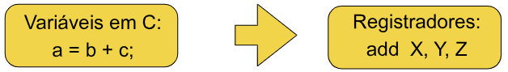
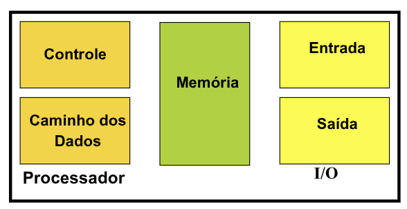
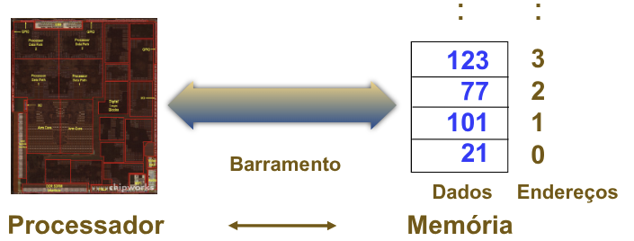

# Arquitetura RV

## Instruction Set Architeture - ISA
A **ISA** define os **recursos** que o programador pode utilizar para **desenvolver programas** em determinado processador.

Informações Típicas:
- Quais instruções o processador executa 
- Qual o formato destas instruções 
- Que tipos de dados são suportados 
- Quais os registradores estão disponíveis 
- Que modos de endereçamento são utilizados

## RISC x CISC
Historicamente, as arquiteturas dos computadores evoluiram incorporando instruções cada vez mais complexas.

### CISC (Complex Instruction Set Computer)
Grande variedade de instruções
- Uma instrução que realiza um procedimento complexo **reduz o número de acessos à memória**. 
- Reduzir a distância semântica (semantic gap) para linguagens de alto nível.

Entretanto:
- **Controle do processador** complexo. 
- Pouco uso de instruções complexas (20% ISA usado em 80% dos casos). 

### RISC (Reduced Instruction Set Computer - Anos 80)
- Implementação de um conjunto **reduzido de instruções**.
- **Redução** da **complexidade do hardware** de controle do processor, o que implica:
    - **Maior velocidade** na execução de instruções simples.
- Instruções de **mesmo tamanho**.  
- Instruções **específicas** para **acesso à memória**
- Exemplos: `MIPS`, `RISC-V`, `ARM`.

## Arquitetura do RISC-V
- Desenvolvida na UC Berkeley como uma **ISA aberta**. 
    - Projeto iniciado em 2010 por alunos do Patterson 
- Gerida pela Fundação RISC-V (riscv.org) 
- Ampla gama de **aplicações**: Desde sistemas embarcados até supercomputadores 
- Vários **subconjuntos de instruções:** 
    - **RV32I:** Conjunto básico para instruções com inteiros de 32 bits. 
    - **RV32E:** Voltado a sistemas embarcados. 
    - **RV64I:** Conjunto básico para instruções com inteiros de 64 bits. 
    - **RV128I:** Conjunto básico para instruções com inteiros de 128 bits.

### Arquiteturas RISC-V
- **RV32:** Registradores de 32 bits 
- **RV64:** Registradores de 64 bits 
- **RV128:** Registradores de 128 bits

| Tipo de instruções                               | Sufixo    |
| ------------------------------------------------ | --------- |
| ISA de inteiros                                  | I         |
| Instruções de Multiplicação e Divisão            | M         |
| Instruções atômicas (sincronização de memória)   | A         |
| Instruções de ponto flutuante (precisão simples) | F         |
| Instruções de ponto flutuante (precisão dupla)   | D         |
| ISA Geral                                        | IMAFD = G |
| Conjunto reduzido para sistemas embarcados       | E         |


- Modo **Normal**: Instruções com 32 bits de tamanho. 
- Modo **Condensado**: Instruções com 16 bits de tamanho. 
- Modo **Expandido**: Instruções com n×16 bits de tamanho (48,64,96,...).

## Traduzindo de C para Linguagem de Montagem

O `assembly` deve permitir realizar **todas as operações** definidas em uma **linguagem de alto nível**. 

Usualmente temos uma **instrução em assembly** para cada operação:
- `+` : add
- `-` : sub
- `&` : and
- etc

**Variáveis** em um programa são associadas a **registradores** no processador:



### Operações do Hardware
Todo computador deve ser capaz de realizar **operações aritméticas**.
- Ex: `add a,b,c` $\Leftrightarrow$ `a = b + c`.

Instruções aritméticas no RISC-V têm **formato fixo**, realizando **somente uma operação** e tendo **três *"variáveis"***
- Ex: a = b + c + d + e

```asm
add a,b,c # a = b + c
add a,a,d # a = b + c + d
add a,a,e # # a = b + c + d + e
```

> [!NOTE]
>
> Somente uma instrução por linha.

Exigir que toda instrução tenha exatamente **três operandos** condiz com a filosofia de manter o hardware simples.
- hardware para **número variável de parâmetros** é mais **complexo** que para número fixo.

> [!IMPORTANT]
>
> Princípio #1 para projetos: Simplicidade favorece a regularidade

### Exemplo 01 - Qual o código gerado por um compilador C para o seguinte trecho ?
```c
a = b + c;
d = a - e;
```

Assembly
```asm
add a,b,c # a = b + c
sub d,a,e # d = a - e
```

### Exemplo 02 - Qual o código gerado por um compilador C para o seguinte trecho ?
```c
f = (g + h) – (i + j);
``` 

Somente uma operação é feita por instrução: necessidade de **variáveis temporárias**.

Assembly
```asm
add t0,g,h # t0 = g + h
add t1,i,j # t1 = i + j
sub f,t0,t1 # f = t0 - t1
```

## Operandos e Registradores
- Registradores do RISC-V RV32I são de 32 bits. 
- Blocos de 32 bits são chamados de **palavra (*word*)**. 
- Número de registradores é **limitado**: RISC-V $\rightarrow$ **32 registradores**, numerados de **0 a 31**.
    - Acesso mais rápido, **interno ao chip**. 
    - Fácil acesso.

> [!IMPORTANT]
>
> Princípio #2 para projetos: menor é mais rápido
> - Um número muito grande de registradores aumentaria o **período de clock**.

No RISC-V existe uma convenção para nomear registradores na forma $x_i$:
- x0, x1, x2, ... x30, x31

Variáveis em um programa C são usualmente associadas a **endereços de memória**
- Para executar **operações no processador**, os **dados** tem que ser **transferidos para registradores**.
- As operações **lógico-aritméticas** em um processador RISC são realizadas sobre **registradores**.
- Assim, existe um **mapeamento de variáreis do C** para **registradores do processador**.


### Exemplos 02 ...
```c
f = (g + h) – (i + j);
```

Considerando a convenção adotada, podemos associar pois são dados queremos salvar esses dados nos registradores para fazer as operações: 
- f $\rightarrow$ x19.
- g $\rightarrow$ x20.
- h $\rightarrow$ x21.
- i $\rightarrow$ x22.
- j $\rightarrow$ x23.

```asm
add x5,x20,x21 # temporário x5 = g + h 
add x6,x22,x23 # temporário x6 = i + j 
sub x19,x5,x6 # f = (g + h) – (i + j)
```

## Registradores vs Memória
- **Operandos** de **instruções aritméticas** devem ser **registradores** (32 registradores disponíveis).
- Compilador associa **variáveis a registradores**.
- E programas com várias variáveis ?
    - São mantidas na memória



## Organização da Memória
- Vista como um grande **array unidimensional**, com **endereços sequenciais**, **começando em 0**.
- Um **endereço** de memória é um **índice no array**.
- ***"Byte addressing"*** significa que o **índice aponta** para um **byte na memória**.



- As **palavras** de **32 bits** são divididas em **4 bytes**.
- O RISC-V pode endereçar **um byte** ou uma **palavra inteira**.
- A **Instrução** define se é byte ou word.


- $2^{32}$ *bytes* com endereços de byte de $0, 1, 2, 3, \ldots, 2^{32} - 1$
- $2^{30}$ *words* com endereços de byte de $0, 4, 8, \ldots, 2^{32} - 4$.
- **Words são alinhadas**, isto é, quais são os **valores dos 2 bits menos significativos** do endereço de uma word?
    - Os 2 bits menos significativos são sempre `00` pois uma Word de **4 bytes** deve começar em um endereço **múltiplo de 4** e todo em binário, todo múltiplo de 4 termina em `00`. 


### Ordenamento dos Bytes
Processadores podem **numerar bytes dentro de uma palavra**, de tal forma que o byte com o **menor número** é o mais a esquerda ou o mais a direita. 
- Isto é chamado de **byte order**.

Exemplo: byte 0, 1, 2, 3 


- **Big endian:** IBM 360/370, Motorola 68k, MIPS, Sparc, HP PA 
- **Little Endian:** Intel 80x86, MIPS, DEC Vax, DEC Alph

## Transferindo dados da memória
A **instrução** de transferência de dados da **memória para o registrador** é chamada de **load**.
- No RISC-V, o nome da instrução é: `lw` (**load word**).

Formato:
```asm
lw registrador destino, constante (registrador base)
```

Exemplo: 
```c
g = h + *a; 
```

- a $\Rightarrow$ x20, g $\Rightarrow$ x21, h $\Rightarrow$ x22.

```asm
lw x5, 0(x20) # temporário x5 = *a, Ex: Memória[1000] = 25
add x21, x22, x5 
```

### Vetor de Bytes na Memória


Vetor de bytes `A = [0,0,0,0,15]`, com 5 posições, começando no **endereço de memória 102**.
- Este endereço é chamado de **endereço base** do vetor.
- Assim, 102 é o endereço de A[0],103 o de A[1], ...,106 o de A[4].

### Vetor de words
**Cada posição** do vetor (de inteiros) é uma **palavra**, e portanto ocupa **4 bytes**.


Vetor `A = [0,0,0,0,15]`, com 5 posições, começando no **endereço de memória 408**. 
- Assim, 408 é o endereço de A[0], 412 o de A[1], 416 o de A[2], 420 o de A[3] e 424 o de A[4]. 

### Exemplo 03
Suponha que o vetor A tenha 100 posições, e que o compilador associou a variável h ao registrador x21. Temos ainda que o endereço base do vetor A é dado em x22. Qual o código para:
```c
A[12] = h + A[8]
```

A **nona posição** do vetor A, `A[8]`, está no offset **8 x 4 = 32** pois deslocamos 8 bytes que são 32 bits.
```asm
lw x9, 32(x22) # temporário x9 = A[8]
add x9, x21, x9 # temporário x9 = h + A[8]
```

De maneira análoga, a **décima-terceira posição** do vetor A, `A[12]`, está no offset **12 x 4 = 48**.
```asm
sw x9, 48(x22) # Armazena x9 em A[12]
```

## Transferindo dados para a memória
A instrução de transferência de dados de um **registrador para a memória** é chamada de ***store***.
- No RISC-V, o nome da instrução é: `sw` (**store word**).

Formato: 
```asm
sw registrador fonte, constante (registrador base)
```
**Endereço de memória acessado** é dado pela **soma da constante** (***offset***) como conteúdo do **registrador base**.

## Exercício
Temos ainda que o endereço base do vetor A é dado em x22, e que as variáveis i e g são dadas em x20 e x21, respectivamente. Qual o código para:

```c
A[i+g] = g + A[i] – A[0] 
```

- i --> x20
- g --> x21
- Endereço base de A --> x22

```asm
lw   x5, 0(x22)       # x5 = A[0]

slli x6, x20, 2       # x6 = i * 4
add  x7, x22, x6      # x7 = endereço de A[i]
lw   x8, 0(x7)        # x8 = A[i]

add  x9, x21, x8      # x9 = g + A[i]
sub  x9, x9, x5       # x9 = g + A[i] - A[0]

add  x10, x20, x21    # x10 = i + g
slli x10, x10, 2      # x10 = (i + g) * 4, Cálculo dos deslocamento dos bits
add  x11, x22, x10    # x11 = endereço de A[i+g]

sw   x9, 0(x11)       # A[i+g] = g + A[i] - A[0]
```

## Conveção do Uso de Registradores
- O registrador **x0** contém sempre o valor **0** (hardwired).  
- O registrador **x1 (ra)** armazena o **endereço de retorno** quando é executada a **instrução de salto** para função. 
- O registrador **x2 (sp)** é usado como **ponteiro** para a pilha.
- O  registrador  **x3 (gp)** é o ***Global  Pointer***, aponta para o segmento de dados globais estáticos.
- O registrador **x4 (tp**) é chamado **Thread Pointer**, ponteiro  para  área  de  dados local da thread em execução. 
- Os registradores **x5-7 (t0-2)** e **x28-31** (t3-6) são usados para armazenamento de **dados temporários**. 
- Os  registradores  **x8-9 e x18-27** são usados para armazenamento de variáveis **não temporárias**.
- Os registradores **x10-17 (a0-7)** são usados para **passagem de parâmetros** para funções. 
- Os registradores **x10 e x11** são também utilizados para **retorno de valores de funções**. 
- O registrador **x8 (s0 - fp)** pode ser alternativamente utilizado como **Frame Pointer**, ponteiro para área local de dados na pilha.
