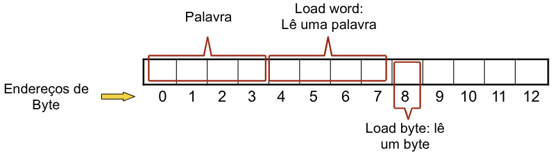
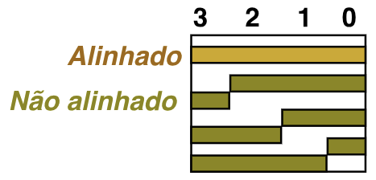
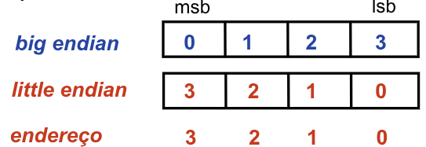
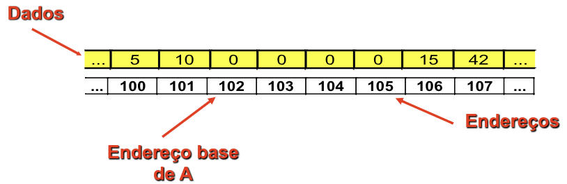
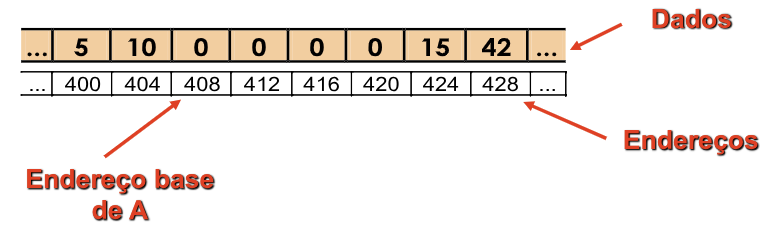
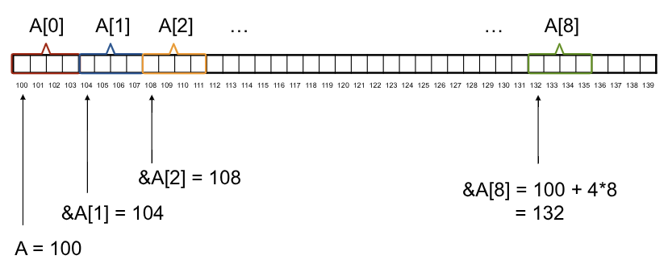

# Arquitetura RV

## Instruction Set Architeture - ISA
A **ISA** define os **recursos** que o programador pode utilizar para **desenvolver programas** em determinado processador.

Informações Típicas:
- Quais **instruções** o processador executa.
    - Soma, Subtração, Ler dado na memória, ...
- Qual o **formato** destas instruções. 
    - RIC-V, Palavras tem **32 bits**.
    - 32 flip-flops um ao lado do outro.
    - Define como os 32 bits estão organizados.
- Que tipos de dados são suportados. 
- Quais os **registradores** estão disponíveis. 
- Que modos de endereçamento são utilizados.
    - Como acho os dados.

### Principais ISAs
- **ARM:**
    - ARMv7 (32 bits) e ARMv9 (64 bits).
- **x86** (32 bits) e **EM64T** (64 bits, proposto pela AMD).
- **RiscV:** Desenvolvida na UC Berkeley como uma **ISA aberta**. 
    - Projeto iniciado em 2010 por alunos do Patterson. 
    - Gerida pela Fundação RISC-V (riscv.org). 
    - Ampla gama de **aplicações**: Desde sistemas embarcados até supercomputadores. 

## Arquitetura do RISC-V
- **RV32:** Registradores de **32 bits**. 
- **RV64:** Registradores de **64 bits**. 
- **RV128:** Registradores de **128 bits**.

| Tipo de instruções                               | Sufixo    |
| ------------------------------------------------ | --------- |
| ISA de inteiros                                  | I         |
| Instruções de Multiplicação e Divisão            | M         |
| Instruções atômicas (sincronização de memória)   | A         |
| Instruções de ponto flutuante (precisão simples) | F         |
| Instruções de ponto flutuante (precisão dupla)   | D         |
| ISA Geral                                        | IMAFD = G |
| Conjunto reduzido para sistemas embarcados       | E         |


- Modo **Normal**: Instruções com 32 bits de tamanho. 
- Modo **Condensado**: Instruções com 16 bits de tamanho. (Sistema Embarcados) 
- Modo **Expandido**: Instruções com n×16 bits de tamanho (48,64,96,...).

> [!IMPORTANT]
>
> Temos **32 registradores** de **32 bits cada**.

Vários **subconjuntos de instruções:** 
- **RV32I:** Conjunto básico para instruções com inteiros de 32 bits. 
- **RV32E:** Voltado a sistemas embarcados. 
- **RV64I:** Conjunto básico para instruções com inteiros de 64 bits. 
- **RV128I:** Conjunto básico para instruções com inteiros de 128 bits.

### Operandos da RiscV RV32
| Local do operando             | Exemplo                            | Comentários                              |
| ----------------------------- | ---------------------------------- | ---------------------------------------- |
| **Banco de 32 Registradores** | `x0, x1, x2, ..., x31`             | Local de acesso mais rápido a variáveis  |
| **Memória RAM**               | `M[0], M[8], M[16], ..., M[2^N-8]` | double word (RV64)                       |
| **Memória RAM**               | `M[0], M[4], M[8], ..., M[2^N-4]`  | word                                     |
| **Memória RAM**               | `M[0], M[2], M[4], ..., M[2^N-2]`  | half-word                                |
| **Memória RAM**               | `M[0], M[1], M[2], ..., M[2^N-1]`  | byte                                     |
| **Acesso imediato**           | `addi x5, x5, 123`                 | Local de acesso mais rápido a constantes |

## Instruções Aritméticas
- **Soma e subtração:** `add` e `sub`. 
- Três **operandos:** 

```asm
add a, b, c  // a = b + c
sub a, b, c  // a = b - c 
```

- Todas operações aritméticas seguem **este padrão**. 
- Simplicidade favorece a regularidade. 
    - Regularidade simplifica a implementação.
    - Simplicidade leva a **alto desempenho** com **custos reduzidos**.

### Exemplo 01
- **Código C:** 
```c
a = b + c;
d = a - e;
```

- Código RiscV: 
```asm
add a,b,c # a = b + c
sub d,a,e # d = a - e
```

> [!IMPORTANT]
>
> **Variáveis** $\Rightarrow$ **registradores** !
> - **Variáveis** em um programa são associadas a **registradores** no processador.

### Exemplo 02
- **Código C:** 
```c 
a = b + c + d + e
```

- Código RiscV: 
```asm
add a,b,c # a = b + c
add a,a,d # a = b + c + d
add a,a,e # a = b + c + d + e
```

### Exemplo 03
- **Código C:** 

```c
f = (g + h) - (i + j)
```

- Código RiscV: 
```asm
add t0, g, h # t0 - temporário
add t1, i, j # t1 - temporário
sub f, t0, t1 # f = t0 - t1
```

## Registradores RV
- Registradores do RISC-V RV32I são de **32 bits**. 
- Blocos de **32 bits** são chamados de **palavra (*word*)**. 
- Número de registradores é **limitado**: RISC-V $\rightarrow$ **32 registradores**, numerados de **0 a 31**.
    - Acesso mais rápido, **interno ao chip**. 
    - Fácil acesso.

> [!IMPORTANT]
>
> Princípio para projetos: menor é mais rápido
> - Um número muito grande de registradores aumentaria o **período de clock**.

No RISC-V existe uma convenção para nomear registradores na forma $x_i$:
- `x0, x1, x2, ... x30, x31`

Variáveis em um programa C são usualmente associadas a **endereços de memória**
- Para executar **operações no processador**, os **dados** tem que ser **transferidos para registradores**.
- As operações **lógico-aritméticas** em um processador RISC são realizadas sobre **registradores**.
- Assim, existe um **mapeamento de variáreis do C** para **registradores do processador**.

| Registrador | Nome  | Descrição                    | Preservado? |
| ----------- | ----- | ---------------------------- | ----------- |
| x0          | zero  | Constante zero *hardwired*   | -           |
| x1          | ra    | Endereço de retorno          | Sim         |
| x2          | sp    | *Stack Pointer*              | Sim         |
| x3          | gp    | *Global Pointer*             | -           |
| x4          | tp    | *Thread Pointer*             | -           |
| x5          | t0    | Temporário                   | Não         |
| x6-7        | t1-2  | Temporários                  | Não         |
| x8          | s0/fp | Reg Salvos / *frame pointer* | Sim         |
| x9          | s1    | Registradores Salvos         | Sim         |
| x10-11      | a0-1  | Argumentos / val retorno     | Não         |
| x12-17      | a2-7  | Argumentos função            | Não         |
| x18-27      | s2-11 | Registradores Salvos         | Sim         |
| x28-31      | t3-6  | Temporários                  | Não         |

- `s` é usado para valores que queremos **preservar por mais tempo**. 
- `t` é usado para **cálculos temporários** e pode ser reutilizado quando o **valor anterior não for mais necessário**.

### Reescrevendo o Exemplo

```c
f = (g + h) – (i + j);
```

Considerando a convenção adotada, podemos associar pois são dados **queremos salvar** esses **dados nos registradores** para fazer as operações: 
- f $\Rightarrow$ x19.
- g $\Rightarrow$ x20.
- h $\Rightarrow$ x21.
- i $\Rightarrow$ x22.
- j $\Rightarrow$ x23.

```asm
add x5,x20,x21 # temporário x5 = g + h 
add x6,x22,x23 # temporário x6 = i + j 
sub x19,x5,x6 # f = (g + h) – (i + j)
```

### Operandos na Memória
- Dados tem que ser transferidos da **memória para os registradores.**
- Instruções de acesso à memória:
    - **load:** Transfere da **memória para o registrador**.
    - **store:** Transfere do **registrador para a memória**.

Exemplo:
- `lw t0, 16(s0)`
    - Endereço = s0 + 16.   
    - t0 $\Leftarrow$ mem[s0 + 16].   

- `sw t0, 16(s0)`
    - Endereço = s0 + 16.
    - mem[s0 + 16] $\Leftarrow$ t0. 

## Registradores x Memória
Registradores tem acesso mais **rápido** do que a memória. 
- A **memória** é muito **maior** que o banco de registradores.

Operandos na memória requerem operações de ***load*** e ***store*** para transferi-los para os registradores. 
- Mais instruções são executadas

O compilador (e o programador) deve usar preferencialmente os **registradores para armazenar as variáveis**.
- Otimizar o tempo de execução. 
- Usar memória apenas quando for muito necessário.

### Operando Imediato
Operando é uma **constante** dentro da instrução: 
- `addi t0, t1, 27` 
- Instruções terminadas em “i” utilizam imediato 

É um exemplo de simplificação de projeto: 
- Uso de pequenas constantes é frequente. 
- Colocar a constante dentro da instrução **evita acesso à memória** ou a **registrador.**

## Organização da Memória
- Vista como um grande **array unidimensional**, com **endereços sequenciais**, **começando em 0**.
- Um **endereço** de memória é um **índice no array**.
- ***"Byte addressing"*** significa que o **índice aponta** para um **byte na memória**.

| Endereço | Dado   |
| -------- | ------ |
| 0        | 8 bits |
| 1        | 8 bits |
| 2        | 8 bits |
| 3        | 8 bits |
| 4        | 8 bits |
| 5        | 8 bits |
| 6        | 8 bits |
| 7        | 8 bits |
| 8        | 8 bits |
| 9        | 8 bits |
| ...      | ...    |
| 2ⁿ-1     | 8 bits |

- As **palavras** de **32 bits** são divididas em **4 bytes**.
- O RISC-V pode endereçar **um byte** ou uma **palavra inteira**.
- A **Instrução** define se é byte ou word.
- Tipos de Dados:
    - **Double (ld):** 64 bits $\rightarrow$ 8 endereços. 
    - **Word (lw):** 32 bits $\rightarrow$ 4 endereços. 
    - **Half Word (lh):** 16 bits $\rightarrow$ 2 endereços. 
    - **Byte (lb):** 08 bits $\rightarrow$ 1 endereço.

Cada instrução agrupa um conjunto de bytes: 
- **ld:** endereços múltiplos de 8 (0, 8, 16, 24, ...). 
- **lw:** endereços múltiplos de 4 (0, 4, 8, 16, ...). 
- **lh:** endereços múltiplos de 2 (0, 2, 4, 6, ...).
- **lb:** endereços múltiplos de 1 (0, 1, 2, 3, 4, ...).



- $2^{32}$ *bytes* com endereços de byte de $0, 1, 2, 3, \ldots, 2^{32} - 1$.
- $2^{30}$ *words* com endereços de byte de $0, 4, 8, \ldots, 2^{32} - 4$.

**Words são alinhadas**, isto é, quais são os **valores dos 2 bits menos significativos** do endereço de uma word?
- Os 2 bits menos significativos são sempre `00` pois uma Word de **4 bytes** deve começar em um endereço **múltiplo de 4** e em binário, todo múltiplo de 4 termina em `00`. 



### Ordenamento dos Bytes
Processadores podem **numerar bytes dentro de uma palavra**, de tal forma que o byte com o **menor número** é o mais a esquerda ou o mais a direita. 
- Isto é chamado de **byte order**.

Existem duas formas de ordenar os bytes em uma palavra. 
- Registradores: `t0 <= 0xFACACAFE` 
- Na memória:



- **Big endian:** IBM 360/370, Motorola 68k, MIPS, Sparc, HP PA 
- **Little Endian:** Intel 80x86, MIPS, DEC Vax, DEC Alph

### Vetor de Bytes na Memória



Vetor de bytes `A = [0,0,0,0,15]`, com 5 posições, começando no **endereço de memória 102**.
- Este endereço é chamado de **endereço base** do vetor.
- Assim, 102 é o endereço de A[0],103 o de A[1], ...,106 o de A[4].

### Vetor de words
**Cada posição** do vetor (de inteiros) é uma **palavra**, e portanto ocupa **4 bytes**.



Vetor `A = [0,0,0,0,15]`, com 5 posições, começando no **endereço de memória 408**. 
- Assim, 408 é o endereço de A[0], 412 o de A[1], 416 o de A[2], 420 o de A[3] e 424 o de A[4]. 

### Exemplo 04
Um vetor de inteiros A tem 100 posições. O compilador associou a variável h ao registrador x21. Temos ainda que o endereço base do vetor A é dado em x22. Qual o código para:

```c
A[12] = h + A[8]
```

A **nona posição** do vetor A, `A[8]`, está no offset **8 x 4 = 32** pois deslocamos 8 bytes que são 32 bits.
- `A[8]: 32(x22)`, 32 é o numero de **bytes de deslocamento**.
- **word:** Tem 4 bytes por isso multiplica por 4.

```asm
lw x9, 32(x22) # temporário x9 = A[8]
add x9, x21, x9 # temporário x9 = h + A[8]
```

De maneira análoga, a **décima-terceira posição** do vetor A, `A[12]`, está no offset **12 x 4 = 48**.

```asm
sw x9, 48(x22) # Armazena x9 em A[12]
```

### Vetor na Memória


## Exercício
Temos ainda que o endereço base do vetor A é dado em x22, e que as variáveis i e g são dadas em x20 e x21, respectivamente. Qual o código para:

```c
A[i+g] = g + A[i] – A[0] 
```

- i $\Rightarrow$ x20
- g $\Rightarrow$ x21
- Endereço base de A $\Rightarrow$ x22

**Passo a Passo**
1. Ler `A[0]`.
2. Calcular o endereço de `A[i]`
3. Ler `A[i]`.
4. Calcular `g + A[i] - A[0]`.
5. Calcular o endereço de `A[i + g]`.
6. Armazenar o resultado nesse endereço.

```asm
lw s1, 0(x22) # s1 = A[0]

# Deslocamento de i bytes 
add t0, x20, x20
add t1, t0, t0

# Endereço Novo
add t2, x22, t1 # Endereço de A[i] = Endereço Base + Deslocamento

lw s2, 0(t2) # s2 = A[i], não poderia colocar lw s2, t2(x22) o RiscV não permite !!

add t4, x21, s2 # g + A[i]
sub t5, t4, s1 # (g + A[i]) - A[0]

# Deslocamento para i + g
add t0, x20, x21
add t1, t0, t0
add t2, t1, t1

# Endereço de A[i+g] = Endereço Base + Deslocamento i + g
add t3, x22, t2

sw t5, 0(t3)
```

## Conveção do Uso de Registradores
- O registrador **x0** contém sempre o valor **0** (hardwired).  
- O registrador **x1 (ra)** armazena o **endereço de retorno** quando é executada a **instrução de salto** para função. 
- O registrador **x2 (sp)** é usado como **ponteiro** para a pilha.
- O  registrador  **x3 (gp)** é o ***Global  Pointer***, aponta para o segmento de dados globais estáticos.
- O registrador **x4 (tp**) é chamado **Thread Pointer**, ponteiro  para  área  de  dados local da thread em execução. 
- Os registradores **x5-7 (t0-2)** e **x28-31** (t3-6) são usados para armazenamento de **dados temporários**. 
- Os  registradores  **x8-9 e x18-27** são usados para armazenamento de variáveis **não temporárias**.
- Os registradores **x10-17 (a0-7)** são usados para **passagem de parâmetros** para funções. 
- Os registradores **x10 e x11** são também utilizados para **retorno de valores de funções**. 
- O registrador **x8 (s0 - fp)** pode ser alternativamente utilizado como **Frame Pointer**, ponteiro para área local de dados na pilha.
