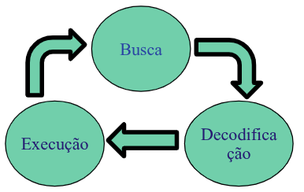
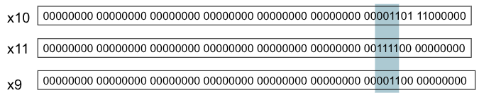
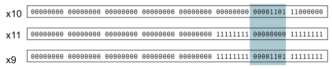
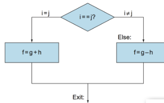
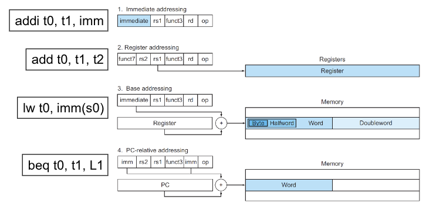
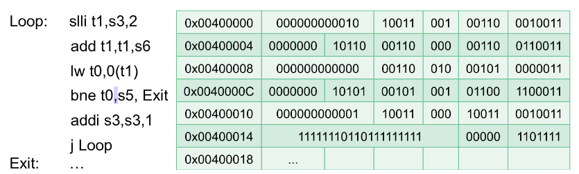

# Assembly RISC-V 

**RISC-V** 
- Banco de **32 registradores de 32 bits cada.** 
- `lw` Carrega ***words*** mas **endereça bytes** na memória. 
- Aritmética **somente** entre registradores ou imediato.

```asm
add x5, x6, x7  # x5 = x6 + x7
addi x5, x5, 1  # x5 = x5 + 1
sub x5, x6, x7  # x5 = x6 - x7
lw x5, imm(x6)  # x5 = Memory[x6 + imm], x6: Endereço Base, imm: Deslocamento 
sw x5, imm(x6)  # Memory[x6 + imm] = x5, x6: Endereço Base, imm: Deslocamento 
```

## Programa Armazenado
- Todas as **instruções** são codificadas em **bits**. 
- Todos os **dados** são representados em **bits**. 
- Programas são armazenados na **memória** para serem lidos da mesma forma que os **dados**.

**Ciclos de Busca e Execução:**
- **Instruções** são buscadas usando o **PC (Program Counter)**, lidas da memória e colocadas num registrador especial (**IR – Instruction Register**).
- Os campos da instrução são **decodificados**, a instrução é identificada e os **sinais de controle** para sua execução são gerados.
- A instrução é executada.
- O processo é repetido até o final.



## Linguagem de Máquina

Formato das Instruções RISC-V

| Name (Field size) | 7 bits | 5 bits | 5 bits | 3 bits | 5 bits | 7 bits | Comments |
|---|---|---|---|---|---|---|---|
| R-type | funct7 | rs2 | rs1 | funct3 | rd | opcode | Arithmetic instruction format |
| I-type | immediate[11:0] | rs1 | funct3 | rd | opcode | — | Loads & immediate arithmetic |
| S-type | immed[11:5] | rs2 | rs1 | funct3 | immed[4:0] | opcode | Stores |
| SB-type | immed[12,10:5] | rs2 | rs1 | funct3 | immed[4:1,11] | opcode | Conditional branch format |
| UJ-type | immediate[20,10:1,11,19:12] | — | — | — | rd | opcode | Unconditional jump format |
| U-type | immediate[31:12] | — | — | — | rd | opcode | Upper immediate format |

- **Tipo R:** Operações lógico-aritméticas. 
- **Tipo I:** Operações com dados imediatos pequenos. 
- **Tipo S:** Operações de armazenamento (store). 
- **Tipo SB:** Operações de salto condicional. 
- **Tipo U:** Operações com dados imediatos grandes. 
- **Tipo UJ:** Operações de salto incondicional.

No RV32I, as **instruções**, assim como os registradores, também têm **32 bits de comprimento** dividido em campos.

Formato de instruções com registradores:
| funct7 | rs2 | rs1 | funct7 | rd | opcode | 
| :----: | :-: | :-: | :----: | :-: | :---: |

- `opcode`: 7 bits, Código que **identifica a instrução.** 
- `rd`: 5 bits, Registrador de **operando destino**: resultado. 
- `func3`: 3 bits, **opcode auxiliar** de 3 bits. 
- `rs1`: 5 bits, **Primeiro** registrador de operando origem. 
- `rs2`: 5 bits, **Segundo** registrador de operando origem.  
- `funct7`: 7 bits, **opcode auxiliar** de 7 bits.

### Exemplo 01: Operações Lógicas-Aritméticas

```asm
add t0, s0, s1 # x5 = x8 + x9`
```

- Instrução `add`: `opcode` = 0x33. 
- `funct3` = 0x0. 
- `funct7` = 0x00. 
- Os registradores são identificados por seus **índices**.

#### Formato Tipo-R da Instrução

| Campo | funct7 | rs2 | rs1 | funct3 | rd | opcode |
|---|---|---|---|---|---|---|
| **Tamanho** | 7 bits | 5 bits | 5 bits | 3 bits | 5 bits | 7 bits |
| **hexadecimal** | 0x00 | 0x09 | 0x08 | 0x0 | 0x05 | 0x33 |
| **binário** | 000 0000 | 0 1001 (9 do x9) | 0 100 0 (8 do x8) | 000 | 0010 1 (5 do x5) | 011 0011 |

### Exemplo 02: Instruções com Dados Imediatos 

```asm
addi  t0, s0, 15
```

#### Formato Tipo-I de instrução: 
| Campo | Imm[11:0] | rs1 | funct3 | rd | opcode |
|---|---|---|---|---|---|
| **Tamanho** | 12 bits | 5 bits | 3 bits | 5 bits | 7 bits |
| **hexadecimal** | 0x00F (15) | 0x08 | 0x0 | 0x05 | 0x13 |
| **binário** | 0000 0000 1111 (15) | 01000 | 000 | 00101 | 0010011 |

#### Extensão de sinal:
- Imediato = { 20{imm[11]}, imm[11:0] (12 bits do imediato) } 
    - Como do imediato saem 12 bits é preciso expandi-lo para torna-lo um bit de 32 bits pois todos os operandos e as intruções tem 32 bits.
    - Repete o bit mais esquerda (mais significativo) **20 vezes** para **completar os 32 bits**.  
- Outras instruções Tipo-I: 

```asm
ori t0, s0, 0x0F0   #  t0 = s0 | 0x000000F0, or bit a bit com imediato 
lw  t0, 4(s0)       #  t0 = Mem[s0 + 4], load word 
lbu t0, 4(s0)       #  t0 = Mem[s0 + 4], load byte unsigned 
srai t0, s0, 2      #  t0 = s0 >>> 2 , deslocamento aritmético a direita
```

### Exemplo 03: Instruções *store* 

```asm
sw s0, 16(s1) # mem[s1 + 16] = s0
```

#### Formato Tipo-S de instrução:
| Campo | Imm[11:5] | rs2 | rs1 | funct3 | Imm[4:0] | opcode |
|---|---|---|---|---|---|---|
| **Tamanho** | 7 bits | 5 bits | 5 bits | 3 bits | 5 bits | 7 bits |
| **hexadecimal** | 0x00 | 0x08 | 0x09 | 0x2 | 0x10 | 0x23 |
| **binário** | 0000 000 | 01000 | 01001 | 010 | 10000 | 010 0011 |

- Não tem o `rd` pois ele não altera o resgistrador ele mexe na memória

#### Extensão de Sinal: 
- Dado imediato de **12 bits:** ( 20xImm[11], Imm[11:5], Imm[4:0]) 
- Manter o Sinal:  
    - 20 x Imm[11] - repete **20 vezes** o **bit mais significativo.**  
- `rs1:` Registrador de base para calculo do endereço (s1). 
- `rs2:` Registrador com dado a ser escrito (s0).

### Operações Lógicas
Operadores lógicos de C e Java e seus correspondentes instruções no RISC-V:

| Logical operations | C operators | Java operators | RISC-V instructions |
|---|---|---|---|
| Shift left | `<<` | `<<` | `sll`, `slli` |
| Shift right | `>>` | `>>>` | `srl`, `srli` |
| Shift right arithmetic | `>>` | `>>` | `sra`, `srai` |
| Bit-by-bit AND | `&` | `&` | `and`, `andi` |
| Bit-by-bit OR | `|` | `|` | `or`, `ori` |
| Bit-by-bit XOR | `^` | `^` | `xor`, `xori` |
| Bit-by-bit NOT | `~` | `~` | `xori` |

- `t0 << 2 = t0 * 4`
- Exemplo: 11 (3), 1100(12)
    - Para **multiplicar por quatro** basta colocar **dois 00 à esquerda**.
- `sll`: Move **todos os bits** de um **número binário para à esquerda** pelo número de posições indicado.
- `srl`: Move **todos os bits** de um **número binário para a direita** pelo número de posições indicado.
- Shift right arithmetic: Mantém o sinal.

> >[NOTE] 
> 
> Binários com sinal (**signed**) — Complemento de 2
> - Passo 1 - Inverter os bits: 1111 -> 0000
> - Passo 2 — Somar 1: 0000 + 0001 = 0001
> Logo, **1111 = -1.**

#### AND


- **Mascaramento:** Bloco de 1 com AND.
    - Me diz qual o trecho que queriamos extrair.
    - Descobrir o `opencode`.
    - Descobrir o `rd`, deslocado por $2^7$, faz um deslocamento para direita de 7 bits para alinhar o `rd` e depois eleminar os outros bits com um mascaramento. 

#### OR


- **Mascaramento invertido**.

### Shift - Deslocamento

| funct7 | immed | rs1 | funct7 | rd | opcode | 
| :----: | :---: | :-: | :----: | :-: | :---: |
| 7 bits | 5 bits | 5 bits | 3 bits | 5 bits | 7 bits | 

- **Formato I**. 
- `immed`: Quantos **bits deslocar**. 
- `shift left logical`: Deslocamento lógico à **esquerda.** 
    - **Desloca os bits à esquerda** inserindo **zeros à direita.** 
    - Equivale a multiplicar por $2^i$ 
- `shift right logical`: Deslocamento lógico **à direita** 
    - Desloca os bits à direita **inserindo zeros à esquerda** 

## Fluxo de Execução de um Programa
O RISC-V armazena o **endereço da instrução** a ser executada em um **registrador específico.** 
- **Program Counter (PC):** Contém o endereço da instrução.

As instruções são **armazenadas sequencialmente** na memória:
- Instrução atual: `mem[PC]` 
- Próxima Instrução: `mem[PC + 4]`
- Busca da Instrução:

```
IR = mem[PC]  # Instruction Register, armazena a instrução 
PC = PC + 4   # Endereça à próxima instrução
```

## Controle de Fluxo de Instrução
Comando **condicionais** (if-then-else), **laços** e **chamadas de subroutinas** são implementados com **instruções de desvio**.

- Desvio Incondicional (jump): `jal`, `jalr`.
    - Chamada de **função**.
- Desvio Condicional (branch): 
    - `beq` (se =), `bge` (se >), `bgeu` (se > positivos, sem sinal). 
    - `bne` (se !=), `blt` (se <), `bltu` (se < positivos).

### Controle de Fluxo - Desvio Incondicional

**Sintaxe**
```asm
jal ra, label # Jump and link: ra = PC + 4, PC = label
# ra: Endereço de retorno
```

**Exemplo**
```asm
L1: add x1, x0, x0 
    sub x2, x3, x1 
    jal ra, L1  # jal x0, L1 = jump
```

#### Formato Tipo-UJ de instrução:
| Campo | Imm[20,10:1,11,19:12] | rd | opcode |
| :---: | :-------------------: | :-: | :---: |
| **Tamanho** | 20 bits | 5 bits | 7 bits |
| **hexadecimal** | 0xFF9FF | 0x01 | 0x6F |
| **binário** | 1111 1111 1001 1111 1111 | 0000 1 | 110 1111 |

- **Salto Relatico ao PC:** Label = PC + Imm_32
- Imm_32 = ( 12x{Imm[20]}, Imm[19:1], 0 )

É possível também determinar quantos bytes de deslocamento podemos fazer na hora de realizar um Jump.

```asm
jalr ra, t0, imm    # Jump and link: ra = PC + 4, PC = Imm_32 + t0 
jalr ra, imm(t0)    # formato utilizado pelo Patterson
```

#### Formato Tipo-I de instrução:
- Ex: `jalr ra, t0, 4` 

| Campo | Imm[11:0] | rs1 | funct3 | rd | opcode |
| :---: | :-------: | :-: | :----: | :-:| :----: |
| **Tamanho** | 12 bits | 5 bits | 3 bits | 5 bits | 7 bits |
| **hexadecimal** | 0x0004 | 0x05 | 0x0 | 0x01 | 0x67 |
| **binário** | 0000 0000 0100 | 0010 1 | 000 | 0000 1 | 110 0111 |

- Imm_32 = ( 20x{Imm[11]}, Imm[11:0] ) 

### Controle de Fluxo - Desvio Condicional

**Sintaxe:**
```asm
bne t0, t1, Label    # Branch if Not Equal:     t0 != t1 ? PC = Label : PC += 4 
beq t0, t1, Label    # Branch if Equal:         t0 == t1 ? PC = Label : PC += 4 
bge t0, t1, Label    # B if greater than/equal: t0 >= t1 ? PC = Label : PC += 4 
blt t0, t1, Label    # B if less than:          t0 <  t1 ? PC = Label : PC += 4
```

**Exemplo:**
- i: s4 
- j: s5 
- f: s3 
- g: s2 
- h: s1

```c
if (i == j)
    f = g + h;
else
    f = g - h;
```



```asm
    bne s4, s5, L1
    add s3, s2, s1
    jal x0, L2

L1: sub s3, s2, s1
L2: ...

# Estrutura
LABEL:  xxxxxxxx 
        xxxxxxxx 
        xxxxxxxx 
        beq t0, t1, LABEL
```

#### Formato Tipo-SB
| Campo | Imm[12, 10:0] | rs2 | rs1 | funct3 | Imm[4:1, 11] | opcode |
| :---: | :-----------: | :-: | :-: | :-----:| :----------: | :----: |
| **Tamanho** | 7 bits | 5 bits | 5 bits | 3 bits | 5 bits | 7 bits |
| **hexadecimal** | 0x7F  | 0x06 | 0x05 | 0x0 | 0x15 | 0x63 |
| **binário** | 1111 111 | 0 0110 | 0010 | 000 | 1010 1 | 110 0011 |

```
LABEL   = PC + { 20x{imm[12]}, imm[11], imm[10:5], imm[4:1], 0} 
        = PC + 11111111111111111111 1 111111 1010 0  
        = PC - 12
``` 

## Operadores Relacionais
```asm
slt t0, t1, t2      # t0 = 1 se t1 < t2, senão 0 (Tipo-R) 
slti t0, t1, imm    # t0 = 1 se t1 < imm, senão 0 (Tipo-I) 
sltu t0, t1, t2     # Comparação de positivos (Tipo-R) 
sltiu t0, t1, imm   # Compara positivos, (Tipo-I) 
```

- `sltiu`: imm tem o sinal extendido e é tratado como **unsigned**.

## Constantes
Constantes são usadas frequentemente.

```c
A =  7283891; 
B = A + 1881729383; 
C = B / 91827261287854; 
```

**Soluções:**
- Colocar "constantes" na memória e **carregá-las** (`lw`). 
- Criar registradores ***hardwired*** (como **zero**) para constantes como **um**. 
- Colocar as constantes na **própria instrução**.

> [!NOTE]
>
> Princípio de projeto: agilizar o caso comum. 
 
### Uso de Constantes
Constantes de até **12 bits**: Uso das instruções tipo-I.

```asm
addi t0,t1,4    # t0 = t1 + 4
```

Constantes de **13 até 32 bits**: Instruções tipo-U. 
```asm
lui t0,0x12345     # Load Upper Immediate   t0 = 0x12345000 
auipc t0,0x12345   # Add Upper Immediate    to PC t0 = PC + 0x12345000
```

#### Formato Tipo-U de instrução:
#### Formato Tipo-S de instrução:
| Campo | Imm[31:12] | rd | opcode |
| :---: | :--------: | :-: | :---: |
| **Tamanho** | 20 bits | 5 bits | 7 bits |
| **hexadecimal** | 0x123452b7 |
| **binário** | 0001 0010 0011 0100 0101 | 0010 1 | 011 0111 |

- **Imediato** = { imm[31:12], 000000000000 }

## Pseudo-Intruções
São instruções **implementadas** pelo **montador**, a partir das instruções do processador (como macros). **Não** estão **incluídas na ISA** do processador.
- Exemplos:
```asm
lw t1, label    # t1 <= mem[label] 
li t0, 0x123    # t0 <= 0x00000123 
mv t1, t2       # t1 <= t2
```

## Modos de Endereçamento



### Endereços em desvios
- **Linguagem C:**  `while(save[i] == k)  i++;` 



- **Obs:** `j Loop # jal x0,Loop` 
