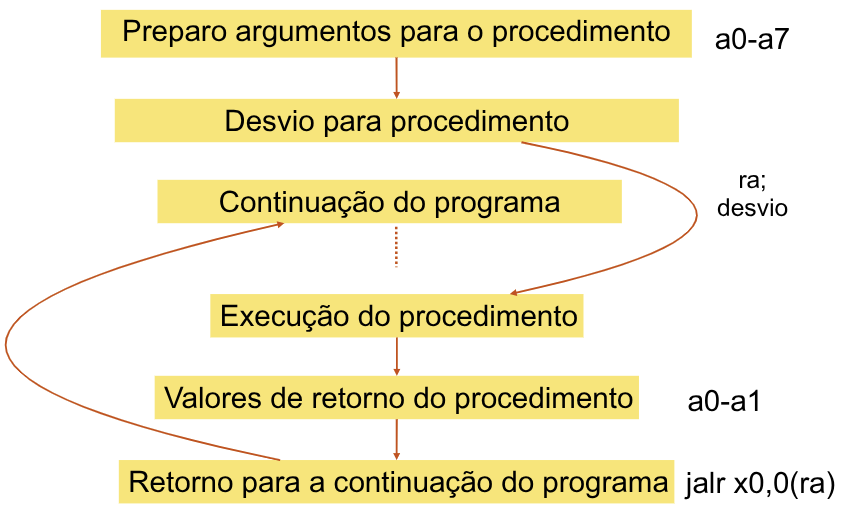
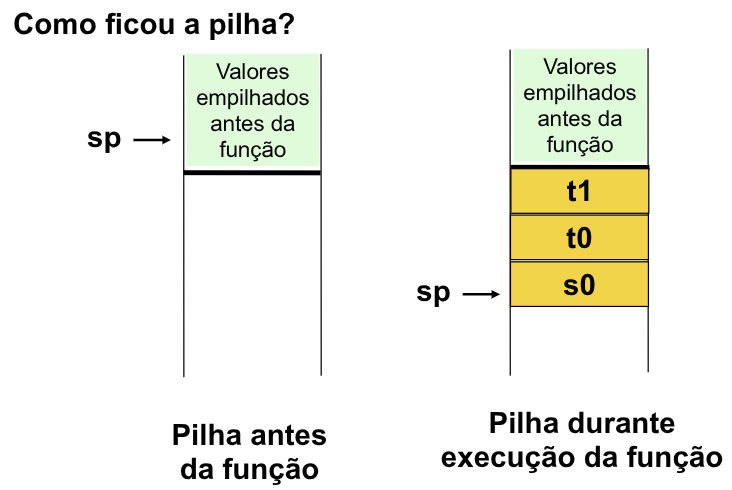
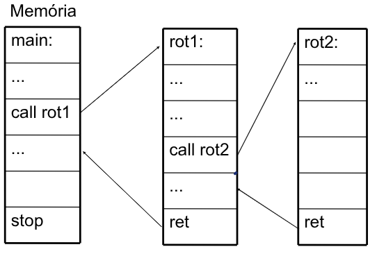

# Procedimentos

### Operandos RISC-V
| Nome                 | Exemplo                                                          | Comentários                                                                                                                                                                                |
| -------------------- | ---------------------------------------------------------------- | ------------------------------------------------------------------------------------------------------------------------------------------------------------------------------------------ |
| **32 Registradores** | `s0-s11`, `t0-t6`, `zero`, `a0-a7`, `gp`, `fp`, `sp`, `ra`, `tp` | Locais rápidos para dados. No RISC-V, os dados precisam estar em registradores para a realização de operações aritméticas. O registrador RISC-V zero é sempre igual a `0` (**hardwired**). |


### Assembly do RISC-V
| Categoria                  | Instrução | Exemplo           | Significado                         | Comentários                                |
| -------------------------- | --------- | ----------------- | ----------------------------------- | ------------------------------------------ |
| **Aritmética**             | `add`     | `add s1,s2,s3`    | `s1 = s2 + s3`                      | Três operandos; dados nos registradores.   |
|                            | `sub`     | `sub s1,s2,s3`    | `s1 = s2 - s3`                      | Três operandos; dados nos registradores.   |
|                            | `addi`    | `addi s1,s2,100`  | `s1 = s2 + 100`                     | Usada para somar constantes.               |
| **Transferência de dados** | `lw`      | `lw s1,100(s2)`   | `s1 = Memória[s2 + 100]`            | Dados da memória para o registrador.       |
|                            | `sw`      | `sw s1,100(s2)`   | `Memória[s2 + 100] = s1`            | Dados do registrador para a memória.       |
|                            | `lb`      | `lb s1,100(s2)`   | `s1 = Memória[s2 + 100]`            | Byte da memória para registrador.          |
|                            | `sb`      | `sb s1,100(s2)`   | `Memória[s2 + 100] = s1`            | Byte de um registrador para memória.       |
|                            | `lui`     | `lui s1,100`      | `s1 = 100 * 2¹²`                    | Carrega os 20 bits mais altos.             |
| **Desvio condicional**     | `beq`     | `beq s1,s2,25`    | `if (s1 == s2) PC = PC + 100`       | Testa `==`; desvio relativo ao PC.         |
|                            | `bne`     | `bne s1,s2,25`    | `if (s1 != s2) PC = PC + 100`       | Testa `!=`; desvio relativo ao PC.         |
|                            | `slt`     | `slt s1,s2,s3`    | `if (s2 < s3) s1 = 1; else s1 = 0`  | Compara menor que; usado com `beq`, `bne`. |
|                            | `slti`    | `slti s1,s2,100`  | `if (s2 < 100) s1 = 1; else s1 = 0` | Compara menor que constante.               |
| **Desvio incondicional**   | `jal`     | `jal x0,100`      | `PC = PC + 100`                     | Salto incondicional.                       |
|                            | `jalr`    | `jalr ra,100(x1)` | `ra = PC + 4, PC = x1 + 100`        | Para `switch` e retorno de função.         |
|                            | `jal`     | `jal ra,100`      | `ra = PC + 4, PC = PC + 100`        | Para chamada de função.                    |

## Instruções de Suporte a Procedimentos

**Passos em um Procedimento**  
- Colocar os **parâmetros** em um lugar onde o **procedimento** possa **acessá-los**. 
- Transferir o controle para o procedimento. 
- Adquirir recursos de armazenamento necessários para o procedimento. 
- Realizar a tarefa desejada. 
- Colocar o **valor de retorno** em um lugar onde o programa que o chamou possa acessá-lo. 
- Retornar o controle para o ponto de origem.

Qual o lugar mais rápido que pode armazenar dados em um computador ? Nos **registradores**. 

### Registradores RISC-V 
- `a0 - a1`: Parâmetros para os procedimentos e **valores de retorno**. 
- `a2 - a7`: **Argumentos** para funções;  
- `ra`: Registrador de **endereço de retorno** ao ponto de origem (`ra = return address`).
    - Armazena o **endereço de memória** da próxima **instrução** seguinte.



## JAL (jump and link)

- `JAL x1, Label`
    - **Label** é utilizado no montador. **Localiza** o **endereço** a ser **alcançado** pelo JAL.
    - Na instrução JAL, o campo `imm20` deve ser tal que:
        - `PC + imm20*2 = Endereço(Label)`

- Link, neste caso, quer dizer que é **armazenada**, no registrador indicado (*x1 no exemplo*), o endereço da instrução que vem logo após a instrução `jal x1, Label`.
    - Qual a intrução ele deve retornar apos executar a **subrotina**.
- `x1` é denominado `ra`, **return address**, e é utilizado por padrão para **armazenar o endereço de retorno** de função.
- Entretanto, qualquer outro registrador pode ser utilizado.

## Exemplo 01

```c
int main() 
{
    c = soma(int x, int y); /* a = s0, b = s1, c = s2 */
}

int soma(int x, int y){ /* x = a0, y = a1 */
    return x + y;
}
```

```asm
# Passar os valores de a e b para x e y
add a0, s0, zero # x = a, mv a0, s0
add a1, s1, zero # x = a, mv a1, s1 

jal ra, soma # Prepara ra e j soma
add s2, a0, zero # s2 = a + b

soma: add a0, a0, a1  
jalr x0, 0(ra) # Retorna
```

## Usando mais Registradores
- Se precisar mais de **8 argumentos** e **2 valores** de retorno ? 
- Se o procedimento necessitar utilizar **registradores salvos** `sx` ?

Processo conhecido por ***register spilling:*** 
- Uso de uma **pilha**; 
- Temos um **apontador** para o **topo da pilha**; 
- Este apontador é ajustado em uma palavra **para cada registrador** que é colocado na pilha (***push***), ou retirado da pilha (***pop***). 
- No RISC-V, o registrador `x2` é utilizado somente para indicar o **topo da pilha**: `sp` (**stack pointer**).

### Usando Pilha
- Por razões históricas, a pilha "cresce” do **maior endereço para o menor endereço**. 
- Para colocar um valor na pilha (push), devemos **decrementar** `sp` em uma palavra e **mover** o **valor desejado** para a **posição de memória apontada** por `sp`. 
- Para retirar um valor da pilha (pop), devemos ler este valor da **posição de memória** apontado por `sp`, e então **incrementar** `sp` em uma palavra.

## Exemplo 02 - Folha

Suponha que tenhamos o seguinte código: 

```c
int exemplo_folha (int g, int h, int i, int j)  
{ 
    int f; 
    f = (g+h) – (i+j); 
    return f; 
}
```

- **Definição:** Os argumentos `g, h ,i e j` correspondem aos registradores `a0, a1, a2 e a3`, e `f` corresponde a `s0`. 
- Definir o rótulo do procedimento: `exemplo_folha`
- Devemos então armazenar na pilha os **registradores** que serão **utilizados** pelo **procedimento**:

```asm
addi sp, sp, -12 # cria espaço para 3 itens na pilha 
sw t1, 8(sp)  # empilha t1 
sw t0, 4(sp)  # empilha t0 
sw s0, 0(sp)  # empilha s0
``` 



Corpo do procedimento:
```asm
add t0, a0, a1  # t0 = g + h 
add t1, a2, a3  # t1 = i + j 
sub s0, t0, t1   # f = s0 = (g+h) – (i+j)
```

Resultado é armazenado no registrador a0:
```asm
add a0, s0, zero  # retorna f em  a0
```

Antes de sair do procedimento, **restaurar os valores** dos registradores **salvos** na pilha: 

```asm
lw s0, 0(sp)  # desempilha s0 
lw t0, 4(sp)  # desempilha t0 
lw t1, 8 (sp) # desempilha t1 
addi sp, sp, 12 # remove 3 itens da pilha
```

Voltar o fluxo do programa para a instrução seguinte ao ponto em que a função `exemplo_folha` foi chamada:

```asm
jalr x0, 0(ra) # retorna
```

### Exemplo Completo:**
```asm
exemplo_folha: 
    addi sp, sp, -12   # cria espaço para 3 words na pilha 
    sw t1, 8(sp)    # empilha t1 
    sw t0, 4(sp)    # empilha t2 
    sw s0, 0(sp)    # empilha s0 

    add t0, a0, a1   # t0 = g + h 
    add t1, a2, a3   # t1 = i + j 
    sub s0, t0, t1   # f = s0 = (g+h) – (i+j) 

    add a0, s0, zero   # retorna f em a0 

    lw s0, 0(sp)    # desempilha s0 
    lw t0, 4(sp)    # desempilha t0 
    lw t1, 8 (sp)    # desempilha t1 
    addi sp, sp, 12   # remove 3 wrods da pilha 

    jalr x0, 0(ra)    # retorna
```

### Versão Otimizada
- Salvar o que realmente **necessitar ser salvo**. 
- Por convenção, os registradores `ti` **não precisam ser preservados**. 
- Utilizar registradores `si` onde realmente forem necessários. 
- Ponderar **uso de registradores** com análise de desempenho

```asm
exemplo_folha: 
    add a0, a0, a1 # a0 = g + h 
    sub a0, a0, a2 # a0 = g+h-i 
    sub a0, a0, a3 # f = a0 = g+h-i-j  
    ret   # jalr x0, 0(ra)
```

## Procedimentos Aninhados
Suponha o seguinte procedimento aninhado: 



**Problema:** conflito com registradores **a** e **ra**.

### Convenção sobre Registradores
- Uma solução é **empilhar** todos os registradores que precisam ser **preservados**. 
- Estabelecer uma convenção entre **subrotinas chamada** e **chamadora** sobre a preservação dos registradores (uso eficiente da pilha). 
- Definições: 
    - **Chamadora:** função que **faz** a chamada, utilizando `jal/call`. 
    - **Chamada:** função sendo chamada.
- **Benefícios:** 
    - Programadores podem escrever funções que funcionam juntas; 
    - Funções que **chamam outras funções**, como as **recursivas**, funcionam corretamente.

## Exemplo 03 - *strcpy* 
A função que copia strings em C pode ser descrita como segue:

```c
void strcpy (char x[], char y[]){
    uint32_t i;
    i = 0;
    while ((x[i] = y[i]) != '\0')
        i++;
}
```

Traduzindo para o Risc-V:
- x: x10, 
- y: x11, 
- i: x19

```asm
strcpy:
    addi sp, sp, -4 # Libera espaço na pilha
    sw x19, 0(sp) # Empilha o x19 
    add x19, x0, x0 // i = 0 + 0

L1: 
    add x5, x19, x11  # x5 = &y[i]
    lbu x6, 0(x5)  # x6 = y[i]
    
    add x7, x19, x10  # x7 = &x[i]
    sb  x6, 0(x7) # x[i] = y[i]

    beq x6, zero, L2 # Verifica se a string chegou no final

    addi x19, x19, 1 # i++
    jal x0, L1

L2:
    lw x19, 0(sp) # Desempilha e recupera o x19
    addi sp, sp, 4 # Libera o espaço na memoria
    jalr x0, 0(x1) # retorna
```
